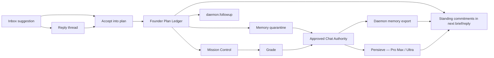

# AI Inbox — Founder Plan Ledger

The compounding half of the Founder Lens: accepted suggestions become durable
**Founder Plans** with lifecycle, execution links, grades, and memory — so the
inbox stops nagging once and starts building. The product sentence:

> Suggestion → accepted plan step → implementation → audit → grade → memory →
> next suggestion builds on it.

## The loop

## Storage (migration `v59_founder_lens`)

Daemon-owned SQLite, mirrored byte-identically across the daemon schema
(`BurnBarAIInboxSchema.founderLensStatements`) and both migration trees
(`AIInboxSchemaParityTests` enforces):

| Table | Role |
|---|---|
| `ai_inbox_plans` | Plan head: title, horizon, pack, status, rolling `grade_avg`, `memory_id` / `pensieve_vector_id` links |
| `ai_inbox_plan_steps` | Steps: status lifecycle, `mission_id` / `followup_id` bindings, grade + note |
| `ai_inbox_plan_events` | Append-only audit: accepted, step_updated, graded |
| `ai_inbox_threads` / `ai_inbox_thread_messages` | Reply dialogue (see `AI_INBOX_FOUNDER_LENS.md`) |
| `ai_inbox_memory_export` | App→daemon bridge of approved snippets |

Write ownership: the daemon writes every table; all mutations arrive through
human-confirmed RPCs. The app never touches these tables directly.

## Lifecycle

**Plan status:** `proposed → active → paused / completed / killed`
**Step status:** `proposed → accepted → in_progress → landed / failed / killed`

- Rows exist only through `daemon.inbox.plans.accept` (config capability) —
  the analyst/reply model proposes `plan_candidates`; the user's tap IS the
  authorization (loophole L14').
- Terminal step outcomes **auto-seed a grade** (landed = 85, failed = 25) so
  ungraded steps still feed the loop; an explicit `daemon.inbox.plans.grade`
  (0–100 + note) always overwrites the seed and refreshes the plan average.
- Every transition writes an `ai_inbox_plan_events` row — if the system can't
  explain what it did, it didn't do it.

## Execution — the existing spine, not a second system

| Action | Mechanism |
|---|---|
| **Promote to mission** | `daemon.mission.create` (capability `mission_control`) with `recommendation: .review` — Mission Control's own approval flow stays the execution authority. `mission_id` binds back onto the step, status → `in_progress`. `InboxPlanPromoteService`. |
| **Create follow-up** | `daemon.followup.create` (capability `mission_control`), kind `controller_nudge`, `followup_id` binds back onto the step. |

Both carry `ai_inbox_plan_id` / `ai_inbox_step_id` metadata so the trace
suggestion → plan → mission → grade survives in Mission Control's journal.

## Memory — human-gated, then compounding

| Stage | Path |
|---|---|
| Remember | `InboxMemoryApprovalHandler.approvePlanStep` → `addChatMemoryAuthorityRecord` **quarantined** → `setChatMemoryReviewStatus(.approved)` — the same two-step every chat memory takes; the PII/secret gate applies identically. Provenance `ai-inbox:plan:<planId>:step:<stepId>`. |
| Export to daemon | After each approval, `InboxMemoryExportService` pushes the **full set** of approved `ai-inbox:*` snippets via `daemon.inbox.memory.export` (loophole L21: the authority lives in the app's SQLCipher store; the daemon ticks headless). Full-set replacement means revocation propagates by omission. Best-effort: approval never fails on daemon-down; the next push heals. |
| Cloud (Pro Max / Ultra) | Approved snippets are eligible for Pensieve `commitKnowledgeBatch` with `sourceKind: chat_memory`. The callable **rejects non-approved chat_memory vectors** and requires full provenance + `approvedAt` (`knowledgeMemory.ts`). The commit gate accepts only `burnbar_pro_max` / `burnbar_ultra`; legacy plain-Pro can search via hosted MCP (`burnbar_search_knowledge`) but can never commit. |
| Recall | Ticks + replies load **standing commitments**: active plans (always, local) + exported approved snippets — fenced as untrusted data (L20). Hosted recall via `burnbar_search_knowledge` after Pensieve sync. |

**Never:** silent `burnbar_remember` for inbox strategy text (L15 — that
tool's contract default is `approved`, which is exactly why this path avoids
it). mem0 is a wiki agent cache, not user memory.

## RPC surface

| Method | Capability | Role |
|---|---|---|
| `daemon.inbox.plans.list` / `.get` | observability | Read plans/steps |
| `daemon.inbox.plans.accept` | config | Human-confirmed create/append |
| `daemon.inbox.plans.update_step` | config | Status + mission/followup binding |
| `daemon.inbox.plans.grade` | config | Grade + note + audit |
| `daemon.inbox.thread.get` / `daemon.inbox.reply` | observability / config | Dialogue |
| `daemon.inbox.memory.export` | config | App pushes approved snippets |

All registered through the canon pipeline (enum → capability → coverage →
dispatch → handler → `generate-burnbarrpc-canon.mjs`; drift-gated in CI).

## MCP

Local read-only tools follow the `burnbar_inbox_*` pattern (daemon RPC
through `pcm.call_daemon`, `_wrap_untrusted_snippet`, trustSignal block):

- `burnbar_inbox_plans_list` — plans with status + rolling grade
- `burnbar_inbox_plans_get` — full plan (sensitive-read capability)

There is deliberately no write tool: an agent may read plans, but only the
human accepts, promotes, and grades.

## Mac UI

`InboxItemDetailView` gains a **Discuss** section (`InboxThreadHost`, keyed by
condition fingerprint): the thread, the composer, refusals rendered as
explanations, and — on assistant turns that carry a proposal — the **Accept
into plan** card. Provenance badges show `model+lens:vN` per turn and the
thread's cumulative cost.

## Sovereignty invariants (the short list)

1. Models recommend; humans accept/approve/grade. No silent durable writes.
2. Unverified claims cannot own a primary next move.
3. All recalled plan/memory content re-enters prompts as fenced untrusted data.
4. Reply spend is capped per reply AND per day, and lands in the same
   authoritative usage ledger as tick spend.
5. Free users get the full local loop (ledger + authority + recall); Pensieve
   cloud recall is a Pro Max/Ultra additive, and the UI says when cloud recall
   is unavailable — no fake cross-device story.
