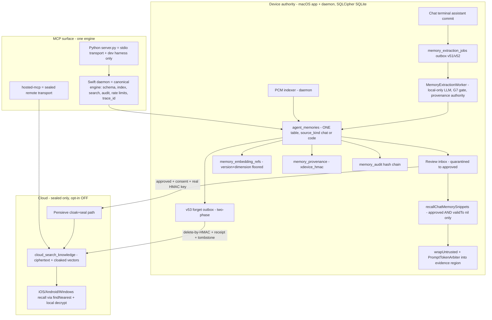
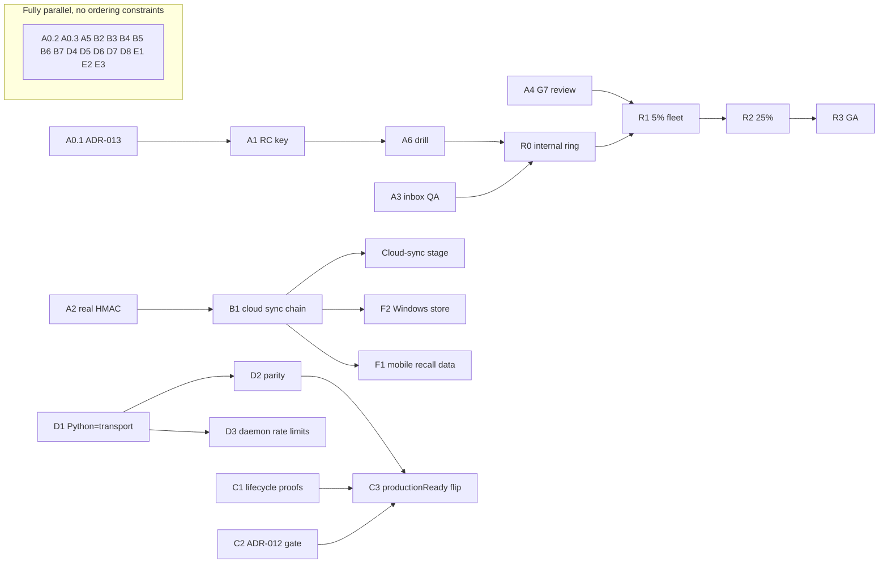

# Memory + MCP SOTA Plan — the execution-ready master plan

- **Date:** 2026-07-04
- **Status:** Committed plan. Supersedes nothing; **reconciles and extends** the existing corpus (see §2.3). Every task below is atomic, independently shippable as one PR through the software-factory loop.
- **Implementation executor:** **Composer 2.5** (this session and follow-on implementation PRs). The task specs remain judgment-free so any model can execute them, but the active implementation lane is Composer 2.5 unless Alberto redirects.
- **Governing rule (quoted, binding):** `docs/PROJECT_CODE_MEMORY_MASTER_PLAN.md` §1 — *"Reconcile + extend, not greenfield. … The work is to unify them under parity names, fill the genuine gaps … and harden the cross-cutting invariants — **not** to re-implement shipped systems or stand up a third parallel memory store."* And `docs/MEMORY_STRATEGY_AUDIT.md` §0 — the audit's verdict that the greenfield strategy *"should not be built as written"* and that the correct path is to *"reconcile + extend the shipped Pensieve/`agent_memories`/v14-vector substrate."*
- **Auto-reject rule for executors:** any task, PR, or design that creates a new `memories`, `memory_embeddings`, or `memory_events` table — or any sibling record/vector/event store parallel to `agent_memories` (v50/v51+), `memory_audit`, `memory_embedding_refs`, or the Pensieve sealed knowledge domain — is **rejected on sight**. Extend the shipped tables or stop.

---

## 0. Ground truth verified 2026-07-04 — corrections to the prior briefs

Every doc claim below was re-verified against `origin/main` (commit `68d790e188` lineage). The docs overstate some gaps and understate shipped progress. Executors MUST treat this section as overriding stale statements in older docs.

### 0.1 What is further along than the docs say

| Stale claim (source) | Verified reality on main |
|---|---|
| G2 go-live flag "DEFAULT **FALSE**" (`MEMORY_ACTIVATION.md` §1) | `ControlPlaneStore.chatMemoryAuthorityWritesEnabledByDefault = true` (`AgentLens/Services/DataStore/ControlPlaneStore.swift:10`). `MemoryActivationEndToEndTests.swift:341` asserts it defaults **on**. De facto, activation is consent-gated only (G0). `MEMORY_ACTIVATION.md` is stale and must be updated (task A0.2). |
| "cloud sync is mechanically gated on the real crossDeviceHMAC key" (`MEMORY_ACTIVATION.md` §5, code comment `ControlPlaneStore+Memory.swift:1913-1915`) | **Not mechanically gated.** The PR-E2 sync lane (`MemoryCloudSyncDomain.swift`, default OFF) replicates approved facts whose citations carry the `v1-local:` placeholder tag verbatim (`KnowledgeSyncService.swift:501-511`). The only real gates are the user opt-in + fleet ceiling. Task B1 adds the fail-closed `v1-local:` refusal; task A2 ships the real key. |
| Memory injection into prompts is future work (`MEMORY_FRONTEND_PLAN.md` F-2) | **Live.** `ChatSessionController+Search.swift:270-311` recalls snippets and wraps each via `LLMSafeContent.wrapUntrusted(provenance:"memory:<id>@<jump>")`; `:612` injects under `promptArbiter.memoryBudget`. `PromptTokenArbiterTests.swift` and `PromptInjectionHardeningTests.swift` exist in `AgentLensTests/Active/Security/`. |
| v51 schema is a plan (`MEMORY_BACKEND_PLAN.md` §4) | **Shipped** — and further: `OpenBurnBarDatabase+MemoryMigrations.swift` registers `v51_chat_memory_authority` (source_kind/review_status/scope ALTERs, `memory_provenance`, `memory_extraction_jobs`, `memory_embedding_refs`, `memory_body_snapshots`), plus `v52_memory_extraction_job_intent_and_lease`, `v53_memory_forget_outbox`, `v54_provider_quota_snapshots`. `v51a_drop_body_fts` shipped (G1). |
| `superseded_by`/`valid_to` are "dead DDL" (audit H7) | **Driven.** `ControlPlaneStore+Memory.swift:1421-1422` writes `valid_to`/`superseded_by`; dedup winner selection at `:143-160`. |
| Phase 2 code tools (get_symbol/find_references/call_graph/diagnostics/explore) are missing (mission brief) | **All exist** at the lexical/static tier: daemon RPCs `daemon.code.get_symbol/find_references/call_graph/diagnostics/index_status/explore/watch_project/ops_diagnostics` (`BurnBarRPCContracts.swift:95-110`) and Python tools `burnbar_get_symbol/...` (`server.py:1798-1887`). The remediation checklist (`docs/reviews/PROJECT_CODE_MEMORY_MASTER_REMEDIATION_PLAN_2026-06-17.md` §6) is fully checked. What remains is **verification + the ADR-012 dense tier**, not tool construction. |
| Phase 0 data-lifecycle blockers "UNFIXED: ~1.94M orphaned FTS rows, projection_jobs never reaped, retention no-op" (mission brief) | **Stale.** The audit's own refutation pass (`MEMORY_STRATEGY_AUDIT.md` §3) confirms these were cleared on main: `ConversationStore+CRUD.swift` ON CONFLICT semantics, `ProjectionStore.reapTerminalProjectionJobs` (`ProjectionStore.swift:181`, scheduled from `RefreshOrchestrator.swift`), v48 purge. Python PCM deletes FTS rows explicitly before re-insert (`project_code_memory.py:1481`). Residual `INSERT OR REPLACE` in `project_code_memory.py:2476/2531/2967` targets `code_symbols`/`code_references`/`chunk_embeddings` — none FTS-mirrored. Task C1 converts this from "trusted claim" to "regression-tested proof." |
| Project-id split "Swift proj_+16hex vs Python 32hex" (remediation §3) | Both runtimes **mint identical v2 fingerprint ids** `proj_` + `sha256("v2:"+fingerprint)[:32]` (`BurnBarProjectCodeMemoryStore+SQLite.swift:243`; `project_code_memory.py:347`). Residual asymmetry: Swift's path-fallback legacy is **16-hex** and Swift bridges both 16- and 32-hex at resolve time (`+ProjectIdentity.swift:28-31`), while Python's fallback is 32-hex and **does not recognize Swift's 16-hex legacy ids** (`project_code_memory.py:389-390`). Task D2 closes the one-way bridge with a parity test. |
| `MemoryServing`, embedding providers, selector are plans | **Shipped:** `OpenBurnBarCore/Sources/OpenBurnBarCore/Memory/MemoryServing.swift:354` + `FakeMemoryService.swift`; `OpenBurnBarMemoryService.swift` implements it. `NLEmbeddingProvider` (OS-revision-stamped versionTag), `Bge384EmbeddingProvider` (fail-closed stub), `MemoryEmbeddingProviderSelector` in `AgentLens/Services/Search/Embedding/DeterministicEmbeddingProviders.swift:107-176`. Version floor enforced at write (`ControlPlaneStore+Memory.swift:1070` dimensionMismatch throw) and read (`:1105` `WHERE embedding_version_id = ? AND dimension = ?`). |

### 0.2 What is genuinely open (the real work of this plan)

1. **`crossDeviceHMAC` placeholder** — `v1-local:` non-crypto tag still live (`ControlPlaneStore+Memory.swift`, `MemoryRecallBudget.swift`). Blocks cloud sync + cross-device citations (audit H16). → Task A2.
2. **Go-live is a static compile-time bool** — there is no Remote Config `memory_authority_writes_enabled` key; the "who flips it, via what" decision (§7.1 of `MEMORY_ACTIVATION.md`) was implemented as a hard `= true`. Fleet-level staged rollout control does not exist. → Task A1.
3. **Review inbox + consent sheet never had visual/UX QA on a running app** (`MEMORY_ACTIVATION.md` §7.6). Inbox IS wired (`DashboardMainRoute.memoryReview`, `DashboardView.swift:523-691`, consent sheet at `:356`; Settings shortcut `PrivacyIndexingSettingsView.swift:143`) — but unsigned-off. → Task A3.
4. **G7 corpus security review not performed** (§7.7). → Task A4.
5. **`server.py` still ships the fake embedding for conversation search** — `DETERMINISTIC_EMBEDDING_MODEL = "deterministic-fake-embedding"` (`server.py:123-124`) powers `burnbar_semantic_search_conversations`. PCM correctly renamed its copy to `DETERMINISTIC_FINGERPRINT_*` and gates it out of ranking (`project_code_memory.py:23-30,3387`), but the conversation leg is still non-SOTA. → Task D5.
6. **Local MCP rate limiting is in-memory, per-process** — `LOCAL_MCP_RATE_LIMIT_BUCKETS` (`server.py:82-119`). Hosted has Firestore transactional buckets (`services/hosted-mcp/src/rateLimits.ts`) with `memory:*`/`code:*` buckets registered — but the `?? LIMITS["metadata:standard"]` fallback (`rateLimits.ts:25`) remains a footgun for future unregistered tools. → Tasks D3, D4.
7. **No `trace_id` anywhere in hosted-mcp** (grep-verified) and no liveness/readiness split. → Task D6.
8. **No MCP management UI exists** in the macOS app (grep of `AgentLens/Views` for MCP server management: zero hits). → Workstream E.
9. **Windows inbox is built but unwired** — `MemoryReviewInboxModel.cs` is a full, unit-tested presentation VM (`windows/app/OpenBurnBar.App.Presentation/Memory/MemoryReviewInboxModel.cs:30`); `MemoryReviewInboxView.xaml` exists but is **never instantiated in the app shell** and its three delegates (`LoadPage`/`OpenBody`/`SetStatus`) have **no production wiring** — only test doubles. No Windows local memory store (`windows/storage/` has no memory backend). The wire-compatible C# crypto port exists: `windows/cloudsync/OpenBurnBar.CloudSync.Crypto/CloudVaultCrypto.cs` + KAT vectors (`windows/tests/cloudsync/Fixtures/cloudvault-kat-vectors.json`) + Firestore REST CloudSync gateway (commit `5eb2b1d975`). → Task F2.
10. **ADR-012 dense tier is a gate with no engine behind it** — `semantic_retrieval_status()` (`project_code_memory.py:3362-3435`) enforces all five ADR-012 conditions and the benchmark harness exists, but **no Ollama embedding HTTP client exists anywhere in the repo** (zero `api/embed` matches); condition 3 (non-fingerprint active version) can never pass today. The only embedding writers are the 96-d fingerprint and a test-only Swift provider. → Task C2 must BUILD the client, not just verify plumbing.
10b. **Chat-memory recall is lexical-only** — `memory_embedding_refs` has live write/read APIs with the version floor (`ControlPlaneStore+Memory.swift:1048-1099`), but `recallChatMemorySnippets` ranks by lexical match + confidence (`:711-742`) and never consults the vectors. → Task B7.
10c. **No write-time injection-sentinel scan exists** — the G7 gate is secret/PII only; injection defense lives entirely at recall (`LLMSafeContent.wrapUntrusted` defangs `</UNTRUSTED_CONTENT>` sequences, `LLMSafeContent.swift:36-46`). The stated invariant requires a write-time sentinel class. → Task A4 (corpus extension).
10d. **Audit-chain serialization diverges across engines** — both use schema `openburnbar.memory_audit.v2`, but Python hashes `json.dumps(sort_keys, separators=(",",":"))` with actor `local-mcp` while Swift hashes `JSONSerialization [.sortedKeys]` with actor `daemon` — the same logical event hashes differently, so no cross-engine chain verifier can exist today. → Task D2.
11. **Migrator duplication drift risk** — `OpenBurnBarDatabase+MemoryMigrations.swift` exists in BOTH `OpenBurnBarCore/Sources/OpenBurnBarData/` and `AgentLens/Services/DataStore/` (two copies kept in sync by hand). → Task B5.
12. **Cloud-sync enablement chain incomplete** — `MemoryCloudSyncDomain.swift` ships (default OFF), but the data-domain registry entry, plaintext-scanner allowlist, and the A2 key are preconditions not yet cleared. → Task B1.
13. **Stale duplicate branches** — `memory/backend-pr2/pr5/pr7` hold commits unmerged to main whose functionality re-landed via the activation merges (#613, #622). → Task A0.3 (close them with receipts).

*Note on mem0: the `mem0-burnbar` MCP server was not reachable from this session (no MCP resources exposed); per `AGENTS.md` mem0 is advisory only, and every fact above was verified against the committed tree, which is authoritative.*

---

## 1. Executive summary + measurable SOTA definition of done

BurnBar already ships ~85% of a SOTA memory system: a quarantine-by-default, secret-gated, provenance-authoritative, version-floored, injection-safe, audit-chained chat-memory authority (v50–v54) unified with the daemon's Project Code Memory in ONE `agent_memories` table partitioned by `source_kind`, plus the E2EE Pensieve substrate for cloud. What it does not have: a controlled activation path, a real cross-device key, one canonical MCP engine, honest semantic tiers everywhere, an MCP management surface, and non-macOS parity.

**Definition of done, per objective (all measurable, all CI- or runbook-verifiable):**

| # | Objective | Done means |
|---|---|---|
| DoD-1 | Unified architecture | ADR-013 merged; one authority model documented; the four subsystems (Pensieve, chat-memory authority, PCM, hosted knowledge) named and mapped to the single `agent_memories`+`memory_audit`+v14-vector+Pensieve spine; zero new parallel stores (CI grep gate). |
| DoD-2 | Loophole ledger | All 43 audit loopholes marked closed with code citation, or open with an assigned task in this plan; ledger committed (§3). |
| DoD-3 | Activation | Feature ON for GA fleet via Remote Config staged rollout; all 9 `MEMORY_ACTIVATION.md` §7 decisions committed (§4.1); crossDeviceHMAC real key shipped; inbox visual QA signed; G7 corpus review passed; kill-switch drill green post-launch (halts extraction in ≤1 pump tick). |
| DoD-4 | Project Code Memory | Phase-0 lifecycle proofs green in CI (DB-size regression, reap, retention); ADR-012 gate driven to a decision (dense ON with benchmark, or honestly OFF with `semanticAvailable:false`); `PROJECT_CODE_MEMORY_PRODUCTION_READY=true` flipped with the proof-gate evidence. |
| DoD-5 | MCP SOTA | One canonical engine (daemon) — Python is transport + dev harness only, enforced by test; 15-tool parity matrix green on all three surfaces at honest tiers; `trace_id` on every response; per-tool fail-closed rate buckets (no silent `metadata:standard` fallback; no per-process-only local buckets); liveness/readiness split; privileged-tool gates pinned; fake conversation embedding removed; hosted code tools still env+threat-model gated; MCP management UI shipped. |
| DoD-6 | Cross-platform | Matrix in §7 implemented: macOS full; iOS/Android recall via sealed `findNearest` wired into mobile chat; Windows read-path memory store on the C# CloudVault port; native mobile extraction explicitly declared a separate epic (ADR-013 §non-goals). |

---

## 2. Unified memory architecture — one authority model

### 2.1 The four subsystems, named (parity naming, before)

1. **Pensieve** — E2EE chat/docs/notes knowledge: device-side chunk→embed(bge-384)→cloak(Householder)→seal(AES-256-GCM)→`commitKnowledgeBatch`→Firestore `cloud_search_knowledge`; server-side `findNearest` over cloaked vectors; local-decrypt shim. (`docs/PENSIEVE.md`, `tools/openburnbar-mcp-remote/src/{embed,seal,knowledge,memoryHook}.ts`.)
2. **Chat-memory authority** — the app-owned extraction→quarantine→review→recall pipeline over `agent_memories(source_kind='chat')` + `memory_provenance` + `memory_extraction_jobs` + `memory_embedding_refs` + `memory_body_snapshots` + `memory_audit` (v50–v54), G0/G1/G2 gated, G7 secret-gated, injection-safe via `wrapUntrusted` + `PromptTokenArbiter`.
3. **Project Code Memory (PCM)** — daemon-owned `agent_memories(source_kind='code')` + code_* tables + FTS5 + fingerprint vectors; 15-tool surface over daemon RPC and Python stdio.
4. **Hosted MCP knowledge surface** — sealed-only remote tools (`burnbar_search_knowledge`, gated `burnbar_search_code`), Ed25519 grants, Firestore rate buckets.

### 2.2 The one authority model (after)

Invariant restated: **`agent_memories` is the single local record authority** (a sealed-reference index over `memory_body_snapshots`/Pensieve — *"not a third store"*, master plan §6.2/§7.1); **the v14 substrate + `memory_embedding_refs` is the single vector plane** (version-floored); **`memory_audit` is the single event log**; **Pensieve is the single cloud plane** (cloaked+sealed only). Nothing in this plan creates a peer to any of these.

### 2.3 ADR-013 (task A0.1) — the reconciliation instrument

One new ADR, `docs/architecture/013-unified-memory-authority-and-mcp-convergence.md`, that:

- **Cites and reconciles** (does not duplicate): `PROJECT_CODE_MEMORY_MASTER_PLAN.md` (governing thesis; remains authoritative for PCM scope), `PROJECT_CODE_MEMORY_MASTER_REMEDIATION_PLAN_2026-06-17.md` (remains authoritative for PCM hardening bar; its §6 checklist claims must now be proof-gated by task C1), `MEMORY_BACKEND_PLAN.md`/`MEMORY_FRONTEND_PLAN.md` (mark **implemented** — historical specs), `MEMORY_STRATEGY_AUDIT.md` (ledger moves to §3 of this plan), `MEMORY_ACTIVATION.md` (update stale G2 text; §7 decisions resolved per §4.1 below), `PENSIEVE.md` + `REMOTE_MCP_THREAT_MODEL.md` (unchanged; code asset-class gate stays).
- **Declares the authority split:** daemon = canonical engine for schema/index/search/audit/rate-limit/trace; app = chat-memory lifecycle owner; Python = transport/dev-harness; hosted = sealed transport.
- **Declares non-goals:** native mobile extraction (separate epic), hosted code sync (Phase-7 gate), per-reply cloud extraction, any new store.
- Records the platform stance: **macOS/daemon-first, honestly** (audit H18).

---

## 3. Loophole ledger — all 43, against live code

Source: `MEMORY_STRATEGY_AUDIT.md` §2 (3 critical + the 20 listed H-items + 18 medium slugs + 2 low = 43 as confirmed; the section headers' "19/19" arithmetic is off by one each way — the ledger below enumerates every item actually listed). **Status legend:** ✅ closed (verified on main, citation given) · 🔶 verify-then-close (evidence strongly suggests closed; a cheap proof test is the task) · 🔴 open (task assigned).

| ID | Loophole | Status | Evidence / Task |
|---|---|---|---|
| C1 | Fourth memory store | ✅ | v51 extends `agent_memories`; no `memories`/`memory_embeddings`/`memory_events` tables exist (grep). CI guard added by task B4. |
| C2 | Versionless vector mixing | ✅ | `memory_embedding_refs(memory_id, embedding_version_id, dimension)` PK + write-time throw (`+Memory.swift:1070`) + read floor (`:1105`). |
| C3 | Unwrapped memory injection | ✅ recall half / 🔴 write half | Recall: `wrapUntrusted` with `memory:<id>@<jump>` provenance (`ChatSessionController+Search.swift:306-310`), sentinel-defanging in the wrapper (`LLMSafeContent.swift:36-46`), `PromptInjectionHardeningTests.swift`. Write-time injection-sentinel scan **does not exist** (G7 is secret/PII only) → Task A4 adds the sentinel pattern class. |
| H1 | Version floor ignored in recall | ✅ | Same floor as C2, recall path. |
| H2 | Rebuilt embedding abstraction / ONNX pipeline | ✅ | `NLEmbeddingProvider` conforms to both protocols; no ONNX/CoreML download anywhere. |
| H3 | BudgetGate misuse | ✅ | Extraction admission via `MemoryExtractionPolicy` caps/deadlines (AutoSummary pattern); no BudgetGate reference in the memory path. |
| H4 | Per-reply cost explosion | ✅ (by design change) | Enqueue-per-terminal-commit but drain is bounded (`maxJobsPerPump=8`, 4-min pump, daily cap) and the LLM is **local-only hard default** (`MemoryExtractionEngine.localFirstProviderOrder`) — zero cloud spend. Cost-neutral invariant holds. |
| H5 | No offline extractor | ✅ | Local-only provider order + benign-empty failure taxonomy (`ChatTranscriptExtractor`). |
| H6 | Reentrancy double-fire | ✅ | Trigger moved to persistence chokepoint (`ConversationStore+Chat.swift:96-103` transactional outbox + idempotency key); `TerminalAssistantCommitTests.swift`. |
| H7 | Dead supersede columns | ✅ | Driven at `+Memory.swift:1421-1422`. |
| H8 | Content-hash id defeats merge | ✅ | Deterministic `memory-<jobID>-<index>` ids + dedup winner state machine (`:143-160`). Eval-set threshold pinning → task B3. |
| H9 | Fake async event_id | ✅ | `MemoryServing.eventStatus` + v52 job intent/lease table. |
| H10 | Lost provenance on merge | ✅ | `memory_provenance` many-to-one join (v51). |
| H11 | Plaintext body breaks sealed invariant | ✅ | Sealed-reference discipline: `body_ref`/`body_redacted` carry `memory_body_snapshots:<slug>` refs; the one plaintext body lives in `memory_body_snapshots.snapshot_json` inside the SQLCipher DB, transient open only (`+Memory.swift:184-188`). G7 gate at both write points. Cloud fields: task B1 registry/scanner proof. |
| H12 | Raw vector replication | ✅ (by default) | Vectors are local-only; cloud sync default OFF. Cloud vector replication, if ever enabled, must use the Pensieve cloak path — pinned in task B1 acceptance. |
| H13 | No cross-tier forget | 🔶 | Chat tier IS two-phase: local tombstones (`memory_fact_tombstones`) → cloud forget receipts + delete-by-HMAC (`KnowledgeSyncService.swift:547-595`) → replicated watermark (`ControlPlaneStore+MemoryForget.swift:192-208`). Daemon code-tier forget is single-phase local hard-delete (`cloudDeletePending: false` always, `BurnBarProjectCodeMemoryStore.swift:368-420`) — acceptable while code memory is local-only, but must gain the two-phase shape before any hosted code sync (remediation Phase-7). Proof e2e → Task B1. |
| H14 | No global token cap | ✅ | `PromptTokenArbiter` + `memoryBudget` shared pool; `PromptTokenArbiterTests`. |
| H15 | Dangling provenance FKs | ✅ | `memory_source_tombstones` + `citation_state` (live/source_pruned/tombstoned); recall skips tombstoned sources. |
| H16 | Cross-device id instability | 🔴 | `v1-local:` placeholder live in `provenanceLocalTag`. → Task A2. |
| H17 | Source-delete → derived-fact reconciliation | 🔶 | Tombstone table + reason enum (`clear_history/gc_30d/user_delete`) exist; wire-through from BOTH delete paths + 30-day GC needs a proof test. → Task B2. |
| H18 | Silently macOS-only | 🔴 (as declaration + wiring) | Declared in ADR-013; mobile recall wiring → task F1; Windows → F2. |
| H19 | Mega-PR | ✅ | Shipped as Waves A–E + F-series PRs (#613, #622 lineage). |
| H20 | Self-blocking gate ordering | ✅ | Defaults ratified and shipped (NLEmbedding + HNSW + version floor). |
| M1 | Schema doc authority backwards | 🔶 | `verify-sqlite-schema-doc.mjs` exists in fast-feedback; must be proven to read the **app migrator** incl. `+MemoryMigrations.swift`. → Task B5. |
| M2 | CI doesn't check app migrator (phase39 slug) | 🔶 | Same as M1. → Task B5. |
| M3 | NLEmbedding no pinned revision | ✅ | OS-stamped versionTag `nl-sentence-en-<dim>-rmacos-x.y.z` (`DeterministicEmbeddingProviders.swift:139-145`). |
| M4 | sqlite-vec downgrade | ✅ | Not adopted; HNSW retained. |
| M5 | Deterministic fake as default ranking | ✅ app/PCM, 🔴 server.py conversation leg | PCM: fingerprint gated out (`project_code_memory.py:3387`). App: fake is CI-only. `server.py:123` conversation semantic search still uses it. → Task D5. |
| M6 | ANN reindex cost unbudgeted | 🔶 | Re-embed protocol exists per version floor; add the cost note + resumability assertion to B3's eval harness. |
| M7 | Success-block seam misses oracle/error replies | ✅ | Chokepoint moved inside `saveChatMessage` (all persist paths). |
| M8 | Streaming mutation capture | ✅ | Same chokepoint fix; cancel path never persists → never extracts. |
| M9 | God-controller coordination | ✅ | Engine/worker/store separation shipped. |
| M10 | Non-deterministic LLM merge oscillation | ✅ | Deterministic winner order (`confidence DESC, valid_from ASC, id ASC`, `+Memory.swift:1357`). |
| M11 | No cross-device convergence model | 🔴 | Read-side reconcile deferred until cloud sync. → Task B1 (design note) + A2. |
| M12 | Missing project_id partition | ✅ | `memoryStorageProjectID(for:scope)` + scope binding in `OpenBurnBarMemoryService` (trust boundary per `MEMORY_BACKEND_PLAN.md` §5.6). |
| M13 | BudgetGate can't throttle subscription creds | ✅ | Moot — BudgetGate not used (H3). |
| M14 | BudgetGate throws user-facing card | ✅ | Same. |
| M15 | No kill switch / irreversible migration | ✅ | Three-gate lever set + Remote Config `memory_extraction_enabled` fleet kill (fail-closed) + clear-to-baseline migration test (`OpenBurnBarDatabaseMigrationTests`). RC go-live key → task A1. |
| M16 | Unbudgeted backfill | ✅ | Forward-only: extraction runs on new terminal commits only; no historical backfill path exists. |
| M17 | Provenance orphan GC targets wrong path | 🔶 | Covered by H17 proof test. → Task B2. |
| M18 | NLEmbedding not on iOS/Android | ✅ (declared) | Mobile recall is server-side `findNearest`; no on-device mobile embedding claimed. ADR-013 non-goal. |
| L1 | Re-ingested-memory recursion | 🔶 | Provenance role gate excludes memory-derived content (`role ∈ {user, assistant}` in `memory_provenance`); add an explicit recursion regression test. → Task B2. |
| L2 | Per-reply extraction undefined on mobile | ✅ | Mobile has no extraction (declared). |

**Open/verify tally:** 2 open critical-path items (H16→A2, M5-server→D5), 1 open declaration pair (H18→F1/F2, M11→B1), and 6 verify-then-close proof tests (H13/H17/M1/M2/M6/M17/L1 → tasks A2, B1, B2, B3, B5). Every one is mapped; none is deferred.

---

## 4. Go-live runbook — drive to activation

### 4.1 The nine §7 decisions — COMMITTED (not options)

| # | Decision (`MEMORY_ACTIVATION.md` §7) | Committed choice | Enacted by |
|---|---|---|---|
| 1 | Who/what flips go-live, via what mechanism | **Remote Config key `memory_authority_writes_enabled`**, separate from `memory_extraction_enabled`. Owner: **Alberto**, via Firebase console with percentage conditions. Fail-closed (fetch error ⇒ false). The static `chatMemoryAuthorityWritesEnabledByDefault` becomes the compile-time ceiling ANDed with the RC value. | Task A1 |
| 2 | crossDeviceHMAC: real key vs placeholder | **Build the real key lifecycle now** (HKDF from the CloudVault vault key, label `memory-citation`, Keychain-stored, rotation-versioned). Local activation may proceed on the placeholder; **cloud sync may not**. | Task A2 |
| 3 | Secret policy REJECT vs REDACT | **REJECT** at both gate points (current code), permanently pinned for v1. REDACT becomes an opt-in only after a dedicated redaction test corpus lands (out of scope here — named non-goal). | Task A4 pins it in the review sign-off |
| 4 | PII handling | **REJECT all PII** for activation. Profile-scoped PII allowance (emails as profile facts) is a fast-follow behind a new setting, not part of this rollout. | Task A4 |
| 5 | Cloud backup default | **OFF, explicit opt-in** (`memoryApprovedCloudBackupEnabled` stays default false). Cloud rollout is its own §4.4 stage after A2+B1. | Already code; pinned in ADR-013 |
| 6 | Approval UX | **Auto-approve nothing.** Ship the inbox as the sole approval path, with two UX additions to fight "feels dead": the pending-count badge (already in `DashboardSectionSwitcher`) verified visible, and a bulk "Approve all from this thread" action. | Tasks A3, A5 |
| 7 | G7 corpus security review | **Required before the % fleet stage** (not before internal ring). Coverage audit vs the remediation §4.9 pattern list + false-positive audit vs the Luhn/IPv4/phone hardening tests. | Task A4 |
| 8 | Cloud transcript egress | **Prohibited.** Local-only extraction remains a hard default; any future cloud extraction is a separate consent + spend-ledger project. | ADR-013 non-goal |
| 9 | Input-side exfil acceptance | **Accepted as N/A for v1** because extraction is local-only (no transcript leaves the device). Re-opened automatically if #8 ever changes. | ADR-013 risk register |

### 4.2 Precondition gates → clearing tasks

| Gate | Blocks | Cleared by |
|---|---|---|
| RC go-live key exists + fail-closed tested | any fleet stage | **A1** |
| Inbox + consent sheet visual/UX QA signed on a running macOS app | internal ring exit | **A3** |
| G7 corpus review passed, REJECT pinned | % fleet entry | **A4** |
| Kill-switch drill green (fleet kill halts pump ≤1 tick) | % fleet entry | **A6** |
| crossDeviceHMAC real key + provenance backfill | cloud-sync stage only | **A2** |
| Data-domain registry + plaintext-scan + rules proofs | cloud-sync stage only | **B1** |

### 4.3 Staged rollout (local memory: extraction + review + recall)

| Stage | Population | Entry criteria | Success metrics (monitored via existing telemetry + `memory.candidate_dropped`/`memory.secret_rejected` audit counters) | Rollback trigger → action |
|---|---|---|---|---|
| R0 internal | Team devices (RC condition: internal cohort) | A1 merged; A3 signed; `MemoryActivationEndToEndTests` green; kill drill rehearsed | 1 week: extraction job success ≥95%; zero G7 leak reports; crash-free ≥ baseline; inbox usable (facts appear, approve works) | Any G7 leak or crash regression → RC `memory_authority_writes_enabled=false` (instant), file blocker |
| R1 5% fleet | RC 5% | R0 exit + A4 passed + A6 drill green | 2 weeks: same metrics at fleet scale; G7 drop-rate stable (no finding-ID spike); approval rate >0 (feature not dead); support tickets ~0 | Extraction failure spike >5%, finding-ID spike (possible exfil), or crash regression → RC flip false |
| R2 25% fleet | RC 25% | R1 exit; corpus tuning applied if drop-rate data demanded it | Same, 1 week | Same |
| R3 GA | RC 100% | R2 exit | Steady-state monitoring; kill switch stays wired (post-GA quarterly drill, task A6) | RC flip remains the instant fleet kill forever |

**End state:** memory ON for real users (consent-gated per user by G0 as designed), extraction live, inbox live, recall live — with `memory_extraction_enabled` (fleet kill) and `memory_authority_writes_enabled` (go-live) both independently flippable and drill-tested.

### 4.4 Cloud-sync stage (separate, later)

Entry: A2 + B1 complete, plus the R3 GA state stable ≥2 weeks. Rollout: internal → opt-in GA (never default-on; decision #5). Metrics: sync success rate, forget-receipt latency ≤24h, zero plaintext-scanner hits. Rollback: `remoteConfigExtractionEnabled` fleet ceiling clamps egress; per-user toggle.

---

## 5. Phased, ordered work breakdown

Rules for every task: one PR; factory-review labeled; cheap local checks run pre-PR (`./scripts/test-openburnbar-app.sh` for app targets, `swift test` in the touched package, `npm test` in touched TS packages, `pytest` for `tools/openburnbar-mcp`); PR body includes validation + risks + rollback. No task below says "figure out X" — where a choice existed, it is made here.

### Workstream A — Activation (critical path to GA)

**A0.1 — ADR-013 + doc reconciliation.**
- Files: new `docs/architecture/013-unified-memory-authority-and-mcp-convergence.md`; edit `docs/architecture/README.md` index; add status banners to `MEMORY_BACKEND_PLAN.md`/`MEMORY_FRONTEND_PLAN.md` ("implemented 2026-06; superseded for status by MEMORY_MCP_SOTA_PLAN.md").
- Change: write ADR per §2.3 with the authority model, non-goals, platform stance, and the §4.1 decision table.
- Acceptance: ADR merged; every doc in §0's stale-claim table carries a pointer; mem0 wiki mirror refreshes on commit.
- Tests: docs-only; link-check. Risk: none. Rollback: revert. Dependencies: none.

**A0.2 — Truth-restore `MEMORY_ACTIVATION.md`.**
- Files: `docs/MEMORY_ACTIVATION.md`.
- Change: correct G2 section (default is now `true` ANDed with the future RC key), add the A1 RC key design, refresh §6 verification checklist and §7 to point at §4.1 committed choices.
- Acceptance: doc matches `ControlPlaneStore.swift:10` and post-A1 code. Dependencies: A1 (land together or immediately after).

**A0.3 — Close stale branches with receipts.**
- Change: for `memory/backend-pr2`, `pr3`, `pr4`, `pr5`, `pr6`, `pr7`, `memory/activation`, `memory/backend-pr0`: verify each unmerged commit's functionality exists on main (spot-check the headline symbol per branch, e.g. `memory_embedding_refs` for pr2, `recallChatMemorySnippets` for pr5, `MemoryCloudSyncDomain` for pr7), then close/delete the branch and leave a `Cross-agent receipt` on the corresponding PR if one is open.
- Acceptance: `git branch -a --no-merged origin/main | rg memory/` returns only actively-worked branches. Risk: deleting a branch with unique work — mitigated by the per-branch symbol check. Rollback: branches restorable from reflog/origin for 90 days.

**A1 — Remote Config go-live key (the activation lever).**
- Files: `AgentLens/Services/Settings/Stores/MemorySettings.swift` (add `remoteConfigAuthorityWritesEnabled`, persisted, not-user-settable, default **true**, fail-closed to false on fetch error — mirroring `remoteConfigExtractionEnabled`); `AgentLens/Services/SettingsManager.swift` (passthrough + fetch wiring next to `memory_extraction_enabled`); `AgentLens/Services/Memory/MemoryExtractionEngine.swift:126` (authority closure becomes `killSwitch.isAllowed() && ControlPlaneStore.chatMemoryAuthorityWritesEnabledByDefault && settingsSnapshot.remoteConfigAuthorityWritesEnabled` — thread through `MemoryExtractionSettingsSnapshot`); `AgentLens/Services/DataStore/OpenBurnBarMemoryService.swift:42` (same AND).
- Firebase: create RC parameter `memory_authority_writes_enabled` (default `true`; rollout staging via conditions per §4.3 — Alberto owns the console).
- Acceptance: gate truth-table test extended — RC-authority=false ⇒ zero writes and zero LLM calls even with consent+toggle+extraction-RC on; fetch-error ⇒ false.
- Tests: extend `MemorySettingsAndKillSwitchTests` + `MemoryActivationEndToEndTests` gate matrix. Risk: a wrong AND order silently disables the fleet — covered by the matrix test. Rollback: revert commit (static ceiling still true). Dependencies: none.

**A2 — crossDeviceHMAC real key lifecycle (kills the `v1-local:` placeholder).**
- Note for the executor: the vault-key HMAC derivation machinery already runs at sync time (`KnowledgeSyncService.swift:634-641` derives real keyed HMACs for uploaded fact identifiers); the gap is specifically the **at-write-time** `memory_provenance.xdevice_hmac` column, which still stores the keyless `v1-local:` SHA tag (`provenanceLocalTag`, `ControlPlaneStore+Memory.swift:1916-1925`). Also: today's sync lane replicates that placeholder tag inside citation payloads (`KnowledgeSyncService.swift:501-511`) — B1's fail-closed refusal depends on this task.
- Files: `OpenBurnBarCore/Sources/OpenBurnBarCore/SharedModels/CloudVaultCrypto*.swift` (add `memoryCitationKey` — HKDF-SHA256 from the vault key, info label `"openburnbar-memory-citation-v1"`, mirroring the shipped `pensieveDedupHash` derivation); `AgentLens/Services/DataStore/ControlPlaneStore+Memory.swift` (`provenanceLocalTag` → `provenanceCrossDeviceHMAC(envelope:key:)` producing `v2-hmac:<hex>`; keep reading `v1-local:` rows); a one-shot idempotent backfill job (iterate `memory_provenance` rows with `xdevice_hmac LIKE 'v1-local:%'`, recompute from the stored canonical envelope fields, update in batches inside the drain pump); parity vector added to the Windows KAT fixture (`windows/tests/cloudsync/Fixtures/cloudvault-kat-vectors.json`) so the C# port derives the identical key.
- Key storage/rotation: the vault key already has Keychain + cross-device lifecycle (Pensieve); the citation key is *derived*, never stored — rotation = bump the info-label version and re-run backfill (documented in ADR-013).
- Acceptance: no new row ever carries `v1-local:`; backfill converges (repeat run = 0 updates); same envelope on two simulated devices with the same vault key yields identical HMACs (unit test); C# KAT green.
- Tests: `AgentLensTests/Active/` new `MemoryCrossDeviceHMACTests`; Windows `dotnet test` KAT. Risk: vault key absent (signed-out) — tag stays local-form until key exists (explicit fallback, tested). Rollback: revert; v1 tags still readable. Dependencies: none (but B1 depends on this).

**A3 — Review inbox + consent sheet visual/UX QA (runbook, human sign-off).**
- Procedure (executor runs, Alberto signs): build + launch the app (`scripts/cross-platform` macOS run or Xcode); grant consent via `MemoryConsentSheet` (first-run); drive a chat to a terminal assistant reply; verify a quarantined fact appears in Dashboard → Memory (`DashboardMainRoute.memoryReview`) with the badge count; approve one (verify audit event + recall injects it next turn, gold-flash citation jump works per `ChatSessionController+Search.swift:62`); reject one; verify Settings → Privacy/Indexing "Review pending memories" row navigates; capture screenshots into `docs/qa/memory-inbox-qa-2026-07.md` with a pass/fail checklist (layout, dark mode, empty state, 200+ item page, VoiceOver labels).
- Change (only if QA finds defects): scoped fixes in `AgentLens/Views/Memory/*` — each its own follow-up PR.
- Acceptance: signed QA doc committed. Dependencies: none. This is the "feels dead" product-risk gate — GA cannot pass without it.

**A4 — G7 secret-corpus security review + policy pinning.**
- Files: `OpenBurnBarCore/Sources/OpenBurnBarCore/Resources/secret-pattern-corpus.json` (+ `tools/project-code-memory/` mirror); `OpenBurnBarCore/Tests/OpenBurnBarCoreTests/MemorySecretPIIGateTests.swift`; output doc `docs/reviews/MEMORY_G7_CORPUS_REVIEW_2026-07.md`.
- Change: audit corpus coverage against the remediation §4.9 list (provider tokens, AWS AKIA, PEM, DB-URIs-with-creds, `.env`/`key=value≥32`, tfvars, k8s secrets, npmrc/pypirc, GitLab/Vault/SendGrid/webhooks, SSN, phone, entropy backstop) — add any missing pattern WITH a paired false-positive test (version strings, order IDs, UUIDs, semver, git SHAs must pass clean); verify Luhn/IPv4/phone-ordering hardening still holds; confirm both gate points fire (`+Memory.swift` worker drop + persistence reject) and audit label-only output; pin `.reject` for secrets and PII (decision #3/#4) with an assertion test that the shipped policy literal is `.reject`.
- **Add the missing write-time injection-sentinel class (closes the open half of C3):** a new corpus pattern family `prompt-injection-sentinel` matching instruction-hijack markers in extracted fact bodies — `</?UNTRUSTED_CONTENT`, `SYSTEM:`/`ASSISTANT:` role-prefix lines, "ignore (all |any )?(previous|prior) instructions", tool-approval directives ("approve all tool calls"), and BEGIN/END prompt-fence look-alikes. Verdict: **drop the candidate** (same `.reject` path, distinct finding IDs `prompt-injection-*` so audit telemetry can distinguish exfil attempts from injection attempts). Paired false-positive tests: legitimate memories QUOTING those strings in prose context must be tuned against over-blocking — start strict (drop), loosen only with corpus data. Defense-in-depth stands regardless because `wrapUntrusted` defangs sentinels at recall (`LLMSafeContent.swift:36-46`).
- Acceptance: review doc merged with a coverage matrix; all corpus tests green; no suppression added (repo rule). Risk: over-broad patterns eating legit memories — every added pattern requires its false-positive twin test. Dependencies: none; gates R1.

**A5 — Inbox bulk-approve affordance (anti-"feels-dead").**
- Files: `AgentLens/Views/Memory/MemoryReviewInboxView.swift`, `MemoryReviewInboxModel.swift`, `AgentLensTests/Active/MemoryReviewInboxModelTests.swift`.
- Change: add "Approve all from this thread" (group pending items by `threadLogicalID` from provenance; one confirm dialog; loops `setChatMemoryReviewStatus(.approved)` so every transition stays on the audit-chained path — no new bulk store API).
- Acceptance: bulk action approves exactly the thread's pending items, each with its own `memory.approve` audit event; model test covers partial-failure (one item errors, rest proceed, error surfaced).
- Dependencies: A3 (land after QA baseline). Rollback: revert (pure additive UI).

**A6 — Kill-switch drill (pre-GA + post-GA recurring).**
- Files: `AgentLensTests/Active/` new `MemoryKillSwitchDrillTests.swift`; runbook section in `docs/runbooks/` (new `memory-activation-rollout.md` holding §4.3 operationally: stage table, RC console steps, metric queries, rollback steps).
- Change: automated drill — with extraction mid-backlog, flip the kill atomic false; assert the next pump tick claims nothing and in-flight jobs complete without new LLM calls; flip RC-authority false; assert `addChatMemoryAuthorityRecord` throws `.disabled`.
- Acceptance: drill test in CI; runbook merged; one manual fleet-level rehearsal on the internal ring logged in the runbook. Dependencies: A1.

### Workstream B — Memory backend completion

**B1 — Cloud-sync enablement chain (approved facts, sealed; the H13/M11 close).**
- Files: `packages/data-domains/registry.json` (register the memory cloud fields at `end_to_end`); `scripts/ci/scan-chat-cloud-plaintext.mjs` allowlist; `firestore.rules` (verify the approved-only sealed-write contract deployed per `MEMORY_ACTIVATION.md` §5 — add rule tests in the Firestore rules suite); `AgentLens/Services/CloudSync/MemoryCloudSyncDomain.swift` + its service (assert candidates carry `v2-hmac:` tags — refuse `v1-local:` rows, fail-closed).
- Change: complete the three-item precondition list from `MEMORY_ACTIVATION.md` §5; pin **bodies+metadata sealed via CloudVault AAD, vectors NOT replicated in v1** (decision: cloud recall of chat memories v1 rides the existing approved-fact sealed rows; cloaked-vector replication for server-side ANN is a follow-up rider on the Pensieve `commitKnowledgeBatch` path and must reuse it verbatim if pursued).
- Acceptance: two-phase forget e2e — approve → sync → forget → cloud row + tombstone verified gone with receipt; plaintext scanner green; only `review_status='approved'` rows ever enqueue; `v1-local:` rows refused.
- Tests: `functions/` callable tests + app `MemoryCloudSync*Tests` + rules tests. Risks: forget-receipt latency — bound at 24h, surfaced in doctor. Rollback: user toggle + fleet ceiling clamp. Dependencies: **A2**.

**B2 — Source-pruned reconciliation + recursion proofs (closes H17/M17/L1).**
- Files: `AgentLens/Services/DataStore/ControlPlaneStore+MemoryForget.swift`, `DataStore+ConversationAccess` delete paths, `AgentLensTests/Active/MemorySourcePruneTests.swift` (new).
- Change: prove (or wire, where missing) that BOTH user chat-delete paths and the 30-day conversation GC insert `memory_source_tombstones` rows with the right `reason`, and that reconciliation flips affected `memory_provenance.citation_state → source_pruned` and suppresses recall of fully-pruned facts. Add the L1 regression: a memory whose only "source" is memory-derived content can never be created (provenance role gate) — test with a forged extractor output citing an injected-memory message.
- Acceptance: delete thread ⇒ citations degrade to "source no longer available", fact suppressed if all sources pruned; GC path identical; recursion test green. Dependencies: none.

**B3 — G6 embedding eval set + drift harness (pins H8 threshold, M6 cost).**
- Files: new `AgentLensTests/Active/MemoryRecallEvalTests.swift` + fixture `AgentLensTests/Fixtures/memory-recall-eval.json` (≥50 fact/query pairs with graded relevance, committed); extend `docs/reviews/` with the measured baseline.
- Change: recall@5 / MRR harness over the NLEmbedding provider; pin the dedup `T_merge` deadband against the eval set (assert current constant beats oscillation cases); assert OS-revision bump forces re-embed (versionTag change ⇒ old vectors excluded, re-embed enqueued, resumable).
- Acceptance: eval runs in CI (fast, local, deterministic corpus); baseline metrics committed; a future provider swap (bundled bge CoreML) must beat baseline to activate — that swap itself is explicitly out of scope (deferred behind this measured gate, per audit H2).
- Dependencies: none.

**B4 — "No 4th store" CI guard.**
- Files: new `scripts/ci/check-memory-store-invariants.sh`, wired into `.github/workflows/fast-feedback.yml`.
- Change: fail CI if any migration/bootstrap adds tables named `memories`, `memory_embeddings`, `memory_events`, or any `CREATE TABLE` matching `%memor%` outside the allowlist (`agent_memories`, `memory_audit`, `memory_provenance`, `memory_extraction_jobs`, `memory_embedding_refs`, `memory_body_snapshots`, `memory_source_tombstones`, `memory_forget_outbox`, `project_memory_snapshots`, PCM `pcm_*`/`code_*`); also fail on new plaintext body FTS (`agent_memories_fts` recreation).
- Acceptance: guard green on main; red on a fixture branch adding `CREATE TABLE memories`. Dependencies: none.

**B5 — Single-source migrator + schema-doc verifier closure (M1/M2 + drift risk #11).**
- Files: `AgentLens/Services/DataStore/OpenBurnBarDatabase+MemoryMigrations.swift` (delete; the app target compiles the `OpenBurnBarCore/Sources/OpenBurnBarData/` copy — if target membership prevents direct sharing, replace the app copy with a file that forwards to the Core implementation so there is exactly one body of migration SQL); `scripts/ci/verify-sqlite-schema-doc.mjs` (assert it parses the memory migrations file and that `docs/SCHEMA_SQLITE.sql` contains v51–v54 tables); regenerate `docs/SCHEMA_SQLITE.sql`.
- Acceptance: one migration source; verifier fails when a memory column is removed from the doc (fixture test); daemon bootstrap remains in lockstep (existing daemon tests).
- Risk: target-membership build breakage — verify with `./scripts/test-openburnbar-app.sh` + `swift build` on Core. Rollback: restore the duplicate. Dependencies: none.

**B6 — mem0 CRUD verb parity on the MCP surface.**
- Files: `tools/openburnbar-mcp/server.py` (new tools `burnbar_get_memory`, `burnbar_list_memories` (paged), `burnbar_update_memory`, `burnbar_forget_all`, `burnbar_list_entities` — thin wrappers over daemon RPC); `OpenBurnBarCore/.../BurnBarRPCContracts.swift` + the 4-site daemon registration checklist (master plan §8) for `daemon.memory.get/list/update/forget_all/list_entities`, backed by the existing `MemoryServing`-equivalent store calls (`chatMemoryPage`, `searchChatMemoryAuthorityRecords`, update path, `deleteAll`).
- Constraint: **writes fail closed** — Python never touches SQLite for these (master plan §5.2); reads may use the daemon read snapshot.
- Acceptance: RPC coverage contract test green (compiler-enforced switches); Python tool schema tests; fail-closed test (daemon down ⇒ error, no fallback write). Dependencies: D1 (shared RPC client) — or lands with it.

**B7 — Wire semantic recall into `recallChatMemorySnippets` (closes the lexical-only gap).**
- Ground truth: `memory_embedding_refs` has live write/read APIs with the version floor (`ControlPlaneStore+Memory.swift:1048-1099`), but `recallChatMemorySnippets` ranks by lexical match + confidence only (`:711-742`) and **never consults the vectors**. The embedding write path may already run at extraction time — verify and wire if missing.
- Files: `AgentLens/Services/DataStore/ControlPlaneStore+Memory.swift` (`recallChatMemorySnippets`, `memoryEmbeddingMatches`, `upsertMemoryEmbeddingRef`); `AgentLens/Services/Memory/MemoryExtractionWorker` or the post-persist hook (ensure every approved-bound fact gets an `memory_embedding_refs` row via `MemoryEmbeddingProviderSelector.selectedLocalProvider()` — NLEmbedding today, bge when bundled); reuse `BurnBarPersistentVectorIndex` / exact-cosine fallback over the active `(embedding_version_id, dimension)` partition (G2).
- Change: recall becomes hybrid — version-floored ANN over `memory_embedding_refs` → RRF with the existing redacted lexical rank (title/tags/kind only, no body FTS) → hydrate sealed bodies transiently → existing approved/tombstone gates unchanged.
- Acceptance: `MemoryRecallEvalTests` (B3) shows recall@5 improves over lexical-only on the committed eval set; dimension-mismatch and cross-version isolation tests stay green; quarantined facts still never returned. Dependencies: B3 eval fixture (can land in same PR). Risk: NLEmbedding quality — the eval set is the gate; if recall@5 does not beat lexical, ship the wiring but keep lexical as the primary ranker with ANN as a tie-breaker only (document the measured outcome in the PR).

### Workstream C — Project Code Memory finish

**C1 — Phase-0 lifecycle proof suite (converts checked boxes into CI evidence).**
- Files: new `OpenBurnBarDaemon/Tests/OpenBurnBarDaemonTests/ProjectCodeMemoryLifecycleRegressionTests.swift` + `tools/openburnbar-mcp/tests/test_lifecycle_regression.py`.
- Change: (a) DB-size regression — index a fixture repo, edit files, reindex ×3, assert row counts in `search_chunks_fts`/`code_symbols`/`code_references`/`chunk_embeddings` return to single-index baseline and DB page count stays bounded; (b) assert `reapTerminalProjectionJobs` is scheduled (verified wiring: `RefreshOrchestrator.runRetentionPurgeIfNeeded` at `RefreshOrchestrator.swift:73-87`, invoked once per launch from `UsageAggregator.swift:168-169`) and reaps a seeded terminal backlog; (c) retention proof — exercise the documented `PROJECT_CODE_MEMORY_RETENTION.md` prune paths (removed file ⇒ dependent rows deleted; reset ⇒ empty). Note the historical FTS-orphan bug was in the **app's** `conversations_fts` and is fixed (`v48_conversation_fts_orphan_repair`, `OpenBurnBarDatabase.swift:1503-1537`; PCM regression `testReindexDoesNotOrphanFTSRowsInCodeStore`); the Python engine's FTS rows are explicitly delete-then-insert (`project_code_memory.py:1481-1488`), and its `INSERT OR REPLACE` sites (`:2476,:2531,:2967`) target non-FTS tables — the size test proves they don't leak rows anyway; fix in the same PR if it fails.
- (d) **Ship the deferred guarded post-repair VACUUM** — the one remaining tail of the v48 fix (TODO at `OpenBurnBarDatabase.swift:1531-1536`): a one-shot, size-thresholded `incremental_vacuum`/`VACUUM` pass run off the retention phase when freelist ratio exceeds the compaction policy, so historical orphan bloat is actually reclaimed, not just stopped.
- Acceptance: all four proofs green in CI (nightly lane acceptable for the size test); the vacuum pass is idempotent and never runs on a healthy DB (freelist-ratio test). Dependencies: none. Risk: fixture flakiness — deterministic temp repos, no wall-clock sleeps; VACUUM on huge DBs — thresholded + once-per-launch cap.

**C2 — ADR-012 dense tier: BUILD the Ollama embedding client, then drive the gate to a decision.**
- Ground truth: the gate (`semantic_retrieval_status()`, `project_code_memory.py:3362-3435`) enforces all five ADR-012 conditions, but **no Ollama HTTP client exists anywhere in the repo** — condition 3 (active version ≠ fingerprint) can never pass today; the checklist box "real local embedding provider selected" is true only on paper. The daemon's only working semantic embedder is Apple NLEmbedding (`BurnBarCodeEmbedding.swift:28-49`).
- Files: **daemon-canonical implementation** (per D1 authority): new `OpenBurnBarDaemon/.../ProjectCodeMemory/BurnBarOllamaEmbeddingClient.swift` — loopback-only `http://127.0.0.1:11434/api/embed` POST `{model, input}` batches, bounded timeout, no retry storms, refuses non-loopback hosts (privacy invariant: no network during indexing beyond loopback); register `ollama/nomic-embed-text` as an `embedding_models`+`embedding_versions` row (dimension read from the first response, then pinned); wire provider selection off `OPENBURNBAR_CODE_EMBEDDING_PROVIDER`/`OPENBURNBAR_CODE_EMBEDDING_MODEL` per ADR-012; re-embed job path for existing chunks (reuse the projection reproject machinery). Python engine gains the same client ONLY under `PCM_DEV_HARNESS=1` (benchmarks) — production dense queries route through daemon RPC (D1).
- Then: run `scripts/ci/project-code-memory-vector-benchmark.py` against live Ollama; commit results to `docs/reviews/PROJECT_CODE_MEMORY_VECTOR_BENCHMARK_<date>.md`; retrieval eval per remediation Phase-5 acceptance (dense must beat lexical precision@5 on the committed NL-intent eval set).
- Decision rule (committed, no judgment call): if dense beats lexical precision@5 by ≥10% relative at p95 query latency ≤300ms → enable behind the env vars with `semanticAvailable:true`; otherwise dense stays off with `semanticAvailable:false` + `semanticFallbackReason` — a valid SOTA end-state per ADR-012 ("honest readiness"), and product copy must match.
- Acceptance: loopback-only enforced by test (non-loopback host throws); all five ADR-012 conditions either green (dense ON, benchmark committed, re-embed resumable and observable in doctor) or the explicit fallback state proven in a test asserting `semanticAvailable:false` + reason; fingerprint vectors provably excluded from ranking either way (`project_code_memory.py:3387-3393` regression). Dependencies: D1 (routing). Risk: Ollama unavailable in CI — benchmark runs in the nightly/pre-release lane with a loud skip locally; the daemon degrades to lexical with the honest flag when the runtime is absent.

**C3 — `PROJECT_CODE_MEMORY_PRODUCTION_READY` flip.**
- Files: daemon + Python `doctor` responses; `docs/PROJECT_CODE_MEMORY_MASTER_PLAN.md` status note.
- Change: flip to `true` **only in the PR that links** C1 + C2 + D1 + D2 evidence (the remediation plan's stated bar: trust, schema, incremental indexing, retrieval quality, SQLCipher, hosted-code gate, proof gates). Verify SQLCipher enforcement state in release builds first (`BurnBarDaemonDatabaseCipher` — if stock SQLite still ships, `doctor` must keep saying so and the flip is blocked until the remediation's "SQLCipher release dependency decision" evidence is located or re-made; the executor must attach the evidence, not assume it).
- Acceptance: `doctor` reports `productionReady=true` with every sub-gate listed green. Dependencies: C1, C2, D1, D2.

### Workstream D — MCP convergence (single engine) + SOTA transport

**D1 — Python = transport only, enforced.**
- Files: `tools/openburnbar-mcp/server.py`, `project_code_memory.py`, new shared `daemon_rpc.py` client (port the socket pattern; **fail-closed** on write RPCs).
- Change: every write tool (`burnbar_remember/forget/index_project/watch_project` + the B6 verbs) goes daemon-RPC-only; direct-SQLite write helpers move behind `PCM_DEV_HARNESS=1`; read tools use `_connect_ro` (verify — remediation says done) or daemon read RPCs.
- Acceptance: test — daemon stopped ⇒ every write tool errors and SQLite is untouched (checksum the DB file before/after); `PCM_DEV_HARNESS` unset ⇒ direct write API raises. Dependencies: none. Risk: breaks local-dev flows — the harness flag is the escape hatch, documented in the README tools table.

**D2 — Swift↔Python parity contract test (project id, chunking, audit hash).**
- Files: extend the shared golden fixtures (remediation Phase-2 lists them as committed — locate under `tools/`/`AgentLensTests` fixtures; if absent, create `fixtures/pcm-parity/` with the six repo cases) + a parity test run in both runtimes.
- Change: assert identical `proj_`+32hex v2 ids for the same fixture (incl. the git-fingerprint path), identical chunk ids/counts (chunker constants already match at 2400/240 — pin them), and identical stale-response shape.
- **Project-id legacy bridge (one-way today):** Swift resolves both its 16-hex legacy and 32-hex ids (`+ProjectIdentity.swift:28-31`); Python recognizes only 32-hex (`project_code_memory.py:389-390`). Add the 16-hex legacy alias lookup to Python's resolver so a repo indexed by an old daemon resolves identically from both runtimes; new projects always mint v2 32-hex.
- **Audit-hash canonicalization (real divergence, verified):** both engines stamp schema `openburnbar.memory_audit.v2` but hash different byte streams — Python `json.dumps(sort_keys=True, separators=(",",":"))` + actor `local-mcp`; Swift `JSONSerialization [.sortedKeys]` + actor `daemon`. Committed fix: define the canonical form as **compact sorted JSON with no whitespace** (the Python form), implement a matching canonical serializer in Swift (`BurnBarProjectCodeMemoryStore+MemoryPersistence.swift:236-238` replacement with explicit key-sorted, compact, escaping-pinned encoding), version-bump the payload schema to `…memory_audit.v3` so old chains verify under v2 rules and new entries under v3, and add a cross-engine vector test: same logical event → byte-identical payload → identical hash in both runtimes. Actor field stays truthful per writer (`daemon`/`local-mcp`) — it is part of the payload, not a divergence.
- Acceptance: parity suite green in fast-feedback for the cheap cases; full matrix nightly; cross-engine audit vector test green; Python resolves a 16-hex-era fixture project. Dependencies: D1 (parity of the *engine* is meaningful once Python defers to it; the test guards the remaining transport-side logic).

**D3 — Local rate limiting moves to the daemon (multi-process-safe).**
- Files: `OpenBurnBarDaemon` (new `BurnBarRPCRateLimiter` — token buckets per `(capability, tool-family)` enforced at the RPC dispatch site `OpenBurnBarDaemonServer.swift` dispatch switch; config: `memory` 60/min, `memory-metadata` 120/min, `code` 45/min, `code-metadata` 90/min, `index` 6/min — matching the hosted bucket shape); `server.py` — delete `LOCAL_MCP_RATE_LIMIT_BUCKETS` for daemon-routed tools (the daemon is the single authority; per-process limits remain ONLY for the pure-local read tools that never touch the daemon, documented inline with a `reason:` token if a suppression is ever needed — it should not be).
- Acceptance: two concurrent MCP client processes share one budget (integration test: two Python clients hammer `burnbar_remember`, combined accepted count ≤ bucket); 429-equivalent structured error with `retryAfterMs`. Dependencies: D1. Rollback: limiter behind a daemon config default-on.

**D4 — Hosted rate-limit fail-closed + per-tool audit.**
- Files: `services/hosted-mcp/src/rateLimits.ts`, `toolRegistry.ts`, tests.
- Change: replace `LIMITS[bucket] ?? LIMITS["metadata:standard"]` with a **throw on unregistered bucket** (500 `bucket_unregistered`, fail-closed); add a registry test asserting every registered tool's `costClass`/bucket is a key in `LIMITS` (so adding a tool without a bucket fails CI, killing the 120/min footgun permanently).
- Acceptance: unit test — unknown bucket throws; registry completeness test green. Dependencies: none. Risk: latent unregistered bucket in prod — the registry test runs against the live registry, so it surfaces at CI time, not runtime.

**D5 — Remove the conversation-leg fake embedding (`server.py:123`).**
- Files: `tools/openburnbar-mcp/server.py` (`DETERMINISTIC_EMBEDDING_*`, `_active_deterministic_embedding`, `burnbar_semantic_search_conversations` ranking).
- Change: mirror the PCM fix — rename constants to `DETERMINISTIC_FINGERPRINT_*`; `burnbar_semantic_search_conversations` returns lexical/FTS ranking with `semanticAvailable:false` + `semanticFallbackReason:"no real local embedding provider configured"` unless a real provider (daemon NLEmbedding via RPC, or the ADR-012 Ollama provider once C2 lands) is active; never fuse fingerprint vectors into ranking.
- Acceptance: test — with no provider, response carries `semanticAvailable:false` and results equal the FTS baseline; with a stub real provider, semantic path activates with version floor asserted. Dependencies: none (C2 upgrades it later). Risk: perceived quality drop — it is an honesty fix; the response says why.

**D6 — trace_id + liveness/readiness + privileged gates (all surfaces).**
- Files: hosted — `services/hosted-mcp/src/server.ts` (UUIDv7 `trace_id` injected into every tool response envelope + error; `/livez` returns 200 unconditionally-if-process-alive, `/readyz` probes Firestore + registry); Python — `server.py` adds `trace_id` to every tool JSON response (generate per call; propagate to daemon RPC as a request field); daemon — accept + echo `trace_id`, add it to audit event metadata (label-only); pin the privileged set `{forget, forget_all, index_project, watch_project, index_status, explore, doctor/ops_diagnostics}` to operator capability (verify `BurnBarPeerCapabilityProfile` placement — write methods must not sit in `readOnly`; add the contract test if missing).
- Acceptance: schema tests on all three surfaces assert `trace_id` present and UUIDv7-shaped; readiness returns 503 when Firestore emulator is down; capability contract test green. Dependencies: none.

**D7 — Hosted code tools stay gated; sealed-only CI proof.**
- Files: `services/hosted-mcp/src/auth.test.ts` / `toolRegistry.ts` (flag `OPENBURNBAR_HOSTED_CODE_MEMORY_TOOLS` — already enforced at `toolRegistry.ts:51`); new CI job wiring `scripts/test-hosted-mcp-security.sh` code cases.
- Change: add the sealed-only proof the threat model demands: with the flag on in a test env, assert `burnbar_search_code`/`burnbar_get_code_document` responses contain no field not prefixed `sealed` besides scores/ids/kind/counts; with the flag off (default), tools are absent from `tools/list` AND calls are denied. Document in `REMOTE_MCP_THREAT_MODEL.md` that enabling in production additionally requires the code asset-class review sign-off (a human gate — name Alberto as owner; the plan does NOT enable them).
- Acceptance: both tests green in CI; flag remains off in every deploy config. Dependencies: none.

**D8 — 15-tool parity matrix conformance test.**
- Files: new `tools/openburnbar-mcp/tests/test_tool_parity.py` + a committed matrix `docs/reviews/MCP_TOOL_PARITY_MATRIX.md` generated from the live registries (Python tool list, daemon RPC enum, hosted registry) — see §6.1 for the target matrix.
- Acceptance: generator output matches the committed matrix (drift fails CI); every one of the 15 parity names maps to an implementation + tier + surface or an explicit documented non-goal cell. Dependencies: B6 (verbs), D6 (trace).

### Workstream E — MCP management UI (net-new; spec in §6.2)

**E1 — Server registry + status service.**
- Files: new `AgentLens/Services/MCP/MCPServerRegistry.swift` (model: id, name, kind ∈ {localStdio, daemonSocket, hostedRemote, customStdio}, command/args/env or URL, enabled), persisted at `~/.openburnbar/mcp-servers.json` (0600, Codable, versioned `schemaVersion:1`); `MCPServerStatusService.swift` (daemon socket ping via existing RPC health method; hosted: token expiry from the shim's stored grant (`tools/openburnbar-mcp-remote` oauth store) + vault-key presence check (`~/.openburnbar/vault-key` or Keychain); local stdio: spawn `--version`-style probe with timeout).
- Acceptance: unit tests for registry CRUD + malformed-file recovery (fail-safe to defaults, never crash); status service returns structured `MCPServerHealth` per server. Dependencies: none.

**E2 — Tool-toggle plumbing (shared with ministry).**
- Files: `tools/openburnbar-mcp/ministry.py` (`disabled_tool_ids()` at `:823` currently returns only `DEFAULT_DISABLED_TOOL_IDS` — extend to merge a user config file `~/.openburnbar/disabled-tools.json`, schema `{"disabled": ["server___tool", …], "schemaVersion": 1}`); Swift writer for the same file in `MCPServerRegistry`.
- Acceptance: Python test — config file adds/removes disabled ids, defaults (mem0/serena) preserved unless explicitly re-enabled; Swift round-trip test; both runtimes agree on the file schema (shared fixture). Dependencies: none.

**E3 — Settings UI.**
- Files: new `AgentLens/Views/Settings/MCP/MCPServersSettingsView.swift`, `MCPServersSettingsModel.swift`, tests `AgentLensTests/Active/MCPServersSettingsModelTests.swift`; register the pane in the existing Settings navigation next to `PrivacyIndexingSettingsView`.
- Spec: list of servers with status dot (healthy/degraded/unreachable + last-checked); add server sheet (name, command or URL, env vars — secrets via Keychain, never plaintext-persisted); remove with confirm; per-server expandable tool list with enable toggles (writes E2's config); detail row per server: version, token expiry countdown (hosted), vault-key health (present/absent), "Run doctor" button streaming `openburnbar mcp doctor` JSON into a readable panel; install/uninstall shortcuts per client (codex/claude/droid/cursor) shelling to the shipped `openburnbar-mcp-remote` installers (`installers.ts` targets).
- Acceptance: model tests (status mapping, toggle persistence, add/remove); visual QA appended to the A3 QA doc. Dependencies: E1, E2. Risk: shelling to installers — reuse the exact CLI the shim ships; dry-run mode surfaced in UI.

### Workstream F — Cross-platform parity

**F1 — Mobile recall wiring (iOS + Android) — declared scope, sealed path only.**
- Files: iOS `OpenBurnBarMobile` chat prompt assembly (inject recall via the existing `FunctionsPensieveMemorySearcher`/`searchKnowledge` sealed path, wrapped as untrusted in the mobile prompt builder, token-capped); Android `CloudConversationSearchService.kt` equivalent injection point; UI copy for degradation (offline/signed-out ⇒ "memory unavailable until synced").
- Constraint: memories reach mobile ONLY once B1 replicates approved facts (until then this task wires the plumbing against Pensieve knowledge recall and ships dark). **No on-device mobile extraction — separate epic (ADR-013).**
- Acceptance: `OpenBurnBarMobileTests` + Android JVM tests — recall injects wrapped, capped snippets; offline degrades with copy, never errors. Dependencies: B1 for real data; wiring itself independent. Runs via `./scripts/test-openburnbar-mobile.sh` / `./scripts/test-openburnbar-android.sh`.

**F2 — Windows memory read-path store + shell wiring (closes the unwired inbox).**
- Files: new `windows/app/OpenBurnBar.App.Presentation/Memory/MemoryStore.cs` (portable core, no WinUI deps) backed by the existing Firestore REST CloudSync gateway (`windows/cloudsync/`, commit `5eb2b1d975`) + `CloudVaultCrypto.cs` for sealed-body decrypt; **wire the existing inbox into the shell:** instantiate `MemoryReviewInboxView` + `MemoryReviewInboxModel` from the Windows navigation frame (mirror macOS `DashboardMainRoute.memoryReview` placement); bind the three delegates (`LoadPage` → query synced approved facts; `OpenBody` → decrypt sealed body via vault key; `SetStatus` → **disabled in v1** with honest UI copy "Review on your Mac" — approve/reject stays Mac-owned because quarantined facts never leave the device by design G4).
- Byte-compat proof: extend `windows/tests/cloudsync/Fixtures/cloudvault-kat-vectors.json` with a sealed memory-fact vector produced by the Swift test suite; C# must decrypt to the identical plaintext (the A2 HMAC KAT rides the same fixture).
- Acceptance: `windows/tests/presentation/MemoryReviewInboxModelTests.cs` extended to run against the real store with fixture data; KAT green; inbox renders synced approved facts read-only. Dependencies: **A2, B1** (nothing to read until cloud sync ships). Rollback: feature-flag the pane back to shell.

### Workstream G — Security review (checklist in §8, run as the final gate PR)

**G1 — Invariant conformance review.** One PR containing the completed §8 checklist as `docs/reviews/MEMORY_MCP_SOTA_SECURITY_REVIEW_<date>.md`, each row linked to the test/commit that proves it, signed by the independent reviewer (Codex per the factory contract). Dependencies: all workstreams. This is the "holy shit, that's done" receipt.

---

## 6. MCP convergence detail

### 6.1 Tool-parity matrix (target end-state; D8 generates and enforces this)

Legend: ✅ ships · 🔶 gated · — non-goal on that surface (documented).

| Parity tool | Daemon RPC (canonical engine) | Python stdio (transport) | Hosted (sealed) | Tier honesty |
|---|---|---|---|---|
| remember | `daemon.memory.remember` ✅ | `burnbar_remember` ✅ (fail-closed RPC) | — (writes are device-only) | n/a |
| recall | `daemon.memory.recall` ✅ | `burnbar_recall` ✅ | `burnbar_search_knowledge` ✅ (sealed) | version-floored |
| context_pack | `daemon.code.context_pack` ✅ | `burnbar_context_pack` / `burnbar_code_context_pack` ✅ | — | untrusted-wrapped, token-budgeted |
| forget | `daemon.memory.forget` ✅ + v53 outbox | `burnbar_forget` ✅ (privileged) | device-authed delete callable 🔶 (B1) | two-phase, receipts |
| search_code | `daemon.code.search` ✅ | `burnbar_search_code` ✅ | `burnbar_search_code` 🔶 (env + threat gate, D7) | `semanticAvailable` honest (C2/D5) |
| index_project | `daemon.code.index_project` ✅ | `burnbar_index_project` ✅ (privileged) | — (local-only asset class) | manifest-delta |
| index_status | `daemon.code.index_status` ✅ | `burnbar_index_status` ✅ | `burnbar_list_search_index_status` ✅ | |
| doctor | `daemon.code.ops_diagnostics` ✅ (operator RPC — **not** named `doctor`) | `burnbar_memory_doctor` ✅ (Python-only; zero `doctor` matches under `OpenBurnBarDaemon/`) | `/readyz` (D6) | reports every unmet gate; parity alias `doctor` → `ops_diagnostics` documented in D8 matrix |
| audit_trail | `daemon.memory.audit_trail` ✅ | `burnbar_audit_trail` ✅ | — | label-only hash chain |
| get_symbol | `daemon.code.get_symbol` ✅ | `burnbar_get_symbol` ✅ | — | lexical/static_tree_sitter/SCIP tiers labeled |
| find_references | `daemon.code.find_references` ✅ | `burnbar_find_references` ✅ | — | same |
| call_graph | `daemon.code.call_graph` ✅ (depth honored) | `burnbar_call_graph` ✅ | — | same |
| diagnostics | `daemon.code.diagnostics` ✅ | `burnbar_diagnostics` ✅ | — | cached-file tier labeled |
| memory_analytics | `daemon.memory.analytics` ✅ | `burnbar_memory_analytics` ✅ | — | |
| explore | `daemon.code.explore` ✅ | `burnbar_explore` ✅ | — | repo-map tier |
| *(+ B6 verbs)* | get/list/update/forget_all/list_entities (new) | new wrappers | — | |

Cross-cutting on every row: `trace_id` (D6), per-tool rate bucket (D3/D4), privileged set operator-gated (D6), fail-closed writes (D1).

### 6.2 MCP management UI — capability summary (spec detail in E1–E3)

Servers pane (add/remove/enable), per-tool toggles (shared `disabled-tools.json` honored by ministry.py), live health (daemon socket, hosted token expiry, vault-key presence), doctor panel, per-client installer actions. No secrets in plaintext config; Keychain only.

---

## 7. Cross-platform matrix

| Capability | macOS app | Daemon (Mac) | iOS | Android | Windows |
|---|---|---|---|---|---|
| Extraction (chat→facts) | ✅ live (local-only LLM, G0–G2+G7 gated) | — | — separate epic | — separate epic | — separate epic |
| Store (authority) | ✅ `agent_memories` chat rows (SQLCipher) | ✅ `agent_memories` code rows | — | — | 🔶 F2 read-mirror of synced approved facts |
| Review/approve | ✅ inbox (A3/A5) | — | — (roadmap) | — (roadmap) | read-only v1 ("review on your Mac") |
| Recall into prompts | ✅ live (wrapped + arbitered) | ✅ RPC recall | 🔶 F1 sealed `findNearest` | 🔶 F1 sealed path | 🔶 post-F2, same sealed rows |
| Code memory (PCM) | via daemon | ✅ canonical | — | — | — (non-goal) |
| Forget | ✅ two-phase local; cloud via B1 | ✅ | tombstone-respecting reads | same | same |
| Crypto | CloudVaultCrypto ✅ | ✅ | ✅ (Swift) | ✅ (Kotlin port) | ✅ C# port + KATs (A2 extends) |

---

## 8. Security review checklist (bound to the invariants; run as G1)

Every row must cite a green test or code line at review time:

1. **E2EE/sealed-reference:** no plaintext memory body or raw vector in any cloud field — plaintext scanner + `firestore.rules` tests (B1); `body_ref` sealed-reference discipline (`+Memory.swift:184-188`); Pensieve cloak on any replicated vector (B1 pin).
2. **Prompt-injection defense:** all recalled memory wrapped via `wrapUntrusted` with server-resolved provenance (`+Search.swift:309`; `PromptInjectionHardeningTests`); never persona-concat; write-time G7 gate incl. injection sentinels; PCM snippets/context packs wrapped (remediation ship-blocker, spot re-verify).
3. **Quarantine-by-default:** recall hard-gates `reviewStatus==approved && validTo==nil` (`recallChatMemorySnippets`); quarantined never replicates (B1 test).
4. **Embedding-version floor:** write throw + read floor + per-version ANN partition tests (C2/B3); no cross-dimension compare anywhere (incl. D5's server.py fix).
5. **Two-phase audited forget:** local cascade + v53 outbox + cloud delete-by-HMAC + receipt + tombstone e2e (B1); doctor surfaces pending forgets.
6. **Cost-neutral extraction:** local-only provider order test; no cloud LLM call possible from the extraction path (assert provider list contains no cloud provider).
7. **Windows byte-compat:** KAT vectors green for seal/unseal + citation HMAC (A2/F2).
8. **Kill switches:** drill tests green (A6); RC fail-closed semantics tested (A1).
9. **MCP trust:** fail-closed writes (D1), privileged-tool capability placement (D6), hosted sealed-only + code-tool denial (D7), rate-limit fail-closed (D3/D4), no `trace_id`/audit field carries plaintext.
10. **No new suppressions; no 4th store:** B4 guard green; `check-no-suppressions.sh` green.

---

## 9. Sequencing / critical path

- **Critical path to GA (the headline outcome):** A0.1 → A1 → A6 → R0 (with A3 parallel) → A4 → R1 → R2 → R3. Everything else can proceed concurrently.
- **Critical path to cloud/cross-device/Windows:** A2 → B1 → {F1 data, F2, cloud-sync stage}.
- **Critical path to `productionReady=true`:** {C1, C2, D1→D2} → C3.
- **Fully parallel lanes:** all of workstream E (management UI), D4–D8, B2–B7, A0.2/A0.3/A5.
- Suggested sprint order for a single executor: week 1 = A0.*, A1, A3, A4, A6 + R0 start; week 2 = A2, D1, D4, D5, C1; week 3 = B1, D2, D3, D6, C2, B7; week 4 = E1–E3, B2–B6, D7, D8, C3; week 5 = F1, F2, G1, GA.

---

*Adversarial self-check performed against each objective ("how does a literal executor still ship non-SOTA?"): the B4 CI guard makes a 4th store mechanically impossible; D8's generated matrix makes silent tool omission impossible; C2's explicit "honest OFF" branch prevents fake-semantic re-introduction under schedule pressure; A1's gate-matrix test prevents a wrong AND-order silently disabling or enabling the fleet; F2's read-only scope prevents a Windows store from becoming a divergent write authority; every "verify-then-close" ledger row has a named proof test so no checked box is trusted without CI evidence.*
