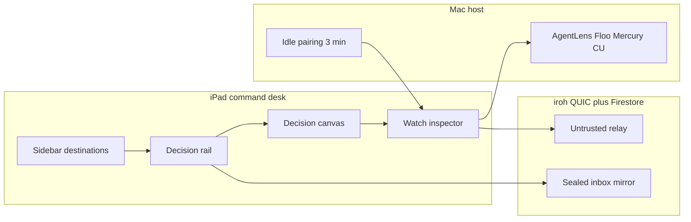

# iPad away-from-desk information architecture

**Status:** command-desk shell landed 2026-08-20 (`RootNavigationView` Inbox-first split + Watch inspector + named `WindowGroup(id: "agent-watch")`). Keep-awake You control landed 2026-08-21. Watch inspector two-pointer / drive-mode chrome landed 2026-08-21 (local hover on Halt · approvals · Ask to Mirror; Mac arrow on live pixels only). Physical Magic Keyboard / pointer receipts are still later.

**Sibling:** [iphone-hero-ia.md](iphone-hero-ia.md) — compact tray + Watch overlay.

**Plan:** [plans/2026-08-20-iphone-remote-continuation-master-plan.md](../../plans/2026-08-20-iphone-remote-continuation-master-plan.md)

**North star:** the iPad is a **command desk** for agents that still run on *your* Mac. You leave the desk. The next decision, the agent thread, and the live Mac stay on screen together. Transport is **iroh + HPKE Auth v3 + trusted-device roots**. This is not a daemon-RPC remote and it does not talk to `openburnbar-daemon.sock`.

The iPhone is a steering wheel: Inbox home, Watch **overlay** when a session starts. The iPad is a desk: Inbox-first **columns**, Watch / Mercury as a **persistent inspector canvas**. Do not copy the compact tray. Do not scale the phone overlay to fill an 11- or 13-inch window.

Same product brain as Mac AgentLens and the existing mobile packages. Same bundle, pairing graph, and `burnbar://` scheme. New information architecture only.

---

## Why a desk, not a large phone

Apple’s split-view HIG treats iPad as two or three vertical panes (Mail, Keynote), not a tab bar with more padding. iPadOS 26 windows resize continuously, hide the inspector first as width shrinks, wrap toolbars around window controls, and expect a menu bar plus 1:1 pointer tracking. SwiftUI’s `NavigationSplitView` plus `.inspector(isPresented:)` is the system shape for that: sidebar + content + detail, trailing inspector on regular width, sheet on compact.

BurnBar already has pieces of a desk and then fights them:

- `RootNavigationView` is a two-column `NavigationSplitView` whose **default launch is Pulse**.
- Default sidebar primaries are **Pulse / Quota / Insights / Streams / Agents** (`AppCustomization`).
- Inbox is a reachable `AppDestination` and still a **Streams chip**.
- `AIInboxSplitLayout` and `HermesSquareSplitLayout` are custom `HStack` splits at ≥ 720 pt.
- Agents **hides the root sidebar** (`.detailOnly`).
- Watch is `AgentLiveStage` in a `ZStack` — dock / split / maximize — the phone overlay.

That overlay is the wrong iPad model. A 360 pt floating tile on a 13-inch canvas is a phone habit. Maximize that covers Inbox is a phone habit. The away-from-desk job is: **see the next decision, act on it, and watch the Mac, without losing the list.**



---

## Hard facts (do not contradict)

These are inventory facts, not aspirations. The target IA must compose around them.

| Fact | Consequence for this IA |
|---|---|
| Inbox is a Streams chip today, not a tab. iPhone launch is Pulse. | Target iPad **launches Inbox**. Streams keeps a chip for people who land there. Pulse is reachable, not home. |
| Agent Watch overlay is **control-only**. Watch VIDEO is unwired: the Mac never starts `AgentWatchHUDSession`. | Inspector chrome (approvals, halt, action log) comes from Watch. **Pixels do not.** |
| Mercury **Ask-to-Mirror** on the single `media.control` mux is the live pixel path. | Inspector video is Mercury HEVC (H.264 fallback), not a HUD session. |
| Phone / iPad drives the Mac via **iroh + HPKE v3**, not the daemon Unix socket. | No Engine Room, no `openburnbar-daemon.sock`, no local gateway UI on iPad. |
| Keep-awake **exists**: live-session auto-arm plus a signed You toggle. Idle pairing freshness is **3 minutes**. | Inspector footer is honest: last seen / pairing age. You owns the sticky switch. |
| MAS compiles out Path C / D (`AgentWatchHUDSession` is `#if canImport(AppKit) && !DISTRIBUTION_MAS`). | iPad never pretends System CU or signed input will run on a MAS Mac. |
| Grokd / Local D box is **out of mobile v1**. | Agents lists Mac-backed CLIs via Hermes relay. Grokd is Mac-only until a sealed relay op exists. |

`IrohRelayPairing` already distinguishes idle 3-minute freshness from a longer reconnect window while a Mercury / CU / iroh session is live. That is pairing policy, not keep-awake. Do not describe the Mac as staying a host because this IA exists.

---

## Current iPad vs this target

| Surface | Landed (`RootNavigationView`) | Still later |
|---|---|---|
| Root | Inbox-first split + Watch inspector | Physical pointer / keyboard receipts |
| Sidebar primaries | Inbox, Agents, Quota, You | User-custom overflow only |
| Inbox | Home. Decision rail + canvas. App-wide `.searchable`. Pointer secondary-click | — |
| Watch | Persistent inspector + `WindowGroup(id: "agent-watch")` + two-pointer / drive-mode chrome | Physical pointer lock + Path D receipts |
| Agents | Sidebar stays. Square left column is the rail; thread/mission is the canvas | — |
| Quota / You | Provider-card rail + grouped You rail (Keep Mac awake is a You group) | — |
| Keyboard / menu / pointer | View menu ⌘1–⌘4, hover tint, Inbox context menu | Column resize cursors |
| Extra windows | Watch only; cloned desk scenes are destroyed | Mission console window |
| Compact iPad | `AuthGateView` → `RootTabView` | Stay that way |

`InboxHomeView` already wraps `AIInboxSplitLayout`. Reuse the store and the list. Replace the *shell*, not the inbox brain.

---

## Column map

One `NavigationSplitView` for the regular-width iPad root. Apply `.inspector(isPresented:)` to the split (not to a nested stack). Attach `.searchable` to the split so search is app-wide on iPad, not a per-column drawer.

Use the three-closure initializer: sidebar, content (decision rail), detail (decision canvas). Watch is **not** a fourth `NavigationSplitView` column and **not** a destination. It is the inspector.

```
┌─ Sidebar 220–260 ─┬─ Decision rail 320–400 ─┬─ Decision canvas (flex) ─┬─ Watch inspector 360–520 ─┐
│ Inbox ●           │ Ranked next decisions   │ Evidence + actions       │ Mercury pixels           │
│ Agents            │ or thread list          │ or live thread           │ CU strip · Halt          │
│ Quota             │ Provider cards          │ Headroom / reset atlas   │ Host footer              │
│ You               │ Settings groups         │ Pairing / devices / labs │                          │
└───────────────────┴─────────────────────────┴──────────────────────────┴──────────────────────────┘
```

Column widths: `navigationSplitViewColumnWidth(min:ideal:max:)`. Persist user drags with the same `@AppStorage` keys already used by `AIInboxSplitLayout` and `HermesSquareSplitLayout` so a person who resized one list recognizes the other. Prefer the **thin** system divider. Hover uses `pointerStyle(.resizeLeftRight)` on the handle.

### Sidebar (column 1) — destinations, not a tray

Four primaries. Order is the job, not historical Pulse-first.

| Order | Label | Enum / route id | What the rail shows |
|---|---|---|---|
| 1 (launch) | **Inbox** | `AppDestination.inbox` | Ranked next decisions (`AIInboxStore`) |
| 2 | **Agents** | `.agents` (id stays `agents` / Hermes) | Runtimes + threads (`HermesService` + missions) |
| 3 | **Quota** | `.burn` (id stays `burn`) | Urgency-sorted provider cards (`QuotaStore`) |
| 4 | **You** | `.you` | Pairing, keep-awake, devices, cloud, appearance, vault, labs |

**Not in the sidebar** (reachable, not deleted):

| Surface | How you get there |
|---|---|
| Pulse | `burnbar://pulse`, You → Pulse, View menu |
| Insights | `burnbar://insights`, You → Insights |
| Streams | `burnbar://streams`, You → Streams (cockpit / sessions / projects; Inbox chip remains) |
| Recap | You → Recap |
| Settings / devices / providers / vault | You, or today’s secondary rows if the user customized the sidebar |
| Agent Control screen | Inspector / Watch window. Stop pushing You → Agent Watch as the primary address. |

Sidebar chrome stays quiet: wordmark, four rows, unread badge on Inbox, a one-line **host footer** (iroh direct / last seen / pairing age). Today’s “Quick ask Hermes” footer sheet is the wrong affordance on a desk — ⌘N in Agents, or a toolbar compose field, opens a thread in the canvas.

Do not hide the sidebar when Agents is selected. Today’s `.detailOnly` on `.agents` is a phone-sized mistake.

### Decision rail (column 2) — the next move

Selection-driven. No `NavigationLink` push on regular width. Empty rail is a real `ContentUnavailableView`, not a blank slab.

**Inbox.** Existing ranked list: unread / attention / evidence. Arrow keys move. Return opens (already selected) or activates the primary action. Hover tints the row; no scale (HIG: rows must not lift). Secondary click: Approve, Open thread, Archive, Snooze, Copy link.

**Agents.** Existing Hermes Square left column: identity line, pinned Mac, thread list, mission overflow. Selecting a thread fills the canvas. Do not open Mercury from a grid tile into a sheet that covers Inbox — Ask-to-Mirror pins the inspector.

**Quota.** Provider cards as a selectable list. Canvas is the selected account’s headroom and reset atlas.

**You.** Grouped settings list (Pairing, Keep Mac awake, Devices, Cloud, Appearance, Data Vault, Labs). Canvas is the selected group. Keep-awake is the signed sticky phone toggle; live sessions still auto-arm.

### Decision canvas (column 3) — act

This is the reading / acting surface. It is **not** the Mac screen.

| Sidebar | Canvas |
|---|---|
| Inbox | `AIInboxDetailView` — evidence, next step, Approve / Deny / Open in Agents |
| Agents | Existing Hermes Square detail: thread, mission situation room, composer |
| Quota | `BurnView` account detail (reuse, do not restyle into a dashboard collage) |
| You | Settings page / devices / vault split already used on iPad |

Toolbar on the canvas (wraps around iPadOS 26 window controls):

- Sidebar toggle
- Inspector toggle (Watch)
- Primary action for the selection (Approve, Send, Ask to Mirror)
- Host chip: “Mac awake · iroh direct” vs “Mac asleep · last seen 12m” — honest, no fake idle ([docs/DASHBOARD_HOME_PLAN.md](../DASHBOARD_HOME_PLAN.md))

### Watch inspector (trailing) — see the Mac

SwiftUI `.inspector(isPresented:)` on the root split. Regular width: trailing column. Compact: sheet (and compact iPad should already be on the iPhone root). `InspectorCommands()` supplies **⌃⌘I**. Width via `inspectorColumnWidth(min:ideal:max:)` — ideal ~420, min ~320, max ~560.

The inspector is one canvas with two honest layers:

1. **Pixels (Mercury).** Ask-to-Mirror / live `media.control` frames. HEVC with H.264 fallback. If no mirror is live, show a still host card — pairing age, last frame time, “Ask to Mirror” — not a black video well pretending HUD frames exist.
2. **Control (Agent Watch).** Approval strip, action log, trust badge (phone/iPad **only downgrades**), panic Halt, Path D signed input **only when the paired Mac is Developer ID**. File drop when the blobs flag is on.

PiP and the phone dock tile are iPhone behaviors. On iPad, collapsing the inspector or popping the Watch window is the equivalent. Do not keep `AgentLiveStage` maximize as the regular-width default.

**Drive mode.** Pointer over the pixel surface becomes Mac-cursor passthrough (trackpad + keyboard to the host). A “You are driving” pill appears on first input and after a 4-second lull — same rule as today’s maximize stage, confined to the inspector or Watch window, not the whole iPad.

---

## Width collapse (Stage Manager, Split View, Slide Over)

HIG: defer compact for as long as possible; hide the **inspector first**; then collapse columns into a stack. Test halves, thirds, and quadrants.

| Width (approx.) | Columns | Watch |
|---|---|---|
| ≥ 1100 pt (full 11/13, landscape) | Sidebar + rail + canvas + inspector | Inspector open when a session or share is live, or when the user pinned it |
| 820–1099 pt | Sidebar overlay or rail + canvas | Inspector hidden; toolbar badge if a session is live |
| 720–819 pt | Rail + canvas (sidebar as leading overlay) | Hidden or Watch window |
| < 720 pt or compact size class | `AuthGateView` → `RootTabView` | iPhone overlay IA |

`AIInboxSplitLayout` / `HermesSquareSplitLayout` already resolve one vs two columns from the width they are given. Keep that for the **rail + canvas** pair. Do not let those custom `HStack`s become a second app chrome that hides the sidebar.

---

## Keyboard first class

Hardware keyboard is a primary input, not an accessibility extra. Populate the iPadOS 26 menu bar (`Commands`). Order by frequency. SF Symbols that match on-screen controls. Never hide disabled items — dim them.

### Menu bar

| Menu | Items |
|---|---|
| **BurnBar** | About, Settings… (⌘,), Keep Mac Awake *(later, dimmed until that work ships)* |
| **File** | New Agent Thread (⌘N), Ask to Mirror (⌘⇧M), Send File… (⌘⇧F, flag-gated) |
| **Edit** | System undo/redo/cut/copy/paste; Find Inbox (⌘F) |
| **View** | Inbox (⌘1), Agents (⌘2), Quota (⌘3), You (⌘4); Toggle Sidebar (⌃⌘S); Toggle Inspector (⌃⌘I); Pulse / Insights / Streams as secondary |
| **Session** | Approve (⌘↩), Deny (⌘⌫), Halt (⌘.), Trust step-down |
| **Window** | Open Watch Window (⌘⌥W), Mission Console, cycle windows |
| **Help** | Pairing, Computer Use panic paths |

`InspectorCommands()` and `SidebarCommands()` are the system toggles. Add BurnBar commands beside them; do not reimplement ⌃⌘I.

### Shortcuts

| Shortcut | Action | Notes |
|---|---|---|
| ⌘1 / ⌘2 / ⌘3 / ⌘4 | Inbox / Agents / Quota / You | Matches Mac “section keys,” remapped to the desk job |
| ⌘F | Search current rail | `.searchable` on the split |
| ↑ / ↓ | Move rail selection | Focus group = rail. Tab moves among sidebar / rail / canvas / inspector |
| ↩ | Activate primary action on the selected item | Inbox: open already-visible canvas, or Approve if that is the item’s next step |
| ⌘↩ | Approve pending CU / inbox grant | Unlock required if the device is locked — same safety as Live Activity intents |
| ⌘⌫ | Deny / archive (context-sensitive) | Deny when a CU ask is focused; archive when an inbox item is |
| ⌘. | Panic Halt | Same envelope as overlay Halt and Mac ⌃⌥⌘. |
| Space | Focus Watch inspector / begin drive mode | Does not change sidebar selection |
| Esc | Leave drive mode; blur composer | Does not Halt |
| ⌃⌘S | Toggle sidebar | `SidebarCommands` |
| ⌃⌘I | Toggle inspector | `InspectorCommands` |
| ⌘N | New agent thread | Selects Agents, focuses composer |
| ⌘⇧M | Ask to Mirror | Pins inspector; starts Mercury if paired |
| ⌘⌥W | Open Watch window | Stage Manager extra window |
| ⌘, | You → Settings | |

Full Keyboard Access already reaches buttons. We only custom-focus **content**: sidebar rows, rail rows, canvas composer, inspector pixel surface (`focusGroupIdentifier` per column).

---

## Pointer behaviors

iPadOS 26 pointer is 1:1. It no longer magnetizes or rubber-bands. Test with Magic Keyboard / trackpad. Touch still works; pointer does not replace it.

| Region | Effect | Behavior |
|---|---|---|
| Sidebar + rail rows | Hover **tint only** (no scale, no shadow) | Click selects. Secondary click = context menu. Two-finger scroll stays in the list under the pointer. |
| Toolbar / inspector chips | System **highlight** | Contiguous hit targets so the pointer does not flicker between buttons. |
| Canvas action buttons | Highlight | Approve / Deny / Halt stay large enough for finger *and* pointer. |
| Column dividers | `pointerStyle` resize | Drag persists width. |
| Watch pixel surface (not driving) | Hover | Click focuses. Double-click or Space enters drive mode. |
| Watch pixel surface (driving) | Custom Mac-cursor / hidden system pointer | Motion and clicks are signed Path D input when the Mac allows it. Secondary click is a Mac right-click, not an iPad menu. |
| File / Photos items | Drag | Drop onto inspector (Mac workspace) or an inbox/agent composer. Blobs flag default remains off. |
| Inbox evidence links | Pointing-hand | Same `burnbar://` / `openburnbar://sessions/` addresses. |

Do not invent a floating on-screen pointer for CU. The iPad pointer *is* the pointing device.

Apple Pencil: later Watch-unify annotate-on-frame. Natural iPad home; not a v1 column requirement.

---

## Stage Manager / extra windows

iPadOS 26: additive windows for things that should persist beside the current workspace. Inbox items are **not** documents. Do not open a window per item.

| Window | When | Contents | Do not |
|---|---|---|---|
| **Primary desk** | Always | Sidebar + rail + canvas + inspector | Put the Mac screen full-bleed here by default |
| **Watch** `WindowGroup(id: "agent-watch")` | ⌘⌥W, inspector overflow, incoming Ask-to-Mirror while Inbox is in use | Mercury pixels + CU chrome + host footer | Duplicate a second Inbox |
| **Mission console** | Optional later | Today’s `MobileMissionConsoleSheet` | Block v1 on this |
| **Mercury incoming call** | Incoming | Keep the existing incoming sheet; user can promote to Watch window | Steal the desk without consent |

Watch window state is the same `AgentWatchOverlaySingleton` / Mercury coordinators as the inspector. One session, two presentations. Closing the extra window returns the canvas to the inspector (or hides it if the user had collapsed it).

External display: the Watch window may move there. The desk stays on the iPad. Do not automatically span one window across both.

---

## Deep links

Scheme stays `burnbar://`. Hosts stay stable. What changes is **where** they land on regular-width iPad.

| URL | iPad landing | Notes |
|---|---|---|
| `burnbar://inbox` | Sidebar **Inbox**, rail focused | Launch-equivalent. |
| `burnbar://inbox/{id}` | Inbox + select item in rail + canvas | Opaque item id only. Cold-launch stash unchanged. |
| `burnbar://hermes`, `burnbar://chat`, `burnbar://assistants`, `burnbar://pi` | **Agents** | Enum stays `.agents` / Hermes. |
| `burnbar://assistants/{runtime}?threadId=` | Agents + thread in canvas | Agent-reply push. |
| `burnbar://burn`, `burnbar://quota` | **Quota** | Enum stays `.burn`. |
| `burnbar://settings` | You → Settings in canvas | |
| `burnbar://computer-use`, `burnbar://agent-watch`, `burnbar://agent-live` | **Pin Watch inspector** (or Watch window if one is open) | Does **not** select You. Does **not** change the Inbox/Agents selection. |
| `burnbar://insights`, `burnbar://insights/{slug}` | Insights (reachable) | |
| `burnbar://pulse`, `burnbar://dashboard` | Pulse (reachable) | |
| `burnbar://streams`, `burnbar://search` | Streams (reachable) | Inbox is no longer the reason to open Streams. |
| `burnbar://mission/{id}` | Agents + mission in canvas | Sheet only if the window is compact. |
| Mercury / call routes | Inspector or incoming sheet | Does not change sidebar selection. |

Cold launch: `AIInboxDeepLink`, `InsightsDeepLink`, and `MobilePendingOsRouteStore` stash-then-claim stay as they are. A push that posts before the root mounts is not lost.

---

## iPad-only vs shared

### Shared (same brain, both form factors)

- `AIInboxStore` / `AIInboxView` / detail evidence
- `HermesService`, missions, Wand / fan-out, capability grants, rollback
- `QuotaStore` / `BurnView`
- Mercury Ask-to-Mirror, calls, iroh-blobs (flag default off)
- Agent Watch **control** stream, approvals, panic Halt, trust step-down
- iroh + HPKE v3 pairing, trusted-device roots
- `burnbar://` hosts, push opaque ids, widgets / App Intents that already exist
- `MobileTheme` tokens: SF Pro, ember accent, system materials
- Security invariants below

### iPad-only

- Three-column `NavigationSplitView` + `.inspector`
- Inbox as **sidebar launch** (not a compact tray)
- Persistent Watch canvas / extra Watch window
- Menu bar + `Commands` + the shortcut table
- Pointer hover, secondary-click menus, column resize cursors
- Drive mode confined to inspector or Watch window
- Sidebar customization remains iPad (already `AppCustomization`)
- Apple Pencil annotate-on-frame (later)

### iPhone-only (do not bring to regular iPad)

- Four-item compact tray
- Watch overlay dock → split → maximize as the primary Watch model
- Dynamic Island / compact Live Activity presentation
- Large navigation titles over a single column as the home chrome

### Mac-only (do not grow on iPad)

- Daemon socket, Engine Room, local gateway `:8317`
- Grokd / Local D box (v1)
- Path C System CU; Path D only if the **Mac** build includes it
- Desktop pet, WebGL desktop wallpaper host, menu-bar tray popover
- Keep-awake **execution** (`IOPMAssertion`) — the Mac hosts it; iPad only shows the later toggle

### Compact iPad

`AuthGateView.shouldUseSidebarRoot` is already `idiom == .pad && horizontalSizeClass == .regular`. Slide Over and skinny Stage Manager windows use [iphone-hero-ia.md](iphone-hero-ia.md). Do not invent a third shell.

---

## Mac-feature → iPad address

Mapped from [docs/product-focus/FEATURE_INVENTORY.md](../product-focus/FEATURE_INVENTORY.md). “Address” is where an away-from-desk iPad user goes. Italics are named later work, not this IA’s ship claim.

| Mac feature | iPad address |
|---|---|
| AI Inbox | **Inbox** rail + canvas |
| Menu bar spend / quota readout | **Quota**; Inbox host footer may show tightest quota |
| Dashboard / overview lanes | You → Pulse |
| Charts atelier | You → Insights + Chart Studio |
| Insights canvases | You → Insights (Insights already has an iPad split) |
| Subscription & quota vault | **Quota** |
| Session logs / conversation cockpit | You → Streams |
| Projects + project memory | You → Streams |
| Missions + mission console | **Agents** canvas; optional later window |
| Memory review inbox | You → Data Vault / Pensieve |
| Multi-backend chat workspace | **Agents** canvas |
| Elder Wand / The Wand | **Agents** overflow |
| Control Deck | You |
| Context pack / resume / handoff | **Agents** overflow |
| Settings search + copilot | You → Settings |
| Agents & connections / account switcher | You → Providers |
| Local gateway / Engine Room | Mac host only |
| Agent Control (computer use) | **Watch inspector** / Watch window |
| Mercury / Floo screen, calls, files | **Watch inspector** (pixels = Ask-to-Mirror); files flag later |
| Remote Unlock | Human-only path in inspector; credentials never log / Firestore / agent context |
| Smart displays / Cast | You / Settings (Mac still hosts the bridge) |
| Text expansion | iPad keyboard + Settings |
| Desktop pet | Mac only |
| Appearance | You / Settings |
| Cloud membership, sync, trusted devices | You |
| Data & Privacy control center | You → Data Vault (existing iPad split) |
| Spend alerts / digest | Quota + You → Settings |
| Keep Mac awake | *You + inspector footer — separate work. Not this document.* |
| Grokd / Local D box | Mac only. Not v1. |
| ⌘K command palette | *Optional later; View menu + ⌘F cover v1.* |

---

## Security invariants (cannot vary)

From [docs/HERMES_COMPUTER_USE.md](../HERMES_COMPUTER_USE.md) and [docs/HERMES_MEDIA_TRANSPORT.md](../HERMES_MEDIA_TRANSPORT.md):

- Relays, Firestore, gateways: untrusted transport only
- Mac-bound CU / control: authenticated v3 HPKE envelope + trusted-device bind; v1/v2 fail closed
- Approval is ground truth; iPad trust **only downgrades**
- Locked Mac / loginwindow / SecurityAgent ends normal mirror and CU
- Remote Unlock is human-only
- Inbox push: opaque item id + kind/priority enum only
- No daemon-RPC remote from iPad
- Drive-mode input is signed Path D only when the Mac build includes it (not MAS)

---

## Design

SF Pro. System materials (`.regularMaterial`, `.ultraThinMaterial`, sidebar list). One ember accent. Content first. Ranked lists, not dashboard collage.

**Do not mandate Liquid Glass.** iPadOS 26 may glass the system sidebar, toolbar, and pointer highlight on its own. Column interiors stay materials and type. `RootNavigationView` already refuses glass as the sidebar *base fill* (nothing behind it to sample). Keep that discipline.

Toolbar wraps window controls. Backgrounds extend to the window edge; use `backgroundExtensionEffect()` only if the canvas is a hero image — Inbox and threads are lists, so they do not need a mirrored bleed.

Empty states are sentences: “Select an item.” “Mac has not offered a mirror.” “Pairing expired 3 minutes ago.” No illustration library.

---

## Implementation notes

1. Done — Inbox launches; Pulse stays reachable.
2. Done — Inbox, Agents, Quota, and You use sidebar + rail + canvas (not `.detailOnly`).
3. Done — Watch is `.inspector` + `InspectorCommands`. Regular-width iPad does not host `AgentLiveStage`.
4. Done — extra `WindowGroup(id: "agent-watch")`. Stage Manager clones of the desk scene are destroyed.
5. Done — `IPadAwayDeskCommands` on the existing `WindowGroup`.
6. Done — Inbox / Agents / Quota / You rails live in the root split. Agents uses Square’s left column as the rail (not a nested phone `HermesSquareRoot`). App-wide `.searchable` is on the split. Inbox rows expose pointer secondary-click verbs.
7. Done — `shells.ipados.primary` is Inbox / Agents / Quota / You.
8. Done — Watch inspector two-pointer contract: hover/magnetism on local chrome, `.hoverEffectDisabled` on live pixels, host cursor only when mirroring, Space / Esc drive mode confined to the inspector.

---

## Research

- Apple HIG: [Split views](https://developer.apple.com/design/human-interface-guidelines/split-views) (iPadOS two- or three-pane; account for fluid window widths, June 2025).
- Apple HIG: [Layout](https://developer.apple.com/design/human-interface-guidelines/layout) (hide inspector first; `backgroundExtensionEffect`; convertible sidebar).
- Apple HIG: [Pointing devices](https://developer.apple.com/design/human-interface-guidelines/pointing-devices) (highlight / lift / hover; no scale on rows).
- WWDC25: *Elevate the design of your iPad app* (window controls, 1:1 pointer, no magnetization, menu bar).
- WWDC25: *Build a SwiftUI app with the new design* (`NavigationSplitView` + `.inspector` on the detail; `.searchable` on the split).
- SwiftUI: `inspector(isPresented:)`, `inspectorColumnWidth`, `InspectorCommands` (⌃⌘I), `NavigationSplitViewVisibility`.
- Repo: `RootNavigationView`, `AIInboxSplitLayout`, `HermesSquareSplitLayout`, `AgentLiveStage`, `AppCustomization`, `AuthGateView`.
- Context7 SwiftUI lookup was quota-blocked this session; APIs verified from Apple HIG / WWDC / the in-repo SwiftUI expert `sheet-navigation-patterns` reference.
