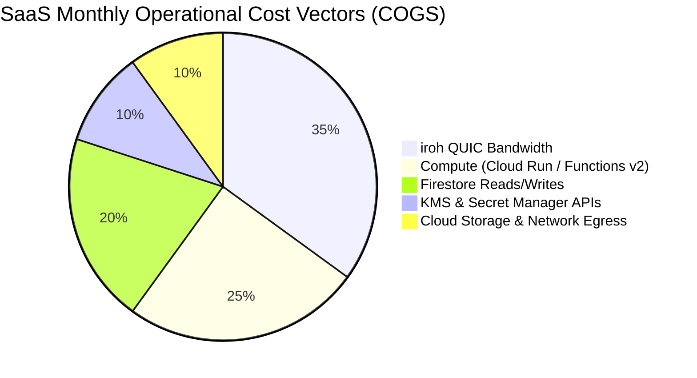

# OpenBurnBar Systems Architecture & Cloud Cost Infrastructure

This document is a comprehensive technical spec detailing the systems architecture, multi-platform runtime boundaries, database schemas, and underlying cloud cost vectors of the OpenBurnBar platform. It is designed for pricing models, SaaS operators, and agentic billing systems to analyze the absolute cost profile of deploying and maintaining OpenBurnBar.

---

## 1. Architectural Subsystems

OpenBurnBar is a local-first, cloud-supplemented developer automation and routing platform. It operates across multiple user devices (macOS, iOS, iPadOS, Android) and leverages a serverless Google Cloud/Firebase backend for premium features.

```mermaid
graph TD
    subgraph Local Developer Environment (macOS)
        IDE[VS Code / Cursor Extension] <-->|Unix Domain Socket JSON-RPC| Daemon[OpenBurnBar Daemon]
        Daemon <-->|Shared Package| Core[OpenBurnBarCore]
        Daemon <-->|Keychain Secrets / UI / Gateway| App[macOS App]
        Companion[Workspace Companion] <-->|Private Command RPC| IDE
        Daemon <-->|Workspace Bridging| Companion
        LocalDB[(GRDB SQLite)] <--> App
    end

    subgraph Mobile Companions
        iOS[iOS / iPadOS App]
        Android[Android App]
    end

    subgraph Cloud Control Plane (Firebase / GCP)
        Auth[Firebase Auth & App Check]
        Funcs[Firebase Functions v2]
        DB[(Firestore DB)]
        Storage[(Cloud Storage GCS)]
        KMS[GCP KMS / Secret Manager]
        IrohRelay[n0 Hosted iroh-relay]
    end

    %% Network & Sync Connections
    Daemon <-->|iroh QUIC Transport| IrohRelay
    iOS <-->|iroh QUIC Transport| IrohRelay
    Android <-->|iroh QUIC Transport| IrohRelay
    
    Daemon <-->|Callable HTTPS & Listeners| Funcs
    iOS <-->|Callable HTTPS & Listeners| Funcs
    Android <-->|Callable HTTPS & Listeners| Funcs
    
    Funcs <--> DB
    Funcs <--> Storage
    Funcs <--> KMS
```

### 1.1 Local macOS Subsystems
1. **OpenBurnBar macOS App:** The primary native desktop UI. It is responsible for the installation, repair, and removal of the `launchd` LaunchAgent daemon, secure management of upstream provider credentials inside the macOS Keychain, rendering local usage logs, and configuring advanced model routing and alias profiles.
2. **OpenBurnBar Daemon (`OpenBurnBarDaemon`):** A launchd-managed, background-resident helper process. It acts as the local control plane. It exposes a versioned JSON-RPC protocol over a Unix domain socket, manages multi-client lease arbitration, monitors token quotas, implements fallback/failover routing, and acts as the local HTTP proxy gateway at `127.0.0.1:8317`.
3. **Cursor / VS Code Extension:** Integrates directly into the developer's editor, rendering health cards, run lists, plan queues, and approval sheets.
4. **Workspace Companion:** A lightweight editor-side runner. It receives private Command RPC requests from the extension to execute file reads, workspace grep searches, AST-based patches, and sandboxed terminal commands, and reports active workspace trust states back to the daemon.
5. **OpenBurnBarCore:** A shared Swift package used by the app, daemon, and tests, which encapsulates the model catalog schemas, tool definitions, approval contracts, and the run-state machine.

### 1.2 Mobile Companions
1. **iOS / iPadOS App:** Built natively in SwiftUI. Connects to the macOS app via an iroh-based QUIC connection to act as an active screen-mirror, remote controller, clipboard synchronizer, and real-time quota monitor.
2. **Android App:** Built natively in Kotlin, achieving 100% feature parity with iOS, including iroh loopback transport, Tink cryptographic signing, and BiometricPrompt integration.

### 1.3 Cloud Control Plane (Firebase / GCP)
1. **Firebase Auth & App Check:** Restricts all backend access to verified subscribers running authentic, untampered mobile and desktop clients (verified via Apple DeviceCheck/App Attest and Android Play Integrity).
2. **Firebase Functions v2:** A suite of Node.js serverless functions acting as the API layer for subscription management, hosted quota refreshing, zero-knowledge search indexing, and VoIP push dispatch.
3. **Cloud Firestore:** A serverless NoSQL document database storing secure user profile metadata, encrypted session log indexes, and synchronized quota snapshots.
4. **Cloud Storage (GCS):** Host for zero-knowledge client-side encrypted conversation session logs.
5. **Google Cloud KMS & Secret Manager:** Secures provider access keys, Apple App Store Connect API certificates, and the cryptographic vault key used to wrap hosted indices.
6. **n0 Hosted iroh-relay:** An active Cloud Run or compute instance acting as a TURN-like relay for iroh QUIC traffic, allowing firewalled macOS hosts and mobile clients to establish direct, low-latency control streams.

---

## 2. Shared Data Contracts & Formats

OpenBurnBar uses strictly defined formats across all local and remote boundaries, preventing serialization overhead and minimizing cloud translation compute.

### 2.1 Local Gateway Server Protocol (`127.0.0.1:8317`)
The daemon's gateway acts as a format-transposing proxy:
* **Incoming Endpoints:** Exposes OpenAI-compatible `/v1/chat/completions`, `/v1/models`, and `/v1/responses`, alongside Anthropic-compatible `/v1/messages`.
* **Outbound Translation (Anthropic Bridge):** Converts incoming OpenAI Chat Completions requests into Anthropic Messages payloads, streams the response chunk-by-chunk using Server-Sent Events (SSE), and translates upstream `message_delta.usage` and OpenAI `stream_options.include_usage` final chunks to ensure exact client-side billing metrics.
* **Format-Family Enforcement:** Segregates requests by `requestedFormatFamily`. An OpenAI-shape request is restricted to OpenAI-compatible provider accounts, and an Anthropic request is restricted to Anthropic keys, preventing cross-vendor data corruption.

### 2.2 Phone Control Authority Envelope (Ed25519)
All remote-control intents sent from a mobile client to a macOS host are signed to prevent man-in-the-middle attacks or malicious replays over the public iroh network.
* **Payload Structure (`PhoneControlAuthority`):**
  ```json
  {
    "peerNodeId": "iroh_node_id_base32",
    "counter": 1042,
    "timestamp": 1780234175000,
    "intentHashBlake3": "sha256_hex_hash_of_authority_free_intent",
    "signatureEd25519": "base64_signature_over_metadata"
  }
  ```
* **Replay Rejection:** The macOS host maintains a persistent lookup of `lastSeenCounter[peerNodeId]`. Any payload carrying a counter value less than or equal to the recorded count is instantly discarded. A sliding time window of $\pm 5$ seconds rejects stale timestamps.

---

## 3. Database & Storage Schemas

### 3.1 Firestore Schemas (Canonical Cloud Models)
Firestore collections are highly optimized to minimize write amplification and keep storage footprint negligible.

#### Collection: `users/{uid}/entitlements`
Stores the active billing and access levels of the user, written exclusively by server-side reconcilers.
```typescript
interface HostedQuotaEntitlementDoc {
  schemaVersion: 2;
  verificationVersion: 2;
  source: "apple_jws_verified" | "stripe_webhook" | "google_play_verified";
  productId: "com.openburnbar.pro.monthly" | "com.openburnbar.hostedQuotaSync.cloud.monthly";
  expiresAt: Timestamp;
  originalTransactionId: string;
  isActive: boolean;
  features: string[]; // ["hostedQuota", "hostedLLM", "encryptedSessionLogBackup", "cloudConversationSearch"]
}
```

#### Collection: `users/{uid}/quota_snapshots`
Caches the latest provider metrics retrieved by the hosted or self-hosted runners.
```typescript
interface QuotaSnapshotDoc {
  providerId: string; // e.g., "codex", "claude-code"
  sourceId: string;   // e.g., "hosted", "self_hosted"
  updatedAt: number;  // Epoch milliseconds
  quotaBuckets: Array<{
    bucketName: string;
    remainingCredits: number;
    totalLimit: number;
    resetTimestamp: number;
  }>;
}
```

#### Collection: `users/{uid}/cloud_search_chunks`
Maintains the zero-knowledge semantic and prefix search index of user conversations.
```typescript
interface CloudSearchChunkDoc {
  sessionId: string;
  chunkIndex: number;
  commitId: string;       // Opaque verification hash
  storageBlobPath: string; // References the GCS encrypted file
  exactTokenHashes: string[]; // HMAC-SHA256 hashes of exact tokens for exact search
  semanticPostingEdges: string[]; // Encrypted vector-adjacent candidate hashes
  updatedAt: Timestamp;
}
```

### 3.2 Cloud Storage (GCS) File Layout
* **Path:** `users/{uid}/sessions/{sessionId}.vault`
* **Content-Type:** `application/octet-stream`
* **Encryption Format:** Client-side AES-GCM (256-bit) using a key derived from the user's local device keychain, wrapped via an escrowed KMS vault key. The server never receives the plaintext conversation text, screenshots, or code files.
* **Commit-Time Validation:** Cloud Functions enforce a hard ceiling of 10 MB per file (`ENCRYPTED_SESSION_BLOB_MAX_BYTES`) and run a strict pre-commit hook verifying that the GCS blob matches the size, hash, and content-type declared in the client-signed upload ticket before indexing the metadata in Firestore.

---

## 4. SaaS Cloud Cost Vectors (COGS)

Operating OpenBurnBar as a paid service introduces direct, variable Cost of Goods Sold (COGS) across multiple GCP and external network categories.



### 4.1 Compute (Cloud Functions & Cloud Run)
* **Cloud Run (Hosted Quota Runner):** Runs the Dockerized environment containing the Codex CLI engine. Retrieves provider quota on demand.
  * *Cost Drivers:* CPU allocation (1 vCPU, 2GB RAM) per active execution millisecond, cold start overhead, and container scaling.
* **Cloud Functions v2 (Event Loops & Callables):** Handles Apple StoreKit receipt verification, Apple Server-to-Server webhook processing, daily subscription reconciliations, search index commits, and VoIP APNs push dispatch.
  * *Cost Drivers:* Invocation count ($0.20 per million), CPU-seconds, and outbound HTTP connection time to Apple and Stripe APIs.

### 4.2 Database (Firestore)
* **Write Costs ($0.18 per 100,000 writes):**
  * Adding user billing logs, entitlement changes, daily rollups, and search chunk indexes.
  * Writing `cloud_search_chunks` records for indexed session transcripts. A single 100-turn chat split into 16 KB chunks generates up to 10-15 chunk writes, creating direct write amplification.
* **Read Costs ($0.06 per 100,000 reads):**
  * Validating permissions on every user request.
  * Querying `cloud_search_chunks` during semantic searches. Opaque hash matching queries read the index collections before client decryption.

### 4.3 Network & Bandwidth (Mercury Media Relay)
OpenBurnBar supports screen sharing, video streams, and audio calls between paired devices over an iroh network. When direct peer-to-peer hole punching fails, all data flows through the hosted TURN/iroh-relay.
* **Relay Host Compute:** Keeping active `n0 hosted-relay` instances (`team-200` tier) online to negotiate QUIC streams costs a flat **$200/month** per instance.
* **Network Egress Bandwidth:** Data flowing through the relay incurs GCP network egress charges.
  * *Cost Factor:* **$0.04 per GB** of relayed traffic. A single screen-sharing session (1080p, 15fps, average 3 Mbps) consumes approximately **1.35 GB per hour**, costing **$0.054/hour** in pure bandwidth.

### 4.5 KMS & Secret Manager APIs
* **Secret Manager ($0.03 per 10,000 active secret versions):** Holds hosted Codex session cookies (`auth.json`) and developer keys securely.
* **Secret Access ($0.03 per 10,000 API calls):** Cloud Functions retrieve wrapped keys on every user-initiated refresh, creating direct linear overhead with usage frequency.

### 4.6 Security and API Abuse Vulnerability
If an authenticated, premium user initiates background quota refreshes or runs scripts that spam the hosted runner, compute and Secret Manager API costs can spike rapidly.
* *Mitigation:* OpenBurnBar implements server-side abuse limits (**30 refreshes/day** soft cap, **300 refreshes/month** hard cap per user) to bound Secret Manager and Cloud Run exposure.

---

## 5. Architectural Invariants for Billing
1. **Unilateral Server Enforcement:** Entitlements live in Firestore under `users/{uid}/entitlements/` with write permission denied to all client devices. The StoreKit verification pipeline or Stripe webhooks are the sole writers.
2. **App Check Verification:** Every network call to Firebase Functions requires a valid App Check token. Unregistered API clients, bots, or third-party wrappers are rejected at the gateway before triggering server compute or database reads.
3. **Zero Plaintext Storage:** The server never stores decrypted session transcripts, keystrokes, or code file contents. The SaaS operator is completely insulated from expensive compliance audits (SOC2, HIPAA) for raw developer data, keeping regulatory insurance and compliance costs exceptionally low.
