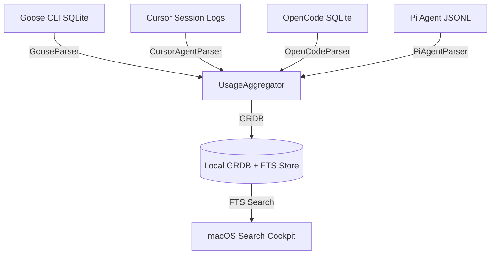
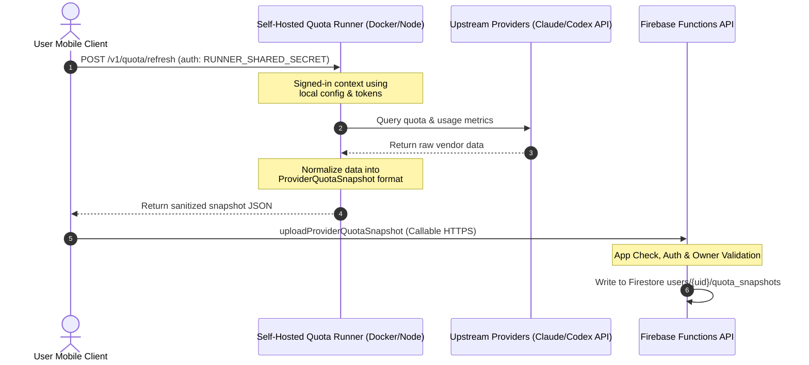

# Tier 1 — Free / Local-First BYOK Technical Spec

This document details the engineering specifications, operational boundaries, and technical mechanics of **Tier 1 (Free / Local-First / Bring-Your-Own-Key)**. 

---

## 1. Core Philosophy & Architectural Boundary

Tier 1 is designed to be **entirely local-first and client-controlled**. It operates with a **$0.00 marginal cost to the SaaS operator** by keeping all planning, model execution, credential vaulting, and telemetry indexing confined to the developer's physical macOS device and their private self-hosted infrastructure.

```mermaid
graph LR
    subgraph macOS Localhost (BYOK Sandbox)
        IDE[VS Code / Cursor] <-->|Unix Domain Socket| Daemon[OpenBurnBar Daemon]
        Daemon <-->|Port 8317 Proxy| Upstream[Upstream APIs e.g. OpenAI/Anthropic]
        App[macOS App UI] <-->|Local OS Keychain| Keys[(Keychain API Keys)]
        Daemon <-->|Scrapers / Log Parsers| LocalDB[(Local SQLite GRDB + FTS)]
    end
```

### Key Technical Properties:
* **Zero External Cloud Processing:** The SaaS operator's Firebase databases, Cloud Functions, and storage buckets are bypassed for model calls, logs, and indexing.
* **Keychain-Backed Security:** Provider secrets (e.g., API keys for OpenAI, Anthropic, DeepSeek, Z.ai, MiniMax, Warp) are stored directly inside the user's native macOS Keychain using the `KeychainItem` Swift APIs, secured by hardware-level secure enclaves.
* **Compliance Posture:** Satisfies enterprise security requirements where raw code, corporate credentials, and proprietary logs must never touch a third-party server.

---

## 2. The Local Gateway (`127.0.0.1:8317`) & CLI Routing

The heart of the local-first tier is the **OpenBurnBar Loopback Gateway**. It runs by default on port `8317` and abstracts all developer tools (IDEs and CLIs) from upstream API changes, rate limits, and quota exhaustion.

### 2.1 Supported CLI Clients & Integrations
Tier 1 includes automatic configuration and wiring scripts for the industry's most widely used coding assistants:
1. **Claude Code:** OpenBurnBar automatically edits `~/.claude/settings.json`, injecting `env.ANTHROPIC_BASE_URL` pointing to `http://127.0.0.1:8317` and writing a security-restricted `env.OPENBURNBAR_WIRED` sentinel marker.
2. **Factory / Droid:** The macOS app rewrites `customModels` configurations in `~/.factory/settings.local.json`, `~/.factory/settings.json`, and `~/.factory/config.json`, mapping models served by the gateway. Old VibeProxy mappings are automatically deduped.
3. **Forge:** Configures `~/forge/.forge.toml` with sentinel blocks pointing to the local loopback server.
4. **Codex CLI:** Inserts a fenced `[model_providers.openburnbar]` block inside `~/.codex/config.toml`.
5. **OpenCode:** Integrates with `~/.config/opencode/opencode.json` via a direct provider block.

### 2.2 Advanced Failover & Routing Policies
The loopback gateway doesn't simply proxy requests; it implements advanced client-side orchestration:
* **Provider-Family Failover:** Extends active API call capacity by rotating across multiple user-supplied keys in the same provider family. If a primary OpenAI account returns a rate-limit error (`429`), the gateway automatically shifts traffic to the backup OpenAI key transparently before streaming bytes to the client.
* **Exact Model Failover:** Ensures that failovers are mathematically sound. OpenBurnBar enforces that the destination slot's `canonicalModelID` is an exact match for the requested model. It will never swap `gpt-5.4-pro` for a generic `gpt-5-family` wrapper just because it is available, preserving task intelligence and deterministic behavior.
* **Anthropic Bridge:** Allows OpenAI-shaped clients to execute Anthropic Models. The gateway parses Chat Completions payloads, converts them to Anthropic Messages, executes the call, and wraps SSE stream chunks into standard OpenAI server-sent event frames.
* **Custom Model Aliases:** Users can define friendly aliases (e.g., `my-fast-coder` mapping to `claude-3-5-sonnet`) through the macOS Settings panel. The gateway registers these in its loopback `/v1/models` payload and routes traffic dynamically.

---

## 3. Local Indexing & Log Parsers

Rather than uploading transcripts to a cloud server to synchronize search indices, Tier 1 builds and maintains a highly optimized **local semantic corpus** using native log parsers that scan local runtime files.



### 3.1 Log Parsers (`LogParser` Interface)
A suite of native Swift parsers implements defensive, type-safe SQLite and JSONL scanning:
* **`GooseParser`:** Connects to `~/.local/share/goose/sessions/sessions.db` (and legacy Application Support folders), flattening structured relational tables (`sessions` and `messages`) into conversation turns while gracefully handling column type drift.
* **`CursorAgentParser`:** Scans `~/.cursor-agent/sessions/` transcripts, parsing precise token logs and message sequences.
* **`OpenCodeParser`:** Connects to `~/.local/share/opencode/opencode.db` using robust GRDB `DatabaseValue` decoding. It safely parses `part` rows, token consumption, and cache reads.
* **`PiAgentParser`:** Parses JSONL stream logs under `~/.pi/sessions/` to extract conversation telemetry.

### 3.2 GRDB + FTS SQLite Database
* **FTS (Full-Text Search):** Parsed transcripts are written directly into a local SQLite database using **GRDB (SQLite Toolkit for Swift)** and optimized FTS5 modules.
* **Zero Overhead:** Conversational search, keyword indexing, and snippet indexing happen entirely on the CPU of the developer's Mac, running at near-zero latency with zero network bandwidth consumption.

---

## 4. Self-Hosted Mobile Synchronization Mechanics

To allow mobile companions (iOS, iPadOS, Android) to refresh provider quotas without relying on paid OpenBurnBar hosted runners, Tier 1 provides an open-source **Self-Hosted Quota Runner** architecture.



### 4.1 The `quota-runner` Node Service
The repository packages a fully functional, containerized Node.js service under `quota-runner/`.
* **Container Environment:** The Dockerfile pins specific globally-installed command-line tools (`OPENAI_CODEX_VERSION` and `ANTHROPIC_CLAUDE_CODE_VERSION`) to prevent floating npm dependency breaks.
* **Execution Boundary:** The runner binds to `127.0.0.1` by default for secure local development. When configured with a cryptographic `RUNNER_SHARED_SECRET`, it binds to `0.0.0.0` for deployment in private VPCs, Cloud Run, or home servers.
* **Supported Refresh Actions:**
  * **Codex:** Mounts the user's `CODEX_HOME` or reads `auth.json`, boots the Codex stdio bridge, and parses rate limits.
  * **OpenCode:** Connects to `~/.local/share/opencode/opencode.db` to retrieve the exact 5-hour cost ledger, and runs `opencode stats --days 7` and `opencode stats --days 30` to return Normalized estimated buckets.
  * **Claude Code:** Self-hosted is the **only supported path** for Claude Code quota updates. The runner executes in an environment with active OAuth credentials, protecting the user's Anthropic tokens inside their private perimeter.

### 4.2 Firebase Storage & Verification Loop
* **Local Keychain Secrets:** On mobile devices, the self-hosted runner's URL is persisted in `UserDefaults`, and the optional Bearer token is stored in the iOS/Android Keychain.
* **Sanitized Uploads (`uploadProviderQuotaSnapshot`):** The mobile client queries the self-hosted runner directly, receives the normalized snapshot, and pushes it to Firestore via the Firebase callable `uploadProviderQuotaSnapshot`. The Firestore security rules enforce that the snapshot belongs to a provider account owned by the uploading Firebase UID, preventing data spoofing.

---

## 5. Pricing and Cost Implications for GPT Pro

When modeling the financials of the OpenBurnBar platform, **Tier 1 represents a highly profitable, self-sustaining system**:
* **Variable Cost:** **$0.00/month per active user**. Compute, network bandwidth, Secret Manager keys, and database reads/writes are completely offloaded to the user.
* **Customer Acquisition Cost (CAC) Utility:** Serves as an exceptional "free forever" hook. It builds viral developer adoption and acts as a gateway to the Pro tier once developers require hosted mobile sync, video relays, encrypted search indices, and shared agent executors.
* **Compliance Cleanliness:** Eliminates billing, tax, and licensing complexities for highly regulated sectors (defense, healthcare, finance), which can adopt the open-source self-hosted codebase directly.
