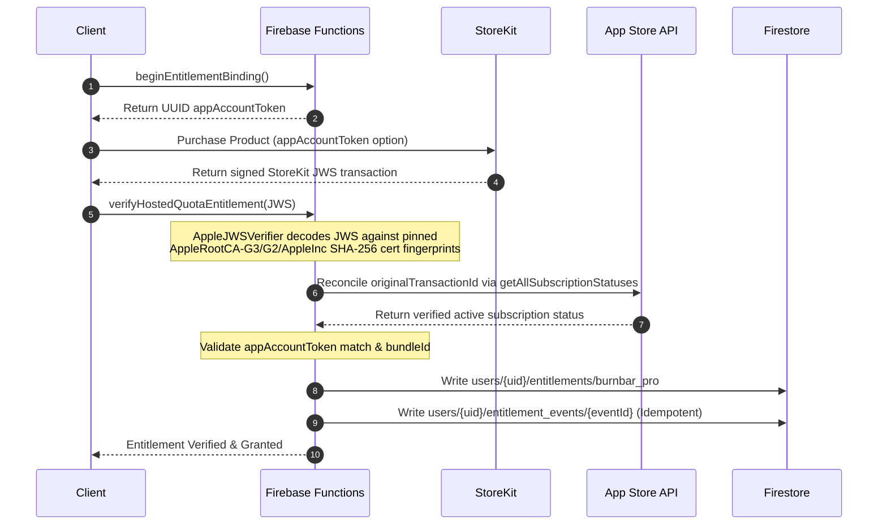
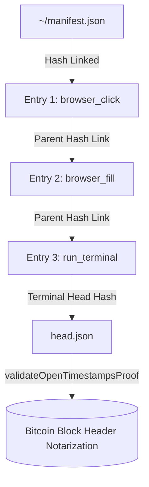

# Tier 2 — Paid Pro Cloud SaaS Spec & Operational Mechanics

This document provides a highly detailed engineering and operational spec for **Tier 2 (Paid Pro Cloud SaaS Bundle / `burnbar_pro`)**. It breaks down the systems architecture, transactional verifications, encrypted data flows, bandwidth relays, remote executors, and strict budget caps that govern premium operations.

---

## 1. The Pro Cloud Entitlement Model

Access to Tier 2 services is guarded by a server-side, cryptographically-proven entitlement structure. 

### 1.1 Entitlement Features Advertised
When a user subscribes, their Firestore entitlement document (`users/{uid}/entitlements/burnbar_pro`) advertises four active capability flags:
1. `hostedQuota`: Unlocks the OpenBurnBar-hosted Codex quota refresh runners.
2. `hostedLLM`: Grants access to hosted MiniMax-backed Intelligence Brief callable endpoints.
3. `encryptedSessionLogBackup`: Allows automated GCS backups of AES-encrypted conversation transcripts.
4. `cloudConversationSearch`: Unlocks Firestore-based zero-knowledge semantic and exact token search indexing.

### 1.2 StoreKit JWS Verification Pipeline (v2)
Entitlements are not granted via client-supplied request tokens. They are the product of an **immutable server-side StoreKit verification pipeline**:



#### Pipeline Highlights:
* **Certificate Pinning:** The `AppleJWSVerifier` decodes signed payloads against pinned Apple Root certificates (`AppleRootCA-G3.cer`, `AppleRootCA-G2.cer`, and `AppleIncRootCertificate.cer`). If a root certificate's SHA-256 fingerprint does not match the hardcoded pins inside `verifier.ts`, the cold start sequence immediately crashes the Cloud Function.
* **App Account Token Binding:** Before executing a purchase, the client calls `beginEntitlementBinding` to generate a fresh UUID. This UUID is set as the StoreKit transaction's `appAccountToken`. When Apple signs the resulting JWS, the reconciler matches this token against `entitlement_bindings` to prevent replay attacks across multiple UIDs.
* **Server-to-Server Webhooks (`appStoreServerNotificationsV2`):** Handles App Store subscription state changes (cancellations, renewals, upgrades) in real-time with an append-only idempotent audit log.
* **Daily Reconciliation (`reconcileHostedEntitlementsDaily`):** A scheduled Cron job that re-polls the App Store Server API for every active subscriber, catching any missed webhooks and reconciling state changes within 24 hours.

---

## 2. Premium Cloud Services Deep-Dive

### 2.1 Service 1: Hosted Quota Sync
Allows mobile devices to sync Codex quota status automatically without keeping a desktop app online or deploying a private self-hosted server.
* **Data Flow:**
  1. User taps "Refresh" on the iOS/Android app.
  2. The client calls `refreshProviderAccountQuota` with App Check validation.
  3. The Cloud Function verifies the active `burnbar_pro` entitlement.
  4. The Cloud Function fetches the user's Codex credential (`auth.json`) from GCP Secret Manager.
  5. The Cloud Function executes an HTTPS POST to the hosted runner endpoint `/v1/quota/refresh` using the `HOSTED_QUOTA_RUNNER_TOKEN` bearer key.
  6. The hosted runner boots the Codex CLI environment, retrieves the rate-limit payload, normalizes it, and returns the sanitized buckets.
  7. The Cloud Function writes the normalized quota snapshot into Firestore under `users/{uid}/quota_snapshots/`.

### 2.2 Service 2: Mercury Media Cloud Relay
Facilitates high-bandwidth screen-sharing, video streaming, and 1:1 audio calls over firewalled networks.
* **iroh QUIC Transport:** Paired devices establish iroh QUIC sessions. If P2P hole-punching fails, data automatically routes through the hosted `n0 iroh-relay` instances (`team-200` tier, costing $200/mo flat).
* **APNs VoIP Integration (`triggerVoIPCall`):** When a macOS host attempts to stream screen and media data, it triggers a VoIP push to the mobile client using Apple Push Notification service (APNs), which invokes CallKit on the iOS device to alert the user.
* **SaaS Guardrails (`evaluateMediaBudget`):** To prevent astronomical bandwidth bills, an hourly Cloud Function evaluates total media egress traffic against Remote Config parameters:
  * **Default Soft Cap:** Projected month-end spend reaches **$600**. System auto-tightens bandwidth allocations.
  * **Default Hard Cap:** Projected month-end spend reaches **$1000**. The function flips the Remote Config `media_kill_switch=true` and terminates in-flight relay sessions with a 60-second grace window.
  * **Cost Per GB:** Defaults to **$0.04/GB**.

### 2.3 Service 3: Zero-Knowledge Search Indexing
Provides full-text and semantic search across the user's historical session transcripts without exposing plaintext conversation details or security credentials to the cloud database.

```mermaid
graph TD
    subgraph macOS Client (Zero-Knowledge Encryption)
        Plain[Plaintext Transcript] -->|Split 16KB Chunks| Chunks[Transcript Chunks]
        Chunks -->|AES-GCM-256 local key| Cipher[Encrypted Blobs]
        Chunks -->|HMAC-SHA256 hash| TokenHashes[Exact Token Hashes]
        Chunks -->|HMAC-SHA256 hash| SemanticHashes[Semantic Posting Edges]
    end

    subgraph Firebase Cloud Storage (GCS)
        Cipher -->|Upload Ticket| GCS[(Encrypted Storage Blobs)]
    end

    subgraph Firestore Cloud Database
        TokenHashes -->|Callable Hook| DB[(cloud_search_chunks Collection)]
        SemanticHashes -->|Callable Hook| DB
        GCS -->|Commit Verification| DB
    end
```

#### Indexing Mechanics:
* **Client-Side Partitioning:** The macOS app splits conversation transcripts into structured 16 KB chunks.
* **AES-GCM Encryption:** Chunks are encrypted on the developer's machine using `CloudVaultCrypto` and a vault key before uploading to GCS.
* **Hash Manifests:** The client generates one-way cryptographic search indicators:
  * **Exact Token Hashes:** Up to 1024 exact HMAC-SHA256 token hashes per chunk.
  * **Semantic Posting Edges:** Opaque HMAC hashes representing vector-adjacent search candidate paths.
* **Database Commit:** Firestore rules block direct client writes to the search indexes. Uploads flow through a callable validation function. The server only commits index metadata once GCS confirms the encrypted blob exists, matches the expected `application/octet-stream` MIME type, and conforms to the size and path declared in the upload ticket.
* **Low-Cost Search Querying:** Search queries transmit only device-derived opaque hashes. The database matches candidate Firestore document chunks and hands back GCS download links. The client device downloads the encrypted chunks and decrypts them locally.

### 2.4 Service 4: Hosted Remote MCP
Exposes the zero-knowledge session vault to external agents (e.g., Cursor, Claude CLI, Anthropic SDK).
* **Bearer Access:** Pro users can connect tools directly to `https://mcp.burnbar.ai/mcp` or run the local `openburnbar-mcp-remote` stdio shim using short-lived bearer tokens minted by the app.
* **Decryption Location:** Decryption is strictly enforced **device-side**, keeping the cloud relay clean of raw text.

---

## 3. Cloud-Managed Computer Use

Computer Use (Path A, B, C, D) enables autonomous agents (Hermes, Pi, OpenClaw, Codex, Claude, Droid, Forge, Antigravity) to view screens, click elements, fill forms, and run terminal commands under strict human supervision.

### 3.1 Subsystem Execution Boundaries
1. **Path A — Agent Watch:** Mirrors macOS desktop states, cursor movements, and action overlays to iOS/Android companions over active iroh-relay video packets.
2. **Path B — Browser Computer Use (Playwright):** Drives an isolated, sandboxed Chromium instance via the `openburnbar-playwright-bridge.js` bridge pinned to Playwright `1.49.1`.
3. **Path C — macOS System Computer Use (CGEvent + AX):** Drives native OS interactions (clicking display coordinates, typing Unicode strings, executing hotkeys, and inspecting Accessibility trees) using CGEvent and macOS AX APIs.
4. **Path D — Phone-as-Controller:** Converts mobile screen interactions into signed control frames (`control.input.intent`) containing Ed25519 authority envelopes, executing desktop actions remotely.

### 3.2 Agent Chat Grants & Biometrics
OpenBurnBar enforces strict capability boundaries. Agents have **zero desktop privileges** by default.
* **Chat Thread Isolation:** The user must explicitly issue an `AgentCapabilityGrant` from the chat UI (Off, Low, Workspace, Desktop, All, or YOLO presets) which remains local to that specific chat thread.
* **Live Sync & Queues:** Desktop controls sync live over active iroh connections via `control.agent_grant.request`. If offline, requests are queued in Firestore (`agent_capability_grant_requests/{requestId}`).
* **Biometric Unlock Enforcement:** Before granting high-risk permissions (Desktop, All, YOLO), iOS and Android clients enforce **mandatory local biometric authentication** (FaceID/TouchID via LocalAuthentication on iOS, AndroidX `BiometricPrompt` on Android).

### 3.3 Cryptographic Audit Chains & OpenTimestamps Notarization
Every tool call, screenshot, and keyboard input executed by an agent is locked into a tamper-proof cryptographic audit trail.



* **Linear Hashing:** Audit entries (`chain.jsonl`) are chained via parent hashes using SHA-256 (`ComputerUseAuditHasher`).
* **Tarball Exports:** The `ComputerUseAuditExportWriter` packs transcripts, signatures, and pre/post action screenshots into a signed `.tar.gz` bundle, verified against public keys registered in Firestore under `users/{uid}/escrow_devices/`.
* **Bitcoin Notarization:** The final state hash (`head.json`) is notarized to the Bitcoin blockchain via OpenTimestamps. The Cloud Function `validateOpenTimestampsProof` decodes the base64 `.ots` proof, queries the local verifier container client (`tools/opentimestamps-verifier-service/`), and confirms blockchain consensus.

### 3.4 Computer Use Budget Governance
To insulate the SaaS operator from out-of-control LLM loops or runaway agent executions, the hourly `evaluateComputerUseBudget` Cloud Function monitors monthly projections and enforces strict daily ceilings:

```
Month-to-Date Projection (projectedMonthEndUSD)
   |
   |---> >= $1500  -->  SOFT CAP ENVELOPE ENFORCED
   |                     - Max 25 actions per execution run (down from 50)
   |                     - Max 100 actions per day (down from 200)
   |                     - Max 2 sessions per day (down from 4)
   |                     - Daily User spend limit: $2.50 (down from $5.00)
   |
   |---> >= $2500  -->  HARD CAP KILL SWITCH TRIGGERED
   |                     - Auto-publishes Remote Config computer_use_kill_switch=true
   |                     - Active sessions panic-halt (panicHalt) within 60s
   |                     - Max actions, sessions, and spend limit set to 0
```

#### Panic Halt Triggers:
A session instantly shuts down and resets to Manual mode within 100-200ms if:
1. The user hits the global keyboard panic hotkey (`⌃⌥⌘.`).
2. The user initiates a three-finger long press on their paired mobile phone screen.
3. The macOS host enters secure OS screens (e.g., `loginwindow` triggers, `SecurityAgent` credential sheets appear, or the display falls asleep).
