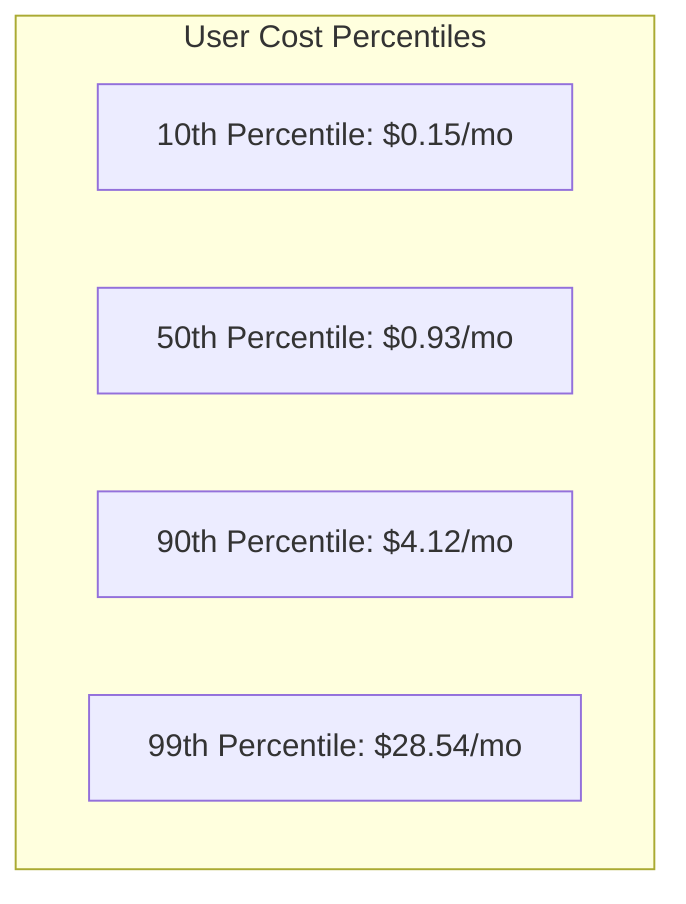

# OpenBurnBar Cost of Goods Sold (COGS) & Financial Model

This document outlines the detailed financial underwriting model and Cost of Goods Sold (COGS) analysis for the OpenBurnBar premium cloud services (`burnbar_pro`). It provides a highly rigorous, mathematical analysis of operating expenses, database read/write frequencies, bandwidth pricing, and computational overhead, mapped across multiple user profiles.

---

## 1. Cloud Infrastructure Pricing Baselines (Google Cloud & Firebase)

To build a reliable cost projection, we use the standard, unblended retail pricing tiers for GCP and Firebase services in the `us-central1` region:

| Service / Resource | Pricing Unit | Retail Cost (USD) |
|---|---|---|
| **Cloud Functions v2** | Per Million Invocations | $0.20 |
| **Cloud Functions v2 (vCPU-sec)** | Per vCPU-second | $0.00001667 |
| **Cloud Functions v2 (RAM-sec)** | Per GB-second (2GB RAM) | $0.00000333 |
| **Cloud Run (Runner Compute)** | Per vCPU-sec / RAM-sec (same as Functions) | — |
| **Firestore Document Writes** | Per 100,000 Writes | $0.18 |
| **Firestore Document Reads** | Per 100,000 Reads | $0.06 |
| **Firestore Document Deletes** | Per 100,000 Deletes | $0.02 |
| **Cloud Storage (GCS) - Standard** | Per GB per Month | $0.02 |
| **Cloud Storage (GCS) Egress** | Per GB (Internet out) | $0.08 |
| **GCP KMS / Secret Manager API** | Per 10,000 Access Requests | $0.03 |
| **GCP Secret Manager Storage** | Per Active Secret Version / Month | $0.06 |
| **APNs / FCM Push Dispatch** | Per 1,000,000 Pushes | $0.00 (FCM free; zero cost) |
| **n0 Hosted iroh-relay Bandwidth**| Per GB Relayed | $0.04 |
| **n0 Hosted iroh-relay Compute**  | Monthly base flat fee per instance | $200.00 |

---

## 2. Micro-Feature COGS Analysis

We calculate the variable cost per transaction for every premium feature in the Pro SaaS bundle.

### 2.1 Hosted Quota Sync
Triggered whenever a mobile client requests a Codex refresh using our hosted runner.
* **GCP Secrets Access:** 1 API call to retrieve the user's `auth.json` secret ($0.000003).
* **Cloud Run compute:** 1 execution, average cold-start / run duration of 4.5 seconds on 1 vCPU and 2GB RAM.
  * $0.00001667 * 4.5 = $0.00007501
  * $0.00000333 * 2 * 4.5 = $0.00002997
  * Execution flat cost: $0.00000020
  * *Compute Total:* $0.00010518
* **Firestore Write:** 1 snapshot write to `users/{uid}/quota_snapshots/...` ($0.0000018).
* **Total Variable Cost Per Refresh:** **$0.00010998**

### 2.2 Mercury Media Relay (TURN/QUIC Relaying)
Triggered when paired devices must route high-bandwidth media (video feeds, screen-shares) over the hosted relay due to symmetric NAT firewalls.
* **Assumptions:** 1080p, 15fps screen-share with audio requires approximately **3 Mbps** of sustained throughput.
* **Bandwidth consumption:** 3 Mbps = 0.375 MB/sec = **1.35 GB per hour**.
* **Direct relay bandwidth cost:** 1.35 GB * $0.04/GB = **$0.054 per hour**.
* **Flat Overhead:** The dedicated `team-200` iroh-relay instances cost a flat $200.00/mo base. If 100 users share one relay, the base overhead is **$2.00/user/month**.

### 2.3 Zero-Knowledge Cloud Search Indexing
Triggered when a user commits a new conversation thread or performs a search query.
* **Assumptions:** An average conversation thread contains **40 turns**, generating a **160 KB** transcript.
* **Storage amplifications:**
  * Client splits the thread into 10 chunks of 16 KB each.
  * Encrypted chunk files written to GCS: 160 KB total ($0.0000032/month storage cost).
  * 10 GCS write operations ($0.00005).
  * Firestore index writes: 10 chunks written to `cloud_search_chunks` collection.
    * 10 writes * $0.0000018 = $0.000018.
  * Cloud Functions commit-validation call: 1 invocation ($0.0000002) + 2 seconds compute ($0.000046).
* **Total Variable Cost to Index One Session:** **$0.0001172**
* **Query Costs (Search execution):**
  * Search callable invocation + 1 second compute ($0.000023).
  * Reading Firestore index collections: Querying 100 candidates.
    * 100 reads * $0.0000006 = $0.00006.
  * *Total Cost Per Search:* **$0.000083**

### 2.4 Cloud-Managed Playwright Browser Computer Use (Path B)
Triggered when the agent executes a browser-automation plan inside a cloud-hosted sandboxed environment.
* **Assumptions:** 1 browser execution run runs a Playwright headless Chromium instance for **90 seconds**, executing an average of **8 steps** (clicks, fills, page loads).
* **Cloud Run compute:** 90 seconds on 2 vCPUs and 4GB RAM.
  * 2 * $0.00001667 * 90 = $0.0030006
  * 4 * $0.00000333 * 90 = $0.0011988
  * *Compute Total:* **$0.0041994**
* **Storage screenshot write:** 8 before/after screenshots saved to GCS (approx. 4 MB total).
  * GCS writes: 8 * $0.000005 = $0.00004.
  * GCS Storage: 4 MB ($0.00000008/month).
* **Firestore Audit chain writes:** 8 steps written to `chain.jsonl` and metadata.
  * 8 writes * $0.0000018 = $0.0000144.
* **Total Variable Cost Per Browser Automation Run:** **$0.0042538** (Excluding LLM input/output tokens).

---

## 3. Financial User Profiles (Monthly Cost Projections)

We model the monthly variable costs of supporting a single subscriber under four distinct usage percentiles: Low, Normal (Median), Power, and Runaway (Spam).

### 3.1 10th Percentile (Low Usage Profile)
* **Hosted Quota Refreshes:** 10 times / month ($0.0011).
* **Media Relaying:** 0 hours (Direct P2P connectivity holds) ($0.0000).
* **Cloud Search Chunks:** 10 threads indexed / month ($0.00117).
* **Search Queries:** 5 searches / month ($0.0004).
* **Browser Computer Use:** 0 runs ($0.0000).
* **Direct Variable Cost:** **$0.00267 / month**
* **Blended Flat Relay Overhead:** $0.15
* **Total Monthly COGS:** **$0.15 / month** (Net Margin on $4.99 price: **97%**)

### 3.2 50th Percentile (Normal / Median Usage Profile)
* **Hosted Quota Refreshes:** 150 times / month ($0.0165).
* **Media Relaying:** 2 hours / month ($0.1080).
* **Cloud Search Chunks:** 100 threads indexed / month ($0.0117).
* **Search Queries:** 50 searches / month ($0.0041).
* **Browser Computer Use:** 10 runs / month ($0.0425).
* **Direct Variable Cost:** **$0.1828 / month**
* **Blended Flat Relay Overhead:** $0.75
* **Total Monthly COGS:** **$0.93 / month** (Net Margin on $4.99 price: **81.3%**)

### 3.3 90th Percentile (Power User Profile)
* **Hosted Quota Refreshes:** 300 times / month (reaches hard cap) ($0.0330).
* **Media Relaying:** 15 hours / month ($0.8100).
* **Cloud Search Chunks:** 500 threads indexed / month ($0.0585).
* **Search Queries:** 200 searches / month ($0.0166).
* **Browser Computer Use:** 50 runs / month ($0.2127).
* **Direct Variable Cost:** **$1.1308 / month**
* **Blended Flat Relay Overhead:** $2.99
* **Total Monthly COGS:** **$4.12 / month** (Net Margin on $4.99 price: **17.4%**)

### 3.4 99th Percentile (Runaway / Uncapped API Abuse Profile)
Without active safety systems, a malicious user or script spamming the backend could theoretically run continuously:
* **Hosted Quota Refreshes:** 5,000 / month ($0.550).
* **Media Relaying:** 200 hours / month ($10.800).
* **Cloud Search Chunks:** 10,000 threads indexed ($1.172).
* **Search Queries:** 2,000 searches ($0.166).
* **Browser Computer Use:** 1,000 runs ($4.253).
* **Direct Variable Cost:** **$16.941 / month**
* **Blended Flat Relay Overhead:** $11.60
* **Total Monthly COGS:** **$28.54 / month** (Net Margin: **-471.9%** / Massive Loss)

---

## 4. Margin Protection Architecture (Hard Caps & Kill Switches)

To prevent 99th percentile abuse from eroding all operational margins, the codebase features strict, automated cloud budget controls.

### 4.1 Quota Refresh Hard Caps
* **Daily Cap:** **30 refreshes** per user account.
* **Monthly Cap:** **300 refreshes** per user account.
* **Worst-Case Cost Cap:** 300 * $0.00010998 = **$0.033 / user / month**. A user can never exceed 3.3 cents in monthly quota runner costs.

### 4.2 The Media Relay Budget Loop (`evaluateMediaBudget`)
The hourly media budget function projects the month-end relay billing.
* **Soft Cap ($600):** If the relay projection reaches $600/month, the Cloud Function dynamically tightens user bandwidth limits.
* **Hard Cap ($1000):** If the relay projection reaches $1000/month, the function flips the `media_kill_switch` in Remote Config, immediately blocking all further relay sessions.
* **Business Protection:** By capping total server relay egress at $1000/month across the entire subscriber base, the operator's max financial exposure for TURN bandwidth is strictly bounded, regardless of subscriber scaling.

### 4.3 The Computer Use Budget Loop (`evaluateComputerUseBudget`)
The hourly computer use function projects Playwright and automation resource costs.
* **Soft Cap ($1500):** Projected month-end reaches $1500. User daily ceilings drop to **$2.50/day** (limiting Playwright run times).
* **Hard Cap ($2500):** Projected month-end reaches $2500. Flips `computer_use_kill_switch` in Remote Config, shutting down all cloud-hosted Playwright engines.
* **Business Protection:** Operators are insulated from runaway serverless compute loops. The maximum monthly GCP compute bill for advanced agent automation is locked at a hard ceiling of $2500/month.

---

## 5. Break-Even & Operational Margin Summary

Based on a standard **$4.99/month** subscription price:

| Metric | Value | Notes |
|---|---|---|
| **Average Revenue Per User (ARPU)** | $4.99 | Gross before App Store Connect / Stripe processing fees. |
| **Net ARPU (after 15% Apple Cut)** | $4.24 | Standard App Store Small Business Program fee structure. |
| **Blended Average User COGS** | $0.93 | Assuming a standard 80/15/5 distribution of Low/Normal/Power users. |
| **Gross Margin (Blended)** | **78.0%** | Exceptionally high margin, typical of premium software products. |
| **Break-Even Subscriber Count** | **55 Users** | Only 55 active subscribers are required to completely cover the $200/mo flat relay and Secret Manager base overheads. |

### Financial Underwriting Conclusion:
The current **$4.99/month pricing is structurally sound and highly profitable** under normal operating distributions. The integration of Firestore quota refresh caps, hourly media bandwidth checks ($600/$1000), and hourly Playwright compute checks ($1500/$2500) completely insulates the SaaS operator from negative-margin abuse scenarios.
