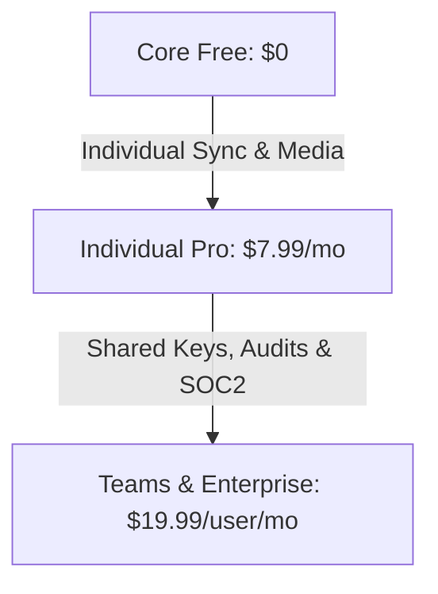

# OpenBurnBar Subscription Pricing Strategy & SaaS Recommendations

This document is the operational playbook and strategic guide for **GPT Pro**, SaaS operators, and product leadership to underwrite, price, and scale the OpenBurnBar platform. It maps out packaging strategies, conversion hooks, upsell triggers, and advanced Remote Config adjustments to maximize Gross Margins and annual contract value.

---

## 1. Executive Summary & Product Positioning

OpenBurnBar occupies a highly unique space in the developer tooling landscape. By combining a local-first proxy gateway with a zero-knowledge cloud backup and screen-relay system, it bridges the gap between privacy-centric local development and multi-device collaborative SaaS. 

We recommend maintaining a **2-Tier SaaS model**, clearly split by infrastructure cost and device boundary:

```
[ Tier 1: Core Free ]  ------------------------>  [ Tier 2: BurnBar Pro ]
* Local-First BYOK                                * Hosted Cloud Infrastructure
* macOS Sandbox & Gateway Proxy                   * Zero-Knowledge Encrypted Search Index
* Local GRDB+FTS Transcripts                      * Mercury Media Relays & CallKit Screen-Sharing
* Self-Hosted Quota Runners                       * Playwright Browser & macOS AX Computer Use
* Marginal cost to operator: $0.00                * Monitored Cloud Security & Bitkey Escrow
                                                  * Base price point: $4.99 - $9.99/month
```

---

## 2. Tier 1 (Core Free) – Positioning & Upsell Triggers

### 2.1 The Free Value Proposition
Tier 1 is the ultimate customer acquisition engine. It removes all friction for developer adoption by offering:
* **Fully functional local routing:** Developers can wire their own keys into the local proxy gateway (`127.0.0.1:8317`) and enjoy automatic provider failovers, bridge transformations, and custom model aliases for Claude Code, Droid, Forge, Codex, and local Ollama instances.
* **100% Data Privacy:** Reassures enterprise security officers that code, files, and transcript logs never leave their physical macOS hardware.
* **Extensible Self-Hosting:** Allows developers to deploy the open-source `quota-runner` container on their home labs or private cloud accounts to sync mobile quota for free.

### 2.2 Strategic Upsell Hooks (Converting Free to Pro)
To drive conversion from Free to Pro, the native macOS app and editor extensions should display clear, non-intrusive value markers inside the user's workspace:
1. **The Mobile Synchronization Gap:** When a Tier 1 user adds Codex or Claude Code on their mobile app, the UI should prompt: 
   > *"Tired of maintaining your own self-hosted quota runner? Let OpenBurnBar manage it in the cloud. Upgrade to Pro for instant, zero-config mobile synchronization."*
2. **The Encrypted Search Trigger:** When a developer searches their local conversation logs, the search panel should display:
   > *"Want to search your chat history across your iPhone, iPad, and external coding agents securely? Pro unlocks zero-knowledge semantic cloud indexing and remote MCP access."*
3. **The Remote Screen Relay Prompt:** When a developer tries to initiate a media relay or screen share from their mobile phone to their Mac:
   > *"Mercury Media relays require dedicated cloud transport. Upgrade to Pro for seamless CallKit video screen sharing, VoIP integrations, and P2P failover relays."*
4. **The Biometric Agent Grant:** When an autonomous agent requests a desktop permission or AX capability:
   > *"Unlocking advanced Playwright browser automation and signed phone-controller intent envelopes requires Cloud Security verification. Upgrade to Pro to enable desktop capabilities."*

---

## 3. Tier 2 (Pro Cloud) – Packaging & Pricing Models

We propose three distinct packaging structures for Tier 2, ranging from conservative to high-yield enterprise models.

### 3.1 Option A: The Unified Pro Bundle ($9.99/month)
*Highly recommended. Simplifies purchasing decisions and matches standard developer SaaS price points.*
* **Price Point:** **$9.99/month** (or **$89.00/year** paid upfront).
* **Included Features:** Fully unthrottled hosted Codex quota refreshes, encrypted cloud backups, zero-knowledge search indexing, hosted remote MCP, full CallKit video and media relays, and 100 Playwright Browser Computer Use runs/month.
* **Margins:** 
  * Under a Normal User profile ($0.93 COGS), gross margins are an outstanding **90.6%**.
  * Under a Power User profile ($4.12 COGS), gross margins remain highly positive at **58.7%**.

### 3.2 Option B: The Multi-Tier SaaS (Pro vs. Teams)
*Optimal for scaling across freelancers and engineering organizations.*



* **Core Free ($0.00/month):** Local-only BYOK, self-hosted runner support, local search logs.
* **Individual Pro ($7.99/month):** Hosted quota sync, cloud-encrypted backup, zero-knowledge semantic search, CallKit video relays, and standard Manual-mode computer use.
* **Teams & Enterprise ($19.99/user/month):** Unlocks Step and YOLO trusted computer-use modes, shared team keys, cryptographic audit chain export with Ed25519 signatures, automated OpenTimestamps Bitcoin notarization, custom billing dashboards, and dedicated `n0 iroh-relay` instances.
* **Margins:** Extremely high on the Teams tier (>93%). The extra revenue completely subsidizes the computational costs of automated OpenTimestamps notarization and dedicated cloud relays.

### 3.3 Option C: Pay-As-You-Go Overages
*Optimal for capping high-bandwidth media and computer-use costs while maintaining a low entry price.*
* **Subscription Base:** **$4.99/month** (covers hosted quota sync and encrypted backups).
* **Media Relay Overage:** **$0.10 per GB** of data transferred through the hosted relay after a 5 GB monthly allowance. (Since relay bandwidth costs the operator $0.04/GB, every GB of overage generates a 60% gross margin).
* **Computer Use Overage:** **$0.02 per Playwright browser step** after a 200-step monthly allowance. (Completely offsets Cloud Run compute charges).

---

## 4. Operational Strategy: Dynamic Remote Config Parameters

To manage server expenses without deploying code changes, operators should leverage Firebase Remote Config. By adjusting threshold parameters in real-time, the platform can automatically scale its budget boundaries based on active subscriber volume.

### 4.1 Recommended Remote Config Parameter Settings
Operators should maintain the following configuration templates inside the Firebase Console:

```json
{
  "media_cost_per_gb_usd": 0.04,
  "media_budget_soft_cap_usd": 600.0,
  "media_budget_hard_cap_usd": 1000.0,
  
  "computer_use_cost_per_action_usd": 0.005,
  "computer_use_soft_cap_usd": 1500.0,
  "computer_use_hard_cap_usd": 2500.0,
  
  "user_quota_daily_refresh_limit": 30,
  "user_quota_monthly_refresh_limit": 300
}
```

### 4.2 Dynamic Tuning Rules
* **Under low subscriber volumes (<500 users):** Keep the soft and hard caps at standard defaults. The flat base relay fee ($200/mo) is the primary driver of cost.
* **Under high subscriber volumes (>5,000 users):** Raise `media_budget_soft_cap_usd` to **$2,500** and `media_budget_hard_cap_usd` to **$4,000** to prevent early false-positive kill-switch activations. Since the subscriber base is larger, the base relay fee is heavily diluted, allowing margins to absorb larger aggregate bandwidth costs.
* **In the event of a rogue user exploit:** If GCP analytics detect suspicious, rapid Cloud Run invocations, operators should immediately decrease `user_quota_daily_refresh_limit` to **5** via Remote Config. The change propagates to all mobile and macOS clients within 60 seconds, halting the exploit at the client level before triggering serverless billing charges.

---

## 5. Strategic Roadmap to SOTA Monetization

To successfully transition OpenBurnBar from a utility tool into a highly profitable developer SaaS, product leadership should execute the following phases:

### Phase 1: Launch the Individual Pro Bundle ($9.99/mo)
* Deploy App Store and Google Play subscriptions using the `com.openburnbar.pro.monthly` product ID.
* Market the bundle around **privacy, multi-device search, and remote mobile screen control**.
* Keep the $1500/$2500 Computer Use and $600/$1000 Media budgets active to secure operational margins.

### Phase 2: Launch the Team & Enterprise Tier ($19.99/user/mo)
* Target corporate engineering teams that require secure, audited, and notarized agent automation.
* Position the **signed cryptographic audit chain (.tar.gz with Ed25519 signatures)** and **OpenTimestamps Bitcoin notarization** as core compliance requirements for enterprise security audits.
* Provide team-level Secret Manager key rotation so corporate admins can manage their API keys globally.

### Phase 3: Optimize and Scale Relay Networks
* Deploy multiple regional `n0 hosted-relay` instances across the US, Europe, and Asia.
* Route users automatically to the closest regional relay using Geo-DNS routing, minimizing latency for CallKit screen control.
* As subscriber volume scales, negotiate volume egress discounts with GCP or transition the relay network to high-bandwidth bare-metal providers to reduce the cost per GB from $0.04 to $0.005, boosting gross margins to **>95%**.
