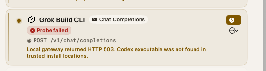

# RCA: Grok Build CLI probe returns HTTP 503 about a missing Codex executable

**Filed as:** https://github.com/Imagine-That-Ai/BurnBar/issues/2616  
**Issue:** [#2616](https://github.com/Imagine-That-Ai/BurnBar/issues/2616) — Grok Build CLI probe: HTTP 503 — Codex executable not found in trusted install locations  
**Status:** RCA only. No product fix in this change — the defect is a probe-selection / attribution mismatch, not a one-line bug.
**Primary evidence:** screenshot below, captured on OpenBurnBar `1.0.40+repair.41` (build 86).



Observed UI (verbatim):

- Card: **Grok Build CLI** · Chat Completions
- Badge: **Probe failed**
- Endpoint: `POST /v1/chat/completions`
- Detail: `Local gateway returned HTTP 503. Codex executable was not found in trusted install locations.`

---

## Verdict

The Grok Build CLI row is a **routed-client wiring card**, not a `grok` binary health check. Its probe POSTs a 1-token Chat Completions ping to the local OpenBurnBar gateway using **the first advertised route-eligible model of any OpenAI-compat provider**. On a default install that first model is almost always a **Codex** catalog row (`local: true`, auto-enabled, provider name sorts early). The gateway then dispatches to `BurnBarCodexProviderExecutor`, which refuses nvm / ChatGPT.app / Chrome-extension `codex` binaries.

The Codex-named 503 is the **real** executor error for the model that was pinged. It is **not** a reused Grok string. It is also **not** proof that Grok Build CLI is missing.

| Hypothesis | Result |
|---|---|
| A. Grok probe incorrectly routes through Codex executable resolution | **Partially true as a product bug, false as a provider-ID mixup.** The probe is a shared gateway ping. It does not look up `grok`. If the first advertised model is Codex-owned, Codex resolution is the correct executor for that ping. |
| B. Trusted Codex locations exclude nvm PATH installs | **True, and intentional.** Gateway Codex resolution only walks `/opt/homebrew/bin`, `/usr/local/bin`, `/usr/bin`, `/bin`, then rejects any resolved path under `$HOME`. Tests pin this. |
| C. Wrong error string reused for Grok failures | **False.** The string is thrown only by the Codex process runner. The Grok card displays whatever body the gateway returned for the ping it actually sent. |

---

## 1. Exact code path

```
Settings → Agents → CLIs → Grok Build CLI
  → ConnectionsViewModel.test / wireAndProbe
  → RoutingClientWiring.probe(target: .grok)
  → GET /v1/models  (if advertisedModels not already supplied)
  → firstGatewayServedModel(..., target: .grok)   // .first after filter
  → POST http://127.0.0.1:<port>/v1/chat/completions
       model = <that first advertised id>
       max_completion_tokens = 1
       messages = [{role:user, content:"ping"}]
  → BurnBarHTTPGatewayServer.handleChatCompletions
  → routeModelRequest → ranked route for that model
  → proxyChatCompletions
  → BurnBarOpenAICompatibleProviderExecutor.proxyChatCompletions
       if route.providerID == "codex":
         BurnBarCodexProviderExecutor.proxyChatCompletions
           → BurnBarCodexSystemProcessRunner.runCodex
           → defaultCodexExecutableURL() == nil
           → throw upstreamError(503, "Codex executable was not found…")
  → providerFailureResponse writes that string as the HTTP body
  → probe.failed(status: 503, message: <first 200 chars of body>)
  → UI: "Local gateway returned HTTP 503. " + message
```

### UI card and probe trigger

- Display name **Grok Build CLI** and badge **Chat Completions** come from `RoutingClientWiringTarget` (`AgentLens/Services/CLIBridge/RoutingClientWiring.swift:53`, `:77`, `:115`).
- **Probe failed** is the `.degraded` badge (`AgentLens/Views/Settings/ConnectionsSettingsView+Rows.swift:1056-1060`). The detail line is the full gateway message (`:1142-1143`).
- `ConnectionsViewModel.test` / `wireAndProbe` wrap any non-2xx as `Local gateway returned HTTP \(status). \(trimmed)` (`AgentLens/Views/Settings/ConnectionsViewModel.swift:400-405`, `:427-431`).

### Shared OpenAI-compat probe (Grok is not special)

`RoutingClientWiring.probe` treats `.grok` identically to `.opencode`, `.forge`, and `.droid` (`AgentLens/Services/CLIBridge/RoutingClientWiring+SnippetProbe.swift:293-364`):

1. Resolve `firstGatewayServedModel(models, target:)` (`:297`).
2. POST `/v1/chat/completions` with that model's raw id (`:303-312`, `:363-364`).
3. On failure, take the first 200 characters of the response body (`:329-330`).

`firstGatewayServedModel` is literally `.first` after filtering route-eligible Chat Completions / Responses rows (`AgentLens/Services/CLIBridge/RoutingClientWiring+Droid.swift:331-353`). There is **no** `providerID == "xai"` preference.

That conflicts with the same card's empty-state copy, which *does* treat Grok as xAI-specific: *“No route-ready xAI account is enabled…”* (`ConnectionsSettingsView+Rows.swift:1160-1161`).

Wiring Grok Build writes `[model.openburnbar]` with `model = "openburnbar-gateway"` into `~/.grok/config.toml` (`RoutingClientWiring+CodexGrok.swift:172-184`). The probe never sends `openburnbar-gateway`. It pings whatever `/v1/models` listed first.

### Gateway dispatch into the Codex executor

- `POST /v1/chat/completions` is handled by `chatCompletionsEndpointDescriptor` (`OpenBurnBarDaemon/Sources/OpenBurnBarDaemon/OpenBurnBarHTTPGatewayServer+Endpoints.swift:91-134`).
- Buffered proxy calls `proxyChatCompletions` (`OpenBurnBarDaemon/Sources/OpenBurnBarDaemon/OpenBurnBarHTTPGatewayServer+CrossVendorDegrade.swift:170-181`).
- OpenAI-compat routes go to `BurnBarOpenAICompatibleProviderExecutor.proxyChatCompletions`, which branches on `providerID == "codex"` (`OpenBurnBarDaemon/Sources/OpenBurnBarDaemon/OpenBurnBarProviderExecutor.swift:321-323`, `:421-427`).
- Codex `proxyChatCompletions` runs local `codex exec` (`OpenBurnBarDaemon/Sources/OpenBurnBarDaemon/BurnBarCodexProviderExecutor.swift:244-261`, `:286-288`).
- Missing binary throws `BurnBarProviderExecutorError.upstreamError(503, "Codex executable was not found in trusted install locations.")` (`BurnBarCodexProviderExecutor.swift:126-130`).
- `providerFailureResponse` returns that string as the HTTP body with status 503 (`OpenBurnBarDaemon/Sources/OpenBurnBarDaemon/OpenBurnBarHTTPGatewayServer+RoutePipeline.swift:659-686`).

There is **no** `BurnBarGrokProviderExecutor`. The `grok` binary is never consulted on this path.

Unrelated Grok surfaces that this ticket is **not**:

- Fleet session probe `BurnBarFleetGrokCLIProbe` (`~/.grok/active_sessions.json`).
- Switcher launch resolution (`CLILaunchAdapter` / `SwitcherCLIProfileType.grok`).
- xAI HTTP quota (`XAIQuotaAdapter`).

---

## 2. Trusted install locations

### Gateway Codex executor (the path that threw)

`BurnBarCodexSystemProcessRunner.trustedCLIPathEntries` (`BurnBarCodexProviderExecutor.swift:76-89`):

- `/opt/homebrew/bin`
- `/usr/local/bin`
- `/usr/bin`
- `/bin`

Home-directory descendants are stripped. After finding `…/codex`, `isTrustedExecutablePath` only accepts a resolved path under `/opt/homebrew`, `/usr/local`, `/usr/bin`, or `/bin` (`:91-111`). `$HOME/.nvm/…/bin/codex` fails both the search list and the resolved-path check.

The spawned process `PATH` is reset to those four directories (`BurnBarCodexProviderExecutor.swift:363-366`). Tests lock this down (`OpenBurnBarDaemon/Tests/OpenBurnBarDaemonTests/BurnBarCodexProviderExecutorTests.swift:6-47`): nvm, `~/.local/bin`, and other home bins must not appear.

Rationale in-file: unattended, consent-gated `codex exec --json` for a routed completion (`BurnBarCodexProviderExecutor.swift:193-216`). This is stricter than Switcher launch on purpose.

### Switcher / launch Codex (not this probe)

`SwitcherCLIProfileType.codex.trustedExecutablePaths` (`OpenBurnBarCore/Sources/OpenBurnBarKernel/SharedModels/SwitcherProfile.swift:148-154`):

- `/usr/local/bin/codex`
- `/opt/homebrew/bin/codex`
- `$HOME/.local/bin/codex`
- `$HOME/.codex/bin/codex`

Codex is the one CLI that **refuses** ambient user-managed fallbacks (nvm, fnm, IDE extension hosts): `allowsAmbientUserManagedExecutableFallback(for:)` returns `false` only for `.codex` (`CLILaunchAdapter.swift:278-291`). Tests require that nvm candidates are never chosen (`OpenBurnBarCore/Tests/OpenBurnBarCoreTests/CLILaunchAdapterExecutableResolutionTests.swift:28-100`).

So the reporter's `~/.nvm/versions/node/…/bin/codex` is excluded from **both** gateway execution and Switcher Codex launch. ChatGPT.app / Chrome-extension hosts are excluded for the same reason.

### Grok (separate list; unused by this probe)

`SwitcherCLIProfileType.grok.trustedExecutablePaths` (`SwitcherProfile.swift:195-201`):

- `/usr/local/bin/grok`
- `/opt/homebrew/bin/grok`
- `$HOME/.grok/bin/grok`
- `$HOME/.local/bin/grok`

Grok **does** get ambient nvm/user-managed fallback when launched as a Switcher CLI. That list is irrelevant to the Connections Chat Completions probe.

---

## 3. Why the card says Grok Build but the error names Codex

**Shared helper, plus a bad default model, plus honest Codex copy.**

Grok Build CLI is wired as a **client of the local gateway** (`docs/PROVIDER_ACCOUNTS.md`, `RoutingClientWiring+CodexGrok.swift:129-184`). The probe's job is “can the gateway serve the wire format this client speaks?”, not “is `grok` on PATH?”.

`.grok` shares the OpenAI-compat probe with Droid / Forge / OpenCode. That helper picks `.first` advertised Chat Completions model.

Why that first model is Codex on a typical Mac:

1. Catalog provider `codex` is `local: true` (`OpenBurnBarCore/Sources/OpenBurnBarKernel/Resources/catalog.json:2152-2162`).
2. Default config auto-enables local providers (`OpenBurnBarConfigStore.makeDefaultSnapshot`, `OpenBurnBarDaemon/Sources/OpenBurnBarDaemon/OpenBurnBarConfigStore.swift:1544-1549`). Tests require the default Codex route to satisfy onboarding (`OpenBurnBarDaemon/Tests/OpenBurnBarDaemonTests/OpenBurnBarConfigStoreTests.swift:131-134`).
3. xAI stays disabled until the user adds a key, so no Grok-owned row is advertised.
4. Codex models advertise `formatFamily: openai_compat`, so `/v1/models` lists `/v1/chat/completions` among `served_endpoints` (`OpenBurnBarHTTPGatewayResponseTypes.swift:370-376`).
5. Advertised groups sort by `providerName` then `displayName` (`OpenBurnBarHTTPGatewayServer+ModelCatalog.swift:479-491`). **Codex** sorts ahead of xAI / Z.AI / MiniMax.
6. `firstGatewayServedModel` therefore returns a Codex row. The gateway routes `providerID=codex` into the local `codex` runner. The runner's 503 text is Codex-specific and correct for **that** hop.

So the UI label is the **client being wired**. The error names the **upstream the ping actually hit**. Those are different objects, and the card does not say so.

---

## 4. Recommended fix plan

Do **not** expand nvm into the gateway Codex allowlist as the Grok-card fix. That is a separate security decision, and existing tests exist to prevent it. ChatGPT.app / extension-host binaries should stay untrusted for unattended `codex exec`.

### P0 — Attribute the ping (safe, small)

When a routed-client probe fails, include **model id + provider id** in the user-visible string.

Example:

> Local gateway returned HTTP 503 while probing `gpt-5.6` (provider `codex`) for Grok Build CLI. Codex executable was not found in trusted install locations.

Acceptance:

- Grok / Droid / Forge / OpenCode failure copy names the model and provider that were pinged.
- A Codex-binary 503 on the Grok card is readable as “gateway ping used Codex”, not “Grok CLI is missing”.
- Unit test: `probe(target: .grok)` against a 503 body plus a Codex advertised row asserts the composed message contains `provider` / `codex` and the model id.

### P1 — Probe the client the card claims to be (product-correct)

Align `.grok` with its empty-state copy:

1. Prefer advertised models with `providerID == "xai"`.
2. If none are advertised, fail **before** HTTP with the existing xAI empty-state message — do not fall through to Codex.
3. Optionally POST the wired id `openburnbar-gateway` once that alias has a defined gateway meaning; today it is written to `~/.grok/config.toml` and never probed.

Acceptance:

- With only the default local Codex route enabled, Grok probe fails with “no route-ready xAI account”, never a Codex-executable 503.
- With an enabled xAI route, Grok probe POSTs that xAI model to `/v1/chat/completions` and surfaces xAI/gateway errors only.
- Codex CLI card still probes `/v1/responses` with `openburnbar/<model>` (`RoutingClientWiring+SnippetProbe.swift:277-292`).
- Droid / Forge / OpenCode keep a generic OpenAI-compat ping, but inherit P0 attribution.

### P2 — Stop using `.first` as a health oracle

For generic OpenAI-compat clients, skip local-CLI executors (`codex`, `factory`) when any HTTP provider is advertised. `.first` after provider-name sort is not a readiness signal.

Acceptance:

- If Z.AI / MiniMax / OpenAI / xAI is advertised, Droid/Forge/OpenCode/Grok pings do not land on `BurnBarCodexProviderExecutor`.
- If only Codex is advertised, the message still names Codex (P0) rather than implying the client binary is missing.

### P3 — Codex trusted paths (separate ticket)

Only if the **Codex CLI** card also fails for nvm-only installs:

- Document Homebrew / `$HOME/.codex/bin` as the supported gateway install.
- If product wants user-managed Codex for unattended exec, security-review a tight allowlist (`$HOME/.codex/bin` already trusted by Switcher; still **not** nvm shims).
- Do not treat nvm / ChatGPT.app / Chrome extension hosts as trusted for `codex exec --json`.

Acceptance (only if this ticket is opened):

- Gateway runner and Switcher launch lists are documented side by side.
- Any newly trusted path has a test that accepts that path and still rejects nvm / extension hosts.

---

## 5. Why this is not a one-line fix

- Changing `firstGatewayServedModel` for `.grok` changes which upstream every Grok Connect/Test hits.
- Widening Codex trusted paths contradicts `BurnBarCodexProviderExecutorTests` and `CLILaunchAdapterExecutableResolutionTests`.
- Attribution-only is the smallest safe change and is still more than a one-line swap.

Ship P0+P1 together. Leave P3 on a Codex-install ticket if the Codex card itself is red.

---

## Validation notes for a later fix PR

- `AgentLensTests/Active/RoutingClientWiringTests.swift` already covers Codex `/v1/responses` and Claude `/v1/messages` probes; add a Grok case that pins provider selection and failure attribution.
- `OpenBurnBarDaemonTests/BurnBarCodexProviderExecutorTests.swift` must stay red if nvm is added without an explicit security decision.
- Manual: default-only Codex install → Grok card must not mention a missing `codex` binary; xAI key added → Grok probe hits xAI.

## Rollback / containment

This RCA adds documentation only. Revert by deleting `docs/rca/2026-09-16-grok-build-cli-probe-codex-503.md` and `docs/rca/assets/grok-build-cli-probe-failed-codex-503.png`.
