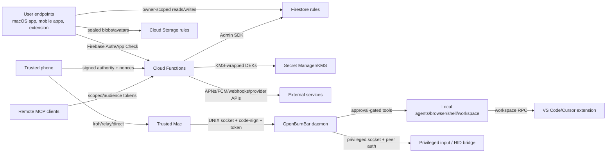

# OpenBurnBar Repository Threat Model

Date: 2026-06-14

Scope: current repository snapshot in `/Users/albertonunez/Documents/Windsurf/BurnBar`.
This model is code-and-doc grounded, but it is not a live deployment attestation. Firebase App Check
enforcement, Remote Config, IAM/KMS bindings, deployed rules/functions, and production secret state
must still be verified against the live project before treating this as release evidence.

## Security Position

OpenBurnBar is a local-first, daemon-centered, multi-device agent control system with optional Firebase
replication and hosted control-plane services. It is not a universal zero-knowledge or universal E2EE
system. The cloud can see account, entitlement, routing, metadata, index, audit, and push-delivery data.
Endpoints can see plaintext after local decryption. Hosted provider credentials are protected by
Secret Manager and KMS, not by a user-held zero-knowledge design.

Primary security goals:

- Prevent cross-tenant access to user data, credentials, entitlements, relays, approvals, and device trust.
- Keep content bodies sealed wherever Firestore/relay rules require sealed envelopes.
- Require proof-of-possession and replay protection for Hermes Gateway writes.
- Ensure high-risk Computer Use and phone-to-Mac operations require trusted devices, App Check, nonces,
  signed authority envelopes, and explicit approval/trust-mode policy.
- Keep local daemon, privileged input, workspace, shell, browser, and agent runtime execution behind
  local code-sign, socket, approval, and workspace trust gates.
- Avoid leaking secrets through Firestore, logs, telemetry, model prompts, notifications, or provider errors.

## System Model

## Trust Boundaries

| Boundary | Attacker-controlled inputs | Existing controls | Residual risk |
| --- | --- | --- | --- |
| User endpoint to Firebase Auth/App Check | Auth tokens, App Check tokens, callable payloads, replay attempts | `assertAuth`, `assertAppCheck`, production config fail-closed checks, high-risk nonce flows | App Check enforcement is partly deployment/config dependent; emulator and disabled-flag paths need live verification |
| Firebase client SDK to Firestore/Storage rules | Direct document writes, sealed payloads, avatars, session logs, metadata fields | Owner namespace checks, size limits, secret-field denial, CloudVault validators, Storage MIME/size checks | Rules cannot validate every nested crypto invariant; Admin SDK handlers bypass rules |
| Cloud Functions to Firestore/Storage Admin SDK | Callable data, IDs, entitlements, approval actions, trust mutations | Endpoint authorization matrix, per-handler ownership checks, server-owned roots | BOLA/IDOR bugs in handlers remain the highest cloud-side class |
| Cloud Functions to Secret Manager/KMS | Provider credential material and secret refs | AES-256-GCM DEK wrapping, KMS encrypted DEK, Secret Manager storage, Firestore secret-ref separation | Backend/IAM compromise can decrypt hosted provider credentials |
| Hermes Gateway HTTP to user data plane | Bearer token, PoP headers, method/path/query/body, event/message/attachment payloads | Token hash index, Ed25519 PoP, nonce/timestamp/body hash, scopes, entitlement, sealed-envelope enforcement | Compromised paired client key or downgrade/config drift can still drive the channel |
| Mobile/phone control to Mac control plane | Pairing keys, relay URLs, authority envelopes, trust-mode requests, approval responses | Trusted escrow devices, Signal identity roots, high-risk nonce, App Check attestation, signed authority envelopes | Trust bootstrap and revoked-device edge cases must stay fail-closed |
| Device-to-device Iroh/relay/direct | Node IDs, direct addresses, relay URLs, sender keys, chunks | Server-owned pairing records, sender-key publication, HPKE-auth relay envelope validation | Metadata and routing remain visible; relay availability/abuse is a DoS surface |
| macOS app to daemon UNIX socket | Local RPC envelopes and auth tokens from same-user processes | 0600 socket path, code-sign peer authentication, socket auth token, request size caps, PID rate limits | Developer env flags can disable code-sign auth; same-user process risk remains important |
| Daemon HTTP gateway | Local/non-loopback HTTP requests, OpenAI-compatible payloads, bearer tokens | Config validation rejects wildcard binds and requires auth token unless explicit unauthenticated loopback opt-in | Any unauthenticated loopback opt-in lets same-host processes spend credits or trigger work |
| Daemon to privileged input/HID bridge | Input execution requests and capability grants | Trusted 0700 socket directory, 0600 socket, peer UID/code-sign validation, capability gate | Accessibility/HID permission compromise expands blast radius to the desktop session |
| Daemon/extension to workspace/shell/browser agents | Tool calls, patches, commands, page content, screenshots, AX trees | Mandatory approval for high-risk tools, workspace trust gates, untrusted workspaces disabled in extension | Prompt injection and malicious repos can steer allowed tools once approved |
| Hosted MCP/remote clients to backend/local decrypt shim | MCP tokens, snippets, tool calls, grants, encrypted session bodies | Audience-bound scoped tokens, entitlement checks, rate limits, sealed snippets, server-side grants | Token theft or over-broad grants can expose remote agent surface |

## Assets

- User plaintext: prompts, transcripts, messages, mission artifacts, screenshots, browser/AX extracts, audio/media, files.
- Cryptographic material: CloudVault keys, device private keys, Signal sessions/prekeys, relay sender keys,
  Gateway PoP keys, Iroh pairing keys, phone-control and agent-grant authority keys.
- Credentials and tokens: Firebase ID/App Check tokens, Gateway bearer tokens, MCP access/refresh tokens,
  APNs/FCM tokens, Stripe/App Store webhook material, hosted provider credentials, OAuth tokens.
- Persistence: local SQLite, daemon support files, Keychain/Keystore items, Firestore docs, Storage blobs,
  Secret Manager versions, KMS keys, audit chains, logs, telemetry, Sentry events, local agent session logs.
- Authority: entitlements, trusted-device graph, approval state, grant queues, trust modes, Remote Config flags.
- Execution: workspace write, shell, browser automation, desktop input, remote unlock, local agent runtimes.

## Attacker-Controlled Inputs

- Callable and HTTP request bodies, headers, bearer tokens, PoP signatures, nonces, timestamps, query strings,
  route parameters, document IDs, and upload metadata.
- Firestore client writes to owner-writable collections, Storage uploads, signed URL upload/finalize metadata.
- Pairing codes, relay URLs, Iroh direct addresses, node IDs, sender public keys, device display metadata.
- Provider webhook payloads and third-party provider API responses, including error bodies.
- Local agent logs and transcripts from Codex, Claude Code, Grok, Cursor, Forge, Antigravity, and related tools.
- Browser page content, DOM/AX trees, screenshots, clipboard-adjacent context, terminal output, generated patches.
- MCP tool calls, model outputs, RAG/search snippets, workspace file paths, shell commands, environment variables.
- Push tokens, notification payload metadata, purchase/entitlement events, and Remote Config controlled behavior.

## Authentication and Authorization Paths

- Firebase callables: Firebase Auth is required by `assertAuth`; App Check is required by `assertAppCheck`
  when enforcement is enabled. Production-like projects are configured to fail closed if App Check is disabled.
- Firestore/Storage: direct client access is owner-scoped by UID and constrained by size, shape, secret-field,
  content-type, and sealed-envelope checks. Server-only collections deny client writes.
- High-risk Computer Use: Auth, App Check, app-attestation binding, high-risk nonce consumption, trusted native
  device status, Signal identity roots, authority signatures, local-auth proof, and approval policy all participate.
- Hermes Gateway: bearer token is an index hint only. Requests require an active client, token hash match,
  scopes, entitlement, Ed25519 PoP bound to token hash/method/path/query/body hash/nonce/timestamp, and replay cache.
- Trusted device graph: escrow device registration starts pending. Trust approval is server-mediated, relies on
  trusted approver devices and signed trust-chain proofs, and revocation invalidates grants/sessions.
- Local daemon socket: production daemon validates first-party code signature and can also require a socket token.
- Privileged input sockets: peer UID and first-party code signature are validated before accepting input execution.
- Extension workspace RPC: workspace read/search/write/shell capabilities are gated on trusted, non-virtual,
  non-read-only workspace context; untrusted workspaces are unsupported.
- Provider webhooks and commerce: webhook-specific signature verification and entitlement checks protect provider
  and subscription state. Exact live webhook secret/IAM state requires deployment verification.

## Cryptographic Operations

- CloudVault: AES-GCM sealed text/blob/payload shapes, path-bound AAD, wrapped vault keys, deterministic
  HMAC-SHA256 indexes for search/dedupe metadata, and rule-level validation of current vault key IDs.
- Hermes relay: production relay envelope validation supports versioned envelopes; v3 uses HPKE Auth over P-256
  with HKDF-SHA256/AES-256-GCM content-key wrapping and sealed payloads. Signal transport is staged and should
  not be claimed active unless the production flag/version set is verified.
- Gateway PoP: Ed25519 signatures with nonce/timestamp/body/query/method/path binding and constant-time token
  hash/body hash checks.
- Signal/trusted devices: Signal identity/prekey/session directories publish public material only; private session
  state is intended to remain device-local. Trust proofs use signed chains rooted in published device identities.
- Computer Use authority: phone-control, relay sender-key, and agent-grant records bind public keys to trusted
  devices and derive stable key IDs from public key material.
- Provider credentials: Cloud Functions generate a DEK, encrypt credentials with AES-256-GCM, wrap the DEK with
  KMS, and store the packed envelope in Secret Manager while Firestore holds references.
- Audit chains: Computer Use audit logs use hash-linked entries and signed heads; timestamping is optional.

## Persistence Layers

- Local app database: SQLite is currently a trusted endpoint store; plaintext-at-rest should be treated as an
  endpoint compromise exposure unless SQLCipher or equivalent is proven active.
- Local support files: daemon config, controller state, browser/run state, provider routing, local logs, and
  agent transcripts live under user-writable application/session directories.
- Keychain/Keystore: device-local private keys, trust credentials, OAuth/provider tokens, and remote-unlock
  material should live here where supported.
- Firestore: canonical cloud metadata, sealed content envelopes, entitlements, trust graph, relay records, grants,
  approval state, audit metadata, and server-only secret references.
- Cloud Storage: session blobs and avatars; session blobs are owner scoped and content-type/size constrained.
- Secret Manager/KMS: hosted provider credentials and wrapped DEKs.
- Observability: Cloud Logging/Sentry/telemetry receive scrubbed events, but stack traces, provider errors, and
  path-like values remain sensitive until proven redacted end to end.

## IPC and Local Execution Surfaces

- `OpenBurnBarDaemon` UNIX socket: primary local RPC boundary; authenticated by peer code-sign and optional token.
- Local HTTP gateway: optional OpenAI-compatible gateway; wildcard binds are rejected, and auth is required unless
  explicit unauthenticated loopback is enabled.
- Privileged input socket/HID bridge: per-user trusted directory, strict socket permissions, peer validation, and
  capability policy protect desktop input execution.
- VS Code/Cursor extension RPC: bridges daemon tool calls into workspace file read/search/patch/terminal actions.
- Process execution: local agent runners launch external CLIs with constructed arguments, enriched environment,
  workspace/home working directories, stdout/stderr capture, and quota supervision.
- Browser automation: Playwright/browser Computer Use actions import untrusted page content into agent context and
  can affect authenticated browser sessions if the user permits it.

## Mobile and Cloud Interactions

- Mobile clients read/write Firebase data, receive push notifications, publish trust/relay/authority records, and
  can approve or deny Computer Use operations depending on trust mode and signed proofs.
- Mac clients host local daemon, pairing records, Iroh relay/direct endpoints, agent runtimes, desktop input, and
  workspace execution surfaces.
- Cloud Functions broker entitlements, provider credentials, relay records, trust roots, gateway tokens, approval
  resolution, hosted MCP, push fanout, webhook processing, and production operations.
- External dependencies include Firebase/Auth/App Check/Firestore/Storage/Functions, KMS/Secret Manager, APNs/FCM,
  Stripe/App Store/Google Play, provider APIs, Iroh relays, browser/Playwright runtime, MCP clients, and local CLIs.

## Agent and Tool Execution Surfaces

- Tool calls that can read files, write patches, run terminal commands, control browser state, inspect accessibility
  trees, capture screenshots, export files, or drive desktop input are the main agency boundary.
- Prompt injection enters through logs, transcripts, RAG snippets, browser/AX content, provider errors, MCP content,
  generated patches, and terminal output. Treat all such material as untrusted instructions unless provenance-wrapped
  and separated from control instructions.
- The strongest controls are mandatory approval for high-risk daemon tools, extension workspace trust checks,
  phone/Mac trust-mode policy, capability allowlists, signed grant requests, and audit-chain capture.
- The most important residual risk is that a user-approved or trusted-session agent can still operate with the
  user's local privileges. Endpoint compromise, malicious workspaces, or over-broad trusted grants can cross from
  data exposure into code execution.

## Priority Threats

| ID | Threat | Likelihood | Impact | Current posture | Review priority |
| --- | --- | --- | --- | --- | --- |
| TM-001 | Endpoint compromise exposes plaintext, local SQLite, Keychain-accessible material, workspace files, and agent sessions | Medium | Critical | Local-first design accepts endpoint trust; controls limit remote abuse, not compromised hosts | Critical |
| TM-002 | BOLA/IDOR in callable/Admin SDK path bypasses Firestore rules | Medium | Critical | Matrix and helper checks exist, but handler-specific ownership must be tested | Critical |
| TM-003 | Stolen Gateway token plus client signing key drives Hermes Gateway writes | Low-Medium | Critical | Bearer-only is insufficient; PoP/replay/scopes/entitlement reduce risk | High |
| TM-004 | Computer Use grant/trust bootstrap bug enables phone-to-Mac or agent execution without intended approval | Medium | Critical | High-risk nonce, trusted device roots, signatures, and trust modes exist | Critical |
| TM-005 | Backend/IAM/KMS compromise decrypts hosted provider credentials | Low-Medium | Critical | Secret Manager/KMS protects at rest, but backend is a decryption authority | High |
| TM-006 | Client-direct Firestore write accepts malformed sealed or plaintext mission/session data | Medium | High | Rules enforce many sealed shapes and reject secret fields; deep crypto validation is limited | High |
| TM-007 | Prompt injection through logs/RAG/browser/MCP content causes unsafe tool use | High | High | Approval gates and tool allowlists exist; model-context isolation remains central | Critical |
| TM-008 | Local daemon/gateway misconfiguration exposes same-user or network-accessible credit/tool surface | Medium | High | Code-sign, socket token, gateway auth validation, and wildcard rejection exist | High |
| TM-009 | Metadata, indexes, push payloads, audit state, and routing records leak behavioral information | High | Medium | Bodies can be sealed, but cloud metadata is intentionally visible | Medium |
| TM-010 | Rules/functions/config drift invalidates repo security claims | Medium | High | Repo has evidence docs and CI gates; live deploy readback is still required | High |

## Verification Checklist

- Compare deployed Firestore/Storage rules and Cloud Functions hashes against this checkout.
- Read live Firebase App Check enforcement, `enforceAppCheck`, `requireHighRiskNonce`, and Gateway/Signal flags.
- Audit all callable handlers in `functions/src/security/endpointAuthorizationMatrix.ts` for ownership checks and
  tests that exercise cross-user IDs.
- Run negative tests for client-direct plaintext writes, malformed sealed envelopes, secret-looking Firestore fields,
  mission approval mutation, relay plaintext fields, and server-only collections.
- Validate Gateway PoP replay, timestamp skew, body hash mismatch, client token rotation, legacy client rejection,
  and entitlement-oracle behavior.
- Validate trusted-device bootstrap, revocation, grant invalidation, signed authority envelopes, and local-auth proof.
- Verify daemon production launch cannot disable peer code-sign outside explicit dev flags and that HTTP gateway
  auth cannot be absent unless the user explicitly opts into unauthenticated loopback.
- Confirm hosted provider credential retrieval is least-privilege IAM scoped and logged without secrets.
- Test prompt-injection fixtures across logs, RAG, MCP, browser, AX, terminal output, and provider errors.
- Confirm local SQLite/agent logs are documented as endpoint-trusted plaintext or encrypted if encryption is enabled.

## Code and Document Anchors

- `firestore.rules`, `storage.rules`
- `functions/src/security/endpointAuthorizationMatrix.ts`
- `functions/src/auth.ts`, `functions/src/config.ts`, `functions/src/appCheckAttestation.ts`
- `functions/src/callables/computerUseSecurity.ts`
- `functions/src/hermesGateway.ts`, `functions/src/callables/hermesGateway.ts`
- `functions/src/secrets.ts`, `functions/src/callables/providerAccounts.ts`
- `functions/src/ssrfGuard.ts`, `functions/src/providers/httpClient.ts`
- `OpenBurnBarCore/Sources/OpenBurnBarCore/SharedModels/CloudVaultCrypto.swift`
- `OpenBurnBarCore/Sources/OpenBurnBarCore/SharedModels/SignalEnvelopeAAD.swift`
- `OpenBurnBarDaemon/Sources/OpenBurnBarDaemon/OpenBurnBarDaemonServer.swift`
- `OpenBurnBarDaemon/Sources/OpenBurnBarDaemon/BurnBarDaemonPeerAuthenticator.swift`
- `OpenBurnBarDaemon/Sources/OpenBurnBarDaemon/OpenBurnBarHTTPGatewayServer.swift`
- `OpenBurnBarDaemon/Sources/OpenBurnBarDaemon/BurnBarRunService+ToolDispatch.swift`
- `OpenBurnBarDaemon/Sources/OpenBurnBarRemoteAccessAgentCore/PrivilegedInputExecutionSocketServer.swift`
- `AgentLens/Services/CLIBridge/CLIProcessStreamRunner.swift`
- `extensions/openburnbar/src/workspace/`
- `docs/security/BurnBar-threat-model.md`
- `docs/security/LLM_GENAI_AGENT_THREAT_MODEL.md`
- `docs/REMOTE_MCP_THREAT_MODEL.md`
- `docs/HERMES_COMPUTER_USE.md`
- `docs/OPENBURNBAR_RELEASE_ARCHITECTURE.md`
