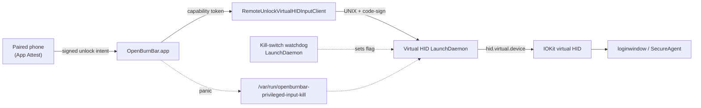
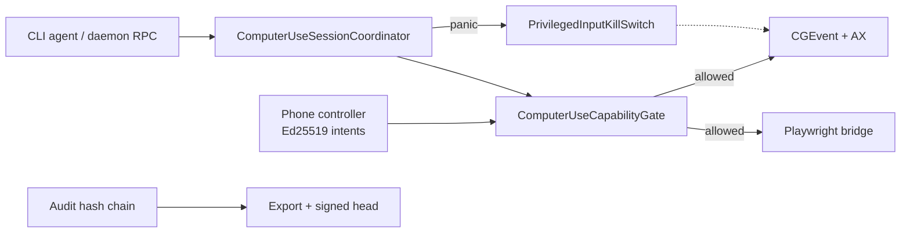

# Privileged input & remote control — threat model (2026-05-30)

**Status:** WS6 deliverable for SOTA security remediation.  
**Scope:** Virtual HID bridge, Remote Unlock, Computer Use, phone-as-controller, kill paths.  
**Does not replace:** [`../THREAT_MODEL.md`](../THREAT_MODEL.md) (product-wide daemon/extension/cloud).

---

## Two policy domains (never merged)

| Domain | Actor | Goal | Token type | Live service in path? |
|--------|-------|------|------------|------------------------|
| **Remote Unlock** | Human at lock/loginwindow | Type unlock password via certified HID sequence | `CapabilityToken` domain `remote_unlock` | **No** — offline verification at leaf |
| **Computer Use** | Agent + optional phone mirror | Post-unlock desktop/browser automation | `CapabilityToken` domain `computer_use` + grants | Fail-closed PDP acceptable |

The Virtual HID bridge enforces the **domain tag** of any capability token it receives. Remote Unlock and Computer Use have separate threat trees below.

---

## Data-flow diagrams

### Remote Unlock (lock screen → HID leaf)



### Computer Use (post-unlock agent path)



---

## Threat tree A — unlock password compromise

**Entry:** Attacker learns or shoulder-surfs the **Mac login password** (not OpenBurnBar credentials).

```
Unlock password compromise
├── A1 Physical observation at keyboard
│   └── Mitigation: Remote Unlock reduces need to type on untrusted keyboard; audit on bridge
├── A2 Phishing / reuse from another breach
│   └── Mitigation: Out of scope for OpenBurnBar; user education
├── A3 Malware captures password via keylogger (pre-unlock)
│   └── Mitigation: Remote Unlock types via HID leaf — password never in agent clipboard
│   └── Residual: OS-level keylogger on phone or Mac still wins
└── A4 Replay of Remote Unlock session
    └── Mitigation: single-use capability token + short TTL + nonce ledger at leaf
    └── Residual: compromised genuine paired phone within TTL (see Tree B)
```

**Primary controls:** single-use domain-locked tokens, offline leaf verification, certified action-kind allowlist, bridge audit events.

---

## Threat tree B — general desktop pwn (post-login)

**Entry:** Attacker achieves **code execution as console user** on an unlocked Mac.

```
Desktop pwn (console user)
├── B1 UID-only bridge access (V0-1) — CLOSED P0
│   └── Mitigation: peer code-signature via audit token + designated requirement
├── B2 Arbitrary HID via broad "input" op (V1-1)
│   └── Mitigation: fail-closed action allowlist + capability tokens (WS2)
├── B3 App panic does not stop leaf (V1-2)
│   └── Mitigation: PrivilegedInputKillSwitch checked every dispatch + watchdog LaunchDaemon
├── B4 Phone grant replay / no TTL (V1-3)
│   └── Mitigation: grant expiry + revocation + attestation binding (WS2)
├── B5 Silent audit gap
│   └── Mitigation: privileged_socket_* + bridge input audit JSON lines
└── B6 Supply-chain trojaned release
    └── Mitigation: SLSA provenance + cosign + SBOM/VEX (WS5)
```

**Primary controls:** least-privilege leaf, kills reach leaf, tamper-evident audit, formal FSM harness in CI.

---

## Residual risk register

| ID | Risk | Likelihood | Impact | Mitigation status | Residual |
|----|------|------------|--------|-----------------|----------|
| R-1 | Console-user malware connects to daemon RPC socket | Medium | High | `0o600` socket + auth token in launchd env | Same-UID malware with plist read |
| R-2 | Compromised genuine paired phone replays within TTL | Low | Critical | TTL + counter + attestation + kill | Nation-state / long-lived device compromise |
| R-3 | Virtual HID entitlement revoked by Apple policy | Low | High | Runtime probe + user-facing blocker | Feature unavailable until re-cert |
| R-4 | Kill flag cleared by root attacker | Low | High | Watchdog can re-activate; audit preserves panic | Root attacker already wins |
| R-5 | Audit completeness dispute | Medium | Medium | Signed head + anchor (WS3) | Requires exported artifacts |
| R-6 | Notarized artifact bit-repro | N/A | Low | **De-scoped** — use provenance instead | See SUPPLY_CHAIN_PROVENANCE.md |
| R-7 | Firestore App Check toggled off in console | Low | Medium | Automated launch gate (WS4) | Operator misconfiguration |

---

## Formal properties (CI gate)

[`ComputerUseSafetyInvariantHarness`](../../OpenBurnBarCore/Sources/OpenBurnBarComputerUseCore/ComputerUseSafetyInvariantHarness.swift) exhaustively explores session FSM transitions and asserts:

1. **No input after panic** — `inputAction` never allowed in `panicHalted`.
2. **Revoked/expired grant** — no `grantApplied` audit; grant inactive.
3. **Trust only downgrades** — escalation without approval rejected.
4. **Remote Unlock token** — single-use nonce ledger; domain mismatch and expiry denied.

Tests: `ComputerUseSafetyInvariantHarnessTests`, `ComputerUseTrustPanicInvariantTests`, `PrivilegedInputKillSwitchTests`.

---

## Kill path SLO (operator)

| Path | Target | Evidence |
|------|--------|----------|
| ⌃⌥⌘. hotkey | ≤ 500 ms to leaf deny | `PrivilegedInputKillSwitch` + bridge error `privileged_input_kill_switch_active` |
| Phone three-finger long-press | ≤ 1 s | Coordinator → kill flag |
| Watchdog socket `activate` | ≤ 200 ms | `/var/run/openburnbar-killswitch-watch.sock` |
| Remote Config kill switch | ≤ 60 s (poll) | Defense in depth |

Runbook: install watchdog via [`scripts/install-privileged-input-killswitch-watchdog.sh`](../../scripts/install-privileged-input-killswitch-watchdog.sh).

---

## Sign-off

| Role | Name | Date |
|------|------|------|
| Owner | Alberto | 2026-05-30 |
| Security reviewer | _(pending)_ | |

---

## Cross-links

- [SOTA remediation plan](../../plans/2026-05-30-sota-security-remediation.md)
- [Privileged socket auth](PRIVILEGED_SOCKET_AUTH.md)
- [Supply chain provenance](SUPPLY_CHAIN_PROVENANCE.md)
- [Computer Use master plan](../../plans/2026-05-16-computer-use-master-plan.md)
