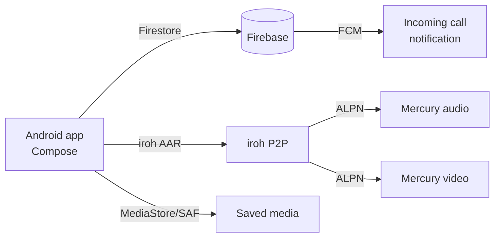

# Android app

The Android companion app reaches full iOS parity as of 2026-05-16. It is built with Kotlin and Jetpack Compose, connects to the same iroh P2P transport as the iOS app, and shares the same Firestore schema canonicalized in `functions/src/types.ts`.

## Purpose

Provide Android users with the same surfaces as the iOS companion: Hermes Square messaging, Mercury media (file transfer, screen share, 1:1 calls), Computer Use Agent Watch, and the Insights Editorial Observatory.

## Directory layout

```
android/
  app/src/main/java/com/openburnbar/
    data/
      models/           # Kotlin data classes mirroring functions/src/types.ts
      store/            # Firestore listeners, DataStore Proto prefs
    ui/
      theme/            # InsightsTheme, Aurora design tokens
      screens/          # IntelligenceBriefScreen, MediaSettingsView
      components/       # AttachmentBubble, ZScoreGauge
    services/
      HermesService.kt   # Relay connection management
      MercuryFcmService.kt  # Incoming call notifications
  openburnbar-iroh-relay/  # Gradle module: codec, pairing, loopback transport
```

## Key abstractions

| Type | File | Purpose |
|------|------|---------|
| `IntelligenceBriefScreen` | `ui/screens/IntelligenceBriefScreen.kt` | Editorial Observatory brief with cascade-in animations |
| `MercuryFcmService` | `services/MercuryFcmService.kt` | Constructs `Notification.CallStyle.forIncomingCall` with full-screen intent |
| `CallKitFacade` | `services/CallKitFacade.kt` | Self-managed `ConnectionService` wrapping Android call UI |
| `MediaPartnerSavePreferenceStore` | `data/store/MediaPartnerSavePreferenceStore.kt` | DataStore Proto per-partner save policy (Photos / Files / Forget) |
| `OpenBurnBarIrohFfiBackend` | `services/OpenBurnBarIrohFfiBackend.kt` | Reflection-bridged iroh AAR loader with loopback fallback |
| `MercuryAudioDatagramChannel` | `services/MercuryAudioDatagramChannel.kt` | Audio over ALPN `openburnbar/mercury/audio/1` |

## How it works



1. **Schema alignment** — every Kotlin data class is annotated `@IgnoreExtraProperties` and uses `@PropertyName` for Firestore keys that differ from camelCase. The canonical schema is `functions/src/types.ts`.
2. **Iroh transport** — the `:openburnbar-iroh-relay` module shares the same wire format as iOS: big-endian u32 length prefix, `HermesRealtimeRelayFrame` JSON envelope, Ed25519 pairing. If the AAR is missing, the app falls back to loopback transport.
3. **Incoming calls** — Android 14+ uses `Notification.CallStyle.forIncomingCall` + `USE_FULL_SCREEN_INTENT` targeting `IncomingCallActivity`. If the user revoked the permission, the service degrades to a heads-up notification with a settings deep link.
4. **Save preferences** — `MediaPartnerSavePreferenceStore` persists per-partner policy via DataStore Proto. `SAVE_TO_PHOTOS` routes to `MediaStore.Images.Media`; `SAVE_TO_FILES` uses `DocumentsContract.createDocument` after a one-time tree URI selection.

## Integration points

- **Firestore** — read-only consumption is default; outbound writes follow `functions/src/types.ts`.
- **Iroh relay** — same ALPN and frame format as iOS/macOS via the shared Rust crate.
- **Firebase Cloud Messaging** — high-priority data messages for incoming call fan-out.

## Entry points for modification

- Add new UI screens under `android/app/src/main/java/com/openburnbar/ui/screens/`.
- Update Firestore models under `android/app/src/main/java/com/openburnbar/data/models/` and run `./tools/schema-sync/check-drift.sh`.
- Add iroh relay tests in `:openburnbar-iroh-relay:testDebugUnitTest`.

## Related pages

- [Iroh transport](../systems/iroh-transport.md)
- [Mercury media](../features/mercury-media.md)
- [Computer Use](../features/computer-use.md)
- [Insights](../features/insights.md)
- [macOS app](macos-app/index.md)
- [iOS app](ios-app/index.md)
