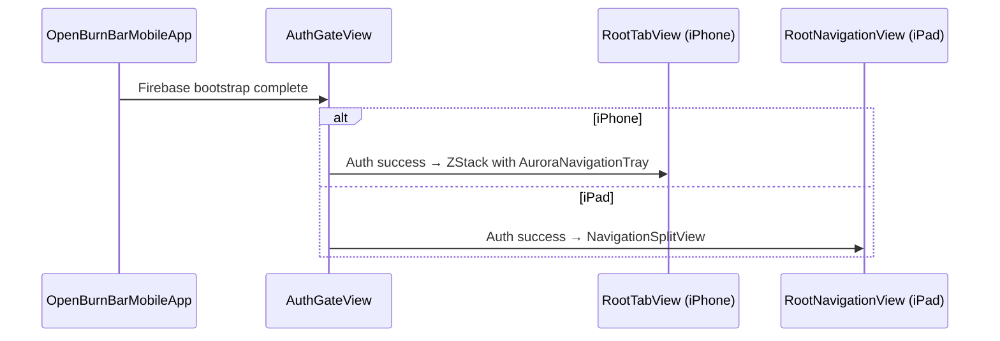
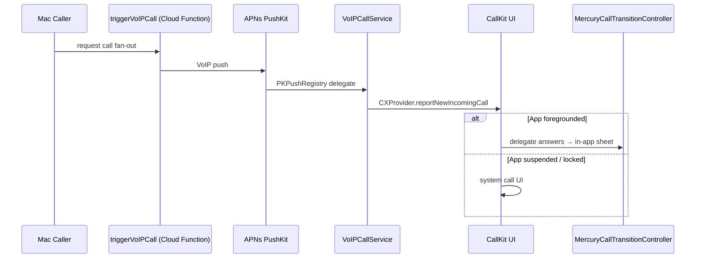
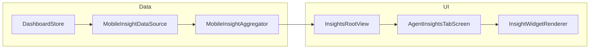

# iOS app

SwiftUI companion app for iPhone and iPad. Mirrors the Mac via Agent Watch, handles Mercury P2P calls and file transfer, renders the Insights Editorial Observatory, and chats through the Hermes relay integration. Built on the same `OpenBurnBarCore` wire types, Firestore schema, and iroh transport as the macOS app.

## Directory layout

```
OpenBurnBarMobile/
├── App/
│   ├── OpenBurnBarMobileApp.swift     @main entry point, deep-link handler, lifecycle
│   ├── AppDelegate.swift              Firebase bootstrap, PushKit registry
│   └── AuthGateView.swift             Auth state router (sign-in → app shell)
├── Features/
│   └── Mercury/                       Personalization store, accent picker, mood carousel
├── Models/
│   ├── AuthStore.swift                Firebase Auth state
│   ├── DashboardStore.swift           Firestore-backed usage rollup cache
│   ├── InsightsStore.swift            Canvas grid, composer, catalog
│   ├── AgentWatchLiveActivityManager.swift  Live Activity for Mac session
│   └── ...                            Quota, projects, provider summary stores
├── Services/
│   ├── HermesService.swift            Hermes relay connection, chat thread, message actions
│   ├── ComputerUse/
│   │   ├── AgentWatchOverlaySingleton.swift   App-scope iroh control stream owner
│   │   ├── AgentWatchOverlayCoordinator.swift Dial, read-loop, reconnect backoff
│   │   ├── AgentWatchState.swift      Published frame / approval / trust-mode state
│   │   ├── AgentLiveStagePresenter.swift  Dock → split → maximize state machine
│   │   ├── PhoneControlSender.swift   Ed25519-signed intent dispatch (Phase 12)
│   │   └── AgentWatchReceiver.swift   Decode control.* frames from Mac
│   ├── Media/
│   │   ├── MediaControlStreamCoordinator.swift  Persistent media blob control stream
│   │   ├── VideoReceivePipeline.swift VTDecompressionSession → CMSampleBuffer
│   │   ├── AudioReceivePipeline.swift Opus decode → AVAudioEngine
│   │   ├── VoIPCallService.swift      PushKit + CallKit incoming-call driver
│   │   ├── MercuryCallTransitionController.swift  In-app → CallKit hand-off
│   │   └── iOSFileTransferService.swift  Blob advertise / ack / save
│   ├── IrohRelay/
│   │   └── HermesIrohRelayTransport.swift  iOS-side iroh QUIC dialer + frame dispatch
│   └── Insights/
│       ├── MobileInsightDataSource.swift  Firestore rollup → InsightUsageRow adapter
│       └── MobileInsightAggregator.swift  Mobile-specific brief assembly
├── Views/
│   ├── RootTabView.swift              iPhone: Pulse / Burn / Streams / Hermes / You
│   ├── RootNavigationView.swift       iPad: NavigationSplitView sidebar + detail
│   ├── Aurora/
│   │   ├── AuroraNavigationTray.swift Bottom glass pill with animated icons
│   │   └── AuroraBackdrop.swift       Parallax motion + hero card drift
│   ├── ComputerUse/
│   │   ├── AgentWatchView.swift       Full-bleed mirror + passthrough input surface
│   │   ├── AgentWatchScreen.swift     You-tab viewer bound to singleton state
│   │   ├── AgentLiveStage.swift       Root overlay (dock / split / maximize)
│   │   ├── AgentLiveStageDockTile.swift 320×180 floating tile
│   │   ├── AgentLiveStageChatPuck.swift 56 pt draggable chat launcher
│   │   └── AgentWatchEmptyStateView.swift Editorial onboarding when no session
│   ├── Media/
│   │   ├── ScreenShareViewerView.swift AVSampleBufferDisplayLayer viewer
│   │   ├── MercuryLiveSheet.swift     Ask-to-mirror / call / send-file sheet
│   │   ├── MercuryIncomingSheet.swift Incoming call full-screen sheet
│   │   ├── CallHUDView.swift          In-call floating chrome
│   │   └── AttachmentBubble.swift     Mercury-stroked file-transfer row
│   ├── Hermes/
│   │   ├── HermesTabView.swift        Conversation list + thread push
│   │   ├── AssistantTileBridgeView.swift  Runtime selection + status banner
│   │   └── HermesSquareRoot.swift     Square-mode pinned grid + discover drawer
│   ├── Insights/
│   │   ├── InsightsRootView.swift     Top-level tab, Pro gating, store bootstrap
│   │   └── AgentInsightsTabScreen.swift Canvas + composer + audit footer
│   ├── Pulse/
│   │   └── PulseView.swift            Real-time spend strip + trend cards
│   ├── Burn/
│   │   └── BurnView.swift             Session list + provider breakdown
│   ├── Streams/
│   │   └── StreamsView.swift          Project streams + memory wiki
│   └── You/
│       └── YouView.swift              Profile, settings hub, Computer Use sub-screen
├── Theme/
│   ├── MobileTheme.swift              Adaptive colors, spacing, typography tokens
│   └── AuroraDesign.swift             Aurora glass / shimmer / motion presets
├── Settings/
│   └── Search/                        Settings search engine + manifest
├── Tests/
│   └── MissionFABResurrectionControllerTests.swift
└── Resources/
    └── Assets.xcassets
```

## Key abstractions

| Abstraction | File | Role |
|---|---|---|
| `HermesService` | `OpenBurnBarMobile/Services/HermesService.swift` | Central relay client. Manages connection lifecycle, message history, tool dispatch, and SSE streaming. The iOS equivalent of macOS `CLIBridge.Backend.hermes`. |
| `AgentWatchOverlaySingleton` | `OpenBurnBarMobile/Services/ComputerUse/AgentWatchOverlaySingleton.swift` | Process-scoped owner of the persistent iroh control stream. Survives tab swaps so the live mirror can auto-open from any screen. |
| `AgentLiveStagePresenter` | `OpenBurnBarMobile/Services/ComputerUse/AgentLiveStagePresenter.swift` | Pure-data state machine for the three Agent Live Stage modes: `.hidden` → `.dock` → `.split` → `.maximize`. Test-overridable grace window. |
| `AgentWatchState` | `OpenBurnBarMobile/Services/ComputerUse/AgentWatchState.swift` | Observable model for the live mirror surface. Holds `currentFrame`, `pendingApproval`, `liveTrustMode`, `actionTimeline`, and `sessionId`. |
| `VideoReceivePipeline` | `OpenBurnBarMobile/Services/Media/VideoReceivePipeline.swift` | VTDecompressionSession wrapper for inbound HEVC/H.264 screen-share frames. Emits `CMSampleBuffer`s for `AVSampleBufferDisplayLayer`. |
| `MediaControlStreamCoordinator` | `OpenBurnBarMobile/Services/Media/MediaControlStreamCoordinator.swift` | Persistent iroh bi-stream dedicated to Mercury media control frames (`media.classify`, `media.blob.advertise`, `media.blob.ack`). Reconnects with exponential backoff. |
| `VoIPCallService` | `OpenBurnBarMobile/Services/Media/VoIPCallService.swift` | PushKit registry + CallKit provider. Handles the wake-from-suspended incoming-call path. |
| `InsightsStore` | `OpenBurnBarMobile/Models/InsightsStore.swift` | Observable mobile shell around the Insights canvas grid, composer, catalog, and audit log. Drives `InsightsRootView`. |
| `MobileInsightDataSource` | `OpenBurnBarMobile/Services/Insights/MobileInsightDataSource.swift` | Adapts Firestore-backed `DashboardStore` rollups into `InsightUsageRow`s for the mobile brief. Falls back to raw usage when rollups are stale. |
| `AuroraNavigationTray` | `OpenBurnBarMobile/Views/Navigation/AuroraNavigationTray.swift` | Custom bottom pill replacing `TabView`. Horizontal drag-to-switch, spring-snap physics, glass backdrop, VoiceOver support. |
| `PhoneControlSender` | `OpenBurnBarMobile/Services/ComputerUse/PhoneControlSender.swift` | Phase 12 phone-as-controller. Signs `PhoneControlIntent` with Ed25519, writes the envelope to the open iroh `control.input` stream. |

## How it works

### App launch and shell selection



`OpenBurnBarMobileApp.swift` is the `@main` entry point. It sets up Firebase, binds `AppCustomization.shared` for theming, and opens `AuthGateView`. On auth success the gate routes to `RootTabView` (iPhone) or `RootNavigationView` (iPad). Both shells inject the same shared `AgentWatchOverlaySingleton` so Computer Use auto-open works regardless of device form factor.

### Agent Watch / Agent Live Stage lifecycle

```mermaid
sequenceDiagram
    participant Mac as Mac Agent
    participant Relay as Hermes relay
    participant Sing as AgentWatchOverlaySingleton
    presenter LP as AgentLiveStagePresenter
    participant Dock as AgentLiveStageDockTile

    Mac->>Relay: control.surface.frame (HEVC + cursor metadata)
    Relay->>Sing: iroh QUIC stream
    Sing->>Sing: decode → AgentWatchState.currentFrame
    Sing->>LP: sessionId becomes non-nil
    LP->>Dock: mode = .dock (auto-open)
    Note over Dock: 320×180 compact / 360×203 regular
    User->>Dock: tap
    LP->>Dock: mode = .split
    User->>Dock: pinch-out
    LP->>Dock: mode = .maximize + ChatPuck
    User->>Dock: tap on mirror surface
    Dock->>Sing: sendTapIntent(normalizedX, normalizedY)
    Sing->>Relay: control.input (Ed25519-signed)
    Relay->>Mac: execute tap via CGEvent
```

`AgentWatchOverlaySingleton` owns the persistent iroh control stream. It dials the relay when auth + selected Hermes connection are both available, then keeps a read-loop alive across tab changes. `AgentLiveStagePresenter` is pure-data: it flips `mode` between `.hidden`, `.dock`, `.split`, and `.maximize` based on `sessionId` changes and user gestures. The presenter stays in `.dock` for a 6-second grace window after `sessionId` clears so the final audit-head animation can finish.

### Mercury incoming call



`VoIPCallService` registers a `PKPushRegistry` for VoIP pushes and a `CXProvider` for CallKit. The first ring always goes through the system call UI; when the app is already foreground `MercuryCallTransitionController` swaps the sheet in instead. On Android the equivalent is `Notification.CallStyle.forIncomingCall` with `USE_FULL_SCREEN_INTENT`.

### Insights Editorial Observatory brief



`InsightsRootView` bootstraps the store on `.task`. It ensures `DashboardStore` is hydrated first, then builds `InsightsStore` with a `MobileInsightDataSource` adapter. `AgentInsightsTabScreen` renders the editorial brief: hero with mercury-gradient hairline, numbered `01/02/03` findings, horizontal anomaly atlas, recommendations with sign-aware impact arrows, and generated chart widgets. Cascade-in uses staggered `AnimatedVisibility` at 0.04 s; `accessibilityReduceMotion` paints synchronously.

## Integration points

| Integration | Mechanism | Notes |
|---|---|---|
| Hermes relay | `HermesIrohRelayTransport` — iroh QUIC + Ed25519 signature verification | Same wire format as macOS: big-endian u32 length prefix + JSON envelope. Public keys exchanged during `createHermesPairing` / `completeHermesPairing` Cloud Function flow. |
| Computer Use Mac | `AgentWatchOverlayCoordinator` reads `control.*` frames; `PhoneControlSender` writes `control.input` | Phone-side trust-mode downgrade only (security invariant: stolen phone cannot elevate). Upgrades require Mac-side confirmation. |
| Mercury media | `MediaControlStreamCoordinator` owns persistent `media.*` iroh stream; `VideoReceivePipeline` / `AudioReceivePipeline` decode | Opus audio over `openburnbar/mercury/audio/1` ALPN. Screen share uses HEVC via VideoToolbox. |
| Firestore | `FirestoreRepository` — usage pages, quota snapshots, provider accounts, session logs | Read-only by default; outbound writes follow `functions/src/types.ts` canonical schema. |
| Firebase Auth / App Check | `AuthStore` + `AppCheckAttestationMonitor` | Required for Mac control approval; `AppCheck` blocks untrusted clients. |
| OpenBurnBarCore | Shared Swift package — `TokenUsage`, `HermesRealtimeRelayFrame`, `ComputerUseSessionID`, etc. | iOS links `OpenBurnBarCore`, `OpenBurnBarComputerUseCore`, `OpenBurnBarMedia`, and `OpenBurnBarIrohRelay`. |
| CallKit / PushKit | `VoIPCallService` — `PKPushRegistry` + `CXProvider` | First ring uses system UI even when suspended. Token registered with Cloud Function `triggerVoIPCall`. |

## Entry points for modification

- **Add a new Agent Live Stage layout**: `OpenBurnBarMobile/Services/ComputerUse/AgentLiveStagePresenter.swift` — extend `Mode` enum, update transition logic.
- **Change mirror input gestures**: `OpenBurnBarMobile/Views/ComputerUse/AgentWatchView.swift` — the `phoneInputSurface` overlay routes taps, drags, and scrolls to `sendTapIntent` / `sendScrollIntent`.
- **Add a new Mercury media codec**: `OpenBurnBarMobile/Services/Media/VideoReceivePipeline.swift` — extend `Codec` enum and `VTDecompressionSession` setup.
- **Customize Insights brief layout**: `OpenBurnBarMobile/Views/Insights/AgentInsightsTabScreen.swift` — the editorial sections cascade in via `AnimatedVisibility`.
- **Add a new tab to Aurora nav**: `OpenBurnBarMobile/Views/Navigation/AuroraNavigationTray.swift` + `AuroraNavDestination` (in `AppCustomization.swift`).
- **Change Hermes chat thread UI**: `OpenBurnBarMobile/Views/Hermes/HermesTabView.swift` — conversation list and thread push.
- **Extend mobile theme tokens**: `OpenBurnBarMobile/Theme/MobileTheme.swift` — colors, spacing, typography. `AuroraDesign.swift` for glass/shimmer motion presets.
- **Add a Computer Use empty-state CTA**: `OpenBurnBarMobile/Views/ComputerUse/AgentWatchEmptyStateView.swift` — hero, checklist, step guide, capability strip, and permissions footer.

## Related pages

- [macOS app](macos-app/index.md)
- [Android app](../android-app.md)
- [Computer Use](../../features/computer-use.md)
- [Mercury media](../../features/mercury-media.md)
- [Insights](../../features/insights.md)
- [Hermes relay](../../systems/hermes-relay.md)
- [iroh transport](../../systems/iroh-transport.md)
- [Usage tracking](../../features/usage-tracking.md)
- [Budget governance](../../features/budget-governance.md)
