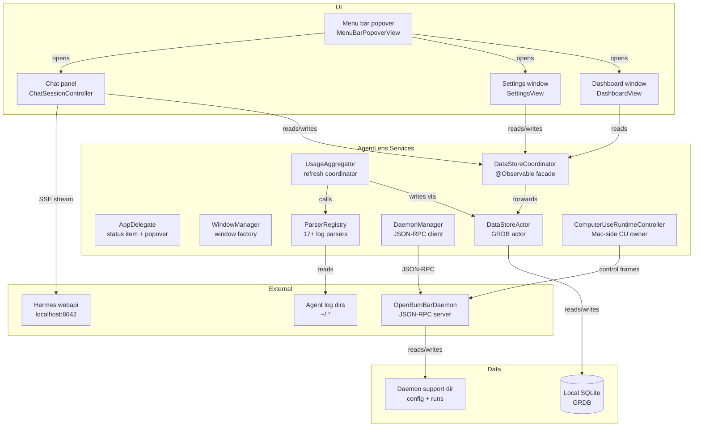

# macOS app

The primary OpenBurnBar surface. `AgentLens/` is a native macOS SwiftUI shell that lives in the menu bar, parses local AI agent log files, stores token usage in local SQLite (GRDB), and surfaces real-time spend through a popover dashboard, settings window, and Hermes chat panel.

## Purpose

- **Local-first spend tracking** — Watch `~/.*` agent log directories and compute unified token + cost ledgers.
- **Menu bar UI** — Popover snapshot, full dashboard window, and settings via `NavigationSplitView`.
- **Chat + agent runtime** — Hermes chat panel (Local Index and Hermes webapi backends), Computer Use runtime (Agent Watch, Browser, Mac System control), and daemon management.
- **Design system** — Complete `DesignSystem.swift` tokens (colors, typography, spacing, motion) used across macOS, iOS, and Android parity surfaces.

## Directory layout

```
AgentLens/
├── App/
│   ├── AgentLensApp.swift          # @main entry point, scene assembly, startup orchestration
│   └── AppDelegate.swift            # NSStatusItem + NSPopover, live wallpaper panels, power monitoring
├── Models/
│   ├── ConversationRecord.swift
│   ├── ProviderBrand.swift
│   ├── AgentProvider.swift
│   └── Settings/                    # AppearanceMode, TimeRange, etc.
├── Services/
│   ├── UsageAggregator.swift        # @Observable refresh facade, parser coordination
│   ├── UsageAggregation/
│   │   ├── ParserRegistry.swift     # Canonical provider → parser map (17+ providers)
│   │   ├── RefreshBackgroundWork.swift
│   │   └── AutoSummaryEngine.swift
│   ├── LogParser/
│   │   ├── LogParserProtocol.swift  # ParseResult + LogParser protocol
│   │   ├── ClaudeCodeParser.swift
│   │   ├── FactoryDroidParser.swift
│   │   ├── GrokParser.swift
│   │   ├── KimiParser.swift
│   │   ├── CursorAgentParser.swift
│   │   ├── WindsurfParser.swift
│   │   ├── WarpParser.swift
│   │   ├── HermesParser.swift
│   │   └── ... (17 total)
│   ├── DataStore/
│   │   ├── DataStore.swift          # DataStoreActor (GRDB actor + sub-stores)
│   │   ├── DataStoreCoordinator.swift  # @Observable @MainActor facade
│   │   ├── OpenBurnBarDatabase.swift  # Migrations
│   │   ├── UsageStore.swift
│   │   ├── ConversationStore.swift
│   │   ├── SearchIndexStore.swift
│   │   └── ... (ProjectionStore, ArtifactStore, BudgetLedger, etc.)
│   ├── OpenBurnBarDaemon/
│   │   ├── OpenBurnBarDaemonManager.swift      # Daemon lifecycle + JSON-RPC client
│   │   ├── OpenBurnBarDaemonBinaryResolver.swift
│   │   ├── OpenBurnBarDaemonSocketClient.swift
│   │   └── OpenBurnBarDaemonSupervisor.swift
│   ├── ComputerUse/
│   │   ├── ComputerUseRuntimeController.swift  # Process-scoped CU owner
│   │   ├── ComputerUseSessionCoordinator.swift # Session-scoped CU coordinator
│   │   ├── PhoneControlAuthorityValidator.swift
│   │   └── Mac/
│   │       ├── MacScreenshotService.swift
│   │       ├── MacInputController.swift
│   │       └── RemoteClipboardController.swift
│   ├── CLIBridge/
│   │   ├── CLIBridge.swift          # CLI bridge + Hermes webapi dispatch
│   │   ├── CLIStreamParsers.swift
│   │   └── OpenAICompatibleChatGatewayClient.swift
│   ├── Search/
│   │   ├── SearchService.swift       # FTS + vector retrieval
│   │   ├── Embedding/               # OpenAI + deterministic providers
│   │   └── VectorSearch/
│   ├── CloudSync/
│   │   ├── CloudSyncService.swift
│   │   ├── ConversationSyncService.swift
│   │   └── SessionLogSyncService.swift
│   ├── Settings/
│   │   ├── SettingsManager.swift
│   │   └── Stores/                  # Typed settings (Appearance, Alerts, Quota, etc.)
│   └── ... (Media, IrohRelay, ProviderQuota, etc.)
├── Views/
│   ├── Popover/
│   │   ├── MenuBarPopoverView.swift # 340 pt popover dashboard
│   │   ├── HermesPopoverStrip.swift # Collapsed/expanded Hermes strip
│   │   └── OnboardingView.swift
│   ├── Dashboard/
│   │   ├── DashboardView.swift       # Main dashboard window
│   │   ├── DashboardSidebar.swift    # Navigation rail
│   │   ├── DashboardOverviewView.swift
│   │   ├── ProjectsView.swift        # Project memory + controller projects
│   │   ├── SessionDetailView.swift
│   │   └── ... (Provider, Model, Org lanes; Quota workspace)
│   ├── Chat/
│   │   ├── ChatSessionController.swift  # Streaming message state machine
│   │   ├── ChatPanel.swift           # Floating/pop-out chat panel
│   │   ├── DashboardChatWorkspaceView.swift
│   │   ├── HermesThinkingView.swift  # Mercury pool animation
│   │   └── Components/             # Input row, messages stream, attachments
│   ├── ComputerUse/
│   │   ├── ComputerUseSessionPanel.swift
│   │   ├── ComputerUseApprovalSheet.swift
│   │   └── ComputerUseSettingsView.swift
│   ├── Settings/
│   │   ├── SettingsView.swift        # NavigationSplitView settings
│   │   ├── GeneralSettingsView.swift
│   │   ├── BudgetSettingsView.swift
│   │   └── ... (Connections, Agents, Chat Gateway, etc.)
│   └── Onboarding/
│       └── OnboardingWizardView.swift
├── Theme/
│   ├── DesignSystem.swift           # Colors, typography, spacing, motion tokens
│   ├── ColorAdaptive.swift          # NSColor dynamic provider for dark/light
│   └── ThemeManager.swift
└── Utilities/
    ├── Formatting.swift
    └── BufferedLineSequence.swift
```

## Key abstractions

| Name | Location | Role |
|------|----------|------|
| `OpenBurnBarApp` | `App/AgentLensApp.swift` | `@main` SwiftUI app. Builds `OpenBurnBarRuntimeContext` (DataStore, SettingsManager, DaemonManager, ChatController). |
| `AppDelegate` | `App/AppDelegate.swift` | `NSApplicationDelegate`. Hosts `NSStatusItem` + `NSPopover`, manages live wallpaper `BurnBarWallpaperPanel`, enforces single instance. |
| `WindowManager` | `App/AgentLensApp.swift` | Singleton `@MainActor` window factory. Opens dashboard, settings, onboarding, chat pop-out, and startup recovery windows. |
| `DataStoreActor` | `Services/DataStore/DataStore.swift` | `actor` owning the GRDB `DatabaseWriter` and all sub-stores (Usage, Conversation, Search, Projection, etc.). |
| `DataStoreCoordinator` | `Services/DataStore/DataStoreCoordinator.swift` | `@Observable @MainActor` facade forwarding to `DataStoreActor`. Exposes `usages`, `usagesVersion`, and `usageViewModel`. |
| `UsageAggregator` | `Services/UsageAggregator.swift` | `@Observable` refresh coordinator. Calls parsers off-main-thread via `RefreshBackgroundWork`, applies results on main actor. |
| `LogParser` | `Services/LogParser/LogParserProtocol.swift` | `protocol` returning `ParseResult` (usages + conversations). Implemented by 17+ provider-specific parsers. |
| `ParserRegistry` | `Services/UsageAggregation/ParserRegistry.swift` | Static map of `AgentProvider → LogParser`. The canonical list of supported agents. |
| `OpenBurnBarDaemonManager` | `Services/OpenBurnBarDaemon/` | Daemon lifecycle: install, health-check, JSON-RPC socket client, usage sync, mission control proxy. |
| `ChatSessionController` | `Views/Chat/ChatSessionController.swift` | `@Observable` streaming chat state machine. Dual backend: CLI bridge (Local Index) and Hermes webapi (`localhost:8642`). |
| `ComputerUseRuntimeController` | `Services/ComputerUse/ComputerUseRuntimeController.swift` | Process-scoped owner of the Mac-side Computer Use session. Installs iroh control dispatcher, panic-hotkey monitor, panel model. |
| `DesignSystem` | `Theme/DesignSystem.swift` | Enum namespace for `Colors`, `Typography`, `Spacing`, `Radius`, `Animation`, `Shadows`. |
| `SettingsManager` | `Services/SettingsManager.swift` | Central settings coordinator with typed sub-stores under `Services/Settings/Stores/`. |

## How it works



### Startup sequence

1. `AgentLensApp.init` checks `OpenBurnBarRuntime.shouldUseTestStubScene` to skip heavy bootstrap under XCTest.
2. `makeRuntimeContext()` opens SQLite (`DataStoreCoordinator`), initializes `SettingsManager`, `AccountManager`, `ProviderQuotaService`, `OpenBurnBarDaemonManager`, and `ChatSessionController`.
3. `installCommandRouter()` wires `AppCommandRouter.shared` closures so the popover and deep links can open dashboard/settings/chat.
4. `startLiveServicesIfNeeded()` attaches cloud sync, quota refresh, daemon usage sync, and background cadence.
5. `AppDelegate.applicationDidFinishLaunching` installs the `NSStatusItem`, sets up the live wallpaper panels, and enforces single-instance.

### Refresh pipeline

1. `UsageAggregator.refreshAll()` snapshots in-memory state and enters `Task.detached`.
2. `RefreshBackgroundWork.runFullRefresh()` iterates `ParserRegistry.defaultParsers()`, calling `parser.parse()` for each provider.
3. Parsers read JSONL / log files, compute `TokenUsage` rows, and return `ParseResult`.
4. Results are persisted via `DataStoreActor.insertUsages`, then applied back to `DataStoreCoordinator.usages` on the main actor.
5. If conversation indexing is enabled, parsed conversations are written to `ConversationStore` and FTS is updated.
6. `AutoSummaryEngine` and `ProjectionPipelineService` run post-refresh sweeps.

### Chat dual-backend

- **Local Index mode** — `CLIBridge` spawns `codex` / `claude` CLI subprocess, injects retrieval context as system prompt, streams `CLIChatStreamEvent`.
- **Hermes mode** — `OpenAICompatibleChatGatewayClient` POSTs to `localhost:8642/v1/chat/completions` with `stream: true`. SSE chunks are parsed into the same `CLIChatStreamEvent` types.

## Integration points

| Surface | How it connects |
|---------|-----------------|
| **OpenBurnBarDaemon** | `OpenBurnBarDaemonManager` communicates over a local Unix-domain socket (`openburnbar-daemon.sock`) using JSON-RPC. The daemon is installed/repaired via `OpenBurnBarDaemonBinaryResolver`. |
| **Hermes chat** | `ChatSessionController` probes `localhost:8642/v1/models`. If Hermes is available, it becomes the preferred backend. The popover strip (`HermesPopoverStrip`) and dashboard chat panel (`DashboardChatWorkspaceView`) both render the same stream events. |
| **Computer Use** | `ComputerUseRuntimeController` attaches to the iroh relay (`HermesRelayHostService`) and installs a control dispatcher. Approval UI is `ComputerUseApprovalSheet`. Mac-side input goes through `MacInputController` + `AXTypedAccess`. |
| **Cloud sync** | `CloudSyncService` replicates local SQLite state to Firestore when the user is signed in. iCloud mirroring (`ICloudSessionMirrorService`) copies session files. |
| **Provider quota** | `ProviderQuotaService` polls 22+ provider APIs and stores snapshots in `ProviderAccountStore` (local SQLite) + Firestore. |
| **Settings** | `SettingsManager` owns typed sub-stores (`AppearanceSettings`, `AlertSettings`, `QuotaSettings`, etc.) backed by `UserDefaults` + keychain for secrets. |
| **Design system** | `DesignSystem.swift` is the source of truth for colors, typography, spacing, and motion. `ColorAdaptive.swift` provides `NSColor` dynamic providers for dark/light mode. |

## Entry points for modification

| If you want to… | Start here |
|-------------------|------------|
| Add a new provider parser | `Services/UsageAggregation/ParserRegistry.swift` to register, then create `Services/LogParser/YourParser.swift` conforming to `LogParser`. |
| Change the dashboard layout | `Views/Dashboard/DashboardView.swift` (main route shell) + the lane views (`DashboardOverviewView`, `ProjectsView`, `ProviderDashboardView`, etc.). |
| Change menu bar popover content | `Views/Popover/MenuBarPopoverView.swift`. The popover size is managed by `AppDelegate.showPopover`. |
| Change settings panes | `Views/Settings/SettingsView.swift` (router + `NavigationSplitView`) + individual detail views (`GeneralSettingsView.swift`, `BudgetSettingsView.swift`, etc.). |
| Change the design system | `Theme/DesignSystem.swift` for tokens; `Theme/ColorAdaptive.swift` for dynamic color behavior. |
| Add a new chat backend | `Services/CLIBridge/CLIBridge.swift` and `Views/Chat/ChatSessionController.swift` (backend probe + stream routing). |
| Change Computer Use Mac behavior | `Services/ComputerUse/ComputerUseRuntimeController.swift` (process owner) and `Services/ComputerUse/Mac/MacInputController.swift` (input injection). |
| Change data store schema | `Services/DataStore/OpenBurnBarDatabase.swift` (migrations) and the relevant `*Store.swift` files. |
| Change startup behavior | `App/AgentLensApp.swift` (`makeRuntimeContext`, `startLiveServicesIfNeeded`). |
| Change window management | `App/AgentLensApp.swift` (`WindowManager` singleton). |

## Related pages

- [Architecture](../overview/architecture.md) — High-level component diagram and data flow
- [Daemon](../systems/daemon/index.md) — OpenBurnBarDaemon JSON-RPC server
- [Local database](../systems/local-database/index.md) — SQLite schema and GRDB patterns
- [Hermes chat](../features/hermes-chat.md) — Chat backend details
- [Computer Use](../features/computer-use.md) — Agent Watch, Browser, and Mac System control
- [Usage tracking](../features/usage-tracking.md) — Parser and aggregation details
- [iOS app](ios-app/index.md) — Mobile companion
- [Android app](android-app.md) — Android companion
