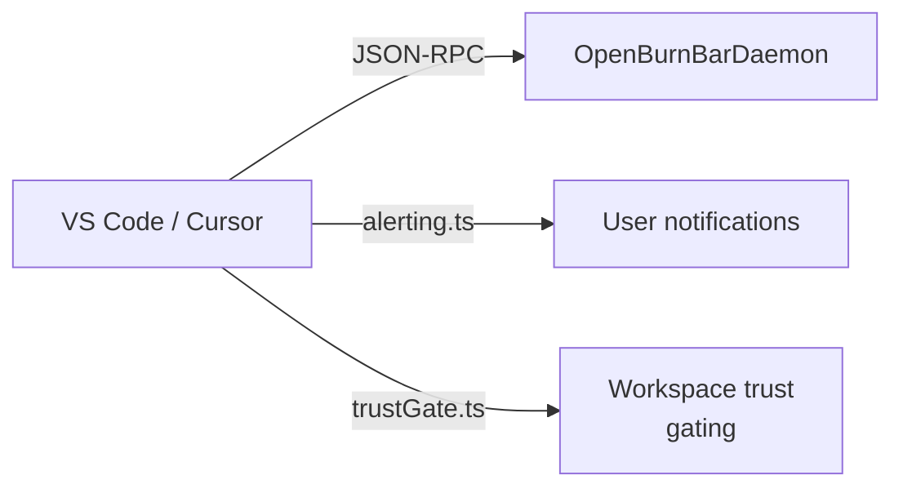

# VS Code / Cursor extension

The TypeScript extension provides a sidebar panel inside VS Code and Cursor that shows daemon health, projected run state, and workspace capability gating.

## Purpose

Give editors a lightweight view into the local OpenBurnBar daemon without leaving the IDE. The extension is local-first and daemon-backed: it acts as a polite sidecar, not a second brain.

## Directory layout

```
extensions/openburnbar/
  src/
    extension.ts       # Activation, sidebar registration, daemon client setup
    alerting.ts        # Alert helpers: alertDaemonUnreachable, alertRunFailed
    daemonClient.ts    # JSON-RPC client to local daemon
    healthView.ts      # Health sidebar view provider
    runsView.ts        # Runs sidebar view provider
    runDetailView.ts   # Run detail webview provider
    trustGate.ts       # Workspace capability detection and gating
  package.json         # Extension manifest, contributes views and commands
```

## Key abstractions

| Type | File | Purpose |
|------|------|---------|
| `activate` | `src/extension.ts` | Entry point: registers views, starts daemon client, sets up trust gating |
| `alertDaemonUnreachable` | `src/alerting.ts` | Shows polite notification when daemon socket is missing |
| `DaemonClient` | `src/daemonClient.ts` | JSON-RPC over Unix domain socket to OpenBurnBarDaemon |
| `TrustGate` | `src/trustGate.ts` | Detects workspace type (local, remote, read-only, virtual, restricted) and gates actions |
| `HealthViewProvider` | `src/healthView.ts` | Sidebar tree showing daemon health, version, and reconnect/repair actions |
| `RunsViewProvider` | `src/runsView.ts` | Sidebar tree showing projected run state |

## How it works



1. **Activation** — the extension activates when the OpenBurnBar sidebar is opened. It attempts to connect to the daemon via Unix domain socket.
2. **Health view** — shows daemon status, version, and quick actions: Reconnect, Refresh, Repair Daemon.
3. **Trust gating** — `TrustGate` detects the workspace type:
   - **Restricted workspaces** (untrusted): allowed: `read_file`, `search_workspace`, health, catalog state. Gated until trusted: `apply_patch`, `run_terminal`.
   - Even in trusted workspaces, `apply_patch` and `run_terminal` pause for explicit approval.
4. **Alerting** — all user-facing errors go through `alerting.ts`. Never call `vscode.window.showErrorMessage` directly.

## Integration points

- **Daemon JSON-RPC** — connects over Unix domain socket. The daemon must be running (launched by the macOS app or manually).
- **VS Code API** — contributes views to the activity bar, commands to the command palette, and webviews for run detail.

## Entry points for modification

- Add new sidebar views in `src/extension.ts` and register them in `package.json` under `contributes.views`.
- Add new daemon client methods in `src/daemonClient.ts`.
- Update alerting copy in `src/alerting.ts`.

## Related pages

- [macOS app](macos-app/index.md)
- [Daemon](../systems/daemon/index.md)
