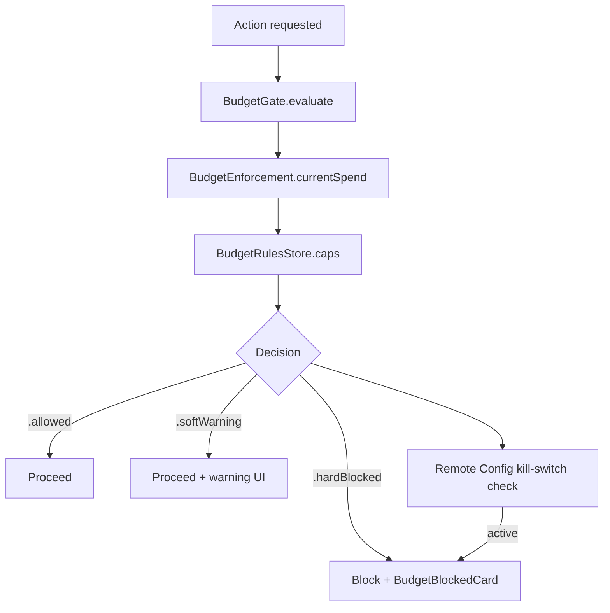

# Budget governance

## Purpose

Per-user spend caps with automated enforcement. Prevents runaway costs from long-running agent sessions. Without caps, a single bug in a routing loop or a poorly scoped Computer Use mission can generate hundreds of dollars of API spend before a human notices. Budget governance provides layered protection: warn early, block at hard limits, and allow remote kill-switch override.

## Directory layout

```
AgentLens/Services/DataStore/
├── BudgetGate.swift                     # Entry point — evaluates whether an action is allowed (~154 lines)
├── BudgetEnforcement.swift            # Enforcement logic: computes current spend against cap layers
├── BudgetLedger.swift                 # Append-only log of spend events; persisted in GRDB SQLite
├── BudgetForecast.swift               # Projects end-of-period spend given current trajectory
├── BudgetRulesStore.swift             # Reads and writes cap configuration (per-user overrides, remote config values)
├── BudgetSettings.swift               # User-visible settings model for cap values
├── BudgetNotificationCenter.swift     # Fires local notifications when soft cap is approached
├── CloudBudgetService.swift           # Syncs budget state with Firestore for cross-device visibility
└── ComputerUseBudgetStatusStore.swift   # Real-time status for the Computer Use panel

AgentLens/Views/Settings/
├── BudgetSettingsView.swift           # User-facing budget cap configuration UI
└── ComputerUseSettingsView.swift      # Computer Use-specific budget settings

AgentLens/Views/Chat/
└── BudgetBlockedCard.swift            # Inline card shown when an action is blocked by budget

AgentLens/Views/Dashboard/Components/
└── BurnRailBudgetChip.swift           # Inline chip showing budget state in session rail

functions/src/
├── computerUseBudget.ts               # Hourly budget guardrail Cloud Function
├── mediaBudget.ts                     # Mercury media bandwidth cost enforcement
├── computerUseRemoteConfig.ts         # Remote Config kill-switch bridge
└── cloudProAllowance.ts               # Cloud Pro tier allowance management

AgentLensTests/Active/
└── ProviderQuotaServiceTests.swift      # Quota + budget integration tests

OpenBurnBarMobileTests/
└── BudgetGateTests.swift              # Mobile budget gate unit tests

android/app/src/test/java/com/openburnbar/data/budget/
└── BudgetGateTest.kt                  # Android budget gate JVM tests
```

## Key abstractions

### `BudgetGate`

Pure gate decisioning over `BudgetSettings` + `BudgetLedger`. Stateless apart from a reference to its two collaborators — both the daemon plane and the AgentLens plane call `evaluate` and translate the returned `BudgetGateDecision` into protocol-specific responses.

```swift
@MainActor
final class BudgetGate {
    func evaluate(
        credential: BudgetCredentialIdentity,
        projectName: String? = nil,
        estimatedCost: Double,
        reference: Date = Date()
    ) async -> BudgetGateDecision
}
```

### `BudgetGateDecision`

| Case | Behaviour |
|---|---|
| `.allow` | Proceed |
| `.softWarning(rule:used:limit:)` | Proceed + show warning UI |
| `.hardBlocked(rule:used:limit:)` | Block + show `BudgetBlockedCard` |
| `.paused(rule:resumeAt:)` | Block until resume time |

Subscription credentials (e.g. Claude Pro OAuth) short-circuit to `.allow` before any query runs.

### `BudgetLedger`

Append-only log of spend events in GRDB SQLite. Budget rows include:
- Provider ID
- Action type (Computer Use action, model request, etc.)
- Token count + cost
- Timestamp
- Cap tier at time of write

This allows accurate reconstruction of spend within any rolling window without relying on Firestore.

### `BudgetRule`

| Property | Description |
|---|---|
| `limit` | Dollar cap for the rule |
| `window` | `.daily`, `.weekly`, `.monthly` |
| `scope` | `.credential`, `.project`, `.global` |
| `isPaused(until:)` | Temporary pause with resume time |

Rules are evaluated in descending strictness order: credential first, then project, then global.

## How it works

### Cap layers

| Layer | Scope | Behaviour |
|-------|-------|---------|
| Per-user daily ceiling | $5 normal / $2.50 soft / $0 hard | Blocks new actions when daily spend hits ceiling |
| Soft monthly cap | $1,500/mo (Computer Use) | Enforces 25 actions/run × 100 runs/day; warns in UI |
| Hard monthly cap | $2,500/mo (Computer Use) | Blocks all Computer Use actions |
| Remote Config kill-switch | `computer_use_kill_switch` | Remotely disables Computer Use for all users |

These caps are specific to Computer Use. Usage tracking for passive token accounting has separate per-provider quota limits (see [provider-quota.md](provider-quota.md)).



### Cloud enforcement

`functions/src/computerUseBudget.ts` is a Firebase Cloud Function that runs hourly and evaluates each active user's Computer Use spend against the cap tiers. It writes enforcement decisions to Firestore so all devices see consistent state.

A second function, `functions/src/mediaBudget.ts`, applies analogous enforcement for Mercury media bandwidth costs.

## Integration points

- **Usage tracking** — `BudgetLedger` reads usage rows from `UsageStore` to compute current spend.
- **Provider quota** — `BudgetGate` reads quota snapshots when evaluating Computer Use actions. A provider at its hard limit can block actions independent of dollar caps.
- **Computer Use** — `ComputerUseBudgetStatusStore` provides real-time envelope state to `ComputerUseSessionCoordinator`; `evaluateComputerUseBudget` Cloud Function enforces hourly.
- **Cloud sync** — `CloudBudgetService` syncs budget state with Firestore for cross-device visibility.
- **Hermes chat** — `BudgetGate` can block chat requests when caps are reached, surfacing a `BudgetBlockedCard`.

## Entry points for modification

- **Add a new cap layer** — extend `BudgetRule` window/scope types and add evaluation logic in `BudgetGate`.
- **Change default thresholds** — edit `BudgetSettings.swift` defaults and `functions/src/computerUseBudget.ts` constants.
- **Add a new notification type** — extend `BudgetNotificationCenter.swift`.
- **Modify cloud function logic** — edit `functions/src/computerUseBudget.ts` and run `npm test --prefix functions`.
- **Add per-project budgets** — extend `BudgetRulesStore` project-scope rules and UI in `BudgetSettingsView.swift`.

---

Cross-links:
- [Provider quota](provider-quota.md)
- [Computer Use](computer-use.md)
- [Usage tracking](usage-tracking.md)
- [Cloud sync](cloud-sync.md)
- [Hermes chat](hermes-chat.md)
