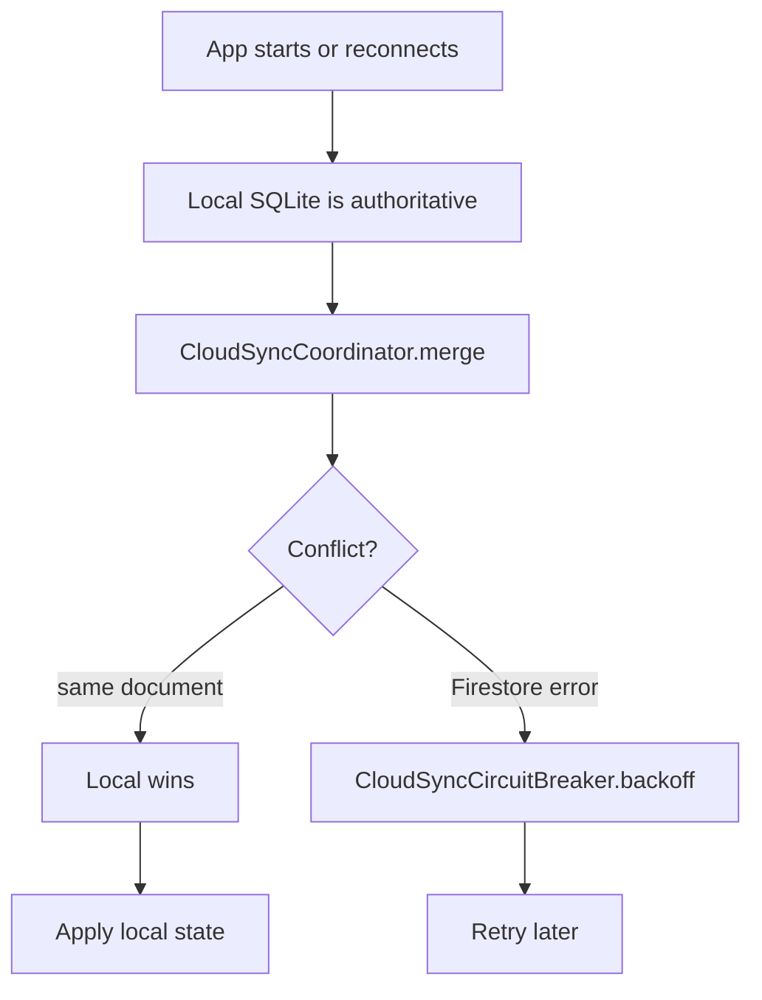

# Cloud sync

## Purpose

Optional cross-device continuity. Local SQLite is always canonical — cloud sync is replication, not the source of truth. The daemon parses agent logs directly from disk and stores everything in a local GRDB/SQLite database. Cloud sync adds cross-device continuity for users who want their usage history and quota state available on their iPhone, iPad, or secondary Mac — but it is never required.

## Directory layout

```
AgentLens/Services/
├── CloudSyncService.swift               # High-churn orchestration entry point (~231 lines)
├── CloudBudgetService.swift            # Budget state cross-device sync
└── RefreshOrchestrator.swift           # Triggers sync after usage refresh

AgentLens/Services/CloudSync/
├── CloudSyncCoordinator.swift         # Orchestrates all sync services (~15,511 bytes)
├── CloudSyncTypes.swift               # Shared types and document models
├── CloudSyncCircuitBreaker.swift      # Error backoff (~9,124 bytes)
├── CloudSyncFirestoreGateway.swift    # Firestore operations abstraction
├── CloudSyncFirestoreFakeGateway.swift # Test fake for Firestore gateway
├── SessionLogSyncService.swift        # Session log backup (opt-in) (~49,432 bytes)
├── CollaborationSyncService.swift     # Shared artifact and workspace sync
├── QuotaSnapshotSyncService.swift     # Quota state replication
├── ChatThreadSyncService.swift        # Thread metadata sync
├── UsageSyncService.swift             # Usage row sync
├── MacCloudPublisher.swift            # Mac presence publication to Firestore
├── HermesRelayHostService.swift       # Hermes relay presence management
├── CLIAgentSessionMirror.swift        # iCloud session log mirror
└── CLIAgentMissionRequestListener.swift # Mission dispatch listener

AgentLens/Services/DataStore/
└── RemoteSyncWatermarkStore.swift       # Tracks last-synced document IDs

AgentLens/Views/Settings/
└── CloudStoreSettingsView.swift         # Cloud sync opt-in UI

AgentLensTests/Active/
└── CloudSyncCoordinatorTests.swift      # Coordinator unit tests
```

## Key abstractions

### `CloudSyncService`

High-level entry point. Uploads unsynced local `TokenUsage` rows to Firestore under the authenticated user's namespace. Document IDs are deterministic (`{deviceId}_{usageId}`), so re-uploading is idempotent.

```swift
@Observable
final class CloudSyncService {
    var isSyncing = false
    var lastSyncDate: Date?
    var lastSyncError: String?
    private(set) var cloudTotalCost: Double?
}
```

### `CloudSyncCoordinator`

Orchestrates all sync services. Manages merge decisions and conflict resolution. Key responsibilities:
- Local writes take precedence over remote state for the same document
- Backs off on Firestore errors via `CloudSyncCircuitBreaker`
- Abstracts Firestore operations through `CloudSyncFirestoreGateway` for testability

### `CloudSyncCircuitBreaker`

Prevents write storms on Firestore errors. Implements exponential backoff with a cooldown window (`permissionDeniedCooldown = 10 minutes`).

### `CloudSyncContext`

Carries sync context across services:
- `dataStore`, `accountManager`, `settingsManager`
- `suppressedSyncUntil` — allows temporary suppression (e.g. during high-load refresh)

## How it works

### What syncs automatically (when signed in)

| Data | Destination | Notes |
|------|------------|-------|
| Usage rows | Firestore `users/{uid}/usage/{doc}` | `UsageSyncService.swift` |
| Usage rollups | Firestore `users/{uid}/usage_rollups/{window}` | 5 documents: today, 7d, 30d, 90d, all_time |
| Quota snapshots | Firestore `users/{uid}/quota_snapshots/{provider}_{sourceId}` | `QuotaSnapshotSyncService.swift` |
| Provider accounts | Firestore `users/{uid}/provider_accounts/{accountId}` | |
| Chat thread metadata | Firestore `users/{uid}/chat_threads/` | `ChatThreadSyncService.swift`; bodies require opt-in |
| Text expansion snippets | Firestore | `TextExpansionSyncService.swift` |
| Mac cloud presence | Firestore | `MacCloudPublisher.swift` |

### What requires explicit opt-in

| Data | Opt-in | Notes |
|------|--------|-------|
| Conversation session-log backups | Settings → Cloud → Backup & Sync | Encrypted blobs; `SessionLogSyncService.swift` |
| Chat message bodies | Settings → Cloud | Separate gate from thread metadata |
| Hosted search index | BurnBar Pro subscription | Uploads encrypted token/semantic postings |

### Firestore schema (canonical source: `functions/src/types.ts`)

```
users/{uid}/
    usage/{doc}              → UsageEventDoc
    usage_rollups/today      → UsageRollupDoc
    usage_rollups/7d         → UsageRollupDoc
    usage_rollups/30d        → UsageRollupDoc
    usage_rollups/90d        → UsageRollupDoc
    usage_rollups/all_time   → UsageRollupDoc
    quota_snapshots/{k}      → QuotaSnapshotDoc
    provider_accounts/{id}   → ProviderAccountDoc
    chat_threads/{id}        → ChatThreadDoc (metadata only by default)
    devices/{id}             → DeviceDoc
```

### Conflict resolution



1. Local SQLite is authoritative.
2. `CloudSyncCoordinator` manages merge decisions.
3. `CloudSyncCircuitBreaker` backs off on Firestore errors.
4. `CloudSyncFirestoreGateway` abstracts Firestore operations (with `CloudSyncFirestoreFakeGateway` for testing).

### iCloud

`CLIAgentSessionMirror.swift` copies session logs to iCloud Documents as a secondary backup path. Separate from Firestore sync; requires iCloud Drive to be enabled.

## Integration points

- **Usage tracking** — `UsageAggregator` calls `CloudSyncService` after persisting usage rows.
- **Budget governance** — `CloudBudgetService` syncs budget state for cross-device visibility.
- **Provider quota** — `QuotaSnapshotSyncService` replicates quota snapshots to Firestore.
- **Hermes chat** — `ChatThreadSyncService` syncs thread metadata; message bodies require opt-in.
- **Computer Use** — audit chain documents sync to Firestore; `MacCloudPublisher` publishes Mac presence.
- **Remote MCP** — hosted search index upload requires BurnBar Pro subscription and cloud sync opt-in.

## Entry points for modification

- **Add a new sync service** — create a service conforming to `CloudSyncService` pattern, register it in `CloudSyncCoordinator`.
- **Change conflict resolution** — edit `CloudSyncCoordinator.merge()` logic.
- **Modify backoff policy** — adjust `CloudSyncCircuitBreaker` constants.
- **Add a new Firestore document type** — extend `CloudSyncTypes.swift` and ensure alignment with `functions/src/types.ts`.
- **Add Android write path** — follow the `android-firestore-worker` skill; default is read-only Firestore consumption.

---

Cross-links:
- [Usage tracking](usage-tracking.md)
- [Budget governance](budget-governance.md)
- [Provider quota](provider-quota.md)
- [Hermes chat](hermes-chat.md)
- [Remote MCP](remote-mcp.md)
