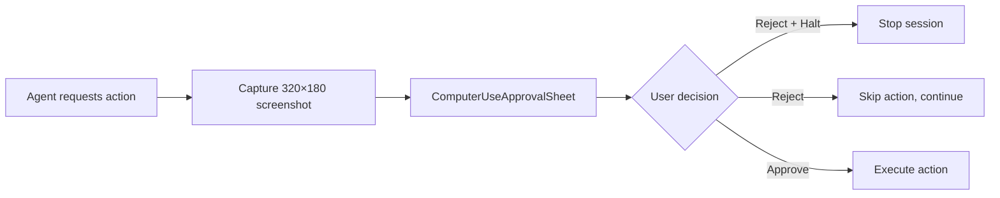
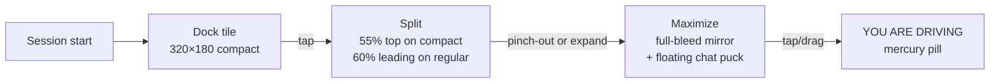

# Computer Use

## Purpose

Lets an AI agent drive your Mac (browser automation and system-level input), while an iOS or Android phone mirrors the screen and can send tap/scroll commands. Six phased capabilities, each gated by a Remote Config flag, allow incremental rollout and remote kill.

## Directory layout

```
AgentLens/Services/ComputerUse/
├── ComputerUseSessionCoordinator.swift       # Session lifecycle, action dispatch, state machine (~1765 lines)
├── ComputerUseRuntimeController.swift        # Process-scoped owner: iroh dispatcher, panic hotkey, panel model (~491 lines)
├── ComputerUsePanicHaltCoordinator.swift     # Three-path panic kill: hotkey, auth gate, Remote Config (~132 lines)
├── ComputerUseBudgetStatusStore.swift        # Real-time budget tracking for the Computer Use panel
├── ComputerUseCapabilityTokenService.swift   # In-process PDP mint for capability tokens (~101 lines)
├── ComputerUseCapabilityGate.swift           # Capability gate (cross-platform, in OpenBurnBarCore)
├── ComputerUseDaemonApprovalPresenter.swift  # Shows approval sheet with pre-action screenshot
├── ComputerUseRemoteConfigNotifications.swift # Remote Config flag observation
├── ComputerUseSessionPanelModel.swift        # Panel state for Settings → Computer Use
├── PhoneControlReceiver.swift              # Ed25519 intent verification, phone→Mac commands (~258 lines)
├── PhoneControlAuthorityValidator.swift      # Validates phone control authority attestations
├── SystemPermissionMonitor.swift             # AX + screen recording permission gating
├── SystemPermissionToolFailureWatcher.swift  # Watches for AX permission revocation mid-session
├── RemoteClipboardController.swift           # Clipboard sync for Agent Watch
├── AgentContextTargetReceiver.swift          # Agent context injection receiver
└── Mac/
    ├── MacInputDispatcher.swift              # CGEvent dispatch
    ├── MacAccessibilityTreeWalker.swift      # AX tree traversal
    ├── MacScreenshotCaptureService.swift      # Screenshot capture for approval chain
    └── MacBrowserAutomationDriver.swift      # Playwright bridge integration

AgentLens/Views/ComputerUse/
├── ComputerUseSessionPanel.swift             # Audit chain panel with mono ordinals + status glyphs
├── ComputerUseApprovalSheet.swift           # 320×180 screenshot + Reject/Halt / Reject / Approve buttons
└── ComputerUseSettingsView.swift           # Trust-mode segmented pill + scope rules library

OpenBurnBarMobile/Views/ComputerUse/
├── AgentWatchView.swift                    # Phone-side Agent Watch mirror
├── AgentWatchVideoSurface.swift            # AVSampleBufferDisplayLayer + VideoReceivePipeline
├── AgentLiveStageDockTile.swift            # Auto-open dock tile (320×180 compact)
├── AgentLiveStageChatPuck.swift            # Draggable floating composer in maximize mode
└── AgentWatchEmptyStateView.swift          # Editorial onboarding card (hero + checklist + guide)

OpenBurnBarMobile/Services/ComputerUse/
└── AgentWatchOverlaySingleton.swift        # Persistent iroh control stream across tab swaps

OpenBurnBarDaemon/Sources/OpenBurnBarRemoteAccessAgentCore/
└── RemoteAccessAgentCoordinator.swift       # Daemon-side remote access coordination

OpenBurnBarDaemon/Sources/OpenBurnBarVirtualHIDBridge/
└── VirtualHIDEventSink.swift                # Virtual HID for synthesised input events

functions/src/
├── computerUseBudget.ts                     # Hourly budget guardrail Cloud Function
├── computerUseMonitoring.ts                 # Session monitoring and telemetry
└── computerUseRemoteConfig.ts               # Remote Config kill-switch bridge

firestore-rules-tests/
└── computer-use.test.js                     # Firestore rules tests for audit chain documents
```

## Key abstractions

### `ComputerUseSessionCoordinator`

Mac-side owner for a live Computer Use session. Key types:

- `Configuration` — `userId`, `macHostNodeId`, `entitlement`, `budgetEnvelope`, `quotaUsage`, `auditBaseDirectory`, `killSwitch`, `phoneControlAttestationRequired`
- `ApprovalPresenter` — async callback that shows the approval sheet and returns `HermesRealtimeRelayApprovalResponse`
- `TrustMode` — `manual`, `step`, `trusted` (per-session, never sticky)

### `ComputerUseRuntimeController`

Process-scoped owner that:
- Installs the iroh `control.*` dispatcher on the live relay client
- Owns the panic-hotkey monitor (`⌃⌥⌘.`)
- Exposes the panel model that Settings renders
- Binds `ComputerUseBudgetStatusStore` envelope changes to the coordinator

### `ComputerUsePanicHaltCoordinator`

Three independent kill paths:

1. **Global hotkey** — `⌃⌥⌘.` monitored via `NSEvent.addGlobalMonitorForEvents`
2. **NSWorkspace auth gate** — loginwindow / SecurityAgent / screen sleep notifications
3. **Remote Config kill-switch** — `computer_use_kill_switch` evaluated by `ComputerUseRemoteConfigNotifications`

All converge on a single `panicHalt(source:)` callback.

## How it works

### Phases

| Phase | Capability | Flag | Notes |
|---|---|---|---|
| 8 | Agent Watch — Mac → phone read-only mirror | `computer_use_watch_enabled` | Reuses Mercury transport |
| 9 | Browser Computer Use — Playwright Chromium | `computer_use_browser_enabled` | Bridge script: `OpenBurnBarDaemon/Resources/PlaywrightBridge/openburnbar-playwright-bridge.js` |
| 10 | Trust modes + scope rules + audit chain | `computer_use_trust_modes_enabled` | Segmented pill in `ComputerUseSessionPanel` |
| 11 | Mac System — CGEvent + Accessibility API | `computer_use_system_enabled` | `#if !DISTRIBUTION_MAS` only |
| 12 | Phone-as-controller — Ed25519-signed intents | `computer_use_phone_control_enabled` | Downgrade-only from phone |
| 13 | Polish — trusted scopes, audit export, OpenTimestamps | `computer_use_polish_enabled` | Scope library in Settings |

### Trust modes

Per-session, never sticky across sessions. The phone-side UI can only downgrade trust (Trusted → Step → Manual). Upgrades require the Mac. This prevents a compromised or stolen phone from silently elevating a session.

### Approval flow



### Audit chain

- SHA-256 content-addressed entries.
- Tamper detection via `head.json` — any modification to a prior entry breaks the chain.
- Each entry includes: action kind, pre/post screenshot hash, trust mode at execution time, approval decision, timestamp.
- Export (Phase 13) supports OpenTimestamps anchoring.

### Budget governance

| Limit | Value |
|---|---|
| Soft cap | $1,500/mo (25 actions/run × 100 runs/day) |
| Hard cap | $2,500/mo (Remote Config kill-switch) |
| Per-user daily ceiling (normal) | $5.00 |
| Per-user daily ceiling (soft) | $2.50 |
| Per-user daily ceiling (hard) | $0.00 |

`ComputerUseBudgetStatusStore` tracks real-time spend; `evaluateComputerUseBudget` Cloud Function evaluates hourly.

### iOS Agent Live Stage



- **Dock tile**: auto-opens on `sessionId` arrival; ignorable but always present while a session is active.
- **Split**: chat tab remains reachable in the bottom half.
- **Maximize**: 56pt draggable `AgentLiveStageChatPuck` expands to a 320×420 mercury-stroked floating composer.
- **Passthrough surface**: taps < 10pt → `AgentWatchReceiver.tap(normalizedX:y:)`, drags → `scrollDrag(...)`.
- **Grace window**: 6s after session end before the dock collapses, allowing final animation frames to render.

`AgentWatchOverlaySingleton` owns the persistent iroh control stream so the live mirror survives tab swaps.

## Integration points

- **Mercury media** — Agent Watch reuses the same iroh transport and `MediaFrame` wire format with a 4-byte cursor extension.
- **Hermes chat** — `ChatSessionController.streamingTick` lets `ProjectMemoryInsightController` mirror live streaming content.
- **Budget governance** — `BudgetGate` blocks actions when daily/monthly caps are reached; `ComputerUseBudgetStatusStore` provides real-time envelope state.
- **Cloud sync** — audit chain documents sync to Firestore under `users/{uid}/computer_use_actions/{id}`.
- **Remote MCP** — trusted-scope rules can reference MCP tool capabilities for agent delegation.

## Entry points for modification

- **Add a new action kind** — extend `ComputerUseAction` in `OpenBurnBarComputerUseCore`, add execution logic in `MacInputDispatcher`, and update the approval sheet.
- **Change trust mode behaviour** — edit `ComputerUseSessionCoordinator` trust mode transitions.
- **Add a new panic path** — extend `ComputerUsePanicHaltCoordinator` with an additional monitor.
- **Modify budget thresholds** — edit `functions/src/computerUseBudget.ts` constants and `BudgetRulesStore` local overrides.
- **Add phone control gesture** — extend `PhoneControlReceiver` intent types and add mapping in `AgentWatchView`.
- **Adjust Agent Live Stage sizing** — edit `AgentLiveStageDockTile` compact/regular size classes.

---

Cross-links:
- [Mercury media](mercury-media.md)
- [Hermes chat](hermes-chat.md)
- [Budget governance](budget-governance.md)
- [Cloud sync](cloud-sync.md)
- [Remote MCP](remote-mcp.md)
