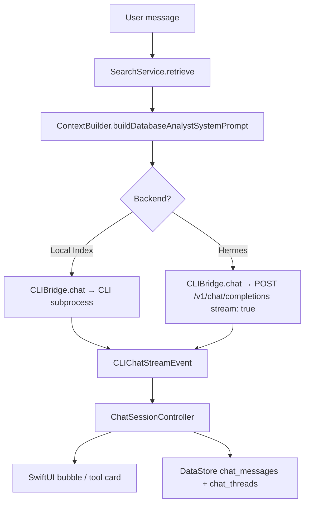

# Hermes chat

## Purpose

A chat panel for querying your OpenBurnBar usage data and interacting with AI agents. Supports two backends — a local CLI subprocess and the Hermes webapi — switched transparently at detection time. The same retrieval pipeline injects live usage context into both backends.

## Directory layout

```
AgentLens/Services/CLIBridge/
├── CLIBridge.swift                    # Backend enum, detection, Hermes probe, streaming (~644 lines)
├── CLIBridgeTypes.swift             # CLIChatStreamEvent, CLIUsageSnapshot, OpenAICompatibleAdvertisedModel
├── CLIBridgeStreamRuntimeCoordinator.swift  # Process + HTTP stream lifecycle (cancel, replace, token gate)
├── OpenAICompatibleChatGatewayClient.swift  # HTTP client for OpenAI-compatible endpoints
├── CLIProcessStreamRunner.swift       # Spawns codex/claude subprocess and parses stream-json
├── CLIArgumentBuilder.swift           # CLI argument construction
├── CLIProfileStreamFailoverRunner.swift   # Failover between profile streams
├── CLIExecutableResolver.swift        # PATH resolution for CLI binaries
└── CLIBridgeQuotaSignalRecorder.swift # Records quota signals from CLI streams

AgentLens/Services/
├── CLIAgentRelayChatExecutor.swift    # Executes chat turns via CLI subprocess
├── CLIAgentRelayChatExecutor.swift    # (also) Hermes relay coordination
├── ChatSessionController.swift        # Multi-turn session state, message persistence, streamingTick
├── HermesRealtimeRelayHostClient.swift # iroh relay client used by Hermes mode
└── OpenBurnBarOperatingComposer.swift # Operating-layer message composition

AgentLens/Views/Chat/
├── ChatPanel.swift                    # Dashboard chat panel with mode toggle
├── ChatBubbleStyle.swift              # Bubble styling (whimsy, ember, mercury gradients)
└── HermesStripView.swift              # Popover compact chat strip

OpenBurnBarMobile/Views/Chat/
└── MobileChatPanel.swift              # iOS chat panel with Local Index / Hermes toggle
```

## Key abstractions

### `CLIBridge.Backend`

```swift
enum Backend: Equatable {
    case claudeCode(path: String)
    case codex(path: String)
    case hermes(baseURL: URL)
}
```

`CLIBridge.detect()` resolves the CLI backend by probing PATH for `codex` (preferred) then `claude`. Hermes availability is probed separately via `probeHermesAvailability(baseURL:bearerToken:)`, which hits `/v1/models`. If the probe succeeds, `hermesAvailable = true` and the UI can offer Hermes mode.

### `CLIChatStreamEvent`

Parsed from Claude `stream-json` lines, Codex text deltas, and Hermes SSE chunks:

```swift
enum CLIChatStreamEvent: Hashable {
    case text(String)
    case toolUse(name: String, detail: String?)
    case toolResult(name: String, detail: String?)
    case usage(CLIUsageSnapshot)
}
```

This unified event type lets both backends feed the same UI pipeline.

### `ChatSessionController`

Owns multi-turn session state, message persistence, and streaming content. Key property for live observers:

```swift
var streamingTick: Int = 0
```

Bumped (`&+= 1`) on every assistant-message content update inside `send()`'s stream loop. Observers like `ProjectMemoryInsightController` subscribe via `.onChange(of: chatController.streamingTick)` to mirror live content without polling.

## How it works



### Context injection

Before each chat turn, the retrieval pipeline builds a system prompt augmented with live usage data:

- `SearchService.retrieve()` → relevant session chunks
- `ContextBuilder.buildDatabaseAnalystSystemPrompt()` → token usage summary, recent sessions, quota headroom
- Prepended to the messages array for both backends

### Hermes mode specifics

- **Endpoint**: `http://127.0.0.1:8642/v1/chat/completions`
- **Protocol**: OpenAI-compatible SSE streaming
- **Multi-turn**: full message history sent per request
- **Tool calls**: handled server-side by Hermes; results streamed as `.toolUse` events
- **Model advertisement**: `/v1/models` returns `OpenAICompatibleAdvertisedModel` rows grouped by `HermesModelID`

## Integration points

- **Usage tracking** — `ContextBuilder` reads `UsageStore` to inject usage context into the system prompt.
- **Insights** — follow-up questions from the Intelligence Brief route through Hermes for streaming answers.
- **Computer Use** — `AgentWatchOverlaySingleton` and `AgentLiveStagePresenter` mirror live streaming content into `HermesReadingCard` for project memory sheets.
- **Budget governance** — `BudgetGate` can block chat requests when daily/monthly caps are reached, surfacing a `BudgetBlockedCard`.
- **Cloud sync** — chat thread metadata syncs to Firestore; message bodies require opt-in.

## Entry points for modification

- **Add a new CLI backend** — extend `CLIBridge.Backend`, add detection in `CLIBridge.detect()`, and add stream parsing in `CLIProcessStreamRunner.swift`.
- **Change Hermes endpoint** — pass a different `baseURL` to `probeHermesAvailability()`.
- **Add a new tool card visualisation** — extend `ChatBubbleStyle.toolShape()` and add a renderer branch in the chat panel.
- **Modify system prompt context** — edit `ContextBuilder.buildDatabaseAnalystSystemPrompt()`.
- **Add streaming observer** — subscribe to `ChatSessionController.streamingTick` and read the latest assistant message content.

---

Cross-links:
- [Usage tracking](usage-tracking.md)
- [Insights](insights.md)
- [Computer Use](computer-use.md)
- [Budget governance](budget-governance.md)
- [Cloud sync](cloud-sync.md)
