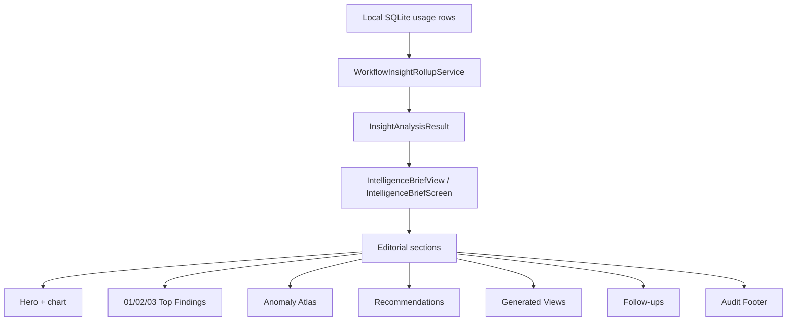

# Insights

## Purpose

Surfaces AI spend patterns, anomalies, and recommendations from recent usage data. The "Editorial Observatory" redesign (2026-05-13) replaces card-grid intelligence briefs with a single-column editorial story that reads like a curated briefing: eyebrow label, executive headline, numbered findings, anomaly atlas, recommendations, generated views, and follow-ups.

## Directory layout

```
AgentLens/Services/
├── InsightEngine.swift                # Core types + WorkflowInsightRollupService (~528 lines)
└── ContextPackService.swift           # Assembles ranked context packs for export to agents (~911 lines)

OpenBurnBarCore/Sources/OpenBurnBarCore/Views/Insights/
├── IntelligenceBriefView.swift        # Cross-platform Editorial Observatory (iOS/macOS) (~2065 lines)
└── InsightWidgetRenderer.swift        # Chart widget renderer (KPI, time-series, ranking, donut, etc.)

AgentLens/Views/Insights/
├── InsightsCanvasGrid.swift
└── InsightsWorkspaceView.swift

OpenBurnBarMobile/Views/Insights/
└── InsightsRootView.swift             # Mobile top-level Insights tab; pro-gated via cloud subscription

android/app/src/main/java/com/openburnbar/ui/insights/
├── IntelligenceBriefScreen.kt         # Android Editorial Observatory (~620 lines)
├── InsightsScreen.kt
├── InsightsScreenSections.kt
└── renderers/InsightWidgetRenderer.kt

AgentLensTests/Active/
├── InsightEngineTests.swift
├── ContextPackServiceTests.swift
└── ContextPackCrossFlowTests.swift

OpenBurnBarMobileTests/Insights/
├── IntelligenceBriefSnapshotTests.swift   # ImageRenderer screenshot suite
├── IntelligenceBriefWiringTests.swift       # 9 cases: citation tap, follow-up, pin, etc.
├── TrendInsightEngineTests.swift
└── AgentLiveStagePresenterTests.swift       # 13 cases: auto-open, grace, transitions, panic

android/app/src/androidTest/java/com/openburnbar/ui/insights/
└── IntelligenceBriefScreenTest.kt       # 14 instrumented UI tests (light/dark, TalkBack, font-scale)
```

## Key abstractions

### `InsightEngine`

**`AgentLens/Services/InsightEngine.swift`** defines the core types:

- `InsightType` — `costChange`, `newSessions`, `rankMovement`, `modelShift`, `cacheEfficiency`, `narrative`, `neutral`
- `Insight` — `id`, `type`, `icon`, `sentiment`, `headline`, `detail`, `metric`, `delta`
- `WorkflowInsightRollupSnapshot` — materialised rollup with `freshness: .fresh | .stale | .rebuilding | .unavailable`

The service only recomputes when the rollup is stale, no rebuild is in progress, and the data store has inputs.

### `ContextPackService`

Assembles ranked, capped context packs for export to AI agents. Key types:

- `ContextPack` — ordered sessions, key files, key commands, usage summary
- `ContextPackSession` — individual session with inclusion reason and rank score
- `ContextPackAssemblyParams` — anchor project, date range, max sessions, character budget

Emits sentinel strings like `"No indexed conversations are available yet."` when a section has no evidence. `NumberedSectionRow.isSentinelBody` renders `EmptyEvidenceCallout` instead of a misleading body paragraph.

### `InsightWidgetRenderer`

Renders chart widgets embedded in the brief. Chart-bearing widget types:

KPI, time-series, ranking, donut, treemap, heatmap, scatter, sankey, radar, cohort, funnel, quota-pulse, forecast, focus-matrix.

The first chart widget is promoted into the hero section above the fold.

## How it works



### Editorial Observatory UI

Both platforms share the same editorial layout pattern:

| Section | Description |
|---|---|
| **Eyebrow** | `INTELLIGENCE BRIEF` label + window subtitle (`Last 7 days`) |
| **Hero** | 22pt rounded-semibold executive summary + mercury hairline with one-shot shimmer + first chart widget |
| **Numbered findings** | Mono ordinals `01` / `02` / `03`, 3pt severity-bar leading edge, confidence dots, footnote citation chips |
| **Anomaly atlas** | Horizontal scroll of anomaly cards with z-score numerals |
| **Recommendations** | Severity-aware action rows with impact arrow (↘ green for savings, ↗ ember for cost increase) |
| **Follow-ups** | Inline citation chips; tapping composes a deterministic follow-up prompt via `IntelligenceBriefCitationPrompt` |
| **Audit footer** | Mercury hairline + mono meta (model, run id) |

### Benchmark-aware rules

The rule engine compares observed model spend and task mix against `modelBenchmarks` data (Artificial Analysis, Design Arena). It can flag model-fit mismatches, surface cheaper alternatives with similar benchmark scores, and add advisory guardrails. Benchmark citations appear as first-class footnote chips.

## Integration points

- **Usage tracking** — reads `UsageStore` SQLite tables as input.
- **Hermes chat** — follow-up taps route through `IntelligenceBriefCitationPrompt` to compose natural-language prompts streamed via Hermes.
- **Budget governance** — recommendations may reference `BudgetGate` status for quota-pressure advisories.
- **Cloud sync** — `InsightsStore` can attach Hermes as an Insights gateway when reachable.
- **Computer Use** — `AgentLiveStagePresenter` mirrors live streaming content into `HermesReadingCard` for project memory insight sheets.

## Entry points for modification

- **Add a new insight type** — extend `InsightType` in `InsightEngine.swift`, then add rendering logic in `IntelligenceBriefView.swift` / `IntelligenceBriefScreen.kt`.
- **Change editorial voice** — tweak `ContextPackService` assembly and `IntelligenceBriefView` headline formatting.
- **Add a new chart widget** — extend `InsightWidgetKind` and add a renderer branch in `InsightWidgetRenderer.swift` / `InsightWidgetRenderer.kt`.
- **Update anomaly thresholds** — modify the z-score bands in `InsightEngine` rule evaluation.
- **Fix layout on mobile** — adjust `InsightsRootView` (iOS) or `IntelligenceBriefScreen` (Android); both have snapshot tests.

---

Cross-links:
- [Usage tracking](usage-tracking.md)
- [Hermes chat](hermes-chat.md)
- [Budget governance](budget-governance.md)
- [Computer Use](computer-use.md)
