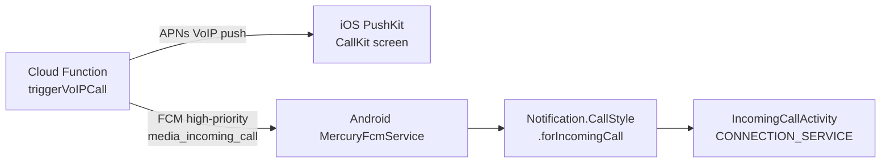

# Mercury media

## Purpose

P2P file transfer, screen sharing, and 1:1 voice/video calls between Mac and iOS/Android. Rides the iroh transport with Ed25519 peer authentication — no relay server required for LAN peers.

## Directory layout

```
AgentLens/Services/Media/
├── MercuryRouter.swift                 # Central routing for all media sessions (~1982 lines)
├── MediaSessionCoordinator.swift       # Session lifecycle and peer handshake
├── MacFileTransferService.swift        # Mac-side blob publish/fetch (~28 KB)
├── MacMediaCapabilityGate.swift      # Permission gating (camera, mic, screen capture)
├── AudioEncoder.swift                  # Opus encoding pipeline
├── AudioDecoder.swift                  # Opus decode pipeline
├── VideoEncoder.swift                  # H.264/HEVC encoding pipeline
├── VideoDecoder.swift                  # Video decode pipeline
├── ScreenCapturePipeline.swift         # SCStream-based screen capture
├── MicrophoneCapturePipeline.swift     # AVAudioEngine mic capture
├── AppleRemoteDesktopRFBClient.swift   # RFB viewer for Agent Watch mirror
├── VoIPCallTrigger.swift             # Triggers Cloud Function for incoming call fan-out
├── MediaPartnerSavePreferenceStore.swift  # Per-peer save preferences (iOS)
├── AttachmentSaver.swift             # iOS attachment save logic
└── MercuryAudioDatagramChannel.swift   # Audio datagrams over iroh ALPN

OpenBurnBarMobile/Services/Media/
├── MediaPartnerSavePreferenceStore.swift  # Per-peer save preferences (iOS mobile)
├── AttachmentSaver.swift             # Mobile attachment save
└── MercuryPeerSource.swift           # Polls Mac presence from Firestore + media heartbeats

OpenBurnBarMobile/Views/Media/
├── IncomingCallSheet.swift           # System call UI sheet
├── PerPartnerSavePreferencesView.swift  # UI for per-peer save policy
└── MercuryPeerGridView.swift         # Hermes Square "My Mac" tile

crates/openburnbar-iroh/
├── Cargo.toml                        # Rust iroh crate (UniFFI bindings for iOS + Android)
├── src/
│   ├── lib.rs
│   ├── datagrams.rs                  # MercuryAudioDatagramChannel UniFFI surface
│   └── relay.rs                    # HermesRealtimeRelayFrame wire format

Vendor/
├── openburnbar-iroh.aar              # Pre-built Android AAR (4 ABIs via cargo-ndk)
└── openburnbar-iroh.xcframework      # iOS/macOS framework

android/openburnbar-iroh-relay/
└── src/main/java/com/openburnbar/irohrelay/
    ├── MercuryAudioDatagramChannel.kt  # Android audio datagram channel (UniFFI/JNI)
    └── HermesRealtimeRelayFrame.kt     # Wire format mirror

android/app/src/main/java/com/openburnbar/data/media/
├── MediaPartnerSavePreferenceStore.kt  # Android per-peer save preferences (DataStore Proto)
├── AttachmentSaver.kt                  # Android attachment save logic
├── CallSessionCoordinator.kt           # Android call session lifecycle
└── MediaSettingsView.kt                # Android media settings UI
```

## Key abstractions

### `MercuryRouter`

Mac-side brain for Mercury user-facing entry points. Owns:
- Inbound `media.mirror.request` triage — cooldown gating, consent fast-path, ringing phase
- Inbound `media.presence.heartbeat` forwarding to `MercuryPeerSource`
- Acceptance — admits the viewer and emits `media.mirror.ack` immediately
- Cooldown — after decline or stop, holds for a configurable window

States: `idle → ringing → callRinging → starting → streaming → cooldown`

### `MediaPartnerSavePreferenceStore`

Persisted per peer `NodeId`, survives app restarts. Three policies:

| Policy | iOS | Android |
|---|---|---|
| `SAVE_TO_PHOTOS` | Photos library | `MediaStore.Images/Video/Audio` (scoped storage API 29+) |
| `SAVE_TO_FILES` | Files.app | SAF tree URI picked once, `DocumentsContract.createDocument` thereafter |
| Forget | Clears preference | Clears preference |

Privacy nuke: `forgetAll()` clears all partner preferences at once.

### `MercuryAudioDatagramChannel`

Audio rides a dedicated datagram channel over ALPN `openburnbar/mercury/audio/1`:
- Encode: `MicrophoneCapturePipeline` → `AudioEncoder` (Opus, ~20ms frames) → iroh datagrams
- Decode: iroh datagrams → `AudioDecoder` → `AVAudioEngine` render

## How it works

### Transport layer

- **Protocol**: iroh (Rust), wrapped in `OpenBurnBarIroh.xcframework` (iOS/macOS) and `Vendor/openburnbar-iroh.aar` (Android).
- **ALPN identifiers**:
  - `openburnbar/1` — general relay and control frames
  - `openburnbar/mercury/audio/1` — audio datagram channel
- **Authentication**: Ed25519 key pair per device. Pairing exchanges public keys; subsequent connections verify against the stored peer key.

### Wire format

Base `MediaFrame` header is 18 bytes. Agent Watch (Computer Use Phase 8) extends it with 4 bytes for cursor metadata:

```
[18-byte MediaFrame header][optional 4 bytes: i16 cursorX, i16 cursorY]
```

Flag bit `0x08` (`hasCursorMetadata`) signals the trailing 4 bytes are present. Old peers ignore trailing bytes when the flag is absent, so the codec is backward-compatible.

Previously used flags: `0x01` (keyframe), `0x02` (audio), `0x04` (muted).

### Incoming calls



**iOS**: PushKit VoIP push activates CallKit directly. The system call UI appears even when the app is not running.

**Android**: FCM data message triggers `MercuryFcmService`, which builds `Notification.CallStyle.forIncomingCall(...)` with `setFullScreenIntent(...)`. The activity is declared `showOnLockScreen=true` + `turnScreenOn=true` so a locked device wakes the screen. On Android 14+, if `USE_FULL_SCREEN_INTENT` is revoked the service falls back to a heads-up notification plus a one-time settings deep link. Audio uses the system ringer (no bespoke ring sound). Foreground service type is `microphone|camera|mediaProjection|phoneCall`.

### File transfer

- iroh blob protocol: `publish_blob` (sender) / `fetch_blob` (receiver).
- Chat UI renders a mercury-stroked attachment bubble (`ChatBubbleStyle.toolShape`) for each in-progress or completed transfer.
- iOS: `MacFileTransferService.swift` manages the Mac-side publish pipeline.
- Android: matching store-and-forward logic mirrors the Mac implementation.

## Integration points

- **Computer Use** — Agent Watch reuses the same iroh transport, `MediaFrame` wire format, and `AgentWatchVideoCoordinator` video pipeline.
- **Hermes chat** — attachment bubbles in chat use `ChatBubbleStyle.toolShape` with mercury gradient strokes.
- **Cloud sync** — `MacCloudPublisher.swift` publishes Mac presence to Firestore so the phone knows when the Mac is online.
- **Budget governance** — `functions/src/mediaBudget.ts` applies bandwidth cost enforcement analogous to Computer Use budget.

## Entry points for modification

- **Add a new media type** — extend `MercuryRouter` triage, add an ALPN identifier, and add encode/decode pipelines.
- **Change save policy behaviour** — edit `MediaPartnerSavePreferenceStore` (iOS) or `MediaPartnerSavePreferenceStore.kt` (Android).
- **Modify wire format** — update `MediaFrame` flags in `crates/openburnbar-iroh/src/lib.rs` and both platform bindings.
- **Add per-peer UI** — extend `PerPartnerSavePreferencesView` (iOS) or `MediaSettingsView.kt` (Android).
- **Adjust call routing** — modify `VoIPCallTrigger.swift` or the `triggerVoIPCall` Cloud Function.

---

Cross-links:
- [Computer Use](computer-use.md)
- [Hermes chat](hermes-chat.md)
- [Cloud sync](cloud-sync.md)
- [Budget governance](budget-governance.md)
