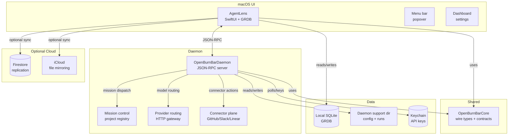

# Architecture

OpenBurnBar is daemon-first and local-first. The macOS app (`AgentLens/`) is a SwiftUI shell over a local JSON-RPC daemon (`OpenBurnBarDaemon/`), with shared types in `OpenBurnBarCore/`. Local SQLite (via GRDB) is the canonical data store; Firestore and iCloud are optional replication planes.

## Component diagram

## Key boundaries

| Boundary | Owner | What lives there |
|----------|-------|----------------|
| Local SQLite | macOS app | usage history, conversations, retrieval projections, shared-artifact cache |
| Daemon support dir | Daemon | provider config, run journal, controller events, connector config |
| Keychain | Device | routed provider API keys, Telegram token, connector credentials |
| Firestore | Optional cloud | replication/collaboration for opted-in data |
| iCloud | Optional cloud | file mirroring for opted-in session copies |

## Data flow

1. **Log ingestion** — parsers in `AgentLens/Services/LogParser/` read agent session files from disk and write token usage rows into local SQLite.
2. **Aggregation** — `UsageAggregator.swift` coordinates parsers and stores results. The daemon polls provider APIs for quota data.
3. **Retrieval** — a projection pipeline builds `search_chunks_fts`, `search_documents`, and optional vector indexes from local SQLite content.
4. **Consumption** — the dashboard, Hermes chat, and Insights engine read from local SQLite (and optional Firestore).
5. **Sync** — `CloudSyncService` merges local vs remote state using optimistic concurrency with Firestore.

## Cross-platform parity

| Surface | Stack | Key shared contract |
|---------|-------|---------------------|
| macOS app | SwiftUI + GRDB | `OpenBurnBarCore` Swift package |
| iOS companion | SwiftUI + GRDB | same core + `AgentWatch` / `Mercury` |
| Android companion | Kotlin/Jetpack Compose | `functions/src/types.ts` canonical schema |
| VS Code extension | TypeScript | JSON-RPC to daemon |
| iroh transport | Rust (UniFFI) | same crate compiled to XCFramework + AAR |

## Related pages

- [macOS app](../apps/macos-app/index.md) — AgentLens deep dive
- [Daemon](../systems/daemon/index.md) — OpenBurnBarDaemon deep dive
- [iOS app](../apps/ios-app/index.md) — mobile companion
- [Android app](../apps/android-app.md) — Android companion
- [Local database](../systems/local-database/index.md) — SQLite schema and GRDB patterns
- [Iroh transport](../systems/iroh-transport.md) — P2P Rust transport
