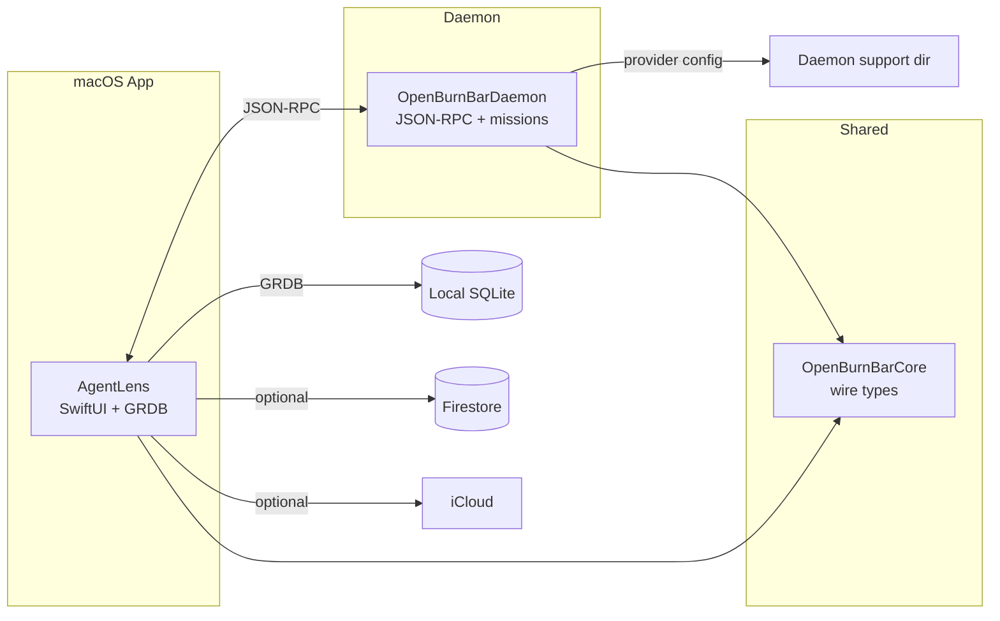

# OpenBurnBar overview

OpenBurnBar is a native macOS menu bar app that tracks token usage and cost across AI coding agents in real time. If you run Claude Code, Factory Droid, Codex, Cursor, Kimi, Goose, Grok, or any of a dozen other agents in parallel, OpenBurnBar reads the local session logs those agents leave behind and gives you a live view of tokens burned and dollars spent — without touching your API keys.

The product is **daemon-first** and **local-first**: local SQLite plus daemon-owned files are the canonical authority. Firestore and iCloud are optional replication planes, not the source of truth.

## What it does

- **Menu bar presence** — no Dock icon, no windows stealing focus. One click for instant cost visibility.
- **17+ log parsers** — reads session logs from Claude Code, Factory Droid, Codex, Cursor, Kimi, Goose, Grok Build, Hermes, Gemini CLI, Warp, Windsurf, Forge, Augment, Antigravity/Z.ai, Cline, and more.
- **Token and cost tracking** — today, this week, this month. Per-provider and per-model breakdowns.
- **Smart Insights** — the InsightEngine surfaces spend patterns, cache efficiency, model trends, and anomalies as editorial cards.
- **Hermes chat** — ask questions about your usage data. Backed by a local CLI bridge or the Hermes web API on `localhost:8642`.
- **Computer Use** — the agent can drive your Mac (browser + system CGEvent + AX) while an iOS/Android companion mirrors the screen in real time with tap-to-drive.
- **Mercury media** — P2P file transfer, screen sharing, and 1:1 voice calls over iroh (Ed25519-authenticated).
- **Mission control** — daemon-backed project registry, task scheduling, question/followup workflows, and mission dispatch.
- **Budget governance** — per-user daily ceilings, soft/hard monthly caps, Remote Config kill-switches.
- **Optional cloud sync** — Firestore for cross-device usage continuity; iCloud for session log copies.

## Platforms

| Platform | Target | Notes |
|----------|--------|-------|
| macOS | macOS 14+ | Menu bar + popover + settings window (Mac App Store + direct DMG) |
| iOS / iPadOS | iOS 17+ | Companion for Computer Use mirror, Mercury calls, notifications |
| Android | API 29+ | Full parity companion (Kotlin/Compose, iroh transport, Mercury media) |
| VS Code / Cursor | Extension | Daemon health, projected run state, workspace trust gating |

## Architecture summary

The macOS app (`AgentLens/`) is a SwiftUI shell that owns the UI, local SQLite database via GRDB, and log parsers. The daemon (`OpenBurnBarDaemon/`) runs as a background JSON-RPC service that handles provider routing, mission control, quota polling, and the HTTP gateway. `OpenBurnBarCore/` holds the shared types and RPC contracts that keep the two in sync.

## Quick links

- [Architecture](architecture.md) — full system diagram and component boundaries
- [Getting started](getting-started.md) — prerequisites, build, and run instructions
- [Glossary](glossary.md) — project-specific terms
- [macOS app](../apps/macos-app/index.md) — AgentLens deep dive
- [Daemon](../systems/daemon/index.md) — OpenBurnBarDaemon deep dive
- [AGENTS.md](https://github.com/Imagine-That-Ai/BurnBar/blob/main/AGENTS.md) — completion bar and AI agent expectations
