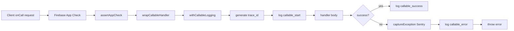

# Cloud functions

Firebase Cloud Functions v2 (TypeScript, Node.js 18) backing optional cloud features: provider account linking, quota refresh, budget governance, VoIP push, agent notifications, Hermes/Pi pairing, encrypted hosted search, and more.

---

## Purpose

Cloud functions provide the server-side complement to OpenBurnBar's local-first architecture. They handle operations that require a trusted server, cross-device coordination, or integration with third-party APIs, while leaving the hot-path data authority on the device.

Key responsibilities:
- Provider account linking and credential vaulting (OAuth, API keys)
- Quota refresh and rollup computation
- Budget governance and kill-switches (Computer Use, Media)
- VoIP call signaling (APNs + FCM fan-out)
- Agent notification routing
- Hermes / Pi device pairing and relay directory
- Encrypted hosted search index commits
- App Store / Google Play entitlement reconciliation

---

## Directory layout

```text
functions/src/
  index.ts                         # Deployment entry point — re-exports all callable, scheduled, trigger, and scheduled functions
  adminRuntime.ts                  # Firebase Admin SDK initialization
  logging.ts                       # Structured JSON logging with PII scrubbing, trace correlation, and `onCallProduction` wrapper
  sentry.ts                        # Sentry initialization, `captureException`, `setSentryUser`, `withSentry`
  resilience.ts                    # Circuit breakers, retry, timeout — built on `cockatiel`
  resilienceHelpers.ts             # Convenience wrappers: `stripeWithResilience`, `pushWithResilience`, `firestoreWithResilience`, `resilientFetch`
  guards.ts                        # Input validation guards (`stringField`, `numberField`, `assertAppCheck`, etc.)
  types.ts                         # Legacy canonical Firestore schema (in migration to TypeSpec)
  types/generated/                 # TypeSpec-emit generated contracts

  callables/
    providerAccounts.ts            # connect, refresh, delete provider accounts and credentials
    hermes.ts                      # create/complete/list/revoke Hermes pairing
    hermesGateway.ts               # BurnBar Hermes gateway: device grants, event enqueue
    piAgent.ts                     # Pi agent pairing mirror
    voipPush.ts                    # `triggerVoIPCall` — APNs + FCM fan-out
    agentNotifications.ts          # `submitAgentNotificationReply`
    stripe.ts                      # Checkout + portal sessions, Google Play verification, webhook
    encryptedSearch.ts             # Encrypted blob upload, index commit, hosted search query
    remoteMcp.ts                   # Remote MCP grant / revoke / search
    computerUseSecurity.ts         # Escrow device bind, approve, revoke
    cliLink.ts                     # CLI link start / poll / complete
    deviceLinks.ts                 # Adopt / revoke / backfill provider account device links
    googlePlayTokenClaims.ts       # Google Play token claim validation
    googlePlayBillingPaths.ts      # Google Play billing path resolution
    publicRateLimit.ts             # Public rate-limit callable
    mediaSku.ts                    # Media grandfathering + purchase validation
    misc.ts                        # `rebuildUsageRollups`, `seedAndroidDemoAccount`

  providers/
    httpClient.ts                  # `providerFetch` — all outbound provider HTTP must use this
    openai.ts, minimax.ts, mimo.ts, factory.ts, zai.ts, xai.ts, kimi.ts, cursor.ts

  appstore/                        # App Store Server API v2 — entitlement binding, verification, reconciliation

  # Scheduled / trigger modules
  scheduled.ts, scheduledExports.ts, scheduledOps.ts
  triggers.ts, health.ts, config.ts, auth.ts
  quota.ts, rollups.ts, tierCogs.ts
  computerUseBudget.ts, computerUseQuota.ts, computerUseMonitoring.ts, computerUseRemoteConfig.ts, computerUseOpenTimestamps.ts
  mediaBudget.ts, mediaQuota.ts, mediaMonitoring.ts, mediaRemoteConfig.ts
  irohMonitoring.ts, insightAnalysis.ts, insightsHostedAnswer.ts
  modelLandscape.ts, cloudSearchCore.ts, cloudFeatureSuspensions.ts
  cloudProAllowance.ts, cloudProAllowanceCore.ts, cloudProAllowanceRemoteConfig.ts
  accountDeletion.ts, remoteMcpGrant.ts, remoteMcpOAuth.ts, piAgent.ts, apnsSender.ts, fcmAndroidSender.ts
  agentNotifications.ts, hostedRunnerConfig.ts, firebaseRuntime.ts
```

---

## Key abstractions

| Abstraction | File | Role |
|---|---|---|
| `onCallProduction` | `logging.ts` | Production callable factory: v2 `onCall` + structured logs + Sentry capture + App Check enforcement. Preferred for new exports. |
| `wrapCallableHandler` | `logging.ts` | Wraps a callable handler with `callable_start`, `callable_success`, `callable_error` logs and automatic Sentry exception capture. |
| `withCallableLogging` | `logging.ts` | Core wrapper: generates `trace_id`, logs start/success/error, and calls `captureException` on failure. |
| `resilience.ts` policies | `resilience.ts` | Circuit breakers + retry + timeout for Stripe, push, Firestore, external APIs, and quota refresh. Built on `cockatiel`. |
| `providerFetch` | `providers/httpClient.ts` | All outbound provider HTTP calls must route through `resilientFetch`. CI enforces no raw `await fetch` in `functions/src`. |
| `assertAppCheck` | `guards.ts` / `auth.ts` | Every callable enforces Firebase App Check attestation before processing the request body. |
| PII scrubbing | `logging.ts` | Emails → `[email]`, IPs → `[ip]`, UIDs truncated to 8 chars, API keys → `[REDACTED]`, strings > 1024 chars truncated. |

---

## How it works

### Callable lifecycle



Every callable follows this path. The `onCallProduction` factory wires it automatically:

```typescript
export const myCallable = onCallProduction(
  "myCallable",
  { region: "us-central1", enforceAppCheck: true },
  async (request) => { /* handler */ }
);
```

### Resilience policies

| Policy | Retries | Circuit breaker | Timeout | Use for |
|---|---|---|---|---|
| `stripePolicy` | 3 | 5 failures → 30s open | 15s | Stripe API |
| `pushPolicy` | 2 | 10 failures → 60s open | 10s | APNs / FCM |
| `firestorePolicy` | 5 | 15 failures → 15s open | 10s | Firestore reads/writes |
| `externalApiPolicy` | 3 | 8 failures → 45s open | 20s | OpenTimestamps, webhooks |
| `quotaPolicy` | 2 | 5 failures → 2 min open | 30s | Provider quota refresh |

All policies use exponential backoff (250 ms initial, 30 s cap) with jitter.

### Sentry integration

`sentry.ts` initializes Sentry on cold start if `SENTRY_DSN` is set. `withCallableLogging` automatically calls `captureException` on any thrown error. `setSentryUser` hashes the Firebase UID to the first 8 characters before attaching it to the scope. Rate-limit errors (429 / `RESOURCE_EXHAUSTED`) are filtered out in `beforeSend`.

### Key functions

| Function | File | Purpose |
|---|---|---|
| `evaluateComputerUseBudget` | `computerUseBudget.ts` | Runs hourly. Projects month-end vision-model spend from daily rollups. Writes public envelope (`ops/computer_use_budget_status/state/current`) and operator metrics. Syncs Remote Config kill-switch at hard cap ($2,500/mo). |
| `triggerVoIPCall` | `callables/voipPush.ts` | Callable. Fan-outs a Mercury incoming call: iOS gets APNs VoIP push (PushKit) via `sendVoIPOutbound`; Android gets a high-priority FCM data message (`media_incoming_call`) via `sendFcmOutbound`. Requires active media entitlement. |
| `createHermesPairing` / `completeHermesPairing` | `callables/hermes.ts` | Two-phase Ed25519 pairing. Initiator creates a pairing code; target completes it by exchanging public keys. Keys are stored in Firestore `hermes_pairings/{pairingId}`. |
| `connectProviderAccount` | `callables/providerAccounts.ts` | Links a provider account (OpenAI, Anthropic, etc.) to the user's BurnBar identity. Stores credentials in Secret Manager, not Firestore. |
| `beginEncryptedSessionBlobUpload` / `commitEncryptedSearchIndexBatch` | `callables/encryptedSearch.ts` | BurnBar Pro hosted search: encrypts session bodies to Firebase Storage, writes sealed index rows (no plaintext) via callable. |

---

## Integration points

| Client surface | How it calls functions |
|---|---|
| macOS app (`AgentLens`) | Firebase SDK `functions.httpsCallable(...)` for provider linking, pairing, quota refresh. |
| iOS / Android app | Same Firebase callable SDK. Android additionally receives FCM messages from `fcmAndroidSender.ts`. |
| VS Code / Cursor extension | Calls `burnBarHermesGateway` and `enqueueHermesGatewayEvent` for relay-link status and CLI agent actions. |
| Stripe / Apple / Google Play | Webhooks hit `stripeBurnBarProWebhook` and `appStoreServerNotificationsV2` for subscription reconciliation. |
| Scheduled jobs | `scheduled.ts` and `scheduledExports.ts` run background quota refresh, rollup triggers, and tier COG computation. |

---

## Entry points for modification

| Task | Where to start |
|---|---|
| Add a new callable | Create a handler in `functions/src/callables/`. Export it from `functions/src/index.ts`. Use `onCallProduction` for the wrapper. Add a test in `functions/src/__tests__/*.test.ts`. |
| Change resilience tuning | `functions/src/resilience.ts` — adjust breaker thresholds, retry counts, or timeout values. |
| Add a new provider HTTP client | `functions/src/providers/httpClient.ts` — call through `providerFetch`. Run `scripts/ci/verify-resilience-wiring.sh` to ensure no raw `fetch`. |
| Update Firestore schema | `functions/src/types.ts` (legacy) or `tools/schema-sync/` (new TypeSpec path). Run `tools/schema-sync/check-drift.sh` before deploy. |
| Change Computer Use budget levels | `functions/src/computerUseBudget.ts` — adjust `SOFT_CAP_USD`, `HARD_CAP_USD`, or the envelope rules. Update `docs/runbooks/computer-use-budget.md`. |
| Debug a callable failure | Check Cloud Logging for JSON lines with `trace_id`. The same `trace_id` appears in Sentry if the error was captured. |

---

## Related pages

- [Hermes relay](../hermes-relay.md) — relay connection lifecycle; pairing callables are the signaling layer before iroh P2P takes over
- [Iroh transport](../iroh-transport.md) — the actual media and control path after `triggerVoIPCall` or `createHermesPairing` completes
- [Local database](../local-database/index.md) — local-first SQLite is the authority; cloud functions are replication and coordination
