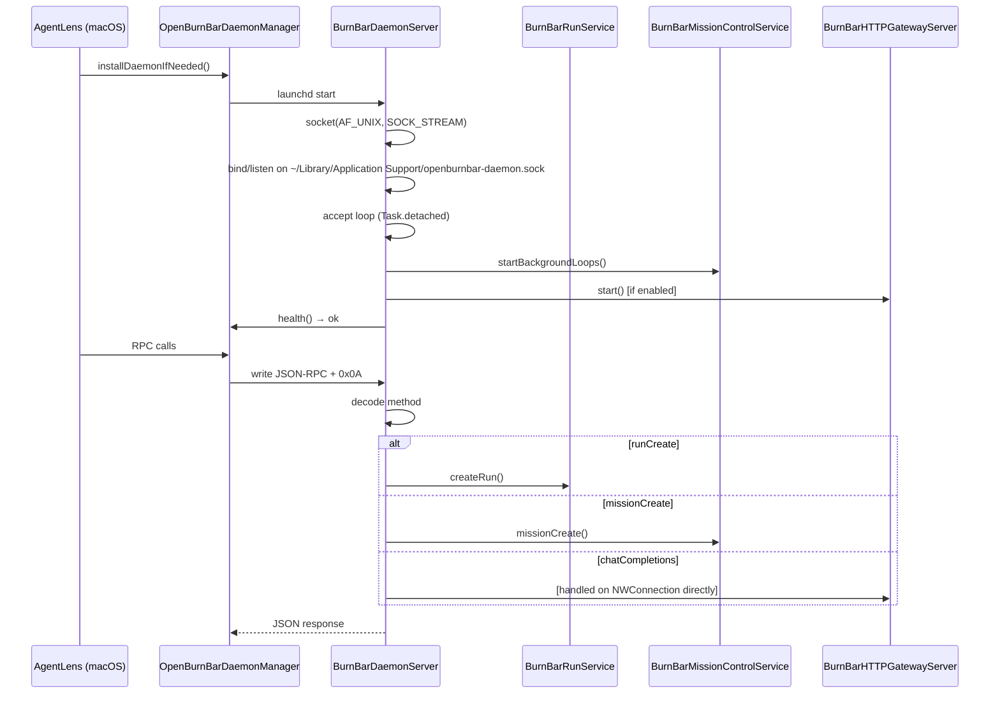
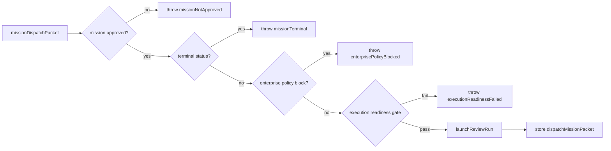

# Daemon

The local JSON-RPC server that runs in the background. Owns provider routing, mission control, quota polling, the HTTP gateway, and the connector plane.

---

## Purpose

`OpenBurnBarDaemon/` is a SwiftPM package that builds a local JSON-RPC server (`OpenBurnBarDaemonExecutable`) plus a companion CLI (`OpenBurnBarCLI`). The daemon is the authoritative runtime for:

- **Provider routing** — scoring and selecting AI provider routes (OpenAI-compatible, Anthropic, Ollama, Factory Droid, etc.)
- **HTTP gateway** — an OpenAI-compatible `/v1/chat/completions` endpoint on `localhost:8317`
- **Mission control** — project registry, scheduled reviews, questions, followups, missions, and simulation
- **Connector plane** — outbound integrations to GitHub, Slack, Linear, PostHog, Sentry, and Gmail
- **Browser plane** — Playwright-based Computer Use browser automation
- **Run service** — daemon-managed AI execution with approval gating and tool dispatch

The macOS app (`AgentLens/Services/OpenBurnBarDaemon/OpenBurnBarDaemonManager.swift`) coordinates the daemon lifecycle: installing the binary, rotating socket auth tokens, health polling, and proxying all RPC calls.

---

## Directory layout

```
OpenBurnBarDaemon/
├── Package.swift                          # SwiftPM manifest (macOS 14+)
├── Sources/
│   ├── OpenBurnBarDaemonExecutable/       # @main entry point for the daemon process
│   │   └── OpenBurnBarDaemonMain.swift
│   ├── OpenBurnBarCLI/                    # @main entry point for the CLI executable
│   │   └── OpenBurnBarCLIMain.swift
│   ├── OpenBurnBarDaemon/                 # Core daemon library (actor-isolated)
│   │   ├── OpenBurnBarDaemonServer.swift   # JSON-RPC accept loop + method dispatch
│   │   ├── OpenBurnBarHTTPGatewayServer.swift # NWListener-based HTTP gateway
│   │   ├── OpenBurnBarProviderRouter.swift # Five-dimensional route scoring
│   │   ├── OpenBurnBarRunService.swift     # AI run lifecycle + tool dispatch
│   │   ├── OpenBurnBarConnectorPlaneService.swift # Connector config + health checks
│   │   ├── OpenBurnBarBrowserToolService.swift # Playwright / fetch / system browser
│   │   ├── OpenBurnBarMissionControlService.swift # Protocol facade (deprecated; see MissionControl/)
│   │   ├── MissionControl/                 # Mission control subsystem
│   │   │   ├── MissionControlService.swift
│   │   │   ├── MissionControlStore.swift
│   │   │   ├── MissionControlProjectionReducer.swift
│   │   │   ├── MissionControlTransport.swift
│   │   │   ├── MissionControlSummaryEnricher.swift
│   │   │   ├── MissionControlPerformanceGuardrails.swift
│   │   │   ├── BurnBarParallelDAGScheduler.swift
│   │   │   └── Bridges/
│   │   │       ├── LocalNotificationBridge.swift
│   │   │       ├── TelegramBotBridge.swift
│   │   │       └── EventKitBridge.swift
│   │   ├── ComputerUse/                   # Browser + system automation
│   │   │   ├── ComputerUseService.swift
│   │   │   ├── ComputerUseRunCoordinator.swift
│   │   │   ├── OpenBurnBarPlaywrightLifecycle.swift
│   │   │   └── OpenBurnBarPlaywrightDriver.swift
│   │   ├── RPC/                           # Per-category RPC handlers
│   │   │   ├── BurnBarDaemonServer+RPCLifecycle.swift
│   │   │   ├── BurnBarDaemonServer+RPCConfig.swift
│   │   │   ├── BurnBarDaemonServer+RPCRunWorkspaceApproval.swift
│   │   │   ├── BurnBarDaemonServer+RPCMissionControl.swift
│   │   │   ├── BurnBarDaemonServer+RPCComputerUse.swift
│   │   │   ├── BurnBarDaemonServer+RPCEncoding.swift
│   │   │   └── ...
│   │   └── ...
│   └── OpenBurnBarRemoteAccessAgentCore/   # Privileged input / Computer Use Phase 11+
│       └── ...
└── Tests/OpenBurnBarDaemonTests/           # XCTest suite (~60 test files)
```

---

## Key abstractions

### `BurnBarDaemonServer`

The top-level actor in `OpenBurnBarDaemon/Sources/OpenBurnBarDaemon/OpenBurnBarDaemonServer.swift`. Creates a Unix domain socket (`SOCK_STREAM`), accepts one JSON-RPC request per connection, and dispatches to per-category handlers. Supports optional socket auth tokens and per-PID rate limiting.

### `BurnBarHTTPGatewayServer`

An actor in `OpenBurnBarDaemon/Sources/OpenBurnBarDaemon/OpenBurnBarHTTPGatewayServer.swift` built on `Network.framework` (`NWListener`). Exposes:

- `GET /health`
- `GET /metrics`
- `GET /v1/models` (advertised + full catalog)
- `POST /v1/chat/completions` (OpenAI-compatible, streaming + buffered)
- `POST /v1/responses`
- `POST /v1/messages` (Anthropic Messages API)

Requests are resolved to a canonical model ID, scored by the provider router, and proxied upstream with verbatim SSE passthrough when formats match.

### `BurnBarProviderRouter`

A `Sendable` struct in `OpenBurnBarDaemon/Sources/OpenBurnBarDaemon/OpenBurnBarProviderRouter.swift` that scores routes across five dimensions:

| Dimension | Weight | Source |
|-----------|--------|--------|
| Capability | 0.20 | Provider features |
| Cost | 0.25 | Model pricing per 1M tokens |
| Latency | 0.15 | Historical round-trip |
| Trust | 0.25 | Credential slot health |
| Policy fit | 0.15 | Preferred provider/slot alignment |

Supports three router modes: `providerFamilyFailover`, `sameModelFailover`, and `intelligentModelRouter`. Routing decisions are persisted to a JSONL audit log.

### `BurnBarConnectorPlaneService`

An actor in `OpenBurnBarDaemon/Sources/OpenBurnBarDaemon/OpenBurnBarConnectorPlaneService.swift` that manages six outbound connectors:

- **GitHub** — `api.github.com`, Bearer token
- **Slack** — `slack.com/api`, Bearer token
- **Linear** — `api.linear.app/graphql`, Bearer token
- **PostHog** — `app.posthog.com/api`, Bearer token
- **Sentry** — `sentry.io/api/0`, Bearer token
- **Gmail** — `gmail.googleapis.com`, OAuth access token

Every base URL is validated for SSRF defense (HTTPS-only, no private/reserved IPs, no cloud metadata endpoints) before persistence.

### `BurnBarBrowserToolService`

An actor in `OpenBurnBarDaemon/Sources/OpenBurnBarDaemon/OpenBurnBarBrowserToolService.swift` supporting three engines:

1. **Daemon Fetcher** (`URLSession`) — `fetchDocument`, `extractLinks`
2. **System Browser** (`/usr/bin/open`) — `openExternal`
3. **Playwright** — interactive actions (`click`, `fill`, `goto`, `screenshot`, etc.)

The Playwright bridge script lives at `OpenBurnBarDaemon/Resources/PlaywrightBridge/openburnbar-playwright-bridge.js`.

### `BurnBarMissionControlService`

An actor in `OpenBurnBarDaemon/Sources/OpenBurnBarDaemon/MissionControl/MissionControlService.swift` (protocol alias in `OpenBurnBarMissionControlService.swift`). Provides:

- Project registry (`controllerProjectUpsert`, `controllerProjectsList`)
- Scheduled reviews with automatic launch
- Question / followup CRUD and notification delivery
- Mission creation, approval, dispatch, and result recording
- Simulator run recording and replay
- Auto-takeover when a mission packet fails

### `BurnBarCLI` / `BurnBarCLIRunner`

The CLI surface in `OpenBurnBarDaemon/Sources/OpenBurnBarDaemon/OpenBurnBarCLI.swift`. Commands include:

- `health` — daemon version and protocol
- `controller` / `status` — project summary
- `questions`, `followups`, `missions`
- `mission-approve <id>`
- `simulator-runs`, `simulator-replay <id>`
- `resume <sessionId>` — run resume with harness/model selection
- `exec <codex|claude|...>` — shell shim forwarding
- `claude-meter-experiment`, `claude-handoff`
- `audit-verify`, `remote-unlock-certification`

The CLI connects over the same Unix socket as the macOS app via `BurnBarCLISocketClient`.

---

## How it works

### Startup and RPC lifecycle



### Provider routing flow

```mermaid
flowchart LR
    A[Client request<br/>model = "claude-opus-4"] --> B[Gateway / RPC]
    B --> C[ProviderRouter.scoreAndRankRoutes]
    C --> D[ConfigStore.resolvedConfigurations]
    D --> E[Candidate routes<br/>per provider + slot]
    E --> F[Scorecard:<br/>capability, cost,<br/>latency, trust,<br/>policyFit]
    F --> G[Ranked routes]
    G --> H[Select winner]
    H --> I[Proxy upstream<br/>or return route]
    I --> J[Record decision<br/>to JSONL audit log]
```

### Mission dispatch with approval gating



---

## Integration points

| Consumer | Integration | File |
|----------|-------------|------|
| macOS app | Unix socket RPC | `AgentLens/Services/OpenBurnBarDaemon/OpenBurnBarDaemonManager.swift` |
| macOS app | HTTP gateway (OpenAI-compatible) | `AgentLens/Services/CLIBridge/OpenAICompatibleChatGatewayClient.swift` |
| VS Code extension | HTTP gateway + daemon health | `extensions/openburnbar/src/daemonHealth.ts` |
| iOS/Android | Firestore (read-only) + iroh | `functions/src/types.ts` |
| Cloud Functions | Firestore rules, callable functions | `functions/src/logging.ts` |
| CI / shell | `openburnbar-cli` via Unix socket | `OpenBurnBarDaemon/Sources/OpenBurnBarCLI/OpenBurnBarCLIMain.swift` |

---

## Entry points for modification

| Change | Where to start |
|--------|----------------|
| Add a new RPC method | `OpenBurnBarDaemon/Sources/OpenBurnBarDaemon/RPC/BurnBarDaemonServer+RPC*.swift` + `OpenBurnBarDaemon/Sources/OpenBurnBarDaemon/OpenBurnBarDaemonServer.swift` `responseData(for:)` switch |
| Add a new provider | `OpenBurnBarDaemon/Sources/OpenBurnBarDaemon/OpenBurnBarProviderRouter.swift` + `OpenBurnBarCore/Sources/OpenBurnBarCore/BurnBarCatalog.swift` |
| Add a new connector | `OpenBurnBarDaemon/Sources/OpenBurnBarDaemon/OpenBurnBarConnectorPlaneService.swift` `BurnBarConnectorKind` + `makeRequest` |
| Add a new browser engine | `OpenBurnBarDaemon/Sources/OpenBurnBarDaemon/OpenBurnBarBrowserToolService.swift` `BurnBarBrowserEngineKind` |
| Change mission control logic | `OpenBurnBarDaemon/Sources/OpenBurnBarDaemon/MissionControl/MissionControlService.swift` |
| Change simulator behavior | `OpenBurnBarDaemon/Sources/OpenBurnBarDaemon/MissionControl/MissionControlStore.swift` `recordSimulatorRun` / `replaySimulator` |
| Add CLI command | `OpenBurnBarDaemon/Sources/OpenBurnBarDaemon/OpenBurnBarCLI.swift` `BurnBarCLIRunner.run(arguments:)` switch |
| Change gateway endpoint | `OpenBurnBarDaemon/Sources/OpenBurnBarDaemon/OpenBurnBarHTTPGatewayServer.swift` `routeRequest` switch |

---

## Related pages

- [Mission control](mission-control.md) — deeper dive into project registry, missions, and simulation
- [macOS app](../../apps/macos-app/index.md) — `OpenBurnBarDaemonManager` and UI integration
- [Local database](../local-database/index.md) — SQLite schema and GRDB projections
- [Iroh transport](../iroh-transport.md) — P2P transport used by Computer Use and Mercury
