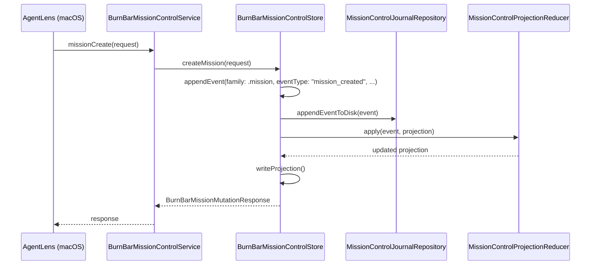
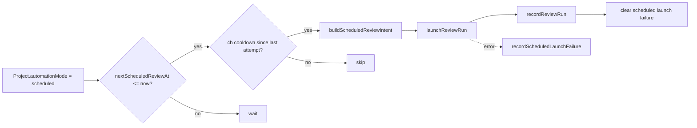
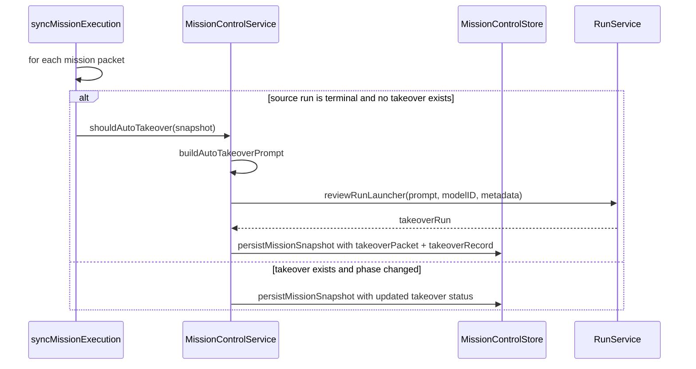
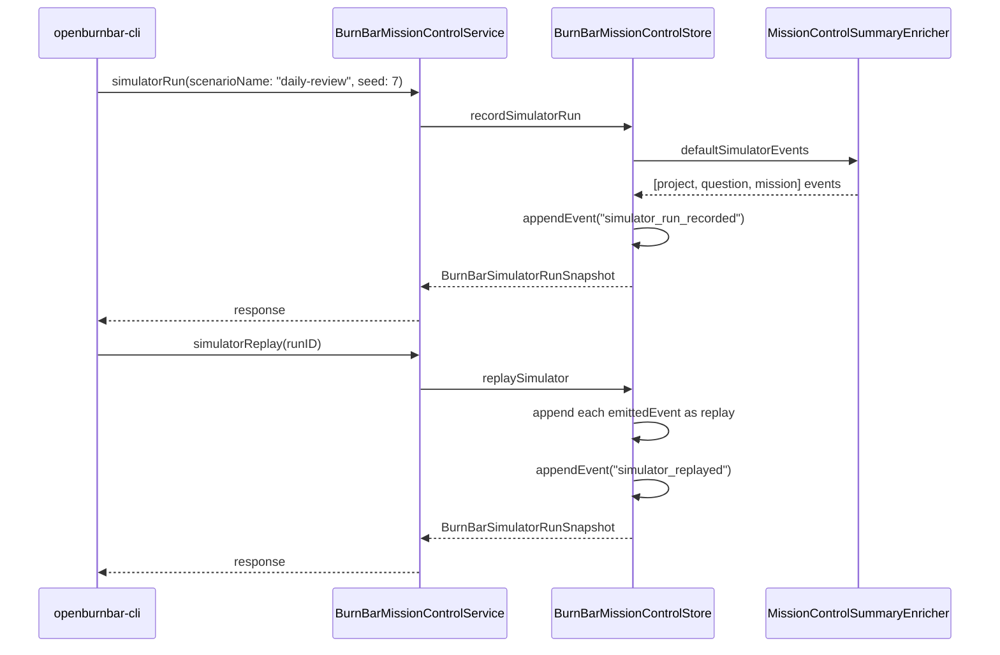

# Mission control

Daemon-backed project registry, scheduled reviews, question/followup workflows, mission dispatch, and deterministic simulation.

---

## Purpose

Mission Control is a subsystem inside `OpenBurnBarDaemon` that gives the macOS app a structured way to manage AI-assisted work. It is event-sourced: every mutation appends a record to a JSONL journal, then a projection reducer rebuilds an in-memory state file. This makes the history replayable and auditable.

The subsystem is experimental. The core OpenBurnBar value proposition remains token-usage tracking; Mission Control is a secondary surface that should only be expanded when user demand justifies the operational burden.

---

## Directory layout

```
OpenBurnBarDaemon/Sources/OpenBurnBarDaemon/MissionControl/
├── MissionControlService.swift           # Top-level actor: orchestration loops + business rules
├── MissionControlStore.swift             # Event-sourced store: JSONL journal + projection persistence
├── MissionControlProjectionReducer.swift # Applies events to rebuild projection state
├── MissionControlProjectionFile.swift    # Codable snapshot of all entities
├── MissionControlSummaryEnricher.swift   # Builds controller summaries from projection
├── MissionControlJournalRepository.swift # Disk I/O for journal and projection files
├── MissionControlTransport.swift         # Notification delivery abstraction
├── MissionControlNotificationEvaluator.swift # Decides when a followup is due
├── MissionControlError.swift            # Typed errors
├── MissionControlPerformanceGuardrails.swift # Cycle-duration and mission-count limits
├── BurnBarParallelDAGScheduler.swift     # Parallel mission execution scheduling
├── MissionControlMissionStateMerger.swift # Merges mission state from multiple sources
└── Bridges/
    ├── LocalNotificationBridge.swift      # macOS UserNotifications
    ├── TelegramBotBridge.swift            # Telegram Bot API delivery
    └── EventKitBridge.swift               # Calendar event creation
```

---

## Key abstractions

### `BurnBarMissionControlService`

The actor in `MissionControl/MissionControlService.swift` that implements `BurnBarMissionControlServing`. It owns:

- **Background notification loop** — `runNotificationLoop()` wakes every 60 seconds to ingest activity, launch scheduled reviews, sync mission execution, evaluate due followups, and poll Telegram commands.
- **Execution readiness gating** — `missionDispatchPacket` checks approval status, terminal-state safety, enterprise policy blocks, and an `executionReadinessGate` before launching any run.
- **Auto-takeover** — `synchronizeAutoTakeover` detects failed mission packets and automatically launches a recovery run via the `reviewRunLauncher` closure.
- **Performance guardrails** — rejects transport cycles that exceed configured mission-count or duration ceilings.

### `BurnBarMissionControlStore`

The actor in `MissionControl/MissionControlStore.swift` that is the single source of truth for all Mission Control entities. It:

- Appends every mutation to a JSONL event journal (`controller-events.jsonl`).
- Rebuilds a `BurnBarMissionControlProjectionFile` via `MissionControlProjectionReducer`.
- Persists the projection to disk for fast startup.
- Supports `injectMissionsForTieBreakTesting` for deterministic unit tests.

Key entities in the projection:

| Entity | Key type | Collection |
|--------|----------|------------|
| Project | `projectSlug: String` | `projects` |
| Question | `BurnBarQuestionID` | `questions` |
| Followup | `BurnBarFollowupID` | `followups` |
| Mission | `BurnBarMissionID` | `missions` |
| Review run | `String` | `reviewRuns` |
| Simulator run | `BurnBarSimulatorRunID` | `simulatorRuns` |

### `BurnBarMissionControlProjectionReducer`

A pure function in `MissionControl/MissionControlProjectionReducer.swift` that takes a `BurnBarControllerEvent` and updates the projection. Event families:

- `.controller` — project upserts, review run records
- `.question` — question created, answered
- `.followup` — followup created, done, snoozed, calendar scheduled
- `.mission` — mission created, approved, cancelled, packet dispatched, result recorded
- `.simulator` — simulator run recorded, replayed

### `MissionControlSummaryEnricher`

Builds operator-facing summaries from the raw projection. Computes:

- `freshnessState` — fresh (< 12 h), aging (< 48 h), stale, missing, provisional
- `nextScheduledReviewAt` — based on `preferredCadence`, `scheduleHourLocal`, and `scheduleWeekdayLocal`
- `status` — healthy, needsAttention, stale, onboarding, paused
- `nextActions` — ordered list of recommended operator actions

Also generates `defaultSimulatorEvents` for deterministic simulation runs.

### Notification bridges

| Bridge | File | Transport |
|--------|------|-----------|
| Local | `Bridges/LocalNotificationBridge.swift` | `UNUserNotificationCenter` |
| Telegram | `Bridges/TelegramBotBridge.swift` | Bot API POST |
| Calendar | `Bridges/EventKitBridge.swift` | `EKEventStore` |

---

## How it works

### Event-sourced write path



### Scheduled review lifecycle



### Mission dispatch with approval and policy gating

```mermaid
flowchart LR
    A[missionDispatchPacket] --> B{mission.approved?}
    B -->|no| C[throw missionNotApproved]
    B -->|yes| D{terminal status?}
    D -->|yes| E[throw missionTerminal]
    D -->|no| F{enterprise policy block?}
    F -->|yes| G[throw enterprisePolicyBlocked]
    F -->|no| H{execution readiness gate}
    H -->|fail| I[throw executionReadinessFailed]
    H -->|pass| J[reviewRunLauncher(prompt, modelID, metadata)]
    J --> K[store.dispatchMissionPacket]
```

### Auto-takeover flow



### Simulator and replay



---

## Integration points

| Consumer | Integration | File |
|----------|-------------|------|
| macOS app | Unix socket RPC → `BurnBarMissionControlServing` | `AgentLens/Services/OpenBurnBarDaemon/OpenBurnBarDaemonManager+Controller.swift` |
| macOS app | Controller runtime snapshot | `AgentLens/Services/OpenBurnBarOperating/OpenBurnBarOperatingComposer.swift` |
| Daemon server | RPC dispatch to Mission Control methods | `OpenBurnBarDaemon/Sources/OpenBurnBarDaemon/RPC/BurnBarDaemonServer+RPCMissionControl.swift` |
| Run service | `reviewRunLauncher` closure injects runs | `OpenBurnBarDaemon/Sources/OpenBurnBarDaemon/OpenBurnBarRunService.swift` |
| CLI | `controller`, `questions`, `followups`, `missions`, `mission-approve`, `simulator-runs`, `simulator-replay` | `OpenBurnBarDaemon/Sources/OpenBurnBarDaemon/OpenBurnBarCLI.swift` |
| Telegram | Bot API for notification delivery | `OpenBurnBarDaemon/Sources/OpenBurnBarDaemon/MissionControl/Bridges/TelegramBotBridge.swift` |
| Calendar | EventKit for followup calendar entries | `OpenBurnBarDaemon/Sources/OpenBurnBarDaemon/MissionControl/Bridges/EventKitBridge.swift` |

---

## Entry points for modification

| Change | Where to start |
|--------|----------------|
| Add a new mission status or packet type | `MissionControl/MissionControlStore.swift` `appendEvent` + `MissionControlProjectionReducer.swift` |
| Change scheduled review cadence logic | `MissionControl/MissionControlService.swift` `launchDueScheduledReviews` + `buildScheduledReviewIntent` |
| Change project health heuristics | `MissionControl/MissionControlSummaryEnricher.swift` `freshnessState`, `makeSummary` |
| Change auto-takeover rules | `MissionControl/MissionControlService.swift` `synchronizeAutoTakeover` + `shouldAutoTakeover` |
| Add a new notification bridge | `MissionControl/Bridges/` + `MissionControlTransport.swift` |
| Change simulator scenarios | `MissionControl/MissionControlSummaryEnricher.swift` `defaultSimulatorEvents` |
| Add enterprise policy rules | `MissionControl/MissionControlService.swift` `evaluateEnterprisePolicyBlock` |
| Change performance guardrails | `MissionControl/MissionControlPerformanceGuardrails.swift` |
| Add CLI mission subcommand | `OpenBurnBarDaemon/Sources/OpenBurnBarDaemon/OpenBurnBarCLI.swift` `BurnBarCLIRunner` |

---

## Related pages

- [Daemon overview](index.md) — JSON-RPC server, provider routing, HTTP gateway, connector plane
- [macOS app](../../apps/macos-app/index.md) — `OpenBurnBarDaemonManager` and UI integration
