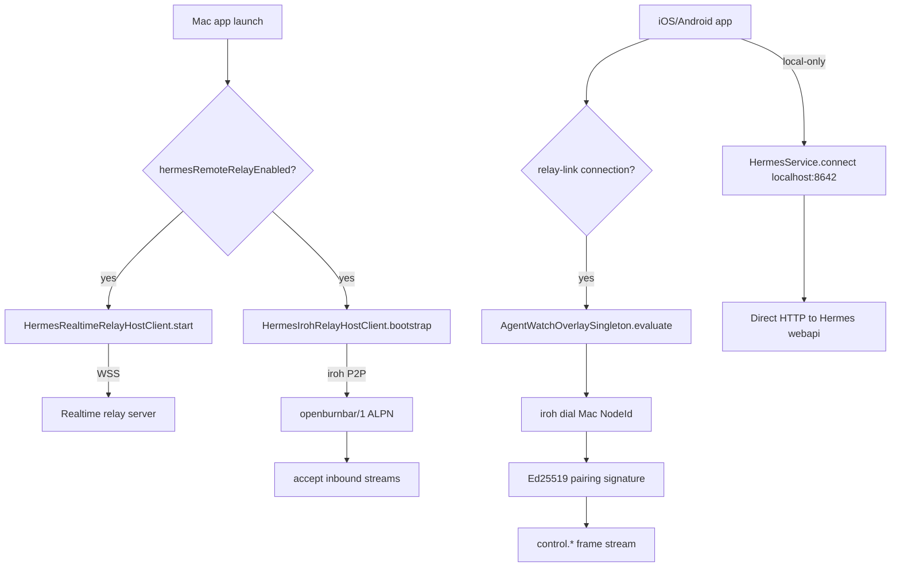

# Hermes relay

Real-time relay for Hermes chat, Mercury media, and Computer Use Agent Watch. Coordinates iroh P2P transport, WebSocket fallback, media session state, and cross-platform relay connection lifecycle.

---

## Purpose

Hermes is the agent-chat and media-relay layer that lets a Mac host stream its screen, audio, and agent actions to paired iOS/Android devices in real time. The relay sits on top of the iroh transport and provides:

- **Chat relay** — SSE streaming of Hermes chat completions and CLI agent chat through a WebSocket or iroh relay link
- **Media session state** — screen share, file transfer, 1:1 call signaling, and audio datagram routing
- **Agent Watch** — live Mac screen mirror with tap-to-drive, approval sheets, and panic halt
- **Cross-platform pairing** — Ed25519-authenticated device pairing via Cloud Functions, resolved into an iroh P2P stream

---

## Directory layout

```text
AgentLens/Services/HermesRealtimeRelayHostClient.swift   # macOS WebSocket relay host client (~24KB)
AgentLens/Services/IrohRelay/
  HermesIrohRelayHostClient.swift                        # macOS iroh relay host client
  IrohRelayRequestHandler.swift                          # Incoming relay frame handler (~53KB)
  HermesRelayHostFanout.swift                            # Fan-out relay frames to multiple devices
  IrohRelayKeyStore.swift                                # Persistent relay key storage
  IrohPairingKeyStore.swift                              # Per-pairing key storage
  IrohPairingPublicKeyPublisher.swift                    # Publishes local public key to Firestore
  FirestoreIrohPairingDirectory.swift                    # Reads/writes pairing records
  IrohTransportAuditLogger.swift                       # Appends transport events to audit chain

OpenBurnBarMobile/Services/ComputerUse/
  AgentWatchOverlaySingleton.swift                       # iOS app-scoped persistent control stream owner
  AgentWatchOverlayCoordinator.swift                     # iroh dialer + frame consumer
  AgentWatchVideoCoordinator.swift                       # Video decode/display layer
  ScreenSharePiPController.swift                        # System PiP bridge

android/app/src/main/java/com/openburnbar/data/hermes/
  HermesService.kt                                       # Android Hermes service (chat, relay, runtime)
  HermesServiceConnectionActions.kt                      # Connection select/add/revoke/refresh
  HermesServiceMessageActions.kt                         # Send, stream, tool dispatch
  HermesServiceThreadActions.kt                          # Thread create/load/clear
  HermesServiceMessageLaunch.kt                          # Message launch / retry
  HermesServiceRelayActions.kt                           # Relay payload streaming for CLI agent

android/app/src/main/java/com/openburnbar/services/media/
  MercuryFcmService.kt                                   # High-priority FCM listener for incoming calls
  IncomingCallActivity.kt                                # Full-screen call accept/decline
  CallKitFacade.kt                                       # Self-managed ConnectionService wrapper

OpenBurnBarCore/Sources/OpenBurnBarCore/SharedModels/
  HermesRealtimeRelayTypes.swift                         # Canonical frame type definitions (~99KB)
```

---

## Key abstractions

| Abstraction | File | Role |
|---|---|---|
| `HermesRealtimeRelayHostClient` | `AgentLens/Services/HermesRealtimeRelayHostClient.swift` | macOS WebSocket relay host. Connects to the Hermes realtime relay over WSS, registers host capabilities, and forwards encrypted requests (chat completions, CLI agent chat, model catalog, session actions) to the local Hermes gateway or CLI bridge. |
| `HermesIrohRelayHostClient` | `AgentLens/Services/IrohRelay/HermesIrohRelayHostClient.swift` | macOS iroh relay host. Manages the iroh endpoint lifecycle, frame dispatch queue, and reconnect backoff. Accepts inbound P2P streams from paired phones. |
| `HermesService` (Android) | `android/app/.../HermesService.kt` | Android-facing Hermes service. Owns chat state (`messages`, `isStreaming`), runtime state (`availableModels`, `runtimeInfo`), relay state (`connections`, `selectedConnection`, `relayCapability`), and delegates to internal action classes for threads, messages, connections, and relay payloads. |
| `AgentWatchOverlaySingleton` | `OpenBurnBarMobile/Services/ComputerUse/AgentWatchOverlaySingleton.swift` | iOS app-scoped owner of the persistent Computer Use control stream. Survives tab swaps. Dials the Mac relay, signs phone authority, publishes the public key, and consumes `control.*` frames. Exposes `AgentWatchState` so `AgentLiveStage`, `AgentWatchScreen`, and the live activity all bind to the same model. |
| `MercuryFcmService` (Android) | `android/app/.../services/media/MercuryFcmService.kt` | High-priority FCM listener for Mercury incoming calls. Constructs a `NotificationCompat.CallStyle.forIncomingCall` notification with accept/decline actions. Avoids `USE_FULL_SCREEN_INTENT` to stay within Play policy while still surfacing a first-party call UX. |
| `HermesRealtimeRelayFrame` | `OpenBurnBarCore/.../HermesRealtimeRelayTypes.swift` | Canonical JSON envelope for all relay frames. Types include: `hostRegister`, `hostReady`, `requestStart`, `requestCancel`, `responseChunk`, `responseComplete`, `responseError`, `ping`, `pong`, plus Mercury media (`mediaCallInvite`, `mediaCallAck`, `mediaStreamFrame`, `mediaMirrorRequest`, `mediaMirrorAck`, `mediaMirrorStop`, `mediaPresenceHeartbeat`) and Computer Use control (`controlApprovalRequest`, `controlApprovalResponse`, `controlInputIntent`, `controlAgentGrantRequest`, `controlClipboardRequest`, `controlSystemPermissionRequest`, `remoteUnlockSession`, etc.). |

---

## How it works

### Relay connection lifecycle



**Mac side**

1. `HermesRealtimeRelayHostClient` opens a WSS connection to the hosted relay (or a self-hosted one) and sends a `hostRegister` frame with capabilities (`chat_completions`, `cli_agent_chat`, `remote_relay`).
2. `HermesIrohRelayHostClient` bootstraps the iroh endpoint with the local Ed25519 secret key and listens on `openburnbar/1`.
3. Both paths are active simultaneously. The phone chooses the best available path (iroh P2P preferred, relay fallback).

**Phone side (iOS)**

1. `AgentWatchOverlaySingleton.evaluate(authUID:hermesService:)` watches auth identity and the selected Hermes relay-link connection.
2. When both are available, it fetches the Mac pairing public key and calls `coordinator.start(uid:connectionID:relayPublicKey:)`.
3. The coordinator dials the Mac via iroh, verifies the Ed25519 signature on every `control.*` frame, and updates `AgentWatchState` (session ID, current frame, action timeline, pending approval, trust mode).
4. The singleton survives tab swaps. `AgentLiveStage` and `AgentWatchScreen` are passive viewers of the same state.

**Phone side (Android)**

1. `HermesService` manages connections via `HermesServiceConnectionActions`. Connections can be `LOCAL` (localhost:8642), `LAN`, or `REMOTE_RELAY`.
2. `suggestedRelayConnection` picks the freshest online relay-link Mac from `relayConnections`.
3. `connectToSuggestedRelay(refresh:)` selects the relay and probes the runtime.
4. For media calls, `MercuryFcmService` receives a high-priority FCM data message with `type: media_incoming_call` and surfaces a `CallStyle` notification.

### Frame dispatch

All frames travel as `HermesRealtimeRelayFrame` JSON with a big-endian u32 length prefix:

```
[u32 length][HermesRealtimeRelayFrame JSON]
```

The frame carries:
- `type` — frame kind
- `uid` — Firebase Auth UID
- `connectionId` — relay connection identifier
- `requestId` — optional request correlation ID
- `payload` — operation-specific body (ciphertext for encrypted relay paths)

For encrypted relay paths (WebSocket), the payload is sealed with a symmetric key wrapped by the recipient's Ed25519 public key. For iroh P2P, the QUIC connection itself provides transport security; the Ed25519 signature on each frame provides authentication and non-repudiation for the audit chain.

### Media session state

Mercury media sessions are coordinated through a shared state machine across Mac and phone:

| State | Trigger | Action |
|---|---|---|
| `idle` | User taps "Ask to Mirror" or "Call Mac" | Mac opens `mediaMirrorRequest` or `mediaCallInvite` |
| `dialing` | Phone receives invite | Phone shows incoming call notification / Agent Watch empty state |
| `live` | Mac accepts / phone answers | Screen share video frames flow over iroh; audio over `openburnbar/mercury/audio/1` datagrams |
| `halted` | Panic kill (⌃⌥⌘., three-finger long-press, or Remote Config kill-switch) | Stream torn down, audit head written |

---

## Integration points

| Consumer | How it uses the relay |
|---|---|
| `ChatSessionController` (macOS) | Sends user messages to `HermesRealtimeRelayHostClient` for SSE streaming chat completions. |
| `AgentWatchOverlayCoordinator` (iOS) | Consumes `control.*` frames from the iroh stream and routes tap/drag input back to the Mac via `PhoneControlSender`. |
| `AgentLiveStagePresenter` (iOS) | Observes `AgentWatchOverlaySingleton.state` to render the live mirror dock tile, split view, or maximize mode. |
| `HermesService` (Android) | Manages chat threads, messages, runtime probes, and relay connections. Dispatches local tool calls and streams CLI agent chat payloads. |
| `MercuryFcmService` (Android) | Receives FCM call invitations from `triggerVoIPCall` Cloud Function and surfaces native call notifications. |
| `ComputerUseSessionCoordinator` (macOS) | Publishes Mac System Computer Use actions to the relay for phone-side approval and audit logging. |
| `IrohTransportAuditLogger` (macOS) | Appends every relay transport event to the Computer Use audit chain for tamper detection. |

---

## Entry points for modification

| Task | Where to start |
|---|---|
| Add a new frame type | `OpenBurnBarCore/Sources/OpenBurnBarCore/SharedModels/HermesRealtimeRelayTypes.swift` — add the enum case and payload struct. Update `IrohRelayRequestHandler.swift` to handle it. |
| Change relay encryption | `HermesRelayCrypto.swift` (macOS) and `HermesRelayKeyStore.kt` (Android) — the wrapped-key + AES-GCM scheme. Keep Ed25519 for key exchange. |
| Change connection selection logic | iOS: `HermesService.selectedConnection` logic in `HermesServiceConnectionActions.swift`. Android: `HermesServiceConnectionActions.kt` — `suggestedRelayConnection` comparator. |
| Add Android media notification polish | `MercuryFcmService.kt` — customize `NotificationCompat.Builder` actions, icons, or full-screen intent behavior. |
| Change Agent Watch lifecycle | `AgentWatchOverlaySingleton.swift` — `evaluate(authUID:hermesService:)`, `stop()`, and the `dialTask` cancellation logic. |
| Update iroh relay host retry behavior | `HermesIrohRelayHostClient.swift` — reconnect backoff, max attempts, and timeout tuning. |

---

## Related pages

- [Iroh transport](../iroh-transport.md) — underlying P2P QUIC transport, ALPN channels, and UniFFI bindings
- [Cloud functions](../cloud-functions.md) — `createHermesPairing`, `completeHermesPairing`, and `triggerVoIPCall` provide the signaling layer before iroh P2P takes over
- [Computer Use](../../features/computer-use.md) — Agent Watch, approval sheets, and audit chain ride the Hermes relay
- [Mercury Media](../../features/mercury-media.md) — screen share, file transfer, and 1:1 calls are Mercury media surfaces on top of the relay
