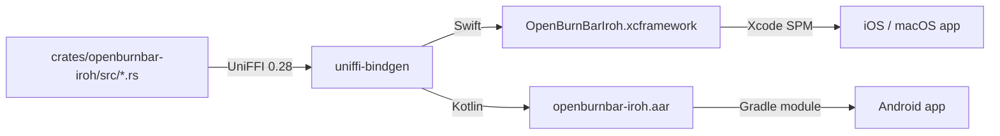

# Iroh transport

Ed25519-authenticated P2P QUIC transport for Mercury media (file transfer, screen share, 1:1 calls) and Agent Watch (live Mac screen mirror to iOS/Android). The transport is implemented as a Rust crate with UniFFI bindings, consumed as an XCFramework on Apple platforms and an AAR on Android.

---

## Purpose

OpenBurnBar needs a low-latency, NAT-traversing transport for:

- **Mercury media** — screen share video frames, audio datagrams, file transfer blobs, and 1:1 call signaling between a Mac and paired iOS/Android devices
- **Agent Watch** — live Mac screen mirror + tap-to-drive control stream from Mac to phone
- **Computer Use** — signed control frames (approval, clipboard, system permission, panic halt) between phone and Mac

The transport is peer-to-peer over QUIC via the iroh networking stack. It does not require a static IP, open ports, or a central relay server (though a hosted relay can be pinned in production).

---

## Directory layout

```text
crates/openburnbar-iroh/
  Cargo.toml                         # iroh = "=1.0.0-rc.0", iroh-blobs = "0.101.0", uniffi = "0.28"
  src/
    lib.rs                           # Endpoint, stream, secret-key, ALPN constants
    datagrams.rs                     # MercuryAudioDatagramChannel — datagram-only audio path
    blobs.rs                         # Content-addressed blob transfer (publish_blob / fetch_blob)
    android_context.rs               # Android-specific JNI context plumbing
  build.rs                           # UniFFI scaffolding

Vendor/
  OpenBurnBarIroh.xcframework        # iOS / macOS binary + Swift bindings
  openburnbar-iroh.aar               # Android binary + Kotlin bindings

scripts/
  build-iroh-android-aar.sh          # cargo-ndk + uniffi-bindgen-kotlin + AAR packaging
  build-iroh-ios-xcframework.sh    # Xcode / SPM build for Apple platforms

AgentLens/Services/IrohRelay/
  HermesIrohRelayHostClient.swift    # Mac-side relay host client (~24KB)
  IrohRelayRequestHandler.swift      # Incoming relay frame handler (~53KB)
  IrohRelayKeyStore.swift            # Persistent relay key storage
  IrohPairingKeyStore.swift          # Per-pairing key storage
  IrohPairingPublicKeyPublisher.swift # Publishes local public key to Firestore
  FirestoreIrohPairingDirectory.swift # Reads/writes pairing records in Firestore
  IrohTransportAuditLogger.swift     # Appends transport events to the audit chain

OpenBurnBarCore/Sources/OpenBurnBarIrohRelay/
  # Transport-agnostic relay protocol, pairing, loopback transport

android/openburnbar-iroh-relay/
  src/main/java/com/openburnbar/irohrelay/
    OpenBurnBarIrohFfiBridge.kt      # Reflection-bridged Kotlin → UniFFI bindings
    MercuryAudioDatagramChannel.kt   # Android audio datagram channel
    HermesIrohRelayTransport.kt    # Kotlin 1:1 port of Swift OpenBurnBarIrohRelay
```

---

## Key abstractions

| Abstraction | File / Location | Role |
|---|---|---|
| `IrohEndpointHandle` | `crates/openburnbar-iroh/src/lib.rs` | Wraps `iroh::Endpoint`. Exposes `bootstrap(secret, relay_url)`, `connect(...)`, `accept_one(...)`, `shutdown()`. |
| `IrohStream` | `crates/openburnbar-iroh/src/lib.rs` | Bidirectional QUIC stream surfaced as an opaque UniFFI handle. `send_frame(frame)` writes a big-endian u32 length prefix + JSON payload. `recv_frame()` reads the same. |
| `IrohDatagramChannel` | `crates/openburnbar-iroh/src/datagrams.rs` | Datagram-only channel for Mercury audio. `send(packet)` / `recv(timeout_millis)` over `Connection::send_datagram`. |
| `HermesRealtimeRelayFrame` | `OpenBurnBarCore/Sources/OpenBurnBarCore/SharedModels/HermesRealtimeRelayTypes.swift` | Canonical JSON envelope for all frames — video, audio, control, cursor, approval, clipboard, etc. |
| `OpenBurnBarIrohFfiBackend` | `android/openburnbar-iroh-relay/.../OpenBurnBarIrohFfiBridge.kt` | Reflection-bridged Kotlin backend. Resolves UniFFI methods via reflection so the module compiles cleanly with or without the AAR on the classpath. |

---

## How it works

### ALPN channels

| ALPN string | Purpose | Frames |
|---|---|---|
| `openburnbar/1` | Relay channel | `HermesRealtimeRelayFrame` JSON envelope: video, audio, control, cursor metadata, Agent Watch, Computer Use approval, etc. |
| `openburnbar/mercury/audio/1` | Audio datagrams | Opus packets at 64 kbps mono, ~120 bytes per 20 ms frame, sent as unreliable QUIC datagrams. |

### Wire format

- **Length prefix:** big-endian `u32` (4 bytes) preceding every frame
- **Max frame size:** 512 KB (`OPENBURNBAR_MAX_FRAME_BYTES`)
- **Envelope:** `HermesRealtimeRelayFrame` JSON
- **Keep-alive:** 1-second QUIC keep-alive, 10-minute idle timeout
- **Pairing signature:** Ed25519, computed in Swift CryptoKit / Android Tink. The Rust side carries the iroh secret-key representation; no Ed25519 re-derivation in Rust.

### Platform packaging



**iOS / macOS**

- `scripts/build-iroh-ios-xcframework.sh` (or Xcode package resolution) produces `Vendor/OpenBurnBarIroh.xcframework`.
- Swift package `OpenBurnBarIroh` wraps the xcframework and exposes `IrohEndpoint`, `IrohStream`, etc.

**Android**

- `scripts/build-iroh-android-aar.sh` runs `cargo-ndk` for four ABIs (`arm64-v8a`, `armeabi-v7a`, `x86`, `x86_64`).
- Generates Kotlin bindings via `uniffi-bindgen-kotlin` pinned to `0.28.3`.
- Packages binary + `classes.jar` + manifest into `Vendor/openburnbar-iroh.aar`.
- The `:openburnbar-iroh-relay` Gradle module is a 1:1 port of the Swift `OpenBurnBarIrohRelay` package — same wire format, same ALPN, same Ed25519 pairing signature.

### Reflection-bridged fallback (Android)

`OpenBurnBarIrohFfiBackend` resolves UniFFI-generated classes via reflection:

```kotlin
if (OpenBurnBarIrohFfiBackend.isAvailable()) {
    // Wire JNI transport into composite
} else {
    // Loopback transport for dev, or Firestore real-time listeners for prod
}
```

The app still builds and runs without the AAR; iroh-based media features are simply unavailable until the AAR is present.

### Content-addressed blob transfer

`iroh-blobs = "0.101.0"` rides the same endpoint family as the relay channel. Used by Mercury Phase 1 file transfer (`publish_blob` / `fetch_blob`). The blob ALPN is separate from the chat and audio ALPNs. Version lockstep with the main `iroh` crate is required — mismatched versions produce duplicate endpoint types the UniFFI bridge cannot safely mix.

---

## Integration points

| Consumer | How it uses iroh |
|---|---|
| `HermesIrohRelayHostClient` (macOS) | Bootstraps the endpoint, accepts inbound streams, and dispatches `HermesRealtimeRelayFrame` to `IrohRelayRequestHandler`. |
| `AgentWatchOverlaySingleton` (iOS) | Owns the persistent iroh control stream so the live mirror survives tab swaps. Dials the Mac relay, consumes `control.*` frames, and routes tap/drag input back to the Mac. |
| `HermesIrohRelayTransport` (Android) | Kotlin port of the relay transport. Connects to the Mac via `openburnbar/1`, handles frame dispatch, and integrates with `HermesCompositeRelayTransport`. |
| `MercuryAudioDatagramChannel` (Android) | Opens a datagram-only connection on `openburnbar/mercury/audio/1` for Mercury voice calls. |
| `MacFileTransferService` (macOS) | Uses `iroh-blobs` for content-addressed file transfer to paired devices. |
| `VoIPCallTrigger` / `triggerVoIPCall` (Cloud Function) | Fan-outs call invitations over APNs + FCM; the actual media path is iroh P2P after signaling. |

---

## Entry points for modification

| Task | Where to start |
|---|---|
| Add a new ALPN | `crates/openburnbar-iroh/src/lib.rs` — define the constant, add an `accept` branch, and bump `openburnbar_iroh_protocol_version()`. |
| Change frame size limits | `crates/openburnbar-iroh/src/lib.rs` — adjust `OPENBURNBAR_MAX_FRAME_BYTES`. Update Swift + Kotlin wire-format tests. |
| Update iroh crate version | `crates/openburnbar-iroh/Cargo.toml` — pin `iroh` and `iroh-blobs` together. Rebuild xcframework and AAR. Run `scripts/build-iroh-android-aar.sh` and `scripts/build-iroh-ios-xcframework.sh`. |
| Add Android JNI plumbing | `crates/openburnbar-iroh/src/android_context.rs` + `OpenBurnBarIrohFfiBridge.kt` — wire new Rust surface through reflection. |
| Change pairing signature scheme | `IrohPairingKeyStore.swift` (macOS) / `HermesRelayKeyStore.kt` (Android) / `FirestoreIrohPairingDirectory` — keep Ed25519 in CryptoKit/Tink; Rust only holds the raw key bytes. |

---

## Related pages

- [Hermes relay](../hermes-relay.md) — relay connection lifecycle and frame routing on top of iroh
- [Cloud functions](../cloud-functions.md) — `triggerVoIPCall` and `createHermesPairing` / `completeHermesPairing` provide the signaling layer before iroh P2P takes over
- [Computer Use](../../features/computer-use.md) — Agent Watch and phone-control frames ride the iroh transport
