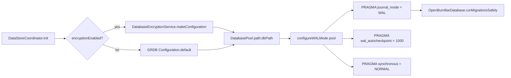
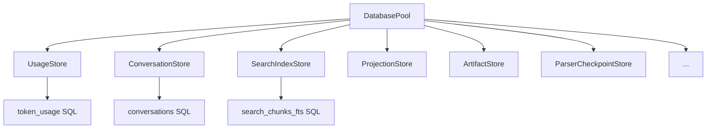

# Local database

The local SQLite database is the canonical store for all usage history, conversations, retrieval projections, shared-artifact state, and supporting app data. It is owned by the macOS app (and mirrored on iOS/Android for offline-first read surfaces) and accessed through GRDB.

---

## Purpose

OpenBurnBar is local-first. The SQLite database is the source of truth for:

- AI token usage and cost records (`token_usage`)
- Conversation transcripts and session logs (`conversations`, `chat_messages`, `chat_threads`)
- Full-text and semantic search indexes (retrieval projection tables)
- Source artifacts (skill docs, agent docs, shared artifacts)
- Device registry, switcher profiles, parser checkpoints, backfill cursors
- Provider account cache and text-expansion snippets
- Budget ledger and enforcement state

Cloud systems (Firestore, iCloud) are replication planes, not authority. Local SQLite wins on conflict.

---

## Directory layout

```text
AgentLens/Services/DataStore/
  OpenBurnBarDatabase.swift          # Schema owner — all 46 migrations registered here
  DataStore.swift                    # DataStoreActor — owns the queue and all sub-stores
  DataStoreCoordinator.swift          # @Observable @MainActor façade; renamed from DataStore
  DataStoreTypes.swift               # All record structs and enums shared across stores
  DataStore+*.swift                  # Domain-specific access extensions
  UsageStore.swift                   # Token usage queries, rollups, dashboard snapshots
  ConversationStore.swift            # Conversation CRUD, FTS, session access
  SearchIndexStore.swift             # search_documents, search_chunks, embeddings
  ProjectionStore.swift              # projection_jobs queue
  ArtifactStore.swift                # source_artifacts, shared_artifact_sync_state
  ParserCheckpointStore.swift        # Per-provider parser file positions
  BackfillCursorStore.swift          # Historical backfill sweep cursors
  DeviceStore.swift                  # Registered devices for cross-device sync
  SwitcherProfileStore.swift         # Account-switcher profile registry
  ProviderAccountStore.swift         # Local provider account cache
  TextExpansionSnippetStore.swift    # Text expansion snippet store
  OpenBurnBarQueryTracer.swift       # N+1 query detection for GRDB
  DatabaseEncryptionService.swift    # Optional SQLCipher encryption wrapper
docs/SCHEMA_SQLITE.sql               # Canonical human-readable schema reference
```

---

## Key abstractions

| Abstraction | File | Role |
|---|---|---|
| `DataStoreActor` | `DataStore.swift` | Swift actor that owns the `DatabaseWriter` and all sub-stores. All heavy I/O runs here, off the main thread. |
| `DataStoreCoordinator` | `DataStoreCoordinator.swift` | `@Observable @MainActor` façade. Forwards async calls to `DataStoreActor`, rebuilds `DashboardUsageViewModel`, and exposes `usagesVersion` for efficient SwiftUI observation. |
| `OpenBurnBarDatabase` | `OpenBurnBarDatabase.swift` | Schema owner. Holds the static `migrator` with all v1–v46 migrations. Provides `runMigrationsSafely()` (integrity check + backup + migrate + restore-on-failure). |
| `DatabasePool` / `DatabaseQueue` | GRDB | Production uses `DatabasePool` (concurrent reads, serialized writes, WAL mode). Tests use `DatabaseQueue` (serialized reads and writes). |
| `OpenBurnBarQueryTracer` | `OpenBurnBarQueryTracer.swift` | N+1 query detector. Hooks into `GRDB.Configuration` via `configure(in:)` to record all SQL statements in debug builds and assert query ceilings in tests. |

---

## How it works

### WAL mode and encryption



- `DataStoreCoordinator` reads `databaseEncryptionEnabled` from `UserDefaults` before `SettingsManager` is initialized.
- `DatabaseEncryptionService.makeConfiguration` returns a `GRDB.Configuration` with SQLCipher if a key exists.
- WAL mode is tuned for read-heavy dashboard aggregation and search queries; writes remain serialized.

### Migration safety

`OpenBurnBarDatabase.runMigrationsSafely()` runs before every launch:

1. Checks whether the current schema is behind `latestMigrationIdentifier` (`v45_conversation_working_directory`).
2. If a migration is needed and the database is not in-memory:
   - Runs `PRAGMA integrity_check`.
   - Creates a timestamped backup via `GRDB.DatabaseWriter.backup(to:)`.
3. Runs the ordered migrator.
4. On failure, restores from the pre-migration backup and logs the error.
5. Prunes old backups, keeping the 5 most recent.

### Store pattern

Each domain owns a `*Store` that receives the shared `DatabaseWriter`:



All stores execute raw GRDB SQL and decode into structs defined in `DataStoreTypes.swift`. There is no ORM layer beyond GRDB's record protocols.

### N+1 query detection

`OpenBurnBarQueryTracer` is installed into the `Configuration.prepareDatabase` closure before opening the pool:

```swift
var config = Configuration()
OpenBurnBarQueryTracer.shared.configure(in: &config)
let dbQueue = try DatabasePool(path: path, configuration: config)
```

In tests:

```swift
tracer.resetLog()
try dbQueue.read { db in _ = try TokenUsage.fetchAll(db) }
tracer.assertMaxQueries(count: 3)
```

The tracer records every SQL statement, detects repeated queries to the same table above a configurable threshold (default 10), and emits `assertionFailure` with the full SQL log when the ceiling is breached.

---

## Integration points

| Consumer | What it reads/writes |
|---|---|
| `UsageAggregator` | Writes `token_usage` and `conversations` after parser import; triggers projection jobs. |
| `ProjectionPipelineService` | Reads `conversations` + `source_artifacts`; writes `search_documents`, `search_chunks`, `chunk_embeddings`, `projection_jobs`, `retrieval_health`. |
| `SearchService` | Reads `search_chunks_fts`, `chunk_embeddings`, `search_documents` for hybrid retrieval. |
| `ContextBuilder` | Reads retrieval results via `SearchService` to build system prompt context packs. |
| `CloudSyncService` | Reads/writes `shared_artifact_sync_state`, `artifact_permissions`, `audit_events` for team collaboration. |
| `BudgetEnforcement` | Reads `budget_rules` and writes `budget_events`. |
| `ChatSessionController` | Reads/writes `chat_messages` and `chat_threads`. |
| `Daemon` (via `OpenBurnBarIndexedSearchService`) | Reads local search tables for extension-side indexed search. |

---

## Entry points for modification

| Task | Where to start |
|---|---|
| Add a new table or index | `OpenBurnBarDatabase.swift` — append a new migration to the static `migrator`. Update `docs/SCHEMA_SQLITE.sql` in the same commit. |
| Add a new store | Create `AgentLens/Services/DataStore/NewDomainStore.swift`, add it to `DataStoreActor.init`, and expose via `DataStoreCoordinator`. |
| Change a query | Edit the relevant `*Store.swift` file. Add a test that calls `OpenBurnBarQueryTracer.assertMaxQueries(count:)` to prevent regression. |
| Add encryption support | `DatabaseEncryptionService.swift` — key generation and `Configuration` wrapper. |
| Fix an N+1 pattern | `OpenBurnBarQueryTracer.swift` — run the test with `tracer.resetLog()` to identify the offending SQL, then collapse multiple round-trips into a single query or a batched fetch. |

---

## Related pages

- [Retrieval system](../retrieval/index.md) — projection pipeline that writes to the search tables
- [Iroh transport](../iroh-transport.md) — not a database concern, but the daemon's indexed search service reads the same SQLite tables
