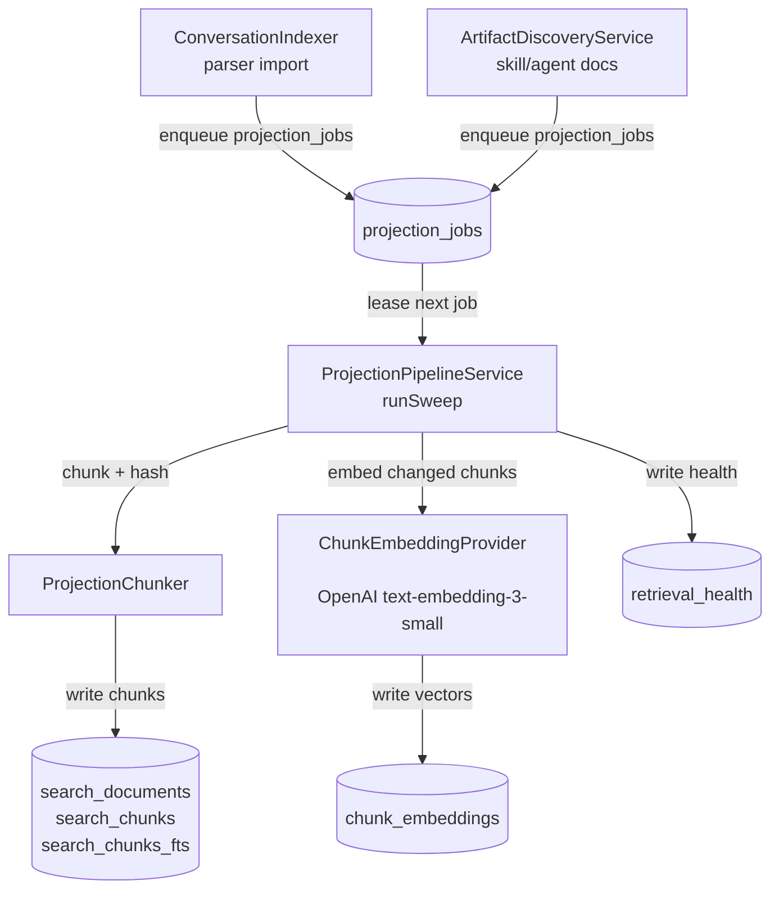
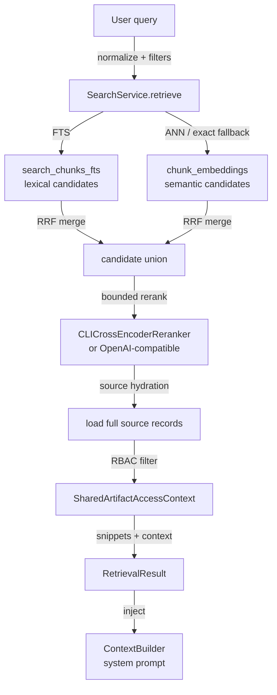

# Retrieval

The local retrieval system provides full-text and semantic search over conversations, skill docs, agent docs, and shared artifacts. It feeds context to Hermes chat, the Local Index chat mode, session summaries, and Project Memory.

---

## Purpose

Before Hermes or the Local Index CLI bridge generates a response, the retrieval system injects relevant context as a system prompt augmentation. The pipeline runs fully offline — no cloud queries on the hot path.

Sources indexed:
- Conversation transcripts parsed from provider log files (Claude Code, Codex, Factory Droid, Grok, Kimi, MiniMax, etc.)
- Skill docs and agent docs discovered by `ArtifactDiscoveryService`
- Shared artifacts synced from collaborators via `CloudSyncService`

---

## Directory layout

```text
AgentLens/Services/Search/
  SearchService.swift                  # Actor shell and public API
  SearchService+Retrieval.swift        # Core retrieval pipeline (lexical + semantic + hydration)
  SearchService+Ranking.swift          # RRF fusion + normalization
  SearchService+Factory.swift          # DI factory — wires embedder, reranker
  SearchService+Health.swift         # Health persistence per query
  VectorSearch/
    VectorSemanticProvider.swift       # ANN + exact-scan semantic search
  RetrievalHealthService.swift         # Health aggregation and display
  ContextBuilder.swift                # System prompt assembly from retrieval results

AgentLens/Services/ProjectionPipeline/
  ProjectionPipelineService.swift      # Sweep orchestrator
  ProjectionPipelineService+Jobs.swift # Job lifecycle, gap repair, backfill
  ProjectionPipelineService+Projection.swift # Chunk/embed/write per job
  ProjectionPipelineService+Health.swift # Health tracking per subsystem
  ProjectionChunker.swift              # Text chunking with section paths
```

---

## Key abstractions

| Abstraction | File | Role |
|---|---|---|
| `SearchService` | `SearchService.swift` | Swift actor and single consumer-facing search entrypoint. Exposes `retrieve(_:)`, `runBurnBarQuery(_:)`, and `recentConversations(limit:)`. |
| `VectorSemanticProvider` | `VectorSearch/VectorSemanticProvider.swift` | Approximate nearest-neighbour (ANN) search against `chunk_embeddings`, with exact cosine fallback when the ANN index is stale or unavailable. |
| `ProjectionPipelineService` | `ProjectionPipelineService.swift` | Leases `projection_jobs` from SQLite, chunks source text, diffs against existing chunks via content hashes, writes search rows, and triggers embedding. |
| `ProjectionChunker` | `ProjectionChunker.swift` | Splits long transcripts on message boundaries and docs on heading/paragraph boundaries. Tracks stable offsets for snippet reconstruction. |
| `RetrievalHealthService` | `RetrievalHealthService.swift` | Aggregates `retrieval_health` rows to drive the dashboard health indicator. |
| `ContextBuilder` | `ContextBuilder.swift` | Assembles system prompts from retrieval results, recent usage summaries, and the 18 most recent sessions. |

---

## How it works

### Indexing pipeline



**Stage 1 — Source discovery**

- `ConversationIndexer.swift` parses provider log files and upserts conversation records. It reads from parser checkpoint offsets (`parser_checkpoints` table) to resume without re-processing historical logs.
- `ArtifactDiscoveryService.swift` walks skill doc directories (`.factory/skills/`) and agent doc directories to register new `source_artifacts`.

Both write `projection_jobs` rows (type `.project` or `.reproject`) into the local SQLite queue via `DataStore`.

**Stage 2 — Projection sweep**

`ProjectionPipelineService.runSweep()` leases jobs one at a time (45-second lease timeout), processes each, and marks it completed or failed. Processing steps per job:

1. Load source text from the conversation or artifact record.
2. Chunk via `ProjectionChunker` (fixed-size overlapping windows with section-path tracking).
3. Diff against existing chunks using content hashes — only changed chunks cause writes.
4. Write `search_documents` + `search_chunks` rows.
5. Update the FTS5 virtual table (`search_chunks_fts`).
6. Copy unchanged embeddings by content hash to avoid expensive provider calls.
7. Embed new/changed chunks via `ChunkEmbeddingProvider` and write to `chunk_embeddings`.
8. Record health metrics into `retrieval_health`.

**Stage 3 — Health tracking**

`ProjectionPipelineService+Health.swift` writes one `retrieval_health` row per subsystem after each sweep. Subsystems tracked (`RetrievalSubsystem` in `DataStoreTypes.swift`): `parserImport`, `lexical`, `semantic`, `projection`, `discovery`, `rebuild`, `collaboration`, `insightRollups`.

---

### Search execution

`SearchService.retrieveInGate(_:sharedArtifactAccessContext:)` in `SearchService+Retrieval.swift` is the core retrieval routine.



**Step 1 — Lexical candidates**

FTS5 query against `search_chunks_fts`. Candidate limit defaults to 1000. Uses porter + unicode61 tokenizer. Skipped if the trimmed query is empty.

**Step 2 — Semantic candidates (optional)**

`VectorSemanticProvider.swift` performs ANN search against `chunk_embeddings`. Falls back to exact cosine scan if the ANN index is stale or unavailable. Disabled if no embedding API key is configured, or for bounded/aggregate/sensitive queries.

**Step 3 — Reciprocal Rank Fusion + reranking**

Lexical and semantic candidate lists are merged via RRF in `SearchService+Ranking.swift`. The merged list is then passed to the optional cross-encoder reranker:

- `CLICrossEncoderReranker` — calls a local CLI cross-encoder process
- `OpenAICompatibleCrossEncoderReranker` — calls an OpenAI-compatible reranking endpoint

**Step 4 — Source hydration and RBAC**

Full source records are loaded for top-K results. Shared artifact results are filtered by `SharedArtifactAccessContext` (ownership + permission checks). Results are returned as `[RetrievalResult]`.

**Step 5 — Context injection**

`ContextBuilder.buildDatabaseAnalystSystemPrompt(from:intelligenceService:)` is called by `ChatSessionController` before each Hermes or Local Index request. It assembles a system prompt from retrieved chunk snippets, source metadata, recent token usage and cost summary, and the 18 most recent sessions with titles, costs, and key files.

---

## Integration points

| Consumer | Integration |
|---|---|
| `ChatSessionController` | Calls `SearchService.runBurnBarQuery(_:)` before each turn to build the system prompt via `ContextBuilder`. |
| `SessionLogsView` | Reads source transcripts directly from `conversations` (not through retrieval). |
| `ProjectMemoryInsightController` | Uses retrieval-backed context packs for Project Memory streaming. |
| `Daemon` (`OpenBurnBarIndexedSearchService`) | Hosts a separate indexed search service for the VS Code/Cursor extension; reads the same local tables. |
| `InsightEngine` | Materializes workflow insight rollups from `SearchService` + `DataStore`. |

---

## Entry points for modification

| Task | Where to start |
|---|---|
| Change chunking rules | `ProjectionChunker.swift` — adjust window size, overlap, and boundary heuristics. Add a test in `ProjectionPipelineServiceTests`. |
| Add a new embedding provider | `SearchService+Factory.swift` — add a new case to `makeChunkEmbedder`. Update `EmbeddingIdentity`. |
| Improve ranking | `SearchService+Ranking.swift` — adjust RRF constants or add a new fusion strategy. |
| Add a new source kind | `DataStoreTypes.swift` — extend `SearchSourceKind`. Update `ProjectionPipelineService` to handle the new kind in `projectArtifact`. |
| Debug retrieval health | `RetrievalHealthService.swift` — inspect `retrieval_health` rows and surface subsystem status in the dashboard. |
| Add search evals | `scripts/test-openburnbar-retrieval-evals.sh` — golden replay tests for lexical-only, hybrid, and semantic-outage fallback. |

---

## Related pages

- [Local database](../local-database/index.md) — SQLite schema for projection and search tables
- [Iroh transport](../iroh-transport.md) — daemon also hosts an indexed search service via `OpenBurnBarIndexedSearchService.swift`
- `docs/OPENBURNBAR_SEARCH_ARCHITECTURE_SPINE.md` — detailed architecture spine covering the full search program, module boundaries, schema, rollout phases, and test strategy
