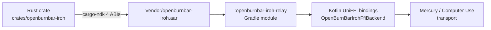

# Android companion app

Full-parity Kotlin/Compose companion app. Ships Mercury media (file transfer, screen-share viewer, 1:1 calls), iroh P2P transport, Hermes chat, Insights, and real-time Firestore usage data.

## Tech stack

| Layer | Technology |
|---|---|
| Language | Kotlin |
| UI | Jetpack Compose |
| Real-time data | Firebase Firestore (`addSnapshotListener`) |
| Push / calls | Firebase Cloud Messaging (FCM) + `ConnectionService` |
| P2P transport | iroh via `Vendor/openburnbar-iroh.aar` (UniFFI/JNI) |
| Dependency injection | Hilt |
| Async | Kotlin coroutines + `callbackFlow` |

## Package structure

```
com.openburnbar
├── data/         — Models, parsers, Firestore stores
├── ui/           — Compose screens and components
├── services/     — Background services (Mercury, FCM, sync)
├── menubar/      — Menu bar / notification area management
├── text/         — Text expansion and formatting utilities
├── util/         — Common utilities
└── wallpaper/    — Wallpaper service (ambient display)
```

## Architecture

Screens are backed by a `*Store` (ViewModel subclass):

```kotlin
class UsageStore : ViewModel() {
    // One-shot fetch
    suspend fun load() { ... }

    // Real-time Firestore listener
    fun startListening(): Flow<UsageRollups> = callbackFlow {
        val registration = db.collection(...).addSnapshotListener { snap, err -> ... }
        awaitClose { registration.remove() }
    }
}
```

Listener lifecycle is managed by `viewModelScope`; `stopListening()` cancels the listener.

## Canonical schema

`functions/src/types.ts` is the source of truth. Android models must match it field-for-field.

| TypeScript type | Android class | Firestore collection |
|---|---|---|
| `UsageEventDoc` | `TokenUsage` | `users/{uid}/usage/{doc}` |
| `UsageRollupDoc` | `UsageRollups` + `RollupSummary` | `users/{uid}/usage_rollups/{window}` |
| `QuotaSnapshotDoc` | `ProviderQuotaSnapshot` + `QuotaBucket` | `users/{uid}/quota_snapshots/{provider}_{sourceId}` |
| `ProviderAccountDoc` | `ProviderAccount` | `users/{uid}/provider_accounts/{accountId}` |

Model conventions:
- `@IgnoreExtraProperties` on every data class to tolerate server additions.
- `@PropertyName` for keys that differ from Kotlin camelCase (e.g. `providerID` → `"providerId"`).
- Computed properties in the class body, not the primary constructor.
- Timestamps: `it.seconds * 1000 + it.nanoseconds / 1_000_000`.

Cloud Functions write **5 separate rollup documents** (`today`, `7d`, `30d`, `90d`, `all_time`). `mergeWindowDocs()` reads all 5 and flattens them into a single client-side `UsageRollups`.

## Mercury media

- **Incoming calls**: `MercuryFcmService` receives FCM high-priority data messages with shape `media_incoming_call`. Builds `Notification.CallStyle.forIncomingCall(...)` + `setFullScreenIntent(...)` pointing at `IncomingCallActivity`.
- **`IncomingCallActivity`**: declared `showOnLockScreen=true` + `turnScreenOn=true`. Managed via `ConnectionService` (`MANAGE_OWN_CALLS`) wrapped in `CallKitFacade`.
- **Android 14+ fallback**: if `USE_FULL_SCREEN_INTENT` is revoked, degrades to heads-up notification with a one-time Settings deep link in `MediaSettingsView`.
- **Audio**: `MercuryAudioDatagramChannel` over ALPN `openburnbar/mercury/audio/1` (Opus codec, ~20 ms frames).
- **Foreground service types**: `microphone|camera|mediaProjection|phoneCall` (Android 14+ granular types).

## iroh transport



Wire format: big-endian u32 length prefix, `HermesRealtimeRelayFrame` JSON envelope. Same as iOS — ALPN `openburnbar/1`.

Ed25519 pairing signatures verified via Tink (JDK Ed25519 provider only ships on API 31+).

`OpenBurnBarIrohFfiBackend` gates gracefully when the AAR is absent — the app still builds, falling back to loopback transport for development and Firestore for production data.

## Insights — Editorial Observatory

`IntelligenceBriefScreen.kt` mirrors the iOS story arc:
- `INTELLIGENCE BRIEF` eyebrow + `Last 7 days` window + 22 sp rounded-semibold executive lede.
- Mercury-gradient hairline hero with one-shot shimmer (Canvas draw).
- 01/02/03 numbered findings with `ZScoreGauge` instrument scale in the Anomaly Atlas (`LazyRow`).
- Recommendations with severity-aware ember seal and mono `↑ impact` arrow (direction inferred from sign).
- Generated views via `InsightWidgetRenderer` with `Fig. 01` ordinals.
- Cascade-in via `AnimatedVisibility` + `slideInVertically(8.dp)` + `fadeIn` at 40 ms stagger.
- Reduce-motion: `LocalAuroraReduceMotion` (driven by `Settings.Global.animator_duration_scale == 0`) paints synchronously.
- Font scale clamped to 1.15× upstream by `InsightsTheme`.

## Build

```bash
export JAVA_HOME="$HOME/.homebrew/opt/openjdk@21"
export ANDROID_HOME="$HOME/Library/Android"

cd android && ./gradlew assembleDebug
```

For errors only: `./gradlew clean assembleDebug --no-daemon 2>&1 | grep "^e:\|BUILD"`

## Tests

```bash
# JVM unit suite (~253 tests: relay, media, missions, atom parser)
cd android && ./gradlew :app:testDebugUnitTest --no-daemon

# iroh-relay library (codec + pairing + loopback transport)
cd android && ./gradlew :openburnbar-iroh-relay:testDebugUnitTest --no-daemon

# Full CI parity (Functions, evals, Firestore rules, all test surfaces)
make ci
```

Instrumented E2E tests:
```bash
scripts/e2e/android-iroh-chat.sh    # iroh chat suite via adb
scripts/e2e/android-mercury-call.sh # Mercury call suite via adb
```
