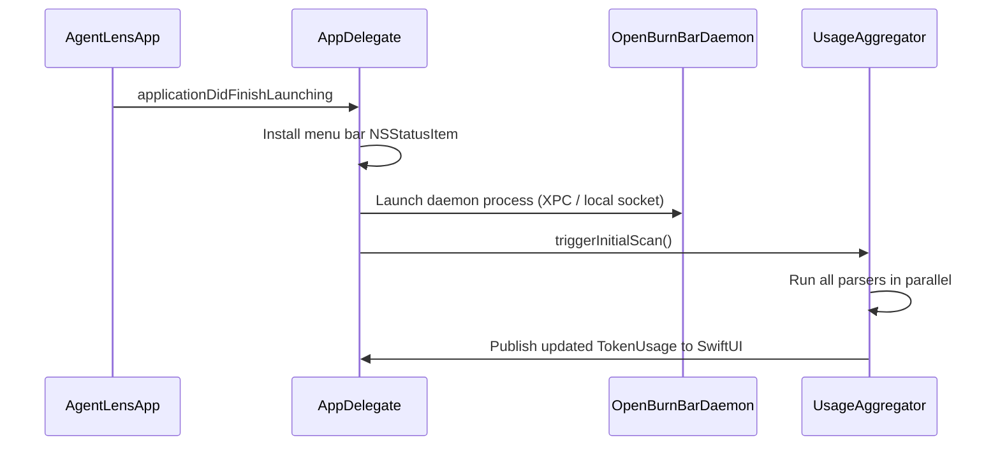
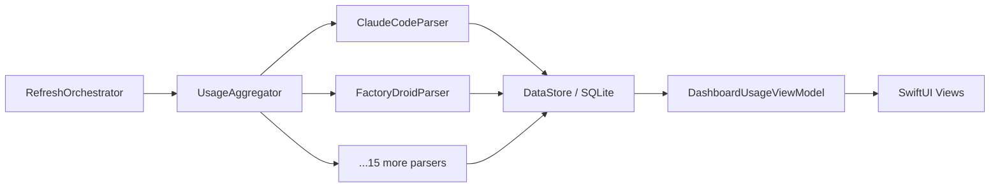

# macOS app

The macOS app (`AgentLens/`) is a menu bar application (LSUIElement) that reads AI coding agent session logs from disk, parses token counts, and surfaces spend data in a popover and full-screen dashboard — without requiring API keys for local providers.

## Directory layout

```
AgentLens/
├── App/
│   ├── AgentLensApp.swift          SwiftUI @main entry point, OpenBurnBarRuntime test gate
│   └── AppDelegate.swift           NSApplicationDelegate, menu bar item, daemon lifecycle
├── Models/
│   ├── AgentProvider.swift         typealias → OpenBurnBarCore; mac-only log directory / file pattern extensions
│   ├── TokenUsage.swift            typealias → OpenBurnBarCore canonical usage record
│   └── ...                         summary types, conversation records
├── Services/
│   ├── DataStore.swift             GRDB-backed SQLite persistence (OpenBurnBarDatabase)
│   ├── UsageAggregator.swift       Orchestrates all parsers, deduplicates, stores results
│   ├── SettingsManager.swift       User preferences (UserDefaults + iCloud)
│   ├── InsightEngine/              Local rule engine; produces intelligence brief items
│   ├── SearchService/              Full-text search over conversations (FTS5 via GRDB)
│   ├── LogParser/                  17 provider-specific parsers (see parsers.md)
│   ├── CLIBridge/                  JSON-RPC bridge to the OpenBurnBarDaemon
│   ├── CloudSync/                  Optional Firebase / iCloud sync
│   ├── ComputerUse/                Computer Use session coordinator + approval flow
│   └── ...                         quota adapters, media, text expansion, etc.
├── Theme/
│   ├── DesignSystem.swift          Color, typography, spacing, radius, animation tokens
│   ├── ProviderTheme.swift         Per-provider accent color mappings
│   └── ThemeManager.swift          Appearance state (follows macOS system appearance)
└── Views/
    ├── Popover/                    340 pt menu bar popover
    ├── Dashboard/                  Full-screen dashboard window
    ├── Settings/                   NavigationSplitView settings window
    ├── Chat/                       Hermes chat + Local Index chat panels
    ├── ComputerUse/                Agent Watch mirror, approval sheet, trust-mode panel
    ├── Insights/                   Editorial Observatory intelligence brief
    └── ...                         Onboarding, Media, Components, SmartHub
```

## Key abstractions

| Abstraction | File | Role |
|---|---|---|
| `AgentProvider` | `AgentLens/Models/AgentProvider.swift` | Enum of all supported agents. macOS extension adds `logDirectory`, `filePattern`, and `supportLevel`. Canonical cases live in `OpenBurnBarCore`. |
| `TokenUsage` | `OpenBurnBarCore/Sources/Models/TokenUsage.swift` | Single token-usage record: provider, model, input/output tokens, cost, timestamp, session ID. |
| `UsageAggregator` | `AgentLens/Services/UsageAggregator.swift` | Runs all parsers, deduplicates by session ID, stores into `DataStore`. Triggered by `RefreshOrchestrator`. |
| `DataStore` / `OpenBurnBarDatabase` | `AgentLens/Services/DataStore.swift` | GRDB SQLite layer. Canonical local store. Exposes `insert`, `fetch`, FTS5 search, and migration. |
| `InsightEngine` | `AgentLens/Services/InsightEngine/` | Rule-based + LLM-assisted engine that produces intelligence brief items (spend anomalies, quota pressure, model recommendations). |
| `SearchService` | `AgentLens/Services/SearchService/` | FTS5-backed conversation search. Supports semantic ranking via local embeddings when enabled. |
| `SettingsManager` | `AgentLens/Services/SettingsManager.swift` | Manages user prefs (refresh interval, enabled providers, budget caps). Persists to UserDefaults; optionally syncs via iCloud. |
| `DesignSystem` | `AgentLens/Theme/DesignSystem.swift` | All color, typography, spacing, radius, and animation tokens. Every view must use these — never raw hex values. |

## How it works

### Startup sequence



`AgentLensApp.swift` is the SwiftUI `@main` entry point. It detects test runs via `OpenBurnBarRuntime.isRunningTests` and substitutes `EmptyScene` to prevent heavyweight bootstrap in test hosts. `AppDelegate.swift` owns the `NSStatusItem`, window lifecycle, and daemon process management.

### Refresh cycle



`RefreshOrchestrator` fires on a configurable timer (default 30 s) and on file-system events from `DirectoryObserver`. Each parser runs concurrently via structured concurrency (`async let` / `TaskGroup`). Results are stored in GRDB and published to SwiftUI through `@Observable` view models.

## Integration points

| Integration | Mechanism | Notes |
|---|---|---|
| OpenBurnBarDaemon | `CLIBridge` (`AgentLens/Services/CLIBridge/`) — JSON-RPC over local Unix socket | Daemon manages mission runs, approvals, and computer-use sessions. Optional — the app degrades gracefully if the daemon is not running. |
| Firebase (optional) | `AgentLens/Services/CloudSync/` — Firestore + Firebase Auth | Sync usage rollups to cloud for cross-device visibility. Disabled by default; enabled via Settings → Cloud Store. |
| iCloud (optional) | `SettingsManager` — `NSUbiquitousKeyValueStore` | Syncs lightweight preferences (not usage data) across the user's Macs. |

## Entry points for modification

- **Add a provider parser**: `AgentLens/Services/LogParser/` — see [parsers.md](parsers.md)
- **Change dashboard layout**: `AgentLens/Views/Dashboard/DashboardView.swift` and `DashboardUsageViewModel.swift`
- **Add a settings panel**: `AgentLens/Views/Settings/SettingsView.swift` + `SettingsTab.swift`
- **Extend design tokens**: `AgentLens/Theme/DesignSystem.swift`
- **Add provider colors**: `AgentLens/Theme/ProviderTheme.swift`

## Related pages

- [Daemon](../systems/daemon/index.md)
- [Usage tracking](../features/usage-tracking.md)
- [Hermes chat](../features/hermes-chat.md)
- [Computer Use](../features/computer-use.md)
- [Log parsers](parsers.md)
- [Dashboard and UI](dashboard.md)
