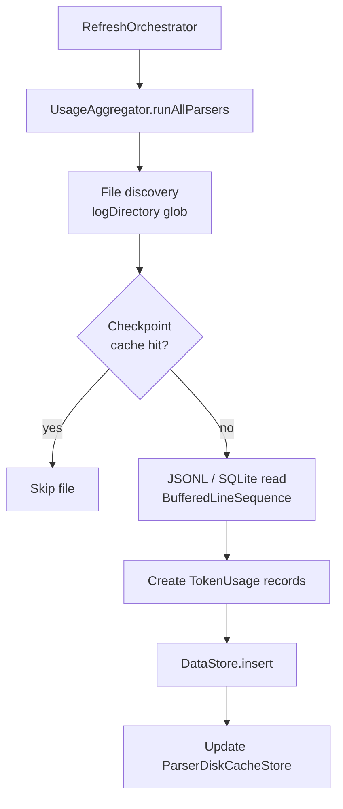

# Log parsers

Each AI coding agent writes session data to a different location and format. The parsers in `AgentLens/Services/LogParser/` translate those on-disk artifacts into `TokenUsage` records that the rest of the app can store and display.

## LogParser protocol

Defined in `AgentLens/Services/LogParser/LogParserProtocol.swift`:

```swift
protocol LogParser: Sendable {
    var provider: AgentProvider { get }
    func parse() async throws -> ParseResult
}

struct ParseResult: Sendable {
    let usages: [TokenUsage]
    let conversations: [ConversationRecord]
}
```

Every parser must be `Sendable` (safe for concurrent use). The `parse()` method returns an empty `ParseResult` — not an error — when the provider's log directory does not exist.

## Supported providers

| Parser file | Provider | Log directory | Format | Notes |
|---|---|---|---|---|
| `AntigravityParser.swift` | Antigravity (Google) | `~/.gemini/antigravity-cli/history.jsonl` | JSONL | Exact token counts |
| `AugmentParser.swift` | Augment | Local install detection | JSONL | `.unavailable` confidence |
| `ClaudeCodeParser.swift` | Claude Code | `~/.claude/projects/**/*.jsonl` | JSONL | Exact; uses `ParserDiskCacheStore` (schema v2) |
| `ClaudeConversationExtractor.swift` | Claude Code | Same as above | JSONL | Extracts full conversation records alongside token usage |
| `ClineFormatParser.swift` | Cline (VS Code) | Local install detection | JSONL | `.unavailable` confidence |
| `CursorAgentParser.swift` | Cursor Agent CLI | `~/.cursor-agent/sessions/` (`transcript.jsonl`, `summary.json`, `*.jsonl`) | JSONL | Exact token counts and session limits |
| `FactoryDroidParser.swift` | Factory Droid | `~/.factory/sessions/` | JSONL | Exact; parses lane/mission metadata |
| `ForgeDevParser.swift` | Forge | `~/forge/.forge.db` | SQLite | Estimated; OpenBurnBar gateway session counts |
| `GeminiCLIParser.swift` | Gemini CLI | Local session files | JSONL | Session tokens only; no vendor quota API |
| `GooseParser.swift` | Goose (Block) | Local session files | JSONL | `.unavailable` confidence |
| `GrokParser.swift` | Grok Build CLI | `~/.grok/sessions/<encoded-cwd>/<uuid>/` (`summary.json`, `signals.json`, `chat_history.jsonl`) | JSONL + JSON | Exact; gateway wiring via `~/.grok/config.toml` |
| `HermesParser.swift` | Hermes | `~/.hermes/sessions/*.jsonl` | JSONL | Offline telemetry: UI steps, duration, local models |
| `KimiParser.swift` | Kimi | `~/.kimi/sessions/*.jsonl` | JSONL | Exact weekly request and token usage |
| `TokenExtractionUtility.swift` | Shared utility | N/A | N/A | Heuristic token estimator used by parsers without exact counts |
| `WarpParser.swift` | Warp | Local session artifacts | JSONL | Exact; supplements `WarpQuotaAdapter` API data |
| `WindsurfParser.swift` | Windsurf | Local install detection | JSONL | `.unavailable` confidence |
| _(in `UsageAggregator`)_ | Codex | `~/.codex/sessions/rollout-*.jsonl` | JSONL | `{"type":"event_msg","payload":{"type":"token_count",...}}` shape |

Confidence levels (`exact` / `estimated` / `unavailable`) are defined in `AgentLens/Models/AgentProvider.swift` as `DataConfidence` and `ProviderSupportLevel`.

## Parse pipeline



1. **File discovery** — each parser expands `provider.logDirectory` (tilde-expanded) and lists files matching `provider.filePattern`.
2. **Checkpoint cache** — `ParserDiskCacheStore<T>` persists per-file parse state to the app's support directory. Files whose mtime and size match the cached entry are skipped, keeping incremental refreshes fast.
3. **Buffered read** — `FileHandle.readAllUTF8Lines()` (defined in `LogParserProtocol.swift`) returns a lazy `BufferedLineSequence` so multi-megabyte logs are not loaded into memory at once.
4. **TokenUsage creation** — each valid JSON line is decoded into the provider's internal struct and mapped to `OpenBurnBarCore.TokenUsage`.
5. **Aggregation** — `UsageAggregator` deduplicates across parsers by session ID before writing to `DataStore`.

### Claude Code example line

```json
{"type":"assistant","message":{"model":"claude-sonnet-4-5","usage":{"input_tokens":1024,"output_tokens":312,"cache_read_input_tokens":0,"cache_creation_input_tokens":0}}}
```

`ClaudeCodeParser.swift` decodes this shape, maps `usage` fields to `TokenUsage`, and associates the record with the project directory name decoded from the hashed path component.

## Error handling

Parsers follow a **log-and-continue** pattern: a malformed JSON line is logged at the `debug` level via `OSLog` and skipped. The `parse()` method never throws for missing directories or individual line decode failures. Only unrecoverable I/O errors (e.g., permission denied on the support directory) are surfaced as thrown errors to `UsageAggregator`, which logs them and continues with remaining parsers.

## How to add a new parser

Full steps are in `CONTRIBUTING.md`. Summary:

1. **Add a case to `AgentProvider`** (`AgentLens/Models/AgentProvider.swift`):
   - Set `iconName` (SF Symbol), `displayName`, `logDirectory` (tilde path), and `filePattern` (glob).

2. **Create a parser** in `AgentLens/Services/LogParser/YourParser.swift` conforming to `LogParser`:
   ```swift
   final class YourParser: LogParser, Sendable {
       let provider: AgentProvider = .yourProvider
       func parse() async throws -> ParseResult { ... }
   }
   ```
   Return `ParseResult(usages: [], conversations: [])` when the directory doesn't exist. Never throw for missing data.

3. **Register the parser** in `UsageAggregator.init()`:
   ```swift
   self.parsers[.yourProvider] = YourParser()
   ```

4. **Add provider colors** in `AgentLens/Theme/DesignSystem.swift` (`primary(for:)`) and `AgentLens/Theme/ProviderTheme.swift`.

5. **Add a quota adapter** (optional) in `AgentLens/Services/ProviderQuota/` if the provider exposes an API for live quota data.

6. **Write tests** in `AgentLensTests/Active/` — at minimum a fixture-driven test that feeds a sample log file to the parser and asserts the expected `TokenUsage` records.

## Related pages

- [macOS app overview](index.md)
- [Usage tracking](../features/usage-tracking.md)
- [Dashboard and UI](dashboard.md)
