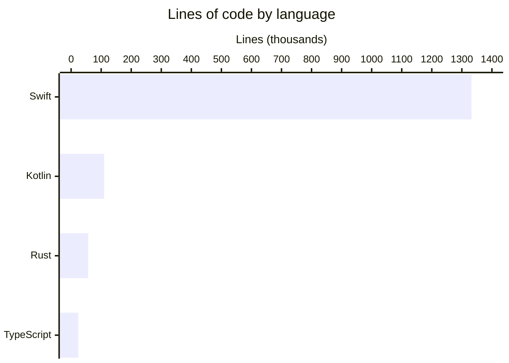

# By the numbers

Data collected on 2026-05-30.

## Codebase size

| Module | Files | Notes |
|--------|-------|-------|
| `AgentLens` (macOS app) | 597 Swift | Main app: UI, services, parsers |
| `OpenBurnBarDaemon` | 3,529 Swift | Daemon + extensive test suite |
| `OpenBurnBarCore` | 471 Swift | Shared models and utilities |
| `OpenBurnBarMobile` (iOS) | 362 Swift | iOS companion app |
| `android/app/src` | 465 Kotlin | Android app (full iOS parity) |
| `functions/src` | 89 TypeScript | Firebase Cloud Functions |
| `crates/` | 136 Rust | iroh P2P transport (UniFFI) |

All Swift modules combined: **1,332,044 lines** across ~4,959 files.

| Language | Lines | Files |
|----------|-------|-------|
| Swift (all modules) | ~1,332,000 | ~4,959 |
| Kotlin (Android) | ~109,787 | 465 |
| Rust (iroh) | ~56,887 | 136 |
| TypeScript (Functions) | ~23,820 | 89 |

## Test coverage

- `AgentLensTests/`: **208** Swift test files
- `OpenBurnBarDaemon/Tests/`: included in the 3,529-file daemon module count; largest single test file is `OpenBurnBarMissionControlServiceTests.swift` at 5,605 lines

## Commit activity

| Window | Commits on `main` |
|--------|-------------------|
| Total (public history) | **855** |
| Last 90 days | 855 |
| Last 30 days | 490 |

The public repo was seeded from a private baseline in April 2026. All 855 commits fall within the last 90 days. The project ships at a velocity of roughly **16 commits/day** over the last 30 days.

## Bot-attributed commits

`factory-droid[bot]` co-authored **232 commits** — approximately **27%** of the entire public commit history.

## Top churn files (last 90 days)

| Changes | File |
|---------|------|
| 144 | `OpenBurnBar.xcodeproj/project.pbxproj` |
| 87 | `CHANGELOG.md` |
| 61 | `project.yml` |
| 43 | `firestore.rules` |
| 42 | `OpenBurnBarMobile/Services/HermesService.swift` |
| 40 | `AgentLens/Services/CloudSyncService.swift` |
| 38 | `functions/src/types.ts` |
| 38 | `functions/src/index.ts` |
| 38 | `AgentLens/App/AgentLensApp.swift` |
| 37 | `AgentLens/Services/ProviderQuota/ProviderQuotaService.swift` |

`project.pbxproj` leading the list is expected — every new Swift file modifies it. Among non-project files, `HermesService.swift` (iOS), `CloudSyncService.swift`, and `ProviderQuotaService.swift` are the most actively evolved services.

## Largest Swift files

| Lines | File |
|-------|------|
| 5,605 | `OpenBurnBarDaemon/Tests/.../OpenBurnBarMissionControlServiceTests.swift` |
| 4,744 | `OpenBurnBarDaemon/Tests/.../OpenBurnBarHTTPGatewayServerTests.swift` |
| 4,589 | `OpenBurnBarMobile/Services/HermesService.swift` |
| 4,383 | `AgentLens/Views/Dashboard/ProjectsView.swift` |
| 4,317 | `OpenBurnBarMobile/Views/Media/ScreenShareViewerView.swift` |

The two largest files are test files. Among production source, `HermesService.swift` (iOS) at 4,589 lines is the biggest single file — it owns Hermes relay connection management, iroh transport, mission dispatch, and media session state.

## Feature surface scale

- **17** log-format parsers under `AgentLens/Services/LogParser/`
- **22+** quota adapters under `AgentLens/Services/ProviderQuota/` (one per provider)
- **49** Firebase Cloud Functions (all wrapped with structured logging as of 2026-05)
- **89** TypeScript source files in `functions/src/`
