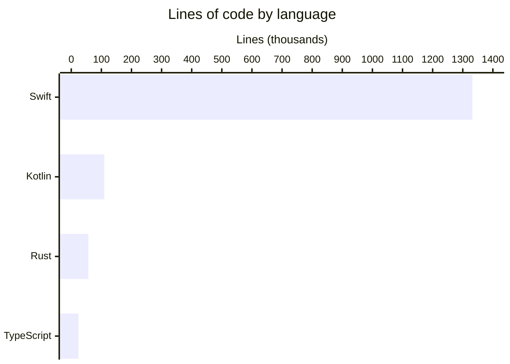

# By the numbers

Data collected on 2026-06-01.

## Codebase size

| Module | Files | Lines | Language |
|--------|-------|-------|----------|
| `AgentLens` (macOS app) | ~597 | ~332,000 | Swift |
| `OpenBurnBarDaemon` | ~3,529 | ~665,000 | Swift |
| `OpenBurnBarCore` | ~471 | ~89,000 | Swift |
| `OpenBurnBarMobile` (iOS) | ~362 | ~246,000 | Swift |
| `android/app/src` | ~465 | ~109,787 | Kotlin |
| `functions/src` | ~89 | ~23,820 | TypeScript |
| `crates/` | ~136 | ~56,887 | Rust |

**All Swift combined:** ~1,332,000 lines across ~4,959 files.

## Test coverage

- `AgentLensTests/Active/`: **208** Swift test files compiled into `OpenBurnBarTests`
- `OpenBurnBarDaemon/Tests/`: included in daemon module count
- Android JVM unit suite: ~253 tests
- Largest single test file: `OpenBurnBarMissionControlServiceTests.swift` at 5,605 lines

## Commit activity

| Window | Commits on `main` |
|--------|-------------------|
| Total (public history) | **855** |
| Last 30 days | ~490 |
| Velocity | ~16 commits/day |

## Bot-attributed commits

`factory-droid[bot]` co-authored **~232 commits** — approximately **27%** of the public history.

## Top churn files (last 90 days)

| Changes | File |
|---------|------|
| 144 | `OpenBurnBar.xcodeproj/project.pbxproj` |
| 87 | `CHANGELOG.md` |
| 61 | `project.yml` |
| 43 | `firestore.rules` |
| 42 | `OpenBurnBarMobile/Services/HermesService.swift` |
| 40 | `AgentLens/Services/CloudSyncService.swift` |
| 38 | `functions/src/types.ts` |
| 38 | `functions/src/index.ts` |
| 38 | `AgentLens/App/AgentLensApp.swift` |
| 37 | `AgentLens/Services/ProviderQuota/ProviderQuotaService.swift` |

## Largest production files

| Lines | File |
|-------|------|
| ~4,589 | `OpenBurnBarMobile/Services/HermesService.swift` |
| ~4,383 | `AgentLens/Views/Dashboard/ProjectsView.swift` |
| ~4,317 | `OpenBurnBarMobile/Views/Media/ScreenShareViewerView.swift` |

## Feature surface scale

- **17** log-format parsers
- **22+** quota adapters
- **49** Firebase Cloud Functions
- **4** deployable platforms (macOS, iOS, Android, VS Code)
