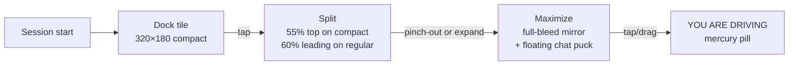

# Computer Use

Lets an AI agent drive your Mac (browser automation and system-level input), while an iOS or Android phone mirrors the screen and can send tap/scroll commands.

## Phases

Each phase is gated by a Remote Config flag. Flags are evaluated at session start and can be killed remotely without an app update.

| Phase | Capability | Flag |
|---|---|---|
| 8 | Agent Watch — Mac → phone read-only mirror | `computer_use_watch_enabled` |
| 9 | Browser Computer Use — Playwright Chromium | `computer_use_browser_enabled` |
| 10 | Trust modes + scope rules + audit chain | `computer_use_trust_modes_enabled` |
| 11 | Mac System — CGEvent + Accessibility API | `computer_use_system_enabled` |
| 12 | Phone-as-controller — Ed25519-signed intents | `computer_use_phone_control_enabled` |
| 13 | Polish — trusted scopes, audit export, OpenTimestamps | `computer_use_polish_enabled` |

Phase 11 (Mac System) ships only via Developer ID / direct download. The MAS build compiles it out with `#if DISTRIBUTION_MAS`.

## Trust modes

Per-session, never sticky across sessions.

| Mode | Behaviour |
|---|---|
| Manual | Every action requires explicit approval before execution |
| Step | Approve each discrete step in a multi-step plan |
| Trusted | Agent runs freely within the active scope rules |

The phone-side UI can only downgrade trust (Trusted → Step → Manual). Upgrades require the Mac. This prevents a compromised or stolen phone from silently elevating a session.

## Approval flow

`ComputerUseDaemonApprovalPresenter` shows a 320×180 pre-action screenshot of what the agent saw, plus three buttons:

- **Reject + Halt** — stops the session entirely (`error` fill)
- **Reject** — skips the action, keeps the session running (cancel role)
- **Approve** — executes (green `borderedProminent`, default keyboard shortcut)

## Panic-kill paths

Three independent kill paths exist in addition to approval rejection:

1. `⌃⌥⌘.` global keyboard hotkey
2. Phone three-finger long-press (via `PhoneControlReceiver`)
3. Remote Config `computer_use_kill_switch` evaluated by `ComputerUsePanicHaltCoordinator`

Additionally, NSWorkspace auth gate (loginwindow / SecurityAgent / screen sleep) automatically halts the session.

## Audit chain

- SHA-256 content-addressed entries.
- Tamper detection via `head.json` — any modification to a prior entry breaks the chain.
- Each entry includes: action kind, pre/post screenshot hash, trust mode at execution time, approval decision, timestamp.
- Export (Phase 13) supports OpenTimestamps anchoring.

## Budget governance

| Limit | Value |
|---|---|
| Soft cap | $1 500/mo (25 actions/run × 100 runs/day) |
| Hard cap | $2 500/mo (Remote Config kill-switch) |
| Per-user daily ceiling (normal) | $5.00 |
| Per-user daily ceiling (soft) | $2.50 |
| Per-user daily ceiling (hard) | $0.00 |

`ComputerUseBudgetStatusStore` tracks real-time spend; `evaluateComputerUseBudget` Cloud Function evaluates hourly.

## iOS Agent Live Stage

When a Computer Use `sessionId` arrives, the iOS app auto-opens a dock tile:

- **Dock tile**: ignorable but always present while a session is active.
- **Split**: chat tab remains reachable in the bottom half.
- **Maximize**: 56 pt draggable `AgentLiveStageChatPuck` expands to a 320×420 mercury-stroked floating composer.
- **Passthrough surface**: taps < 10 pt → `AgentWatchReceiver.tap(normalizedX:y:)`, drags → `scrollDrag(...)`.
- **Grace window**: 6 s after session end before the dock collapses, allowing final animation frames to render.

`AgentWatchOverlaySingleton` owns the persistent iroh control stream so the live mirror survives tab swaps.

## Key files

| File | Purpose |
|---|---|
| `AgentLens/Services/ComputerUse/ComputerUseSessionCoordinator.swift` | Session lifecycle, action dispatch, state machine (~73 KB) |
| `AgentLens/Services/ComputerUse/ComputerUseRuntimeController.swift` | Runtime execution, action queue, approval gating |
| `AgentLens/Services/ComputerUse/ComputerUsePanicHaltCoordinator.swift` | Three-path panic kill implementation |
| `AgentLens/Services/ComputerUse/ComputerUseBudgetStatusStore.swift` | Real-time budget tracking |
| `AgentLens/Services/ComputerUse/PhoneControlReceiver.swift` | Ed25519 intent verification, phone→Mac commands |
| `AgentLens/Services/ComputerUse/SystemPermissionMonitor.swift` | AX + screen recording permission gating |
| `AgentLens/Services/ComputerUse/Mac/` | CGEvent dispatch, AX tree traversal, screenshot capture |
| `OpenBurnBarDaemon/Sources/OpenBurnBarRemoteAccessAgentCore/` | Daemon-side remote access coordination |
| `OpenBurnBarDaemon/Sources/OpenBurnBarVirtualHIDBridge/` | Virtual HID for synthesised input events |
