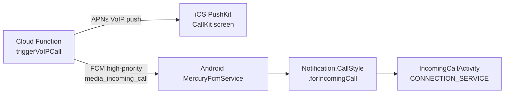

# Mercury media

P2P file transfer, screen sharing, and 1:1 voice/video calls between Mac and iOS/Android. Rides the iroh transport with Ed25519 peer authentication — no relay server required for LAN peers.

## Transport layer

- **Protocol**: iroh (Rust), wrapped in `OpenBurnBarIroh.xcframework` (iOS/macOS) and `Vendor/openburnbar-iroh.aar` (Android).
- **ALPN identifiers**:
  - `openburnbar/1` — general relay and control frames
  - `openburnbar/mercury/audio/1` — audio datagram channel
- **Authentication**: Ed25519 key pair per device. Pairing exchanges public keys; subsequent connections verify against the stored peer key.

## Wire format

Base `MediaFrame` header is 18 bytes. Agent Watch (Phase 8) extends it with 4 bytes for cursor metadata:

```
[18-byte MediaFrame header][optional 4 bytes: i16 cursorX, i16 cursorY]
```

Flag bit `0x08` (`hasCursorMetadata`) signals the trailing 4 bytes are present. Old peers ignore trailing bytes when the flag is absent, so the codec is backward-compatible.

Previously used flags: `0x01` (keyframe), `0x02` (audio), `0x04` (muted). Bit `0x08` was chosen to avoid collision.

## Incoming calls



**iOS**: PushKit VoIP push activates CallKit directly. The system call UI appears even when the app is not running.

**Android**: FCM data message triggers `MercuryFcmService`, which builds `Notification.CallStyle.forIncomingCall(...)` with `setFullScreenIntent(...)`. The activity is declared `showOnLockScreen=true` + `turnScreenOn=true` so a locked device wakes the screen. On Android 14+, if `USE_FULL_SCREEN_INTENT` is revoked the service falls back to a heads-up notification plus a one-time settings deep link. Audio uses the system ringer (no bespoke ring sound). Foreground service type is `microphone|camera|mediaProjection|phoneCall`.

## File transfer

- iroh blob protocol: `publish_blob` (sender) / `fetch_blob` (receiver).
- Chat UI renders a mercury-stroked attachment bubble (`ChatBubbleStyle.toolShape`) for each in-progress or completed transfer.
- iOS: `MacFileTransferService.swift` manages the Mac-side publish pipeline.
- Android: matching store-and-forward logic mirrors the Mac implementation.

## Per-partner save preferences

Persisted per peer `NodeId`, survives app restarts. Three policies:

| Policy | Behaviour |
|---|---|
| `SAVE_TO_PHOTOS` | iOS: Photos library. Android: `MediaStore.Images/Video/Audio` (scoped storage API 29+) |
| `SAVE_TO_FILES` | iOS: Files.app. Android: SAF tree URI picked once, `DocumentsContract.createDocument` thereafter |
| Forget | Clears preference; next transfer prompts again |

A privacy nuke (`forgetAll()`) clears all partner preferences at once.

## Audio

- Codec: Opus (~20 ms frames).
- Channel: `MercuryAudioDatagramChannel` over ALPN `openburnbar/mercury/audio/1`.
- Encode pipeline: `MicrophoneCapturePipeline` → `AudioEncoder` → iroh datagrams.
- Decode pipeline: iroh datagrams → decode → `AVAudioEngine` render.

## Key files

| File | Purpose |
|---|---|
| `AgentLens/Services/Media/MercuryRouter.swift` | Central routing for all media sessions (~87 KB) |
| `AgentLens/Services/Media/MediaSessionCoordinator.swift` | Session lifecycle and peer handshake |
| `AgentLens/Services/Media/MacFileTransferService.swift` | Mac-side blob publish/fetch (~28 KB) |
| `AgentLens/Services/Media/MacMediaCapabilityGate.swift` | Permission gating (camera, mic, screen capture) |
| `AgentLens/Services/Media/AudioEncoder.swift` | Opus encoding pipeline |
| `AgentLens/Services/Media/VideoEncoder.swift` | H.264/HEVC encoding pipeline |
| `AgentLens/Services/Media/ScreenCapturePipeline.swift` | `SCStream`-based screen capture |
| `AgentLens/Services/Media/AppleRemoteDesktopRFBClient.swift` | RFB viewer for Agent Watch mirror |
| `AgentLens/Services/Media/VoIPCallTrigger.swift` | Triggers Cloud Function for incoming call fan-out |
| `crates/openburnbar-iroh/Cargo.toml` | Rust iroh crate (UniFFI bindings for iOS + Android) |
| `Vendor/openburnbar-iroh.aar` | Pre-built Android AAR (4 ABIs via `cargo-ndk`) |
