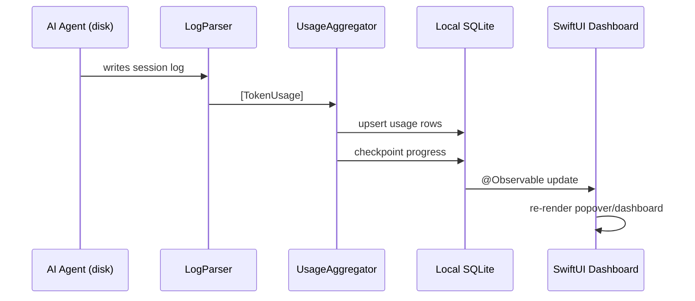
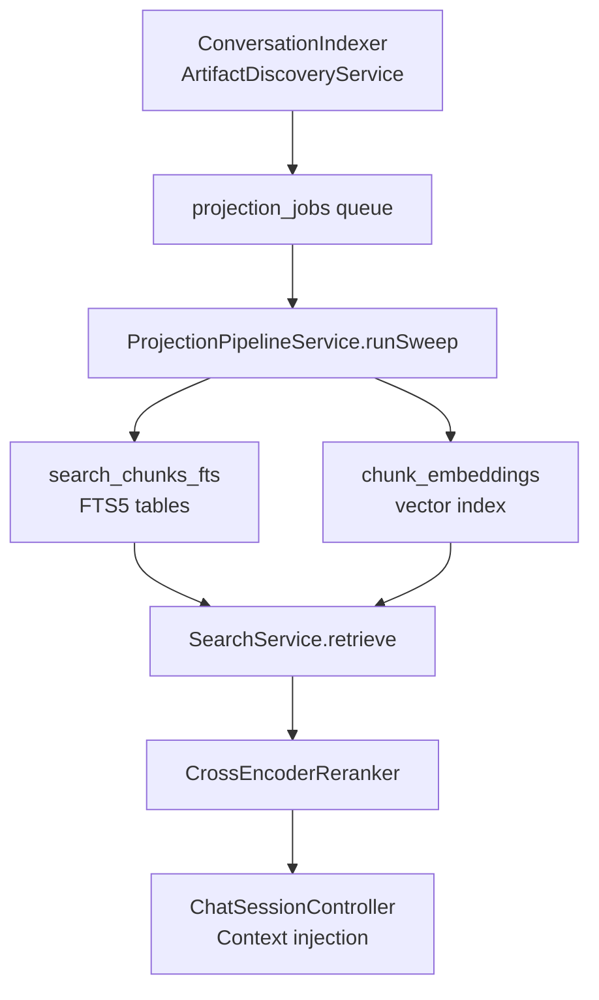

# Architecture

OpenBurnBar is a daemon-first, local-first product. Every piece of production-visible state has a single canonical home; cloud systems replicate that state but do not own it.

## Component overview

```mermaid
graph LR
    subgraph macOS
        A[AgentLens app\nSwiftUI + GRDB]
        D[OpenBurnBarDaemon\nJSON-RPC server]
        CLI[OpenBurnBarCLI]
        Core[OpenBurnBarCore\nShared contracts]
    end
    subgraph iOS / iPadOS
        Mobile[OpenBurnBarMobile\nSwiftUI]
    end
    subgraph Android
        Android[BurnBar Android\nKotlin / Compose]
    end
    subgraph Extensions
        Ext[VS Code / Cursor extension\nTypeScript]
    end
    subgraph Cloud
        Firebase[Firebase\nFirestore + Functions + FCM]
    end
    subgraph P2P
        Iroh[iroh relay\nRust / UniFFI]
    end

    A <-->|JSON-RPC / Unix socket| D
    CLI -->|JSON-RPC| D
    Ext -->|JSON-RPC| D
    Mobile <-->|iroh P2P| D
    Android <-->|iroh P2P| D
    A -->|optional| Firebase
    Mobile -->|optional| Firebase
    Android -->|optional| Firebase
    D --> Core
    A --> Core
    Mobile --> Core
```

## Canonical state ownership

| Store | Owner | What lives there |
|-------|-------|-----------------|
| Local SQLite (GRDB) | macOS app | Usage history, conversations/session logs, retrieval projections, search index, shared-artifact cache |
| Daemon support directory | Daemon | Provider routing config, run journal, controller state, connector config, browser plane config |
| Keychain | Local device | Routed provider API keys, Telegram bot token, connector credentials |
| Firestore | Optional / cloud | Replicated usage rows, cross-device quota snapshots, session-log mirrors (opt-in) |
| iCloud | Optional / cloud | Session log file copies (opt-in) |

## Support tiers

| Tier | What it covers |
|------|----------------|
| **Core** | macOS app, daemon, CLI, shared `OpenBurnBarCore` contracts, VS Code/Cursor extension shell |
| **Experimental** | Optional Firestore replication, iCloud mirroring, connector plane, mission control runtime, browser tooling, Hermes/OpenClaw chat backends |
| **Adjacent tooling** | `tools/openburnbar-mcp/` (read-only SQLite MCP bridge) |
| **Quarantined tests** | `AgentLensTests/Quarantine/` — stale suites, excluded from CI until fixed |

## macOS app (`AgentLens/`)

The macOS app is a menu-bar-only SwiftUI application (`LSUIElement = YES`). It owns:

- **UI layer** — `AgentLens/Views/` contains the popover, dashboard, session detail, settings, Hermes chat, Computer Use, and project memory views.
- **Persistence layer** — `AgentLens/Services/DataStore/OpenBurnBarDatabase.swift` defines the GRDB schema (migrations, stores, FTS indexes, vector embeddings). `UsageStore.swift` alone is ~80 KB.
- **Parser layer** — `AgentLens/Services/LogParser/` holds 17 provider parsers. Each implements `LogParser` protocol and returns `[TokenUsage]`.
- **Aggregation** — `UsageAggregatorParsers.swift` and `UsageAggregator.swift` orchestrate parsers, checkpoint progress, and write results to the local database.
- **Retrieval pipeline** — `ProjectionPipelineService.swift` maintains `search_documents`, `search_chunks`, FTS5 tables, and `chunk_embeddings`.
- **Search** — `SearchService.swift` (~54 KB) merges lexical FTS candidates with optional vector ANN candidates, re-ranks with a cross-encoder, and surfaces results for chat and session detail.

## Daemon (`OpenBurnBarDaemon/`)

The daemon is a Swift Package that launches as a background agent via launchd. Its JSON-RPC server listens on a Unix domain socket (`~/.burnbar.sock` by default) with `0o600` permissions and a Keychain-backed auth token.

Key source targets inside `OpenBurnBarDaemon/Sources/`:

| Target | Role |
|--------|------|
| `OpenBurnBarDaemon` | Main daemon logic: routing, mission control, run state, connector plane |
| `OpenBurnBarCLI` | CLI entrypoints (`health`, `controller`, `missions`, `mission-approve`, etc.) |
| `OpenBurnBarRemoteAccessAgentCore` | Computer Use system-level access layer (CGEvent + Accessibility) |
| `OpenBurnBarVirtualHIDBridge` | Virtual HID bridge for phone-as-controller (Ed25519-signed intents) |

## Shared contracts (`OpenBurnBarCore/`)

A Swift package that both the app and daemon import. Contains wire types, protocol definitions, and schema models that must stay in sync across the process boundary.

## Mobile apps

`OpenBurnBarMobile/` (iOS/iPadOS, SwiftUI) and the Android Kotlin app share the same feature surface: Hermes chat, Computer Use mirror, Mercury media (file transfer, screen share, calls), notifications, and iroh-backed P2P transport. iOS connects via `OpenBurnBarIroh.xcframework`; Android via `Vendor/openburnbar-iroh.aar`.

## iroh P2P transport

`crates/openburnbar-iroh/` is a Rust library that provides Ed25519-authenticated P2P connections via iroh relays. UniFFI generates Swift bindings for iOS/macOS and Kotlin bindings for Android. ALPN identifiers:

| ALPN | Purpose |
|------|---------|
| `openburnbar/1` | General relay framing (HermesRealtimeRelayFrame envelope) |
| `openburnbar/mercury/audio/1` | Mercury audio datagrams |

## Firebase Cloud Functions

`functions/src/` contains the Firebase Cloud Functions backing optional cloud features: quota rollups, Firestore triggers, FCM push (APNs + Android), Computer Use budget governance, iroh monitoring, hosted Insights answers, and VoIP call dispatch. The canonical Firestore schema lives in `functions/src/types/` (migrating from hand-maintained `types.ts` to TypeSpec emitters in `tools/schema-sync/`).

## Data flow: usage tracking



## Data flow: retrieval (chat context)



## Security boundary

- Unix socket permissions are `0o600`; the auth token is stored in Keychain and exchanged on first connect.
- The app runs unsandboxed in its Developer ID build so parsers can read `~/.claude/`, `~/.factory/`, etc. The MAS build uses a read-only entitlement for `$HOME` subdirectories only.
- Computer Use (Phase 11 Mac system) ships exclusively in the Developer ID build (`#if !DISTRIBUTION_MAS`).
- Three independent panic-kill paths for Computer Use: `⌃⌥⌘.` global hotkey, phone three-finger long-press, Remote Config `computer_use_kill_switch`.

See [Security](../security.md) for the full threat model summary.
