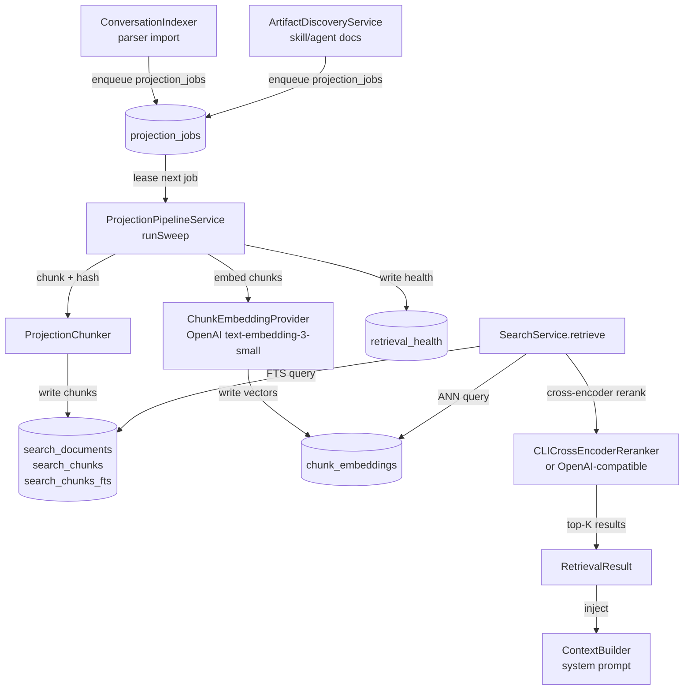

# Local retrieval system

The local retrieval system provides full-text and semantic search over conversations, skill docs, agent docs, and shared artifacts. It feeds context to Hermes chat, the Local Index chat mode, session summaries, and Project Memory.

---

## Purpose

Before Hermes or the Local Index CLI bridge generates a response, the retrieval system injects relevant context as a system prompt augmentation. The pipeline runs fully offline — no cloud queries.

Sources indexed:
- Conversation transcripts parsed from provider log files (Claude Code, Codex, Factory Droid, Grok, Kimi, MiniMax, etc.)
- Skill docs and agent docs discovered by `ArtifactDiscoveryService`
- Shared artifacts synced from collaborators

---

## Pipeline overview

---

## Indexing pipeline

### Stage 1 — Source discovery

**`AgentLens/Services/ConversationIndexer.swift`** parses provider log files and upserts conversation records. It reads from parser checkpoint offsets (`parser_checkpoints` table) to resume without re-processing historical logs.

**`AgentLens/Services/ArtifactDiscoveryService.swift`** walks skill doc directories (`.factory/skills/`) and agent doc directories to register new `source_artifacts`.

Both write `projection_jobs` rows (type `.project` or `.reproject`) into the local SQLite queue via `DataStore`.

### Stage 2 — Projection sweep

**`AgentLens/Services/ProjectionPipeline/ProjectionPipelineService.swift`** drives the queue. `runSweep()` leases jobs one at a time (45-second lease timeout), processes each, and marks it completed or failed.

Processing steps per job (in `ProjectionPipelineService+Projection.swift`):
1. Load source text from the conversation or artifact record
2. Chunk via `ProjectionChunker` (fixed-size overlapping windows with section-path tracking)
3. Diff against existing chunks using content hashes — only changed chunks cause writes
4. Write `search_documents` + `search_chunks` rows
5. Update the FTS5 virtual table (`search_chunks_fts`)
6. Embed changed chunks via `ChunkEmbeddingProvider` and write to `chunk_embeddings`
7. Record health metrics into `retrieval_health`

Gap repair and backfill are managed by `ProjectionPipelineService+Jobs.swift`.

### Stage 3 — Health tracking

**`AgentLens/Services/ProjectionPipeline/ProjectionPipelineService+Health.swift`** writes one `retrieval_health` row per subsystem after each sweep. Subsystems tracked (`RetrievalSubsystem` in `DataStoreTypes.swift`): `parserImport`, `lexical`, `semantic`, `projection`, `discovery`, `rebuild`, `collaboration`, `insightRollups`.

`RetrievalHealthService.swift` (`AgentLens/Services/Search/RetrievalHealthService.swift`) aggregates these for display in the UI.

---

## Search execution

**`AgentLens/Services/Search/SearchService.swift`** is a Swift actor. The main entry point is `retrieveInGate(_:sharedArtifactAccessContext:)` in `SearchService+Retrieval.swift`.

### Step 1 — Lexical candidates

FTS5 query against `search_chunks_fts`. Candidate limit defaults to 1000. Uses porter + unicode61 tokenizer. The query is skipped if the trimmed text is empty.

### Step 2 — Semantic candidates (optional)

**`VectorSemanticProvider.swift`** (`AgentLens/Services/Search/VectorSearch/VectorSemanticProvider.swift`) performs approximate nearest-neighbour search against `chunk_embeddings`. Falls back to exact cosine scan if the ANN index is stale or unavailable. Disabled if no embedding API key is configured.

### Step 3 — Reciprocal Rank Fusion + reranking

Lexical and semantic candidate lists are merged via Reciprocal Rank Fusion in `SearchService+Ranking.swift`. The merged list is then passed to the optional cross-encoder reranker.

Two reranker backends (constructed in `SearchService+Factory.swift`):
- `CLICrossEncoderReranker` — calls a local CLI cross-encoder process
- `OpenAICompatibleCrossEncoderReranker` — calls an OpenAI-compatible reranking endpoint

### Step 4 — Source hydration and RBAC

Full source records are loaded for top-K results. Shared artifact results are filtered by `SharedArtifactAccessContext` (ownership + permission checks). Results are returned as `[RetrievalResult]`.

### Step 5 — Context injection

**`AgentLens/Services/ContextBuilder.swift`** assembles a system prompt from:
- retrieved chunk snippets and source metadata
- recent token usage and cost summary
- 18 most recent sessions with titles, costs, and key files

`ContextBuilder.buildDatabaseAnalystSystemPrompt(from:intelligenceService:)` is called by `ChatSessionController` before each Hermes or Local Index request.

---

## Key files

| File | Size | Role |
|---|---|---|
| `AgentLens/Services/ProjectionPipeline/ProjectionPipelineService.swift` | ~13 KB | Sweep orchestrator |
| `AgentLens/Services/ProjectionPipeline/ProjectionPipelineService+Jobs.swift` | ~12 KB | Job lifecycle, gap repair, backfill |
| `AgentLens/Services/ProjectionPipeline/ProjectionPipelineService+Projection.swift` | ~12 KB | Chunk/embed/write per job |
| `AgentLens/Services/ProjectionPipeline/ProjectionChunker.swift` | ~6 KB | Text chunking with section paths |
| `AgentLens/Services/Search/SearchService.swift` | ~7 KB | Actor shell and public API |
| `AgentLens/Services/Search/SearchService+Retrieval.swift` | ~22 KB | Core retrieval pipeline |
| `AgentLens/Services/Search/SearchService+Ranking.swift` | ~7 KB | RRF fusion + normalisation |
| `AgentLens/Services/Search/SearchService+Factory.swift` | ~10 KB | DI factory — wires embedder, reranker |
| `AgentLens/Services/Search/SearchService+Health.swift` | ~6 KB | Health persistence per query |
| `AgentLens/Services/Search/VectorSearch/VectorSemanticProvider.swift` | ~34 KB | ANN + exact-scan semantic search |
| `AgentLens/Services/Search/RetrievalHealthService.swift` | ~15 KB | Health aggregation and display |
| `AgentLens/Services/ContextBuilder.swift` | — | System prompt assembly |

---

## retrieval_health table

Written after every sweep and after every query. Each row records:

- `subsystem` (enum `RetrievalSubsystem`)
- `status` (healthy / degraded / failed)
- query text, candidate counts, result count
- per-stage latency breakdowns (lexical, semantic, rerank, hydration, cross-encoder)
- error codes and messages when degraded or failed

The `RetrievalHealthService` aggregates these rows to drive the health indicator in the dashboard.

---

## Related pages

- [Local database](../local-database/index.md) — schema for projection and search tables
- [Daemon overview](../daemon/index.md) — daemon also hosts an indexed search service via `OpenBurnBarIndexedSearchService.swift`
