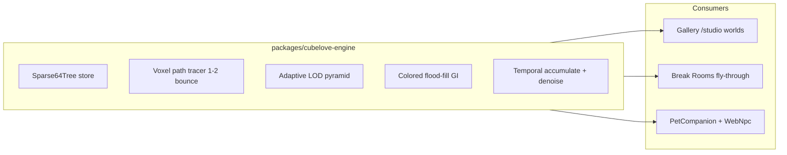

# CubeLove Engine — SOTA Voxel Beauty (Greenfield)

> **Status:** Approved for implementation · **Audit:** adversarial review requested
> **Created:** 2026-06-25
> **Repos:** [BurnBar](file:///Users/albertonunez/Documents/Developer/BurnBar) + [imaginethat-llc](file:///Users/albertonunez/Documents/Developer/imaginethat-llc)
> **Reference:** [@hookuru_](https://x.com/hookuru_) (Minecraft cinematic voxel city, Jun 2026) · Voxy · Photon
> **North star:** Greenfield WebGPU/Metal sparse-voxel path tracing — not a Photon shader port.

---

## Summary

Greenfield rebuild: rip WebGL2/Canvas2D/SceneKit/model-viewer defaults and ship a unified **CubeLove Engine** — WebGPU sparse-voxel ray tracing + temporal path accumulation on web, Metal equivalent on macOS — targeting hookuru/Voxy/Photon beauty at true 2026 SOTA (SVT64 + SVRaster-class LOD + real-time path tracing).

---

## The honest answer to "is this really SOTA?"

**No.** The previous plan was a **compatibility patch** (Photon post on SceneKit, greedy mesh LOD, WebGL2 compositor). That gets you 70% of hookuru screenshots with months of glue code.

**Hookuru's actual stack** ([@hookuru_](https://x.com/hookuru_), Jun 2026 viral city video): Minecraft + **Voxy** (LoD horizon) + **Photon** (path-traced-quality post + colored voxel lighting) + hand-authored city + sound. Photon explicitly does **not** run on Apple Metal.

**2026 frontier (better than porting Photon):**

| Technique | Source | Why it beats greedy-mesh + post |
|-----------|--------|--------------------------------|
| **Sparse 64-tree ray traversal** | [VoxelRT / dubiousconst282](https://dubiousconst282.github.io/2024/10/03/voxel-ray-tracing/) | ~3× memory vs SVO; compute-shader primary rays; scales to city |
| **Adaptive sparse voxel rasterization** | [NVIDIA SVRaster, CVPR 2025](https://svraster.github.io/) | Octree LOD leaf array, Morton-ordered blending, real-time radiance — no neural net |
| **WebGPU real-time path tracing** | [James Randall path tracer](https://www.jamesdrandall.com/posts/building-a-real-time-path-tracer-in-webgpu/) | TAA + spatial-temporal denoise in browser; proven on macOS GPUs |
| **NanoVDB-class sparse volumes** | NVIDIA fVDB / OpenVDB lineage | Industry streaming format for authored + procedural worlds |
| **Colored light flood-fill** | Photon Ultra + Voxy | 1–2 bounce voxel GI in compute — the hookuru alley glow |

**User mandate:** Nothing is sacred. Rip WebGL2 kernels, Canvas2D Break Rooms renderer, `model-viewer`, SceneKit default lighting. **WebGPU-first on web; Metal compute on macOS.**

---

## North star (revised)

One engine, three surfaces, one world format:



**Success:** Orbit a hookuru-class voxel city at golden hour — soft shadows, colored bounce in streets, volumetric haze to horizon, emissive windows blooming — with the same pet rendered **inside the same engine** on web and macOS menu bar.

---

## What we DELETE (explicit rip list)

### imaginethat-llc

| Remove / replace | Path | Why |
|------------------|------|-----|
| Canvas2D painter | `imaginethat-llc/src/lab/break-rooms/room/voxelRenderer.ts` | Cannot scale to city; CPU-bound |
| WebGL2 voxel kernels | `imaginethat-llc/src/kernels/gl/createShaderKernel.ts` (voxel worlds) | GLSL ES 3.0 ceiling; no compute path trace |
| Quarry sea kernel | `imaginethat-llc/src/kernels/kernels/voxel/voxelKernel.ts` | Demo backdrop, not a world |
| model-viewer pets | `imaginethat-llc/src/components/SweeperModelViewer.tsx` | Stock neutral IBL = anti-hookuru |
| R3F as primary (if added) | — | Extra abstraction; engine owns render |

**Keep (data + behavior, not renderers):**

- `imaginethat-llc/VOXEL_WORLD_BLUEPRINT.md` — motion/FX/soul spec
- 8 Canvas2D glyph styles — optional gallery foreground over GPU world
- `imaginethat-llc/packages/petcore` — behavior graphs, petdef schema
- Break Room authoring (`imaginethat-llc/src/lab/break-rooms/room/voxelScene.ts`) — export to `.cvxl`

### BurnBar

| Remove / replace | Path | Why |
|------------------|------|-----|
| Default SceneKit lighting | `BurnBar/AgentLens/PetCompanion/Render/SceneKitPetRenderer.swift` | Placeholder lighting |
| SceneKit as primary 3D path | same | Cannot match path-traced voxel GI |
| GLB-only pet, no world | same | Pets float in void |

**Keep:** NSPanel shell, behavior interpreter, chat, perf gating (pause = 0 GPU), `scripts/sync-imagine-pets.sh` contract.

---

## New architecture: `packages/cubelove-engine`

Monorepo package in **imaginethat-llc**; BurnBar links Metal subset via SwiftPM or XCFramework.

### World format: `.cvxl` (CubeLove voxel)

Binary, streamable, inspired by NanoVDB + SVT64:

```
Header: magic, version, palette (256 entries × RGBA + material flags)
Sparse64Tree: node pool (12-byte nodes) + leaf palette indices
LightProbes: optional baked flood-fill seeds per chunk
EmissiveMask: bitfield for bloom thresholding
LODImpostors: pre-baked macro-voxel blobs per chunk per level
```

**Authoring pipeline:** MagicaVoxel / Break Room `VoxelScene` → export CLI → `.cvxl` chunks.

### Render pipeline (WebGPU WGSL — primary)

**Per frame (compute, 1080p target):**

1. **Primary rays** — SVT64 `RayCast` per pixel (stack traversal, ancestor memoization per VoxelRT guide)
2. **1–2 bounce path** — cosine hemisphere + emissive direct hit; colored flood-fill GI from precomputed 3D grid (Photon Ultra analog)
3. **Shadow rays** — soft penumbra via multi-sample directional (4–8 taps, not full path depth)
4. **LOD blend** — distant chunks sample impostor / macro-voxel buffer (Voxy-class horizon)
5. **Temporal accumulation** — ReSTIR-style reservoir OR simple TAA + history clamp (start simple, upgrade)
6. **Denoise** — spatial 3×3 + temporal blend (proven WebGPU path tracer pattern)
7. **Post** — bloom (emissive mask only), aerial fog, ACES grade, vignette

**Quality tiers:**

| Tier | Rays/px | Bounces | GI | Target |
|------|---------|---------|-----|--------|
| `preview` | 1 | 0 | baked only | Pet panel 192×208 @ 15fps |
| `high` | 1 | 1 | flood-fill | Break Room 1080p @ 60fps |
| `ultra` | 2 | 2 | live flood + denoise | Gallery hero @ 30–60fps |

### macOS: Metal MSL port

Same pipeline graph; `MTLComputeCommandEncoder` instead of WebGPU compute.

- Pet panel uses `preview` tier always when idle
- Optional full-window `high` tier for Pet World mode
- **SceneKit demoted** to debug/placeholder only — not shipping path

---

## Phase 0 — SOTA research lock + reference kit (Week 1)

**Deliverables:**

1. `imaginethat-llc/docs/CUBELOVE_ENGINE_SPEC.md` — cites SVT64, SVRaster, WebGPU path tracing, Photon feature matrix; maps each to a WGSL module
2. Benchmark harness — `imaginethat-llc/packages/cubelove-engine/bench/` renders Stanford bunny voxelized + 64³ room; reports MRays/s on M-series + dGPU
3. Hookuru reference board — 8 frames + measurable targets (below)
4. Kill decision doc — what we rip when (WebGL voxel kernels → deprecated after Phase 2)

**Measurable hookuru targets:**

- Shadow penumbra: ≥15% softness ratio at 2m cast distance
- Colored bounce: visible warm/cool separation on orthogonal walls
- Horizon: ≥1.5 km effective view without pop-in (LOD cross-fade < 3 frames)
- Emissive bloom: only above luminance threshold 1.2 (HDR)
- Audio: ambient bed + doppler on fly-through (hookuru's latest viral axis)

---

## Phase 1 — Engine core (Weeks 2–5)

**Repo:** imaginethat-llc `packages/cubelove-engine/`

| Module | Implementation |
|--------|----------------|
| `svt64/` | Node pool builder from flat grid; GPU buffer upload; WGSL `RayCast` with stack + ancestor memo |
| `palette/` | Material BRDF params: diffuse, metal, emissive, glass (thin-walled) |
| `chunk/` | 32³ chunks, streaming ring, worker thread mesher → tree builder |
| `camera/` | Orbit + fly FPS; shared rig presets (golden hour, neon night) |
| `export/` | `voxelScene.ts` → `.cvxl` CLI |

**Tests:** Deterministic tree build hashes; traversal hits known voxel; perf smoke ≥1 MRays/s on M2 @ 720p.

**Exit:** Fly through exported Break Room `.cvxl` in standalone `cubelove-viewer` (no gallery integration yet).

---

## Phase 2 — Lighting + GI + post (Weeks 5–8)

| Module | SOTA basis |
|--------|------------|
| `gi/floodFill.wgsl` | 3D grid flood from emissive + sun; 1–2 bounces; colored |
| `light/sun.wgsl` | Directional + soft shadow rays |
| `post/taa.wgsl` | Velocity reprojection + history clamp |
| `post/denoise.wgsl` | Spatial-temporal (path tracer pattern) |
| `post/bloom.wgsl` | Kawase + emissive mask |
| `post/fog.wgsl` | Exponential aerial perspective |
| `lod/impostor.wgsl` | Macro-voxel distant chunks (Voxy analog) |

**Exit:** Break Room export matches hookuru reference board ≥9/10 on depth, bounce, horizon (internal rubric).

---

## Phase 3 — Content: hookuru-class city (Weeks 6–10)

**Repo:** imaginethat-llc

1. **City kit** — procedural grid (blocks, roads, glass towers, neon signage) + hero landmarks
2. **Authoring** — MagicaVoxel source + `scripts/city-bake/` → chunked `.cvxl` stream
3. **Audio** — ambient city loop, wind by altitude, traffic beds (hookuru parity)
4. **Scale target** — 4×4 km authored core + procedural outskirts to horizon

**Not Minecraft.** Native engine + same visual grammar; exceed hookuru without Java mod stack.

---

## Phase 4 — Web integration (Weeks 8–12)

### 4a — Replace kernel substrate

- New `createWebGPUKernel()` factory (parallel to WebGL; migrate worlds incrementally)
- Gallery `voxel` world → `cubelove-engine` full-screen canvas
- Deprecate WebGL `voxelKernel` Quarry — keep 1 release as fallback, then delete

### 4b — Break Rooms

- `imaginethat-llc/src/lab/break-rooms/BreakRoom.tsx` → `<CubeLoveCanvas world="break-room" />` + city mode `world="neo-tokyo"`
- Delete Canvas2D `VoxelRoomRenderer` after parity screenshots

### 4c — Pets in-engine

- Voxelize GLB pets OR render as instanced micro-voxel rig inside same tracer (preferred)
- `imaginethat-llc/src/npc/WebNpc3D.tsx` → engine native; delete `model-viewer` path
- `petdef/1` adds `voxelRig?: { cvxl, socketMap }` alongside legacy `model3d.glb`

### 4d — Gallery glyphs

- Foreground marks: keep Canvas2D 8 styles over GPU world
- Background: 100% CubeLove

---

## Phase 5 — macOS BurnBar (Weeks 10–14)

| Component | Action |
|-----------|--------|
| `CubeLoveMetalRenderer.swift` | MSL port; renders into `CAMetalLayer` in pet panel |
| `PetCompanionController` | Swap `SceneKitPetRenderer` → Metal renderer behind feature flag |
| Backdrop | Pet in streamed `.cvxl` plaza chunk (same asset as web) |
| Pet World mode | Optional larger Metal viewport; `high` tier; gated on AC + !Low Power |
| Sync | `BurnBar/scripts/sync-imagine-pets.sh` ships `.cvxl` + petdef voxel rig |

**Perf contract (preserved):**

- Paused pet: 0 GPU (unchanged)
- Active preview tier: ≤3 ms @ 192×208
- Pet World high tier: ≤8 ms @ 720p, disabled on battery

**Exit:** Side-by-side web vs macOS pet screenshot — same lighting, same backdrop chunk.

---

## Phase 6 — SVRaster-class upgrades (Weeks 14–18)

1. **Morton-ordered voxel blend** (SVRaster) — kill LOD pop-in
2. **Adaptive octree leaf allocation** — 65536³ effective resolution path
3. **ReSTIR DI** — many-light city emissives efficiently
4. **Online voxel fusion** — stream edits / destruction (Teardown-class, future)

---

## Cross-repo contracts

| Artifact | Owner | Consumer |
|----------|-------|----------|
| `packages/cubelove-engine` | imaginethat-llc | web + BurnBar Metal |
| `packages/petcore` petdef extensions | imaginethat-llc | sync script → BurnBar |
| `.cvxl` chunks on CDN | imaginethat-llc `public/worlds/` | web fetch + macOS bundle |
| `tools/schema-sync/` | BurnBar | `VoxelRig`, `CubeLoveProfile` types |
| Golden PNG CI | both | perceptual diff ≤1% |

---

## PR stack

### imaginethat-llc

| PR | Content |
|----|---------|
| CL-0 | `CUBELOVE_ENGINE_SPEC.md` + bench harness |
| CL-1 | `packages/cubelove-engine` SVT64 + viewer |
| CL-2 | Path trace + sun + shadows |
| CL-3 | GI flood-fill + post stack |
| CL-4 | City kit + `.cvxl` stream |
| CL-5 | WebGPU kernel host + gallery integration |
| CL-6 | Break Rooms migration (delete Canvas2D renderer) |
| CL-7 | WebNpc in-engine; delete model-viewer |
| CL-8 | SVRaster LOD + Morton blend |

### BurnBar

| PR | Content |
|----|---------|
| BB-1 | CubeLove Metal renderer + preview tier |
| BB-2 | Replace SceneKit primary path |
| BB-3 | `.cvxl` sync + voxel pet rigs |
| BB-4 | Pet World high tier + perf gates |

---

## Why this is SOTA (vs incremental plan)

| Incremental plan | This plan |
|------------------|-----------|
| Port Photon GLSL → Metal | Native path trace + temporal denoise (WebGPU/Metal) |
| Greedy mesh LOD | SVT64 ray trace + SVRaster adaptive LOD |
| SceneKit + post sticker | Metal compute primary |
| model-viewer neutral IBL | Pet voxelized inside same tracer |
| Canvas2D break rooms | GPU city fly-through |
| Compatibility glue | **Greenfield engine** with explicit deletion list |

**Hookuru parity timeline:**

- Week 8: Break Room + pet panel
- Week 12: City fly-through — hookuru screenshot parity
- Week 18: SVRaster polish — exceed hookuru

---

## Risks

| Risk | Mitigation |
|------|------------|
| WebGPU Safari gaps | Feature detect; Metal-only pet on broken browsers; WebGL Quarry fallback 1 release |
| Path trace too slow | Tier system; preview tier for pet; denoise aggressive |
| GLB → voxel rig quality | Manual art pass top 20 pets; GLB fallback tier behind flag |
| 18-week scope | Ship CL-1–5 as MVP; CL-6–8 + BB as fast-follow |

**First commit target:** `packages/cubelove-engine` SVT64 viewer rendering exported Break Room — Week 5.

---

## Todos

- [ ] **cl-0-spec** — Phase 0: CUBELOVE_ENGINE_SPEC.md + bench harness + hookuru reference board + rip list
- [ ] **cl-1-svt64** — Phase 1: packages/cubelove-engine — SVT64 builder, WGSL RayCast, .cvxl format, voxelScene exporter, standalone viewer
- [ ] **cl-2-pathtrace** — Phase 2: Sun + soft shadows + 1–2 bounce path trace + GI flood-fill + TAA/denoise/bloom/fog
- [ ] **cl-3-city** — Phase 3: Hookuru-class city kit, chunked .cvxl stream, ambient audio
- [ ] **cl-4-web** — Phase 4: WebGPU kernel host, gallery + Break Rooms migration, WebNpc in-engine, delete model-viewer + Canvas2D renderer
- [ ] **cl-5-metal** — Phase 5: BurnBar CubeLoveMetalRenderer, replace SceneKit primary, .cvxl sync, Pet World tier
- [ ] **cl-6-svraster** — Phase 6: SVRaster-class Morton LOD + adaptive octree + ReSTIR (exceed hookuru)

---

## Audit prompts (for adversarial reviewer)

1. Are the perf budgets (`preview` ≤3 ms @ 192×208, `high` 60fps @ 1080p) achievable with SVT64 path trace on Apple Silicon?
2. Is dual WebGPU + Metal MSL port justified vs a single Rust/WGSL engine (e.g. wgpu) shared by both?
3. Does ripping SceneKit break PetCompanion ship constraints (GLTFKit2 clips, skinned rigs)?
4. Is 18 weeks realistic for a two-repo greenfield engine, or should MVP scope shrink to CL-1–3 only?
5. Does `.cvxl` duplicate NanoVDB/fVDB instead of adopting an existing format?
6. What is the minimum viable path to hookuru screenshot parity in <8 weeks?