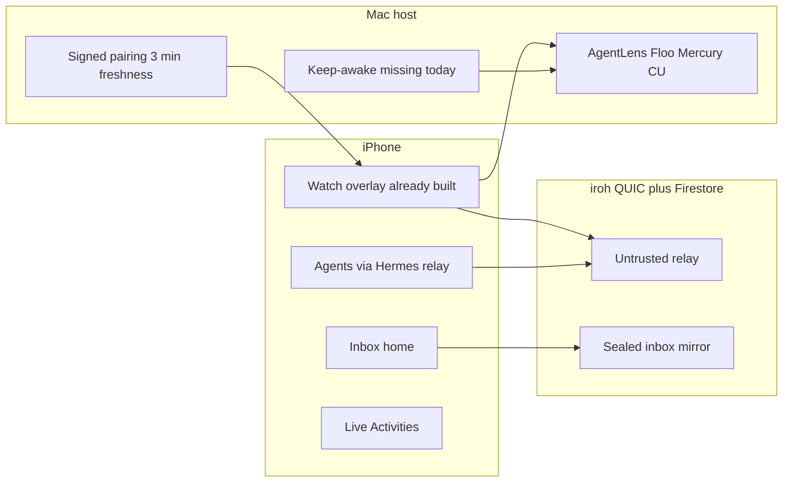

# iPhone remote continuation master plan

> Committed copy of the 2026-08-20 Cursor plan. Transport stays **iroh + HPKE Auth v3 + trusted-device roots**. Do not invent a daemon-RPC remote.

**North star:** the iPhone is the steering wheel for agents that still run on *your* Mac. You leave the desk. The work continues. Approvals, chat, the live screen, files, and computer-use halt all stay one tap away.

**Spine (your call):** Inbox-first. The next decision is home. Watch (screen + computer use + files) overlays when a session or share starts.

**Shell recommendation (SOTA, future-proof):** rebuild [OpenBurnBarMobile](OpenBurnBarMobile) **in place**. Same bundle, App Store, widgets, Live Activities, entitlements, TestFlight, and shared packages. A second Xcode target or new repo doubles identity and breaks the existing pairing graph. “From the ground up” means a new information architecture and visual system, not a second product.

Research used: Cursor iOS (Jun 2026), Claude Code Remote Control, Codex-in-ChatGPT, Happy Coder E2E relay, Omnara/Workbench/Seasalt/Jump, iroh 0.96 QUIC-NAT + multipath, MoQ per-frame abort, Apple iOS 26 Live Activities + App Intents, VideoToolbox low-latency HEVC, StayAwake-class `IOPMAssertion`. Tavily and X were unavailable (auth). BurnBar source of truth: [docs/HERMES_COMPUTER_USE.md](docs/HERMES_COMPUTER_USE.md), [docs/HERMES_MEDIA_TRANSPORT.md](docs/HERMES_MEDIA_TRANSPORT.md), [docs/DASHBOARD_HOME_PLAN.md](docs/DASHBOARD_HOME_PLAN.md), [docs/GROK_D_LOCAL_BOX.md](docs/GROK_D_LOCAL_BOX.md), [docs/mobile-parity/mobile-parity-ledger.md](docs/mobile-parity/mobile-parity-ledger.md).

---

## Why this beats a new app *and* beats the market

Vendor phones are **one-agent remotes**. Cursor steers Cursor. Claude steers Claude. Codex steers Codex. Happy/Omnara wrap one or two CLIs. Jump/Screens share a desktop and know nothing about agents.

BurnBar already owns the only stack that can be **all four surfaces at once**, sealed, multi-provider. The phone already drives the Mac through **iroh + HPKE Auth v3 + trusted-device roots**, not through `openburnbar-daemon.sock`.

- **Agent surfaces:** Hermes/Pi on-device; Mac-backed CLI via Hermes relay (Mac must be awake) plus Firestore missions that can queue while the lid is closed. Grok **Build** is on the phone. Grokd/Local D box is **Mac-only** until a new sealed relay op exists.
- **Screen:** Mercury HEVC with H.264 fallback, GOP-tagged frames muxed on the **single `media.control` stream** (docs still say per-GOP QUIC; live code does not).
- **Computer:** Path A Watch overlay already auto-docks; Path D signed input exists behind flags. MAS compiles Path C/D out.
- **Files:** iroh-blobs 0.101.0, 2 GiB cap, inbox + quarantine; **flag default off**; camera is chat/call, not blob send.
- **Decide:** AI Inbox is a Streams chip reader, not a tab. Quota lives on Burn, not a Quota tab.

The rebuild’s job is **composition and reachability**, not a new transport and not a daemon-RPC remote.

---

## Competitive steal / beat list

**Steal**

- **Cursor:** lock-screen Live Activities (up to 8), keep-computer-awake as a first-class switch, voice, annotate-a-screenshot, cache-first inbox, one backend so a run started anywhere appears everywhere
- **Claude Remote Control:** QR pairing, files from the phone land on the Mac as `@` refs, both surfaces stay in sync, reconnect after sleep, execution never leaves the machine
- **Codex mobile:** QR pair, approve/deny commands, live terminal + diffs + screenshots, credentials stay on the host
- **Happy Coder:** dumb relay that only sees ciphertext; QR-shared secret; catch-up after cellular drop (train/hiking)
- **Workbench / Jump:** voice into the Mac, adaptive bitrate on cellular, headless virtual display so a Mac mini is a real host
- **Codex artifact pack:** diff + terminal + screenshot + tests as one review card
- **iroh/MoQ:** one cheap QUIC stream per media unit; abort stale frames. Live Mercury still HOL-blocks on `media.control` — that is the gap, not a docs rewrite

**Beat (unique BurnBar)**

- Multi-provider fleet, not a single vendor loop
- Inbox as home (competitors open a chat list)
- Quota as a first-class number on the phone
- Real Mac screen + CU panic in the same overlay as the agent thread
- Relays stay untrusted; CU rides HPKE v3 + Ed25519 authority ([docs/HERMES_COMPUTER_USE.md](docs/HERMES_COMPUTER_USE.md))
- Grokd/Local D box as a fleet member, not a hidden Settings pane

**Do not copy**

- Cursor’s “agent loop moves to the cloud, tools stay local” — BurnBar’s contract is local-first; the Mac keeps the loop
- Vendor chat-only remotes with no screen
- MoQ as a new ALPN this cycle (IETF draft still moving; [docs/HERMES_MEDIA_TRANSPORT.md](docs/HERMES_MEDIA_TRANSPORT.md) already gates datagrams/FEC/AV1). Steal the *pattern* (abort stale streams), keep Mercury ALPN

---

## Current product (honest)

Shipped on iPhone today, buried under Pulse / Burn / Streams / Agents / You ([OpenBurnBarMobile/Views/RootTabView.swift](OpenBurnBarMobile/Views/RootTabView.swift), [AuroraNavDestination](OpenBurnBarMobile/Views/Navigation/AuroraNavigationIcons.swift)):

- Inbox exists but is nested in Streams, not launch
- Agent Watch overlay + Live Activity already auto-open on CU ([AgentWatchOverlaySingleton.swift](OpenBurnBarMobile/Services/ComputerUse/AgentWatchOverlaySingleton.swift), [AgentWatchLiveActivityManager.swift](OpenBurnBarMobile/Models/AgentWatchLiveActivityManager.swift))
- Mercury mirror/call/files: capability rows implemented; **physical VAL-MOB-011/012 still blocked** (ledger)
- HEVC + H.264 fallback, MediaFrame v1/v2, per-GOP iroh, VideoToolbox probe ([MercuryStreamingPolicy.swift](OpenBurnBarCore/Sources/OpenBurnBarMedia/MercuryStreamingPolicy.swift), [VideoReceivePipeline.swift](OpenBurnBarMobile/Services/Media/VideoReceivePipeline.swift))
- Keep-awake exists only for **Remote Unlock display wake** ([OpenBurnBarRemoteAccessAgentMain.swift](OpenBurnBarDaemon/Sources/OpenBurnBarRemoteAccessAgent/OpenBurnBarRemoteAccessAgentMain.swift) `IOPMAssertion`). There is no productized “keep this Mac awake while I am away” toggle like Cursor
- Grokd: **mobile explicitly out of v1** ([docs/GROK_D_LOCAL_BOX.md](docs/GROK_D_LOCAL_BOX.md))
- Locked Mac closes normal mirror and CU; Remote Unlock is the only human-only exception ([docs/HERMES_MEDIA_TRANSPORT.md](docs/HERMES_MEDIA_TRANSPORT.md))

Parity ledger: 76 capabilities marked implemented, **productParityClaim = false**, almost every VAL contract blocked on named-device evidence. Unit KATs are not a ship gate for this plan. Physical loops are.

---

## Target iPhone IA

Four tray destinations. Watch is not a tab.

1. **Inbox** (launch) — ranked next move; empty state = today’s brief. Push with opaque item id lands here. Fleet liveness + tightest quota as a two-line header, not a second home.
2. **Agents** — one column: identity line, thread, switcher. Hermes/Pi, Mac CLI agents, Grokd. Overflow: Wand, missions, resume/handoff, capability grants, rollback.
3. **Quota** — headroom cards, reset atlas, urgency sort, `openburnbar://headroom` and `openburnbar://headroom/<provider>`.
4. **You** — pairing, keep-awake, devices, cloud, appearance, data vault, labs.

**Watch overlay** (owns the screen when live): Mac HEVC mirror, trackpad, keyboard, CU action log, approval strip, panic halt, file drop, PiP. Stages already exist: dock → split → maximize ([AgentLiveStagePresenter](OpenBurnBarMobile/Views/ComputerUse/AgentLiveStagePresenter.swift)). Inbox stays underneath; a session starting from an inbox item opens Watch without changing the selected tab.

**Lock screen / Dynamic Island (iOS 26):** extend existing Agent Watch Live Activity with `LiveActivityIntent` buttons: Approve, Deny, Halt. Apple requires unlock before those intents run — that is the correct safety posture. Push-update Live Activities when the app is backgrounded (ActivityKit push), matching Cursor’s “leave the app” loop.

---

## Four shared surfaces (what “complete” means)

### 1. Agent surfaces

- Same thread identity on Mac and phone (Claude/Cursor lesson)
- Start, follow, redirect, approve, grant, rollback from the phone
- Grokd: phone lists live D agents and sends one prompt **through the paired Mac daemon** (never iOS loopback `:1337`). Follow the existing sqlite/preview turn contract
- Voice dictation into the composer (Cursor/Workbench)
- Annotate a screenshot or a frozen Watch frame and send it as agent context (Cursor Design Mode, phone-shaped)

### 2. Screen

- Keep Mercury ALPN and stream-per-GOP. Productize: abort stale GOP on the receiver when a newer GOP completes (MoQ pattern already implied by GOP-end flags in [MediaFrame.swift](OpenBurnBarCore/Sources/OpenBurnBarMedia/MediaFrame.swift))
- Cellular ladder: resolution/fps/bitrate from BWE; HEVC screen-content when VideoToolbox advertises it; H.264 fallback (already tested)
- PiP + Dynamic Island stay up when the user leaves Inbox
- Headless Mac mini: if capture reports a 1x 1080 virtual display, surface a Mac-side “use phone-sized virtual display” control (Workbench lesson). Do not invent a new codec.

### 3. Computer

- Path A Watch + Path D signed input remain the wire
- Approval is the only ground truth. Phone trust **only downgrades**
- Panic halt: overlay button, Live Activity Halt intent, existing three Mac panic paths
- Path C (Mac System CU) stays `#if !DISTRIBUTION_MAS`

### 4. Files

- iroh-blobs as the bulk path; camera/files from phone land on the Mac workspace (Claude lesson)
- Protected inbox, per-partner save prefs, size/progress honest UI
- Files never uploaded as plaintext to Firebase

---

## Reachability (the part Cursor gets right and we currently miss)

Far-from-desk only works if the **Mac stays a host**.

- First-class **Keep this Mac awake** on the phone, executed on the Mac via daemon: `IOPMAssertionCreateWithName(kIOPMAssertionTypePreventUserIdleSystemSleep)` while any remote session, CU, or inbox-tick that needs the host is live. Display may sleep. Lid-close `pmset disablesleep` stays an explicit, reversible, admin-gated advanced option (StayAwake pattern) — not the default.
- Pairing: keep trusted-device + iroh node allowlist. Add a Claude-style **QR on the Mac, scan on the phone** for first pair if the current flow is buried in You.
- Reconnect: Happy-style catch-up — Mac keeps writing; phone replays missed inbox/agent events when cellular returns. iroh QUIC migration (Wi-Fi → LTE) is free if the endpoint stays up.
- Honest footer on Fleet/Inbox: “Mac awake · iroh direct” vs “Mac asleep · last seen 12m” ([docs/DASHBOARD_HOME_PLAN.md](docs/DASHBOARD_HOME_PLAN.md) liveness: no fake idle).

---

## Security invariants (cannot vary)

From [docs/HERMES_COMPUTER_USE.md](docs/HERMES_COMPUTER_USE.md) and [docs/HERMES_MEDIA_TRANSPORT.md](docs/HERMES_MEDIA_TRANSPORT.md):

- Relays, Firestore, gateways: untrusted transport only
- Mac-bound CU/control: authenticated v3 HPKE envelope + trusted-device bind; v1/v2 fail closed
- Approval is ground truth; no silent autopilot
- Locked Mac / loginwindow / SecurityAgent ends normal mirror and CU
- Remote Unlock is human-only; credentials never log, never Firestore, never agent context
- Inbox push: opaque item id + kind/priority enum only
- Tokens redacted in Grokd client `description`

---

## Design

Rebuild the visual system on the existing [MobileTheme](OpenBurnBarMobile) tokens: SF Pro, system materials, one ember accent, content first. Inbox is a ranked list, not a dashboard collage. Watch is full-bleed glass over that list. Follow HIG + current SwiftUI APIs; gate iOS 26 materials with `#available`.

---

## Docs to write before code, then keep true

- [docs/mobile-parity/iphone-hero-ia.md](docs/mobile-parity/iphone-hero-ia.md) — tray, overlay, deep links, Mac-feature → iPhone address table
- [plans/2026-08-20-iphone-remote-continuation-master-plan.md](plans/2026-08-20-iphone-remote-continuation-master-plan.md) — this plan, committed
- Short [CHANGELOG.md](CHANGELOG.md) note when the shell ships

---

## Build sequence (complete, not sliced into fake PRs)

Work as **one coherent theme** (standing “fewer fatter PRs” rule). Internally land in this order, tests green after each:

1. **IA map + empty four-tab shell + deep links** (Inbox launch, Watch overlay host preserved)
2. **Inbox as home** using existing `AIInboxStore` / `AIInboxView` (lift out of Streams)
3. **Keep-awake + reachability chip** (Mac assertion + phone toggle + honest footer)
4. **Agents column + Grokd-via-daemon**
5. **Watch unification:** screen, CU, files, annotate-on-frame, PiP
6. **Live Activity intents:** Approve / Deny / Halt + ActivityKit push updates
7. **Quota tab + headroom deep links**
8. **Cellular GOP-abort + bitrate ladder evidence** against [docs/runbooks/mercury-streaming-evidence-gates.md](docs/runbooks/mercury-streaming-evidence-gates.md) — only promote gated codecs when those gates are green
9. **Reachability pass:** every remaining Mac feature from [docs/product-focus/FEATURE_INVENTORY.md](docs/product-focus/FEATURE_INVENTORY.md) gets an iPhone address in the IA map
10. **Physical loops** on Alberto’s iPhone with `/Applications/OpenBurnBar.app` as the Mac host (debug builds are invisible to him)

---

## Test matrix

Unit (extend [OpenBurnBarMobileTests](OpenBurnBarMobileTests)): IA routing, inbox notification routing, fleet liveness mapping, Grokd daemon client, keep-awake lease, GOP abort, Live Activity intent routing, control-seal negatives (already a VAL-MOB-012-KAT floor).

Commands:

- `./scripts/test-openburnbar-mobile.sh`
- Mercury/CU physical: paired Mac + iPhone; reuse behavior oracles in `scripts/e2e/android-iroh-chat.sh` and `scripts/e2e/android-mercury-call.sh`

Physical loops that define done:

1. Inbox push → open item → approve or chat
2. Agents → send to a live Mac CLI or Grokd agent → stream returns on LTE
3. Watch auto-opens on CU → Halt from overlay **and** from Live Activity
4. Screen share on cellular stays readable; stale GOP is abandoned
5. File from phone camera appears in the Mac workspace
6. Toggle Keep awake; close Inbox; Mac still hosts; footer stays honest when assertion drops

VAL-MOB-011/012/013 stay the promotion criteria. Do not mark parity true without named-device evidence.

---

## Risks

- **Sleep kills the host.** Without keep-awake, this product is a LAN demo. Ship the assertion in the same PR as Inbox-home.
- **MoQ/AV1/datagrams temptation.** Follow existing evidence gates; abort-old-GOP is the 2026 win inside the current ALPN.
- **MAS vs Developer ID.** Path C and Grokd auto-start stay unsandboxed-only.
- **Alberto looks at `/Applications/OpenBurnBar.app`.** Install the Mac host there or the phone has nothing to continue.

