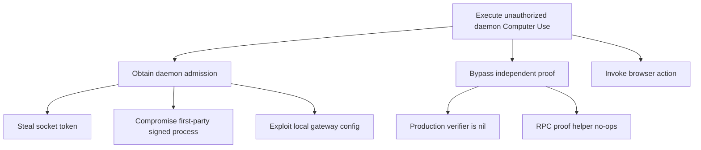
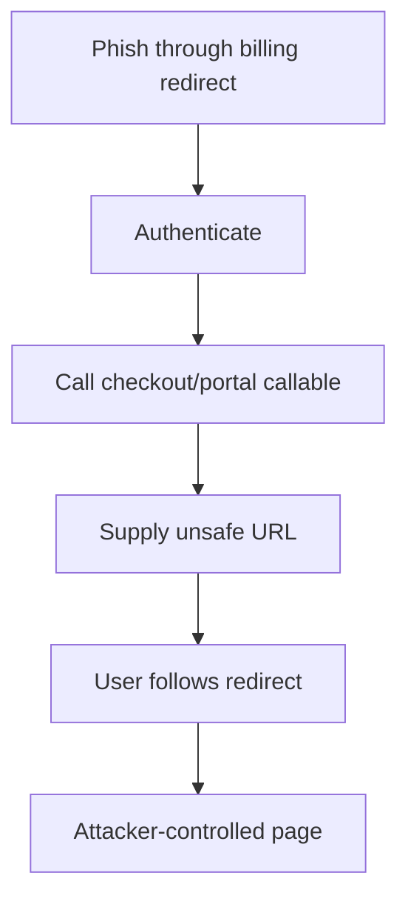
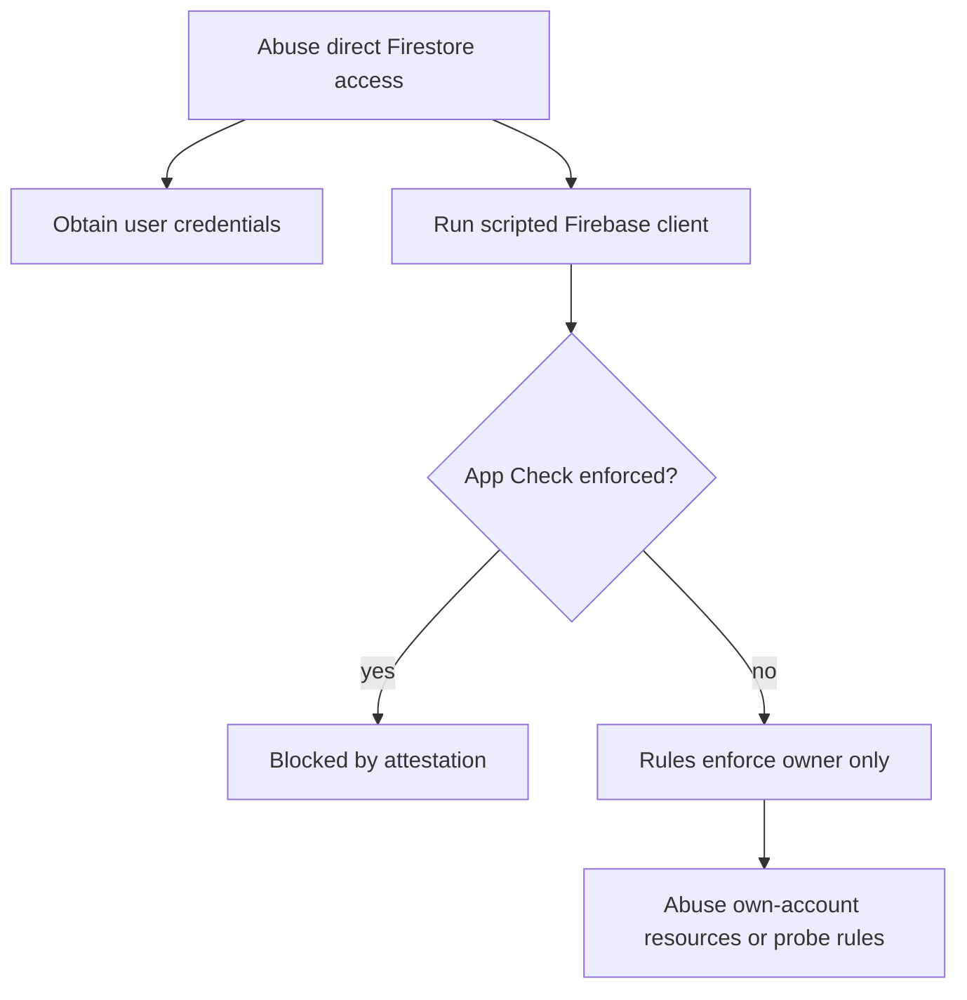
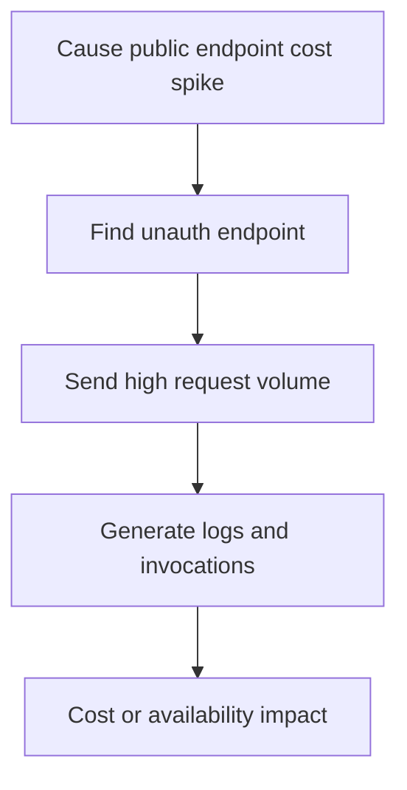
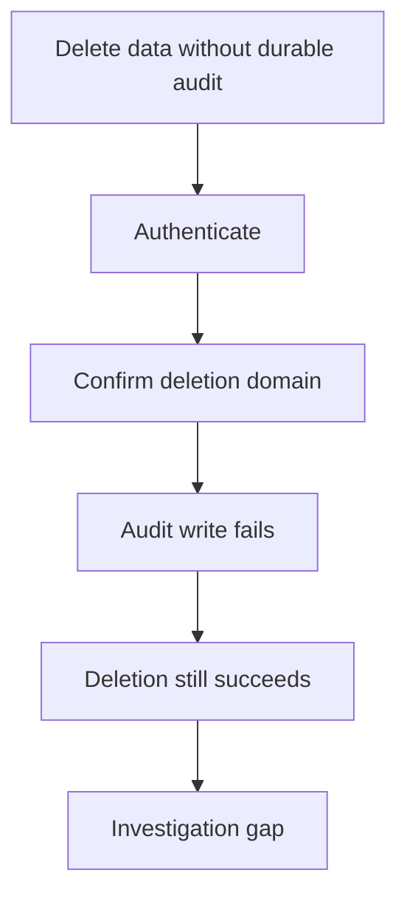
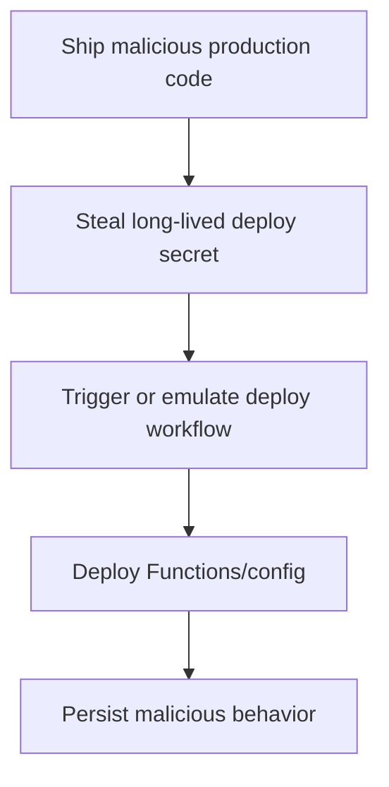

# Abuse Cases and Attack Trees

## ABUSE-001: Unauthorized local Computer Use through daemon

Narrative: An attacker compromises or injects into an admitted first-party local process, or obtains the daemon socket token. They call daemon Computer Use start/invoke. Because the production executable passes no local-auth proof verifier, the independent mobile/device proof boundary is absent.

Impacted assets: ASSET-008, ASSET-007, user browser/session data.

Controls: socket token, release code-signature peer auth, capability profile, approval/audit gate.

Gaps: FINDING-001 and FINDING-002.

Detection: Computer Use action audit entries missing local proof ID; daemon telemetry from unexpected peer.

Tests: production daemon config rejects missing proof; kill-switch true denies daemon browser action.

Mitigation: wire verifier in production and use live entitlement/kill-switch context.

Attack tree:

## ABUSE-002: Billing redirect phishing

Narrative: An authenticated malicious client creates a Stripe checkout or portal session with a crafted return URL using a hostname containing `localhost` but controlled by the attacker.

Impacted assets: ASSET-012 and user trust.

Controls: Auth/App Check, Stripe hosted checkout, webhook signature.

Gaps: FINDING-003.

Detection: anomalous checkout return URLs in logs.

Tests: URL validator rejects non-HTTPS non-loopback and substring hosts.

Attack tree:

## ABUSE-003: Direct Firestore scripted client abuse

Narrative: A compromised user account or scripted client talks directly to Firestore. Rules protect ownership, but if App Check enforcement is not enabled in production, app attestation does not constrain the direct client.

Impacted assets: ASSET-009.

Controls: owner-scoped Firestore rules, server-only secret refs, Functions App Check fail-closed.

Gaps: FINDING-004.

Detection: Firebase App Check missing/enforcement drift, unusual client SDK patterns.

Mitigation: deployment verifier and app attestation enforcement evidence.

Attack tree:

## ABUSE-004: Public endpoint denial-of-wallet

Narrative: An unauthenticated attacker repeatedly calls public HTTP endpoints such as discovery or rundown endpoints. If edge rate limits are absent, maxInstances limits concurrency but not necessarily cost or log volume.

Impacted assets: ASSET-013, service availability, cost budget.

Controls: maxInstances and validation on some handlers.

Gaps: FINDING-005.

Detection: request volume and cost spikes.

Mitigation: product-layer or edge rate limits with CI inventory.

Attack tree:

## ABUSE-005: Deletion without audit evidence

Narrative: A user or compromised account triggers deletion during an audit write outage. The deletion completes while the audit record is absent.

Impacted assets: ASSET-009, ASSET-013.

Controls: Auth/App Check, confirmation string, domain registry.

Gaps: FINDING-006.

Detection: deletion count without audit intent/completion.

Mitigation: pre-delete required audit intent.

Attack tree:

## ABUSE-006: Production deploy secret compromise

Narrative: An attacker obtains a long-lived Firebase token or service-account JSON secret. They can deploy or influence production without relying on short-lived OIDC/WIF identity.

Impacted assets: ASSET-010 and production data plane.

Controls: production environment, health gate, rollback, scans.

Gaps: FINDING-007.

Detection: GitHub and Firebase deploy audit logs.

Mitigation: WIF-only deployment and secret fallback removal.

Attack tree:

## Other Abuse Cases Considered

| Abuse case | Result |
|---|---|
| Account takeover | No direct ATO path found; Firebase Auth/passkey flows have reasonable controls. |
| Cross-user data access | Controlled by owner rules and endpoint tests; keep BOLA tests mandatory. |
| Webhook forgery | Stripe and knowledge webhooks verify signatures. |
| Secrets exfiltration through logs | Scrubbers and tests exist; periodic sampling still recommended. |
| Remote MCP token theft | Short-lived/scoped/rate-limited; residual 15 minute replay window. |
| Prompt injection leading to tool misuse | Capability gates and approvals exist; daemon production gaps and adversarial tests remain. |

