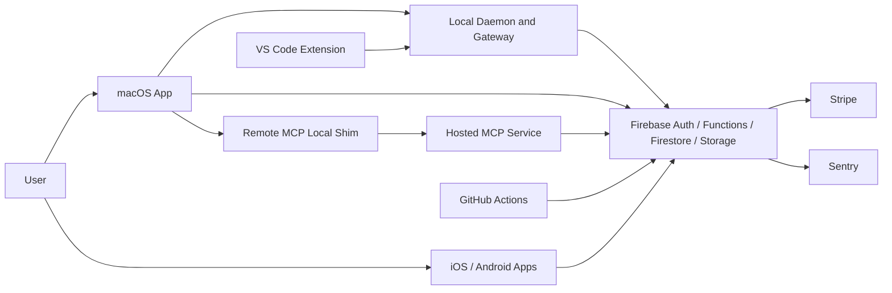
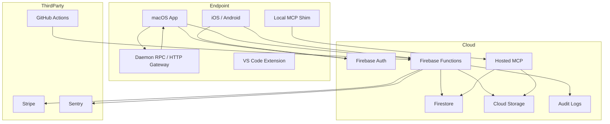
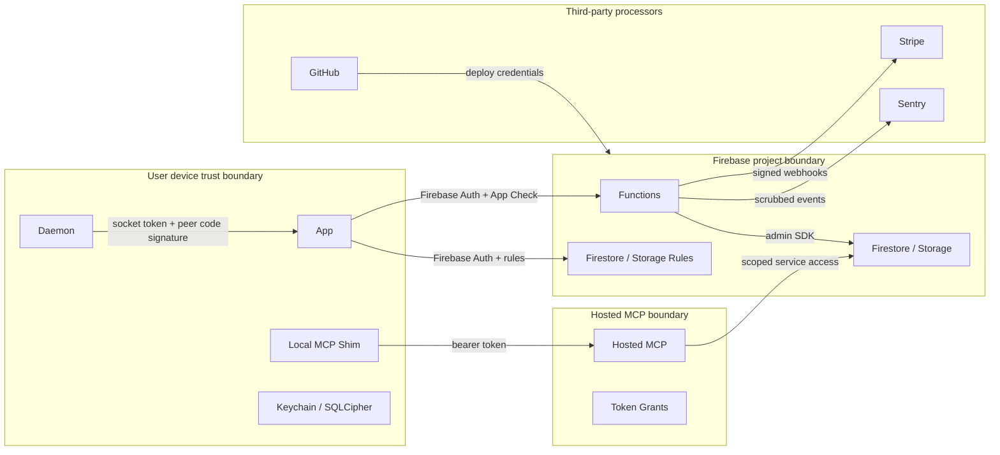

# Architecture and Data Flows

## C.1 Component Inventory

| ID | Name | Type | Purpose | Trust level | Secrets handled | Data handled | Exposed interfaces | Auth | Authz | Logging | Persistence | Evidence |
|---|---|---|---|---|---|---|---|---|---|---|---|---|
| CAP-001 | macOS app | desktop app | User UI, local storage, Firebase client, Computer Use coordinator | user endpoint | Firebase tokens, local secrets, vault keys | sessions, usage, prompts, approvals | Firebase SDK, daemon IPC, local files | Firebase Auth | Firestore rules, app logic | Sentry scrubber | SQLCipher, Keychain | `AgentLens/`, `AgentLensApp.swift:1842-1907` |
| CAP-002 | local daemon/gateway | local service | Local RPC and Computer Use browser/system surface | local privileged boundary | socket token, gateway token | Computer Use intents/results | UNIX socket, loopback HTTP | token, code-signature peer gate | capability profile and Computer Use gate | local logs/audit | memory/local state | `OpenBurnBarDaemonServer.swift`, `BurnBarDaemonPeerAuthenticator.swift` |
| CAP-003 | Firebase Functions | serverless API | callable APIs, billing, webhooks, export/delete, audit | server trusted | Firebase params, Stripe secrets | account, usage, encrypted refs, audit | HTTPS callable/onRequest | Firebase Auth, App Check, signatures | owner checks, high-risk proof | scrubbed structured logs | Firestore/Storage | `functions/src/auth.ts`, `logging.ts` |
| CAP-004 | Firestore/Storage | cloud datastore | Sync, server records, ciphertext object storage | cloud data plane | service account only | user docs, ciphertext, audit | Firebase SDK/Rules | Firebase Auth, deployment App Check | rules and server-only paths | Firebase logs | Firestore/Storage | `firestore.rules`, `storage.rules` |
| CAP-005 | hosted MCP | Node service | Remote MCP resource/tool gateway | server trusted but scope-limited | signing keys, bearer tokens | encrypted resources, metadata | HTTPS `/mcp`, token routes | bearer tokens, origin checks | scopes, client, entitlement, rate limits | hashed audit | Firestore | `services/hosted-mcp/src` |
| CAP-006 | remote MCP local shim | local CLI/service | Local vault key and decrypt/search bridge | user endpoint | vault key, refresh token | ciphertext, local decrypted data | local MCP stdio/HTTP | token to hosted MCP | local process boundary | local logs | Keychain | `tools/openburnbar-mcp-remote/src` |
| CAP-007 | iOS app | mobile app | Mobile UI, approvals, media | user endpoint | Firebase tokens, device keys | approvals, media, usage | Firebase, push, iroh | Firebase Auth | Firestore rules/app logic | Sentry/platform logs | local platform storage | `OpenBurnBarMobile/` |
| CAP-008 | Android app | mobile app | Android parity, Firebase client, media/iroh | user endpoint | Firebase tokens, device keys | usage, media, approvals | Firebase, FCM, iroh | Firebase Auth | Firestore rules/app logic | Sentry/Firebase logs | Android storage | `android/` |
| CAP-009 | VS Code extension | extension | Developer IDE integration | user endpoint | extension tokens/config | alerts and local integration data | VS Code APIs, daemon | local/session auth | extension alerting policy | extension logs | local extension storage | `extensions/openburnbar/` |
| CAP-010 | CI/CD | release pipeline | Build, scan, test, deploy, attest | highly trusted | GitHub/Firebase/GCP secrets | artifacts, SBOM, deploy configs | GitHub Actions | GitHub permissions/OIDC/secrets | branch/env rules | workflow logs | artifacts | `.github/workflows/` |

## C.2 System Context Diagram

## Container Diagram

## Trust Boundary Diagram

## Major Data Flows

### FLOW-001: Signup/Login

Actors: user, macOS/iOS/Android client, Firebase Auth.

Protocol: HTTPS through Firebase SDK.

Data: identity provider credentials/tokens, UID, email/profile metadata.

Controls: Firebase Auth, client token handling, Keychain/Firebase Auth keychain support on Apple.

Evidence: `AgentLens/Services/AccountManager.swift:1-18,104-132,804-825`.

Gaps: production support/admin access to identity data is not repo-visible.

### FLOW-002: Passkey Login

Actors: client, Functions, Firestore, Firebase Auth custom token.

Controls: App Check, WebAuthn user verification, challenge TTL, transactional challenge consumption, counter update, expected origin/RP ID.

Evidence: `functions/src/callables/passkey.ts:1-9,33-36,148-318`.

Gaps: phishing resistance depends on configured origins and platform WebAuthn support.

### FLOW-003: Protected Callable API

Actors: client, Functions, Firestore/Storage.

Controls: `assertAuth`, `assertAppCheck`, `assertOwnership`, generated endpoint authorization catalog, high-risk nonce for sensitive actions.

Evidence: `functions/src/auth.ts:22-72`, `functions/src/security/endpointAuthorizationCatalog.generated.ts`, `functions/src/appCheckAttestation.ts:236-255`.

Gaps: direct Firestore App Check enforcement is deployment-state dependent.

### FLOW-004: Cloud Vault Encrypted Data Upload/Export

Actors: client, Functions, Firestore/Storage.

Data: AES-GCM sealed records, AAD, ciphertext object refs, export signed URLs.

Controls: context-bound AAD, envelope validation, owner-scoped storage paths, export high-risk owner proof, sanitizer for end-to-end fields, fail-closed export audit.

Evidence: `CloudVaultCrypto.swift:31-82,470-486`, `validators.ts:226-341`, `storage.ts:25-93`, `dataExport.ts:510-660`.

Gaps: broad Signal/E2EE claims are unsafe.

### FLOW-005: Remote MCP Grant and Use

Actors: client, Functions, hosted MCP, local shim, Firestore/Storage.

Controls: high-risk owner proof for grant, hashed refresh tokens, short-lived access tokens, Ed25519 production posture, scopes, client ID, entitlement, rate limits, local shim decryption.

Evidence: `remoteMcp.ts:24-78`, `remoteMcpGrant.ts:38-104`, `hosted-mcp/src/auth.ts:152-187`, `oauthToken.ts:106-171`, `toolRegistry.ts:197-210`.

Gaps: production signing-key rotation process and human access review not fully visible.

### FLOW-006: Daemon RPC/Gateway

Actors: macOS app/CLI/extension, daemon.

Controls: daemon socket token, constant-time compare, release code-signature peer authenticator, fail-closed config, loopback-only gateway defaults, CORS local-only.

Evidence: `OpenBurnBarDaemonServer.swift:235-243,384-452`, `OpenBurnBarDaemonConfiguration.swift:95-121,193-291`, `BurnBarDaemonPeerAuthenticator.swift:69-121`.

Gaps: Computer Use local-auth proof verifier not wired in production executable.

### FLOW-007: Computer Use Action

Actors: user, macOS app, mobile approval, daemon, Computer Use service.

Controls: capability gate, deny regions, phone trust downgrade, approvals, audit-before-action reservation, audit chain, panic halt.

Evidence: `ComputerUseCapabilityGate.swift:232-373`, `ComputerUseRunCoordinator.swift:220-428`, `Approvals.swift:49-108,163-260`, `ComputerUseAuditChain.swift:81-180`.

Gaps: daemon browser path uses synthetic entitlement and killSwitch false; daemon local-auth proof not wired.

### FLOW-008: Stripe Billing and Webhook

Actors: client, Functions, Stripe.

Controls: Auth/App Check on checkout/portal callables, Stripe webhook raw-body signature verification, idempotency/reservation.

Evidence: `stripe.ts:229-254,314-341,536-575`.

Gaps: return URL validator accepts unsafe non-HTTPS localhost-substring hosts.

### FLOW-009: Data Export/Delete

Actors: user, Functions, Firestore/Storage.

Controls: Auth/App Check, high-risk owner proof for export, domain registry, sealed field sanitizer, short-lived signed refs, audit log.

Evidence: `dataExport.ts:1-31,576-660`, `dataDeletion.ts:43-115`.

Gaps: deletion audit is best-effort.

### FLOW-010: CI Release

Actors: GitHub Actions, Firebase/GCP, dependency registries.

Controls: pinned actions, CodeQL, gitleaks, dependency review, npm audit, OSV, confidentiality guard, provenance/SBOM, production environment and rollback.

Evidence: `.github/workflows/security-pr.yml`, `.github/workflows/codeql.yml`, `.github/workflows/supply-chain-provenance.yml`, `.github/workflows/deploy-production.yml`.

Gaps: production deploy long-lived secret fallbacks remain.

