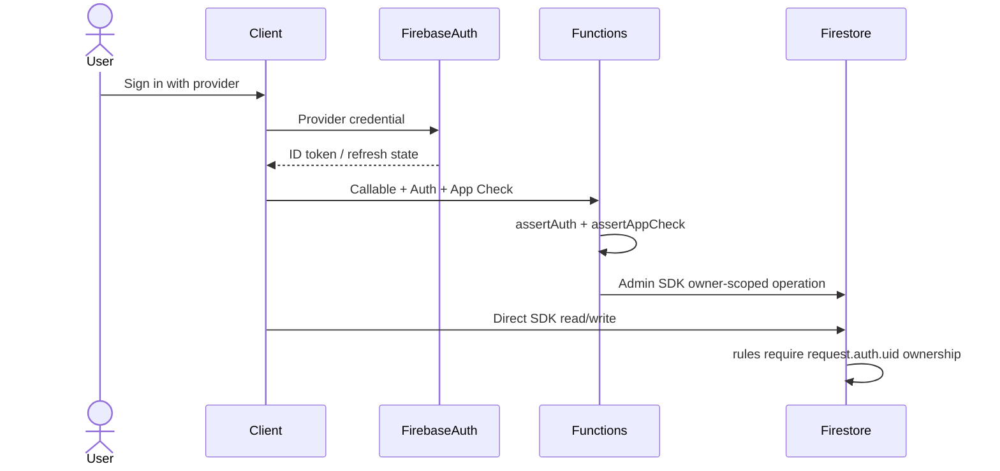
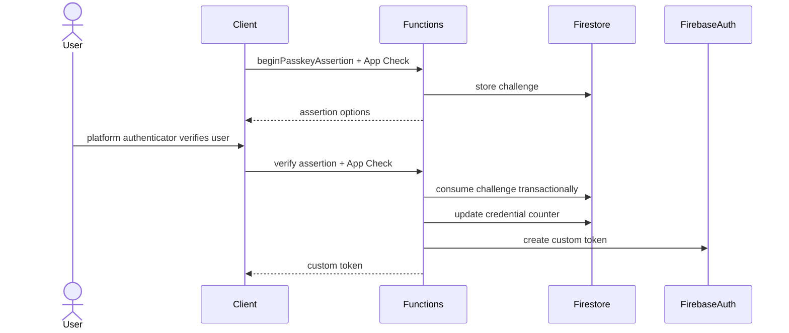
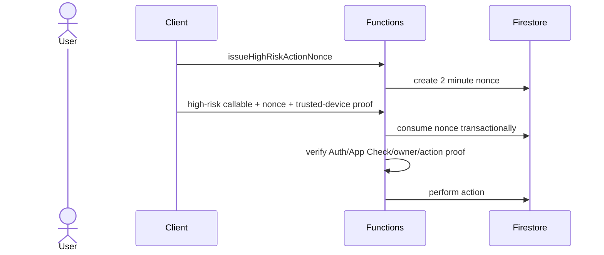
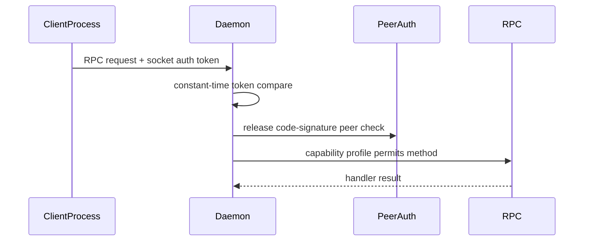

# Authentication, Authorization, and Identity Review

## F.1 Auth Flow Diagrams

### Firebase Sign-In

Evidence:

- `functions/src/auth.ts:39-72` implements Auth and App Check helper checks.
- `functions/src/config.ts:384-399` fails closed in production when App Check is disabled.
- `firestore.rules` enforces owner and server-only paths.

### Passkey Assertion

Evidence:

- `functions/src/callables/passkey.ts:1-9,33-36,244-318`.

### High-Risk Owner Action

Evidence:

- `functions/src/appCheckAttestation.ts:155-207,236-255`.
- `functions/src/callables/highRiskOwnerAction.ts:26-58`.

### Daemon RPC

Evidence:

- `OpenBurnBarDaemonServer.swift:384-452`.
- `BurnBarDaemonPeerAuthenticator.swift:69-121`.

Gap:

- Computer Use local-auth proof verifier is not wired in production executable.

## F.2 Authorization Matrix

| Resource | Operation | Allowed actors | Check location | Ownership check | Tenant check | Admin override | Tests | Gaps |
|---|---|---|---|---|---|---|---|---|
| Firestore `users/{uid}` data | read/write | owning user, server | `firestore.rules` | request.auth.uid path | user UID | server only | Firestore emulator tests | App Check state external |
| `provider_account_secret_refs` | read/write | none from client | `firestore.rules:1373-1374` | n/a | n/a | server only | rules tests | admin access unknown |
| session log bodies | read/create/update | owner reads metadata, body chunks server only | `firestore.rules:2226-2235` | owner path | UID | server only | privacy/rules tests | storage retention unknown |
| high-risk nonces | read/write | server only | `firestore.rules:4449-4451` | n/a | n/a | server only | high-risk nonce tests | none found |
| callable APIs | invoke | signed-in client + App Check unless public/webhook | `functions/src/auth.ts`, endpoint catalog | helper-specific | UID | callable-specific | endpoint auth matrix tests | public inventory rate limits |
| data export | execute | owner with high-risk proof | `dataExport.ts` | uid match | UID | no silent override found | export tests | none found |
| data deletion | execute | owner with confirmation | `dataDeletion.ts` | uid match | UID | no silent override found | deletion tests expected | audit best-effort |
| Stripe checkout/portal | create session | owner | `stripe.ts` | uid/customer mapping | UID | no | Stripe callable tests expected | URL validation bug |
| Stripe webhook | process event | Stripe signed webhook | `stripe.ts:536-575` | customer mapping | UID derived | n/a | webhook tests expected | none core |
| hosted MCP resources | read/call tool | bearer token with client, scope, entitlement | `hosted-mcp/src/auth.ts`, `toolRegistry.ts` | uid in token/grant | UID | no broad override found | hosted MCP tests | key rotation unknown |
| daemon RPC | execute method | local authorized process | daemon server + peer authenticator | local endpoint | device | capability profile | daemon tests | local proof not wired for Computer Use |
| Computer Use action | execute | user/session subject with approval or trust policy | capability gate/coordinator | session/action context | UID/session | no silent auto-pilot intended | Computer Use tests | daemon synthetic context |
| production deploy | deploy | GitHub environment actor/workflow | GitHub Actions env/secrets | repo/env | n/a | maintainers | workflow gates | long-lived fallback secrets |

## F.3 Test Coverage

Existing test evidence found:

- Endpoint authorization and BOLA catalog coverage in `functions/src/__tests__`.
- High-risk owner action static guard coverage in `functions/src/__tests__/highRiskOwnerActionCallableGuards.test.ts`.
- Logging scrubber tests in `functions/src/__tests__/logging.test.ts` and `loggingScrubber.test.ts`.
- Daemon local-auth proof tests in `OpenBurnBarDaemon/Tests/OpenBurnBarDaemonTests/BurnBarDaemonComputerUseLocalAuthProofWiringTests.swift`.
- Daemon code-signature policy tests in `OpenBurnBarDaemon/Tests/OpenBurnBarDaemonTests/BurnBarDaemonPeerCodesigPolicyTests.swift`.
- Hosted MCP auth/rate/token posture tests in `services/hosted-mcp`.
- Firestore emulator tests referenced by security CI.

Missing or insufficient tests:

- Production executable daemon local-auth proof wiring.
- Daemon kill switch and live entitlement context.
- `boundedHttpsURL` exact-loopback and Stripe redirect tests.
- Firestore App Check deployment-state verifier.
- Public Function rate-limit inventory tests.
- Deletion audit fail-closed or durable-intent tests.
- Static policy preventing long-lived production deploy token fallback.

