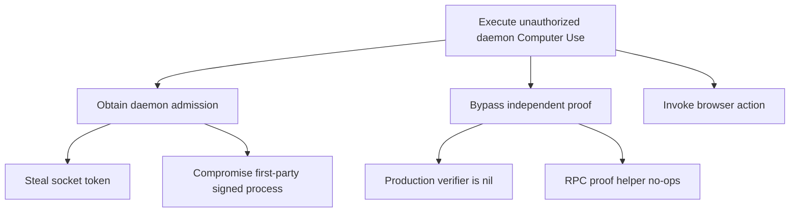
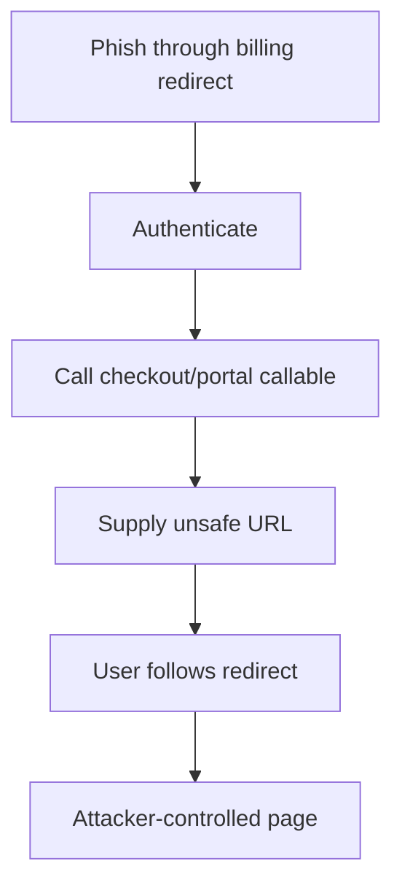
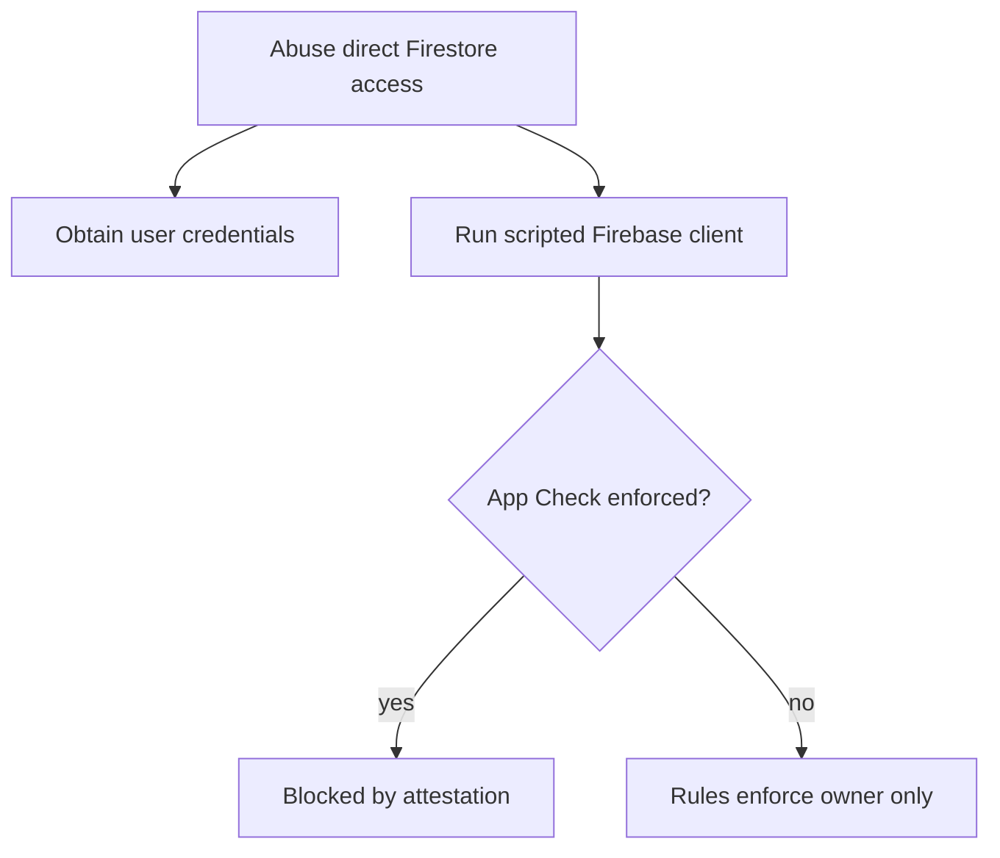
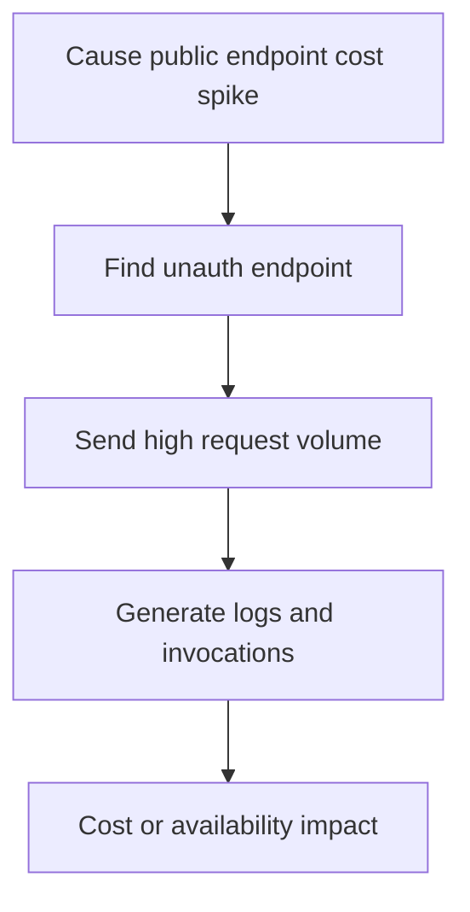
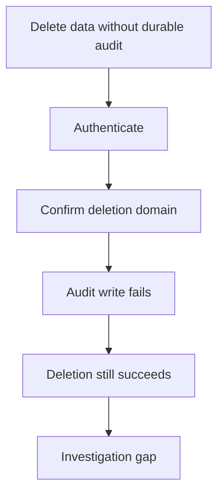
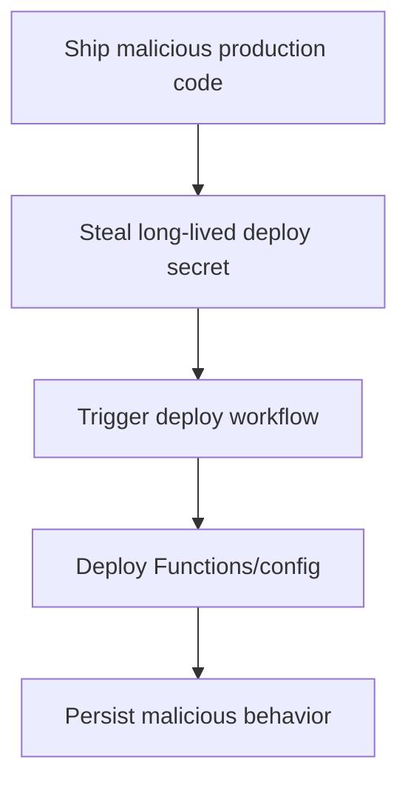

# Abuse Cases and Attack Trees

## ABUSE-001: Unauthorized local Computer Use through daemon

An attacker compromises or injects into an admitted first-party local process, or obtains the daemon socket token. They call daemon Computer Use start/invoke. Because the production executable passes no local-auth proof verifier, the independent mobile/device proof boundary is absent.

Controls: socket token, release code-signature peer auth, capability profile, approval/audit gate.

Gaps: FINDING-001 and FINDING-002.

## ABUSE-002: Billing redirect phishing

An authenticated malicious client creates a Stripe checkout or portal session with a crafted return URL using a hostname containing `localhost` but controlled by the attacker.

Controls: Auth/App Check, Stripe hosted checkout, webhook signature.

Gap: FINDING-003.

## ABUSE-003: Direct Firestore scripted client abuse

A compromised user account or scripted client talks directly to Firestore. Rules protect ownership, but if App Check enforcement is not enabled in production, app attestation does not constrain the direct client.

Gap: FINDING-004.

## ABUSE-004: Public endpoint denial-of-wallet

Gap: FINDING-005.

## ABUSE-005: Deletion without audit evidence

Gap: FINDING-006.

## ABUSE-006: Production deploy secret compromise

Gap: FINDING-007.

## Other Abuse Cases Considered

| Abuse case | Result |
|---|---|
| Account takeover | No direct ATO path found; Firebase Auth/passkey flows have reasonable controls. |
| Cross-user data access | Controlled by owner rules and endpoint tests; keep BOLA tests mandatory. |
| Webhook forgery | Stripe and knowledge webhooks verify signatures. |
| Secrets exfiltration through logs | Scrubbers and tests exist; periodic sampling still recommended. |
| Remote MCP token theft | Short-lived/scoped/rate-limited; residual 15 minute replay window. |
| Prompt injection leading to tool misuse | Capability gates and approvals exist; daemon production gaps and adversarial tests remain. |

