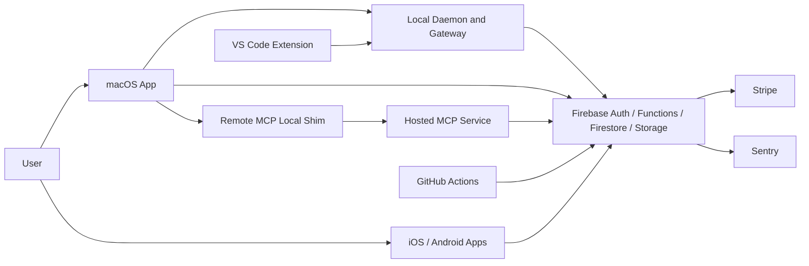
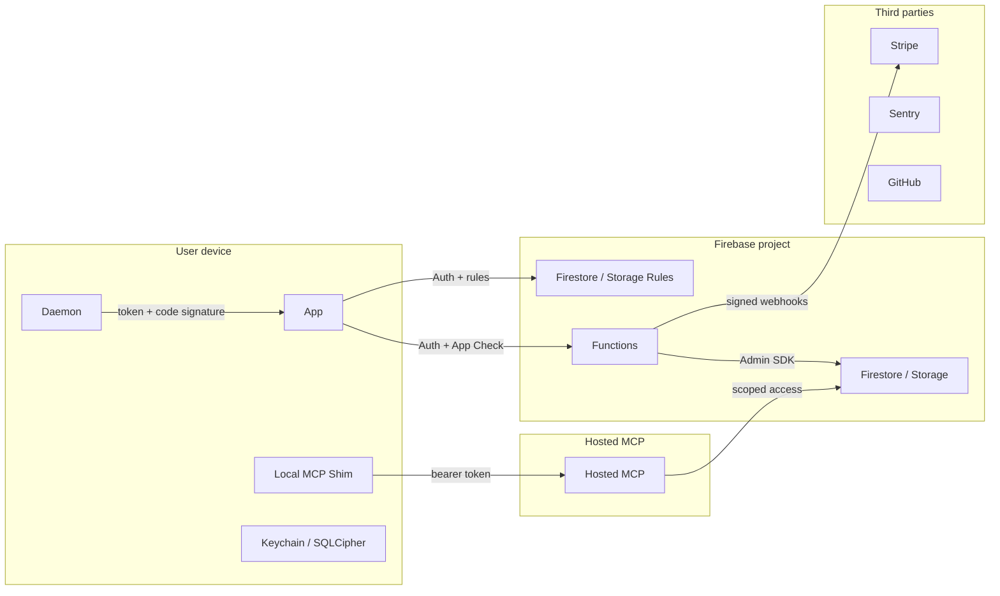

# Architecture and Data Flows

## Component Inventory

| ID | Name | Type | Purpose | Trust level | Secrets/data handled | Interfaces | Security notes |
|---|---|---|---|---|---|---|---|
| CAP-001 | macOS app | desktop app | UI, local storage, Firebase client, Computer Use coordination | user endpoint | Firebase tokens, vault keys, sessions | Firebase SDK, daemon IPC | Keychain, SQLCipher, Sentry scrubber |
| CAP-002 | local daemon/gateway | local service | local RPC and Computer Use execution | local privileged boundary | socket/gateway tokens, action intents | UNIX socket, loopback HTTP | token auth, release peer code signature, local proof gap |
| CAP-003 | Firebase Functions | serverless API | callables, billing, webhooks, export/delete, audit | server trusted | account, usage, encrypted refs | HTTPS callable/onRequest | Auth/App Check, high-risk nonces |
| CAP-004 | Firestore/Storage | cloud datastore | sync and encrypted objects | cloud data plane | user docs, ciphertext, audit | Firebase SDK/rules | owner rules; App Check state external |
| CAP-005 | hosted MCP | Node service | remote MCP gateway | server trusted but scope-limited | tokens, metadata, encrypted resources | HTTPS `/mcp` | bearer, scopes, rate limits, local decrypt model |
| CAP-006 | remote MCP local shim | local service | local vault key and decrypt bridge | user endpoint | vault key, refresh token | local MCP and hosted HTTPS | Keychain and trusted endpoint checks |
| CAP-007 | mobile apps | iOS/Android | mobile UI, approvals, media | user endpoint | Firebase tokens, device keys | Firebase, push, iroh | mobile approval and device state |
| CAP-008 | VS Code extension | extension | IDE integration | user endpoint | extension config/tokens | VS Code APIs, daemon | alerting policy |
| CAP-009 | CI/CD | release pipeline | build, scan, deploy, attest | highly trusted | deploy secrets, artifacts | GitHub Actions | scans, provenance, deploy fallback gap |

## System Context

## Trust Boundaries

## Security-Critical Data Flows

| ID | Flow | Controls | Gaps | Evidence |
|---|---|---|---|---|
| FLOW-001 | Signup/login | Firebase Auth, client token handling | production support access unknown | `AgentLens/Services/AccountManager.swift` |
| FLOW-002 | Passkey login | App Check, WebAuthn user verification, challenge TTL, transactional consume | configured origins must stay correct | `functions/src/callables/passkey.ts:148-318` |
| FLOW-003 | Protected callable API | Auth, App Check, ownership, endpoint catalog, high-risk nonce | direct Firestore App Check proof external | `functions/src/auth.ts:22-72` |
| FLOW-004 | Cloud Vault export | AES-GCM AAD, envelope validation, owner-scoped storage, export proof | broad Signal claims unsafe | `CloudVaultCrypto.swift`, `dataExport.ts` |
| FLOW-005 | Remote MCP grant/use | high-risk owner proof, scoped short-lived tokens, local decrypt, rate limits | signer rotation runbook unknown | `remoteMcp.ts`, `hosted-mcp/src` |
| FLOW-006 | Daemon RPC/gateway | socket token, constant-time compare, release peer auth, capability profile | local-auth proof not wired for Computer Use | `OpenBurnBarDaemonServer.swift`, `OpenBurnBarDaemonMain.swift` |
| FLOW-007 | Computer Use action | capability gate, approvals, deny regions, audit chain, panic halt | daemon synthetic entitlement and kill switch | `ComputerUseCapabilityGate.swift`, `ComputerUseService.swift` |
| FLOW-008 | Stripe billing | Auth/App Check, webhook signature, idempotency | return URL validation bug | `functions/src/callables/stripe.ts` |
| FLOW-009 | Data export/delete | export high-risk proof and required audit; deletion confirmation | deletion audit best-effort | `dataExport.ts`, `dataDeletion.ts` |
| FLOW-010 | CI release | pinned actions, CodeQL, gitleaks, OSV, provenance, rollback | long-lived deploy fallback | `.github/workflows/` |

