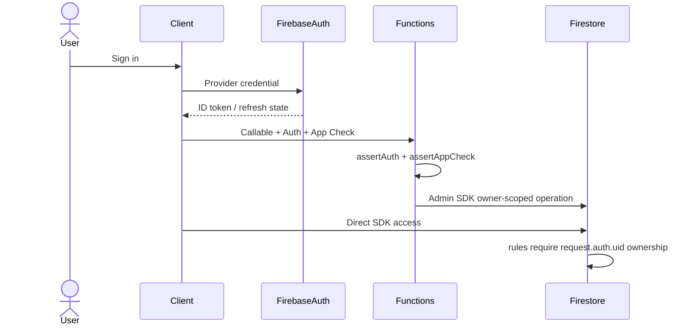

# Authentication, Authorization, and Identity Review

## Auth Flows

### Firebase Sign-In

Evidence: `functions/src/auth.ts:39-72`, `functions/src/config.ts:384-399`, `firestore.rules`.

### Passkey Assertion

Controls: App Check, WebAuthn user verification, challenge TTL, transactional challenge consumption, counter update, expected origin/RP ID.

Evidence: `functions/src/callables/passkey.ts:1-9,33-36,148-318`.

### High-Risk Owner Action

Controls: Auth, App Check, 2 minute nonce, transactional nonce consume, trusted-device action proof.

Evidence: `functions/src/appCheckAttestation.ts:155-207,236-255`, `functions/src/callables/highRiskOwnerAction.ts:26-58`.

### Daemon RPC

Controls: socket auth token, constant-time token compare, release code-signature peer check, capability profile.

Evidence: `OpenBurnBarDaemonServer.swift:384-452`, `BurnBarDaemonPeerAuthenticator.swift:69-121`.

Gap: Computer Use local-auth proof verifier is not wired in production executable.

## Authorization Matrix

| Resource | Operation | Allowed actors | Check location | Ownership check | Tests | Gaps |
|---|---|---|---|---|---|---|
| Firestore `users/{uid}` data | read/write | owning user, server | `firestore.rules` | path UID | emulator tests | App Check state external |
| `provider_account_secret_refs` | read/write | server only | `firestore.rules:1373-1374` | n/a | rules tests | admin access unknown |
| high-risk nonces | read/write | server only | `firestore.rules:4449-4451` | n/a | high-risk tests | none found |
| callable APIs | invoke | signed-in client + App Check unless public/webhook | `auth.ts`, endpoint catalog | helper-specific | endpoint matrix tests | public inventory rate limits |
| data export | execute | owner with high-risk proof | `dataExport.ts` | uid match | export tests | none found |
| data deletion | execute | owner with confirmation | `dataDeletion.ts` | uid match | deletion tests expected | audit best-effort |
| Stripe checkout/portal | create session | owner | `stripe.ts` | uid/customer mapping | Stripe tests expected | URL validation bug |
| Stripe webhook | process event | Stripe signed webhook | `stripe.ts:536-575` | customer mapping | webhook tests expected | none core |
| hosted MCP resources | read/call tool | bearer token with client/scope/entitlement | `auth.ts`, `toolRegistry.ts` | uid in token/grant | hosted MCP tests | rotation runbook unknown |
| daemon RPC | execute method | local authorized process | daemon server + peer authenticator | local endpoint | daemon tests | local proof not wired for Computer Use |
| Computer Use action | execute | user/session subject with approval/trust policy | capability gate/coordinator | session/action context | Computer Use tests | daemon synthetic context |

## Missing Tests

- Production executable daemon local-auth proof wiring.
- Daemon kill switch and live entitlement context.
- `boundedHttpsURL` exact-loopback and Stripe redirect tests.
- Firestore App Check deployment-state verifier.
- Public Function rate-limit inventory tests.
- Deletion durable audit tests.
- Static policy preventing long-lived production deploy token fallback.

