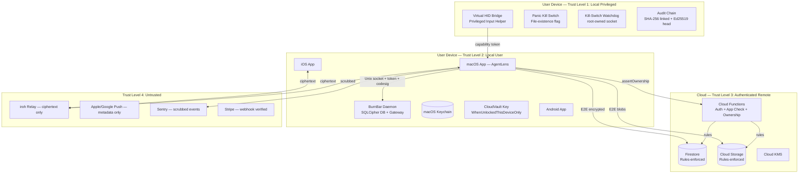

# Architecture and Data Flows

## C.1 System Context Diagram

## C.2 Trust Boundary Analysis

| Boundary | From | To | Mechanism |
|----------|------|----|-----------|
| Network -> Cloud | Any client | Cloud Functions | Firebase Auth token + App Check attestation |
| User A -> User B | Authenticated user A | User B's data | `assertOwnership(request, uid)` + Firestore `ownsUserNamespace` rules |
| Cloud -> CloudVault | Server | Sealed payload | Server never sees vault key; AEAD ciphertext only |
| App -> Daemon | Local user app | Privileged daemon | Unix socket (0600) + bearer token (constant-time) + peer codesig |
| App -> HID | Agent controller | Privileged input | Capability token (Ed25519-signed, escrow+attestation bound, nonce) |
| HID -> Kill Switch | Any HID dispatch | Panic flag | `PrivilegedInputKillSwitch.assertNotActive()` before every dispatch |
| Phone -> Mac | Paired phone | Mac trust mode | Ed25519-signed authority envelope + monotonic counter + freshness window |

## C.3 Critical Data Flows

### FLOW-001: CloudVault Write (Session Content)
- **Evidence:** `CloudVaultCrypto.swift`, `firestore.rules:validPathBoundSealedPayloadForUser`
- **Path:** App -> AES-256-GCM seal (path-bound AAD: `uid|collection|docID|field|schemaVersion|purpose`) -> Firestore/Storage
- **Auth:** Firebase Auth + `assertOwnership` + Firestore rules
- **Encryption:** Client-side AEAD before upload; vault key in Keychain
- **Plaintext locations:** Local device only (SQLCipher daemon DB, in-memory)
- **Tests:** CloudVault AAD rules tests, `signalAtRestWrite.test.ts`
- **Gap:** `chat_threads` and `cli_sessions` still use global AAD (FINDING-008)

### FLOW-002: Computer Use Privileged Input Dispatch
- **Evidence:** `PrivilegedInputDispatchHandler.swift:44-46`, `VirtualHIDBridgeCapabilityGate.swift`, `ComputerUseSessionCoordinator.swift:~530`
- **Path:** Agent request -> capability gate decision -> audit entry reservation (BEFORE action) -> HID dispatch
- **Auth:** Capability token (Ed25519-signed, single-use nonce, escrow+attestation+scope bound)
- **Kill switch:** Checked at `PrivilegedInputDispatchHandler.handle()` line ~44 AND `VirtualHIDKeyboardEngine.dispatch()` line ~59 (belt-and-suspenders)
- **Audit:** `reserveAuditEntry` BEFORE dispatch; if reservation throws, action denied (`denyReason: audit_failure`)
- **Gap:** Local-auth-proof verifier is nil in production (FINDING-002)

### FLOW-003: High-Risk Callable
- **Evidence:** `appCheckAttestation.ts:enforceHighRiskComputerUseCallableWithNonce`, `auth.ts:assertOwnership`
- **Path:** Client -> callable -> `enforceHighRiskComputerUseCallableWithNonce()` -> nonce consume + attestation verify -> operation
- **Auth:** Firebase Auth + App Check + attestation binding (claim must match live `request.app.appId`)
- **Replay protection:** Single-use nonce in Firestore (2-min TTL, `high_risk_action_nonces` collection)
- **Gap:** Att max-age 30 days (FINDING-007)

### FLOW-004: Account Deletion
- **Evidence:** `accountDeletion.ts:eraseUserCloudData`
- **Steps:** (1) KMS destroy secrets (2) delete `voip_outbound`+`fcm_outbound` root docs (3) delete root collections (4) delete `users/{uid}` subtree (5) delete `workspaces/workspace-{uid}` subtree (6) purge Storage prefixes (7) delete Auth user (only if secrets destroyed)
- **Gap:** Storage purge best-effort (FINDING-013)

### FLOW-005: Payment Webhook (Stripe)
- **Evidence:** `callables/stripe.ts:548-575`
- **Path:** Stripe -> HTTP endpoint -> `constructEvent(rawBody, signature, webhookSecret)` -> lease-based idempotency -> entitlement update
- **Auth:** Stripe webhook signature verification
- **Replay:** 10-min processing lease on `stripe_webhook_events/{eventID}`
- **Gap:** None

### FLOW-006: iroh P2P Communication
- **Evidence:** `IrohRelayPairing.swift`, `HermesIrohRelayTransport.kt`, `IrohPairingHostKeyPinStore.kt`
- **Path:** Paired devices -> iroh QUIC -> encrypted HermesRelayFrame
- **Auth:** Ed25519 device identity + key-change pinning (all platforms)
- **Gap:** First-contact safety-number not default-on (FINDING-005)

### FLOW-007: Session Log Sync
- **Evidence:** `SessionLogSyncService.swift`, `firestore.rules:validSessionLogManifestCore`
- **Path:** App -> seal body (AES-256-GCM with path-bound AAD) -> Storage; seal manifest -> Firestore; keyed HMAC search hashes -> Firestore
- **Legacy:** Plaintext fields actively deleted via `FieldValue.delete()`; `legacyPlaintextFields` list
- **Allowlist:** `validSessionLogManifestKeys()` is the FIRST conjunct of `validSessionLogManifestCore` (M-005 fix confirmed)
- **Gap:** None after M-005 fix

### FLOW-008: Push Notification
- **Evidence:** `voipPush.ts:buildVoipApnsPayload`, `check-privacy-invariants.mjs` (I5 invariant)
- **Path:** Cloud Functions -> APNs/FCM -> device
- **Data:** `callId`, ephemeral `correlationId` (fresh UUID per push), "Incoming call" label
- **CI enforcement:** I5 invariant bans `connectionId`, `pairedDeviceId`, `displayName` from payloads
- **Gap:** Stable routing IDs visible to APNs/FCM by design (FINDING-010, accepted)

### FLOW-009: Daemon Socket RPC
- **Evidence:** `OpenBurnBarDaemonServer.swift`, `BurnBarDaemonPeerAuthenticator.swift`
- **Path:** App -> Unix socket (0600) -> bearer token (constant-time compare) -> peer codesig validation -> RPC dispatch
- **Auth:** 3-layer: filesystem perms + token + code signature
- **Self-verification:** `DaemonSelfCodeSignatureVerifier` re-checks daemon binary at startup
- **Gap:** Local-auth-proof verifier nil (FINDING-002)

### FLOW-010: Kill-Switch Watchdog Socket
- **Evidence:** `PrivilegedInputKillSwitchWatchdogMain.swift:60-93`
- **Path:** Any root process -> Unix socket (0600 root) -> `{"action":"clear"}` -> kill switch disarmed
- **Auth:** Filesystem permissions only (0600 root). NO peer authentication.
- **Gap:** FINDING-001 — root attacker can silently disarm the kill switch
