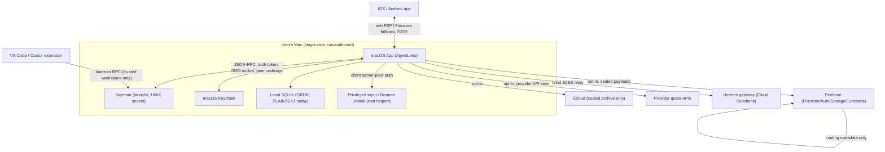

# Architecture & Data Flows — Opus 4.8 1M lane

(Grounded in code + `docs/THREAT_MODEL.md`; this lane verifies, does not re-derive, the existing model.)

## C.1 Trust boundaries (system context)

**Boundaries:** (1) same-user processes are mutually trusted (UNIX socket model) — but credential-bearing IPC adds peer codesign + per-uid 0700 dirs; (2) cloud is opt-in and sees only routing metadata + sealed payloads; (3) the gateway is a blind relay (no plaintext); (4) the extension activates only in trusted workspaces.

## C.2 Components (security-relevant)
| Component | Trust | Secrets | Auth | Notes |
|---|---|---|---|---|
| macOS App (`AgentLens/`) | high (unsandboxed) | Keychain | Firebase Auth | reads agent logs; manages daemon |
| Daemon (`OpenBurnBarDaemon/`) | high | Keychain | socket token + peer codesign | local RPC; no subprocess for control RPC |
| Privileged Input helpers | root | login password (transient) | per-uid 0700 + peer codesign | P0-6 fixed |
| Cloud Functions (`functions/`) | server | Secret Manager/KMS | App Check + owner assert | 150-endpoint authz catalog |
| Firestore | server | none plaintext | rules (owner + denylist) | sealed payloads + metadata |
| Hermes gateway | server | none (blind) | envelope shape only | E2EE relay |
| Computer Use runtime | high | — | in-code approval + kill | audit-before-action |

## C.3 Security-critical data flows
| Flow | Protocol | Auth | Encryption | Failure mode |
|---|---|---|---|---|
| App ↔ Daemon RPC | UNIX socket JSON-RPC | token + peer codesign | local | fail-closed (denied) |
| App → Firestore sync | HTTPS | Firebase Auth + App Check | TLS + AES-256-GCM payload seal | rules deny |
| Billing event → entitlement | HTTPS/S2S | JWS/HMAC signature | TLS | fail-closed (no write) |
| Computer Use action | in-process + daemon | approval gate | — | audit fail → abort |
| Phone ↔ Mac | iroh P2P / Firestore | device trust + E2EE | TLS + sealed | fallback sealed |
| Remote Unlock credential | UNIX socket | client server-peer auth | local | fail-closed |
| Software update | HTTPS feed + DMG | Ed25519 + SHA-256 + codesign | signature | reject on mismatch |
