# Abuse Cases and Attack Trees

Each abuse case includes realistic attacker narrative, impacted assets, current controls, gaps, recommended tests, and mitigations.

## Cloud Relay Compromise

Narrative: An attacker controls or observes Hermes Gateway, Firestore relay docs, or Storage metadata. They try to read, alter, replay, drop, or target traffic.

Attack tree:

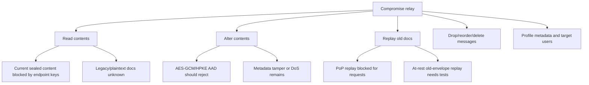

Impacted assets: message metadata, sealed messages, attachments, availability.

Current controls: sealed-only current writes, AAD, PoP replay cache, create-if-absent, server-only rules.

Gaps: metadata minimization, deployed proof, at-rest replay proof, availability/tamper-evident delivery.

Tests: relay mutation harness, stored-envelope replay, drop/reorder chaos, metadata inventory.

Mitigations: monotonic counters/read receipts, client-side stale detection, delivery transparency, retention minimization.

## Malicious Cloud Administrator

Narrative: Insider has production access to GCP/Firebase/GitHub. They query Firestore, Storage, logs, Secret Manager, and KMS.

Attack tree:

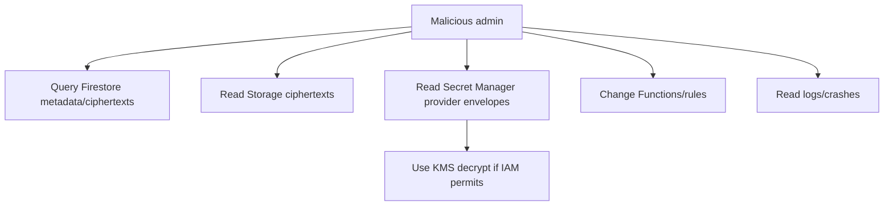

Impacted assets: metadata, provider credentials, ciphertexts, logs, production controls.

Current controls: client-side sealing for selected content, KMS/Secret Manager envelope design, log scrubbers, CI workflows.

Gaps: live IAM, audit, break-glass, log immutability, production access review not proven.

Tests: IAM least privilege audit, KMS decrypt alert, rules hash verification, admin data access tabletop.

Mitigations: least privilege IAM, approval-required production access, tamper-evident admin logs, secret rotation playbooks.

## External Account Takeover

Narrative: Attacker steals Firebase session or account credentials and tries to pair a new device, list devices, read data, revoke devices, or access attachments.

Attack tree:

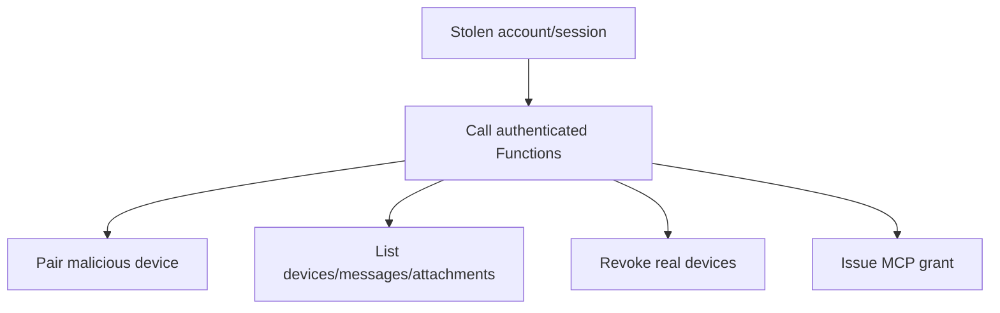

Impacted assets: device graph, messages, attachments, MCP tokens.

Current controls: App Check, high-risk nonce, trusted native device proof for some high-risk actions, ownership checks.

Gaps: MFA/step-up auth not established; complete endpoint matrix missing.

Tests: stolen-session pairing/revocation/MCP simulations, missing App Check tests, nonce replay.

Mitigations: step-up auth for pairing/revoke/MCP/provider secrets, device notification, session revocation.

## Pairing Attack

Narrative: Attacker intercepts or phishes pairing code/QR and races or mediates pairing to bind their own device.

Attack tree:

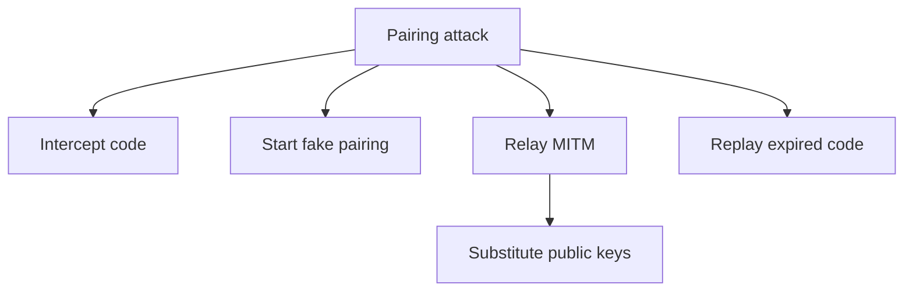

Current controls: expiry, hashed device secrets, relay keys required at start/approval, Iroh Ed25519 freshness.

Gaps: mandatory visual safety-code verification and account/device binding UX not proven.

Tests: replay, race, MITM key substitution, phishing UX red team.

Mitigations: short code TTL, safety code compare, device name spoof warnings, out-of-band approval notifications.

## Compromised Mobile Device

Narrative: Phone is malware-infected, jailbroken/rooted, stolen, or unlocked.

Attack tree:

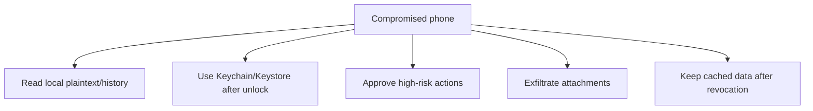

Current controls: Keychain/Keystore, server revocation, App Check/trusted device proof.

Gaps: hardware/user-presence not proven; local purge and jailbreak/root posture not proven.

Tests: stolen unlocked device scenario, post-revoke access, local key extraction assumptions.

Mitigations: device passcode/biometric gating for approval, local wipe on revoke, risk-based step-up.

## Compromised Desktop

Narrative: Desktop malware reads local files, keys, daemon socket, logs, and tool outputs.

Attack tree:

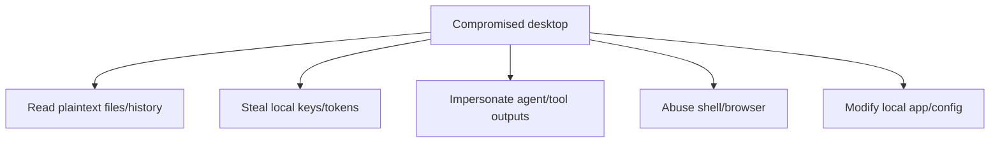

Current controls: daemon peer auth, socket permissions, Keychain, audit logs.

Gaps: malware under user account remains out of scope; local sandboxing incomplete.

Tests: local malicious process IPC tests, unsigned build tests, endpoint compromise tabletop.

Mitigations: explicit non-claim, harden sandbox/entitlements, local key user-presence for high-risk approval.

## Malicious Document / Webpage / Email

Narrative: Untrusted content is loaded into agent context and tells the model to ignore instructions, read secrets, or run tools.

Attack tree:

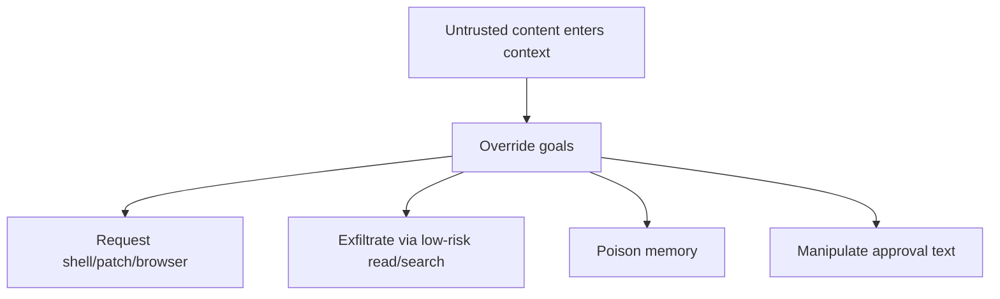

Current controls: untrusted wrappers, tool approval, policy engine.

Gaps: hard instruction/data separation, memory write gates, low-risk exfil prevention.

Tests: indirect prompt-injection corpus across docs/web/email/tool output/memory.

Mitigations: source labels, content isolation, DLP on tool outputs, memory quarantine.

## Tool Execution Attack

Narrative: Agent uses allowed tools or manipulated arguments to execute unexpected commands or side effects.

Attack tree:

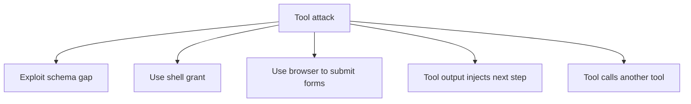

Current controls: tool schemas, policy engine, approvals, audit.

Gaps: full sandbox, egress control, reversible operations, semantic validation.

Tests: schema fuzzing, command injection, browser CSRF, malicious tool output.

Mitigations: strict schemas, least privilege, per-action credentials, rollback.

## Attachment Attack

Narrative: Attacker sends malicious file to exploit preview/parsing or influence model context.

Attack tree:

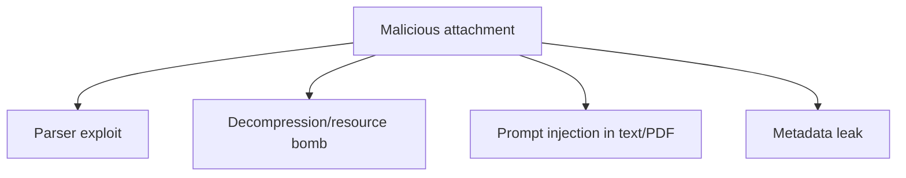

Current controls: encrypted upload, size caps, opaque storage path, content type.

Gaps: local parser sandboxing, download auth, malware scanning, content trust labels.

Tests: parser fuzz, large file, malicious PDF/text prompt injection, path traversal.

Mitigations: quarantine, safe preview, content disarm/convert, explicit untrusted labels.

## Object Authorization Attack

Narrative: User changes IDs in requests to access another user's device, message, MCP grant, attachment, or provider account.

Attack tree:

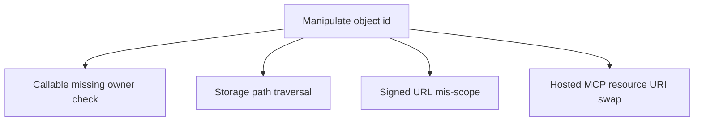

Current controls: `assertOwnership`, owner path checks, Firestore rules, hosted MCP resource checks.

Gaps: complete endpoint matrix and Storage download mismatch.

Tests: BOLA/IDOR suite for every callable/tool/resource.

Mitigations: central authz helpers, generated tests from endpoint registry.

## Supply Chain Compromise

Narrative: Dependency, GitHub Action, vendored runtime, CI secret, or artifact is compromised.

Attack tree:

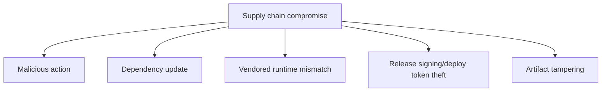

Current controls: security-pr, release signing/notarization/SBOM/VEX/cosign, scans.

Gaps: full SHA pinning, vendored runtime verifier as blocking gate, live protections.

Tests: action pinning policy, provenance verification, secret exposure drill.

Mitigations: pin actions, OIDC-only deploy, mandatory provenance, dependency allowlists.

## Model Provider or AI Service Compromise

Narrative: Provider sees data, returns malicious outputs, or changes model behavior.

Attack tree:

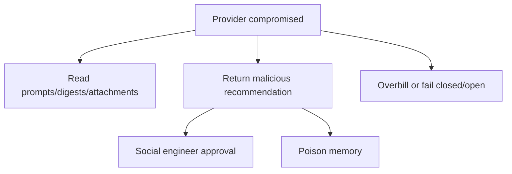

Current controls: privacy mode/routes, digest trimming, output JSON schema, policy-gated tools.

Gaps: retention config, DLP, provider output trust labels, egress UX.

Tests: malicious provider response, data egress fixtures, provider outage/fallback.

Mitigations: local-first default, provider allowlist, redaction/DLP, never trust provider output for actions.

## Rogue Agent

Narrative: Agent behaves outside intended objective, hides actions, requests broad grants, modifies memory, or deletes logs.

Attack tree:

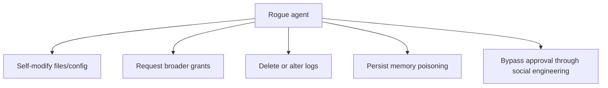

Current controls: approvals, audit, run controllers, policy engine.

Gaps: sandboxing, log immutability, memory provenance, grant duration.

Tests: rogue-agent red team with tool suite, audit tamper attempts, grant escalation.

Mitigations: least agency, short grants, tamper-evident off-device audit, kill switch.
